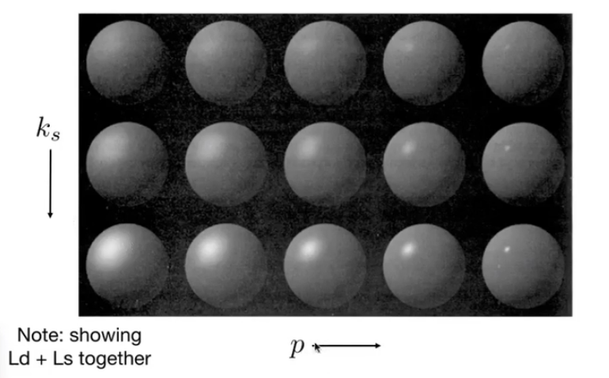
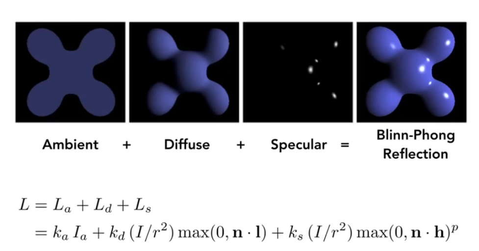

## Specular Term

什么时候能看到高光？
 
1. 物体光滑，反射集中在镜面反射
2. 视角与镜面反射方向接近

**半程向量**：光照方向和观察方向的角平分线，用于判断观察方向和镜面反射方向接近的程度

为什么用半程向量而不是直接计算？

半程向量只需要 v 和 l，计算简单

$$\mathbb{h}=bisector(\mathbb{v},\ mathbb{l})=\frac{\mathbb{v}+\mathbb{l}}{|| \mathbb{v}+\mathbb{l} ||}$$

高光的 Bliinn-Phone 公式：

$$L_s=k_s(I/r^2)max(0, \mathbb{n}\cdot\mathbb{h})^P$$

cosine power plots: increasing p narrows the reflection lobe

{style="width:500px"}

Influence of k and p:

{style="width:500px"}

## Ambient Term

环境光：认为环境光强度处处相同

$$L_a=k_aI_a$$

$L_a$: reflected ambient lignt  
$k_a$: ambient coefficient  
This is approximate / fake

三项相加：

$$L=L_a+L_d+L_s$$

{style="width:500px"}

## Shading Frequency

1. 确定 shading point 时，对一个平面进行相同操作
2. 对每个顶点计算法线并着色，中间的点用平滑插值
3. 对每个像素应用着色
4. Flat shading: triangle face is flat (one normal vector) ,but is not good for smooth surfaces
5. Gouraud shading: Interpolate colors from vertices across triangles, each vertex has a normal vector
6. Phong shading: Interpolate colors from vertices across each triangle, compute full shading model at each pixel (Not the Blinn-Phong Reflectance Model)

Shading frequency: face->vertex->pixel

**顶点的法线怎么计算？**  
周围所有三角形的法线的平均

$$N_v=\frac{\sum_iN_i}{||\sum_iN_i||}$$

或者再根据三角形面积加权

**像素法线怎么计算？**

根据顶点法线和重心，计算各个点的法线，再归一化

## Graphics Pipeline

Graphics Pipeline (Real-time Rendering Pipeline)
图形管线（实时渲染管线）

**Shader(像素着色器)**：计算每一个像素最后的颜色，并输出。可以指定每一个像素的着色

GLSL

## Texture Mapping

在物体的不同位置定义不同的属性（吸收光不同，产生不同颜色）

定义在物体表面：  
Surface lives in 3D world space. Every 3D surface point alsohas a place where it goes in the 2D image.  
即三维的物体表面可以与一张二维的图一一对应，这张二维的图就是纹理。

**Parameterizarion（参数化）**：将三维物体表面的所有三角形映射到二维，且三角形尽可能少扭曲（保持大小关系），且尽可能仍构成完整的图形。

Texture can be used multiple times.  
重复使用纹理：Tile

已知三角形顶点坐标，怎么得到三角形内部某个点的坐标？  
Barycentric Coordinates (下一讲)
