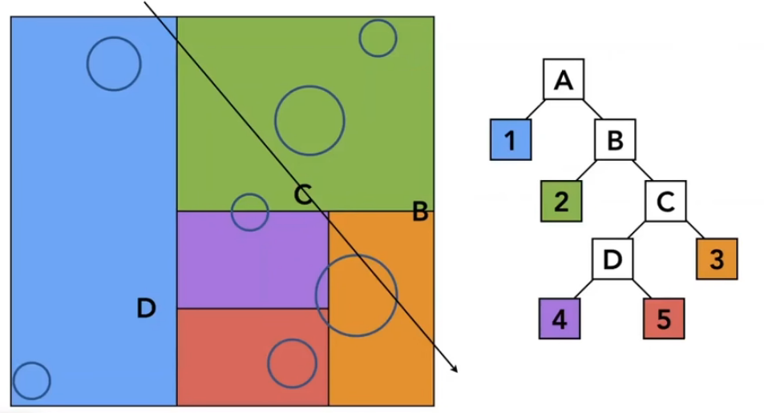
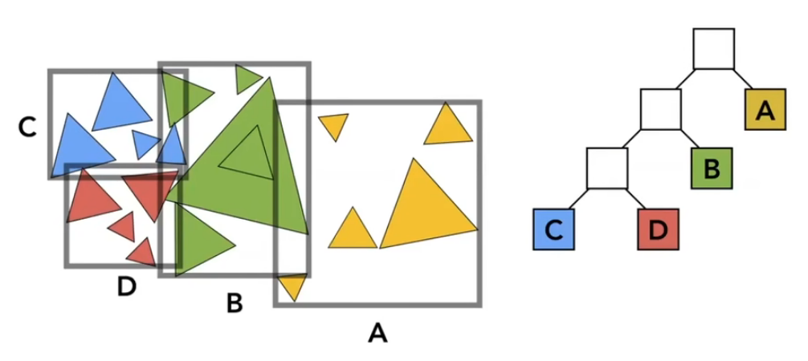

## Uniform Spatial Partitions (Grids)

**Preprocesss: Build Acceleration Grid**

1. Find bounding box
2. Create grid
3. Store each object in overlapping cells (将和物体表面有相交的各自标记)
4. Step through grid in ray traversal order

认为光线和盒子求交计算快、光线和物体求交计算慢

根据光线的方向大致判断和哪些盒子相交。  
当光线和盒子相交但盒子里没有物体（没被标记）时，跳过；  
当光线和盒子相交但盒子里有物体时，计算是否和物体相交。

若只需要找最近交点，找到交点后停止。

**怎么确定划分的格子数？**

格子太少，加速效果差；格子太多，光线和盒子的计算增加。

格子数=C\*场景中物体数，其中 3D 时 C 约为 27。

**加速效果？**

场景中物体分布均匀、物体多时，加速效果好；  
场景中物体分布不均匀、部分区域空旷时，加速效果差；

## Spatial Partition

### KD-Tree Pre-Processing

**Spatial partition examples:**

- Oct-Tree（八叉树）  
  将整个场景用包围盒包围，分成 8 块（3D），对每一个分成的区域再分成 8 块，直到其中一块中物体数量足够少
- KD-Tree  
  每次分割时仅分成两块，分割方向 xyz 交替
- BSP-Tree
  每次分割时仅分成两块，方向任意

{style="width:500px"}

**KD-Tree storage:**

Internal nodes store:

- split axis: x-, y- or z-
- split position: coordinate of split plane along axis
- children: pointers to child nodes

Leaf nodes store:

- list of objects

**Traversing a KD-Tree:**

从整个场景开始，如果有交点，则看和子节点对应的盒子是否有交点，直到检查完所有有交点的叶节点。

{style="width:400px"}

**问题：**

1. 需要知道包围盒和哪些三角形相交
2. 一个物体可出现在多个包围盒中

### Object Partition & Bounding Volume Hierarchy (BVH)

每次划分将三角形分成两组，分别重新求包围盒

BVH 中一个物体只出现在一个包围盒中，不同的包围盒可能相交

KD-Tree 划分空间，BVH 划分物体。实际 BVH 应用更广泛。

{style="width:400px"}

**How to subdivide a node?**

Choose a dimension to split

- 1: Always choose the longest axis in node
- 2: Split node at locaton of median object (balances tree)

**Termination criteria?**

Stop when node contains few elements (e.g. 5)

**BVH traversal**

```c
Intersect(Ray ray, BVH node) {
  if (ray misses node.bbox) return;

  if (node is a leaf node) {
    test intersection with all objs;
    return closet intersection;
  }

  hit1 = Intersect(ray, node.child1);
  hit2 = Intersect(ray, node.child2);
  return the closer of hit1, hit2;
}
```

## Basic Radiometry

Measurement system and units for illumination.

Accurate measure the spatial properties of light  
New terms: radiant flux, intersity, irradiance, radiance

Perform lighting calculation in a physically correct manner

### Radiant Energy and Flux (Power)

**Radiant energy** is the energy of electromagnetic radiation. It is measured in units of joules, and denoted by the symbol:

$$Q\,[J=Joule]$$

**Radiant flux (power)** is the energy emitted, reflected, transmitted or received, per unit time.

$$\Phi\equiv\frac{\mathrm{d}Q}{\mathrm{d}t}\,[W=Watt]\,[ln=lumen]$$

Flux: photons flowing through a sensor in unit time

### Radiant Intensity

**Radiant (luminous) intensity** is the power per unit solid angle emitted by a point light source.

{style="width:200px"}

$$I(\omega)\equiv\frac{\mathrm{d}\Phi}{\mathrm{d}\omega}$$

$$\left[\frac{W}{sr}\right]\,\left[\frac{lm}{sr}=cd=candela\right]$$

**Angles and solid angles**

**Angle:** ratio of subtended arc length on circle to radius

- $\theta=frac{l}{r}$
- Circle has $2\pi$ radians

**Solid angle:** ratio of subtended area on sphere to radius squared

- $\Omega=\frac{A}{r^2}$
- Sphere has $4\pi$ steradians

**Differential solid angles:**

{style="width:250px"}

$$
\begin{align*}
\mathrm{d}A&=(r\mathrm{d}\theta)(r\sin\theta\mathrm{d}\phi)\\
&=r^2\sin\theta\mathrm{d}\theta\mathrm{d}\phi
\end{align*}
$$

$$\mathrm{d}\omega=\frac{\mathrm{d}A}{r^2}=\sin\theta\mathrm{d}\theta\mathrm{d}\phi$$

Sphere:

$$
\begin{align*}
\Omega&=\int_{S^2}\mathrm{d}\omega \\
&=\int_0^{2\pi}\int_0^{\pi}\sin\theta\mathrm{d}\theta\mathrm{d}\phi \\
&=4\pi
\end{align*}
$$

**Isotropic point source:**

$$
\begin{align*}
\Phi&=\int_{S^2}I\mathrm{d}\omega \\
&=4\pi I
\end{align*}
$$

$$I=\frac{\Phi}{4\pi}$$