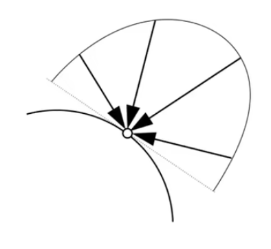
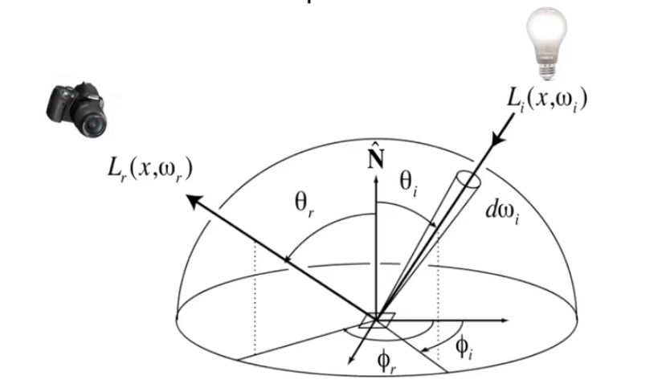

## Irradiance and Radiance

**Irradiance** is the power per (perpendicular / projected) unit area incident on a surfacee  point.

{style="width:200px"}

$$
E(\mathbf{x})\equiv\frac{\mathrm{d}\Phi(\mathbf{x})}{\mathrm{d}A}
$$

$$
\left[\frac{\text{W}}{\text{m}^2}\right]\,\left[\frac{\text{lm}}{\text{m}^2}=\text{lux}\right]
$$

In Blinn-Phong model, "intensity falloff" should be corrected as "irradiance falloff".

Radiance is the fundamental field quantity that describes the distribution of light in an environment.

- Radiance is the quantity associated with a ray  
- Rendering is all about computing radiance

**Radiance** is the power per unit solid angle, per projected unit area.

{style="width:200px"}

$$
L(\mathrm{p},\omega)\equiv\frac{\mathrm{d}\Phi(\mathrm{p},\omega)}{\mathrm{d}\mathrm{d}A\cos\theta}
$$

$$
\left[\frac{\mathrm{W}}{\mathrm{sr}\,\mathrm{m}^2}\right]\,\left[\frac{\mathrm{cd}}{\mathrm{m}^2}=\frac{\mathrm{lm}}{\mathrm{sr}\,\mathrm{m}^2}=\mathrm{nit}\right]
$$

- Radiance is irradiance per solid angle  
- Radiance is intensity per projected area

**Irradiance vs. radiance**

Irradiance is total power received by area dA, from all angle.

$$
\begin{align*}
dE(\mathrm{p},\omega)&=L_i(\mathrm{p},\omega)\cos\theta\mathrm{d}\omega \\
E(\mathrm{p})&=\int_{H^2}L_i(\mathrm{p},\omega)\cos\theta\mathrm{d}\omega
\end{align*}
$$

## Bidirectional Reflectance Distribution Function (BRDF)

Radiance from direction $\omega_i$ turns into the power E that dA receives.  
Then power E will become the radiance to any other direction $\omega$. 

**BRDF** represents how much light is reflected into each outgoing direction $\omega_r$ from each incoming direction.

{style="width:300px"}

$$
f_r(\omega_i\to\omega_r)=\frac{\mathrm{d}L_r(\omega_r)}{\mathrm{d}E_i(\omega_i)}=\frac{\mathrm{d}L_r(\omega_r)}{L_i(\omega_i)\cos\theta_i\mathrm{d}\omega_i}
\quad\left[\frac{1}{\text{sr}}\right]
$$

**The reflection equation:**

$$
L_r(\mathrm{p},\omega_r)=\int_{H^2}f_r(\mathrm{p},\omega_i\to\omega_r)L_i(\mathrm{p},\omega_i)\cos\theta_i\mathrm{d}\omega_i
$$

**The rendering equation:**

Add an emission term to make it general.

$$
L_o(\mathrm{p},\omega_o)=L_e(\mathrm{p},\omega_o)+\int_{\Omega^+}L_i(\mathrm{p},\omega_i)f_r(\mathrm{p},\omega_i,\omega_o)(n\cdot\omega_i)\mathrm{d}\omega_i
$$

(reflected light = emission + incident lignt * BRDF * incident angle)

One point light: no need of integral  
Multiple point lights: sum over all light sources  
Area light: replace sum with integal  
Unknown reflection: regard reflection as light source

{style="width:400px"}

Simplify: L=E+KL

Approximate set of all paths of light in scene:

$$
\begin{align*}
L&=E+KL \\
L&=(I-K)^{-1}E \\
&=(I+K+K^2+K^3+\cdots)E \\
&=E+KE+K^2E+K^3E+\cdots
\end{align*}
$$

- $E$: emission directly from light sources  
- $KE$: direct illumination on surfaces  
- $K^2E$: indirect illumination (one bounce indirect)   
- ...

## Probability Review

$X$: random variable  
$X\sim p(x)$: probability density function (PDF)

Requirements of a probability distrubution:

$$p_i\ge0\quad\sum_{i=1}^n p_i=1$$

Expected value:

$$E[X]=\sum_{i=1}^n x_i p_i$$

**Continuous case: PDF**

Conitions on p(x):      $p(x)\ge 0\,\text{and}\,\int p(x)dx=1$  
Expected value of X:    $E[X]=\int xp(x)dx$

**Function of a Random Variable**

$$X\sim p(x)\quad Y=f(X)$$

Expected value of a function of a random varaible:

$$E[Y]=E[f(X)]=\int f(x)p(x)dx$$

