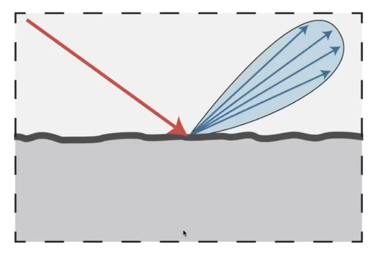
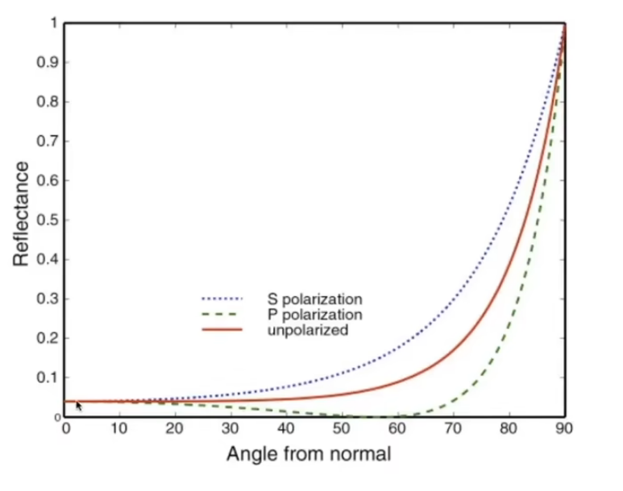

渲染方程中的 BRDF 决定物体的材质。Material == BRDF

## Diffuse / Lambertian Material

### Reflection

Light is equally reflected in each output direction.

假设各个方向进入的光强度相同，即入射光均匀。假设被照射的点既不吸收光也不发出光。

根据能力守恒，进入的能量和反射出的能量相等。进入的能量为被照射的点周围一小块区域接收的光，即当前点的 irradiance。所以入射和出射的 radiance 相等。

$$
\begin{align*}
L_o(\omega_o)&=\int_{H^2}f_r L_i(\omega_i)\cos\theta_i\mathrm{d}\omega_i \\
&=f_r L_i\int_{H^2}\cos\theta_i\mathrm{d}\omega_i \\
&=\pi f_r L_i
\end{align*}
$$

故常数 BRDF 为：

$$f_r=\frac{\rho}{\pi}$$

其中$\rho$为 albedo 系数，可以为常数，可以为 RGB 分开设置。

**Glossy material:**

{style="width:300px"}

**Refractive material:**

{style="width:300px"}

**Perfect Specular Reflection**

{style="width:400px"}

$$
\omega_o +\omega_i=2(\omega_i\cdot\vec{n})\vec{n} \\[10pt]
\Rightarrow\,\omega_o=-\omega_i+2(\omega_i\cdot\vec{n})\vec{n}
$$

### Transmition

**Snell's Law:**

$$
\begin{align*}
\eta_i\sin\theta_i&=\eta_t\sin\theta_t \\[10pt]
\cos\theta_t&=\sqrt{1-\left(\frac{\eta_i}{\eta_t}\right)^2(1-\cos^2\theta_i)}
\end{align*}
$$

**Snell's Window / Circle:**

Looking from underwater, can only see objects confined to a conical area.

**Fresnel Reflection / Term:**

Reflectance depends on incident angle (and polarization of light)

Fresnel term (dieletric, $\eta$=1.5):

{style="width:350px"}

**Approximate: Schlick's approximation**

$$
\begin{align*}
R(\theta)&=R_0+(1-R_0)(1-\cos\theta)^5 \\
R_0&=\left(\frac{n_1-n_2}{n_1+n_2}\right)^2
\end{align*}
$$

## Microfacet Material

假设物体表面粗糙，但从远处看表面平滑。每个表面的微元完全镜面反射。
（从远处，看到材质；从近处，看到几何）。
认为表面由微表面组成，每个微表面有各自的法线。

分析微表面法线的分布，判断宏观表面的材质。  
- concentrated <-> glossy  
- spread <-> diffuse

当half vector和法线相同时，才能将入射光反射到对着相机的出射方向（因为微表面都为镜面反射）

$$f(i,o)=F(i,h) G(i,o,h) D(h)$$

f = Fresnel term * shadowing-masking term * distribution of normals

## Isotropic / Anisotropic Materials

(各向同性/各向异性材质)

Key: directionality of underlying surface

Anisotropic BRDFs: reflection depends on azimuthal angle $\phi$, results from oriented microstructure of surface.

$$f_r(\theta_i,\phi_i;\theta_r,\phi_r)\neq f_r(\theta_i,\theta_r,\phi_r-\phi_i)$$

E.g. nylon, velvet

## Properties of BRDFs

- Non-negativity

$$ f_r(\omega_i\to\omega_r)\ge 0$$

- Linearity

$$L_r(\mathrm{p},\omega_r)=\int_{H^2}f_r(\mathrm{p}, \omega_i\to\omega_r)L_i(\mathrm{p},\omega_i)\cos\theta\mathrm{d}\omega_i$$

- Reciprocity principle

$$f_r(\omega_r\to\omega_i)= f_r(\omega_i\to\omega_r)$$

- Energy conservation

$$\forall L_i\int_{H^2}f_r(\omega_i\to\omega_r)\cos\theta_i\mathrm{d}\omega_i\le 1$$

### Measuring BRDFs

For each outgoing direction and incoming direction, move light and camera.

Problem: curse of dimensionality

Improve efficiency:

- Isotropic surfaces reduce dimensionality from 4D to 3D  
- Reciprocity reduces # of measurements by half  
- Clever optical systems  

MERL BRDF Database

