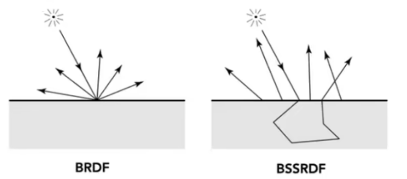

## Advanced Light Transport

Monte Carlo Estimators:

- Unbiased: the expected value will always be the correct value.
- Consistent: converges to the correct value
- Biased: not unbiased

### Bidirectional Path Tracing (BDPT)

Traces sub-paths from both the camera and the light. Connects the end points from both sub-paths.

BDPT is suitable if the light transport is complex on the light’s side. e.g. the first step is diffusion.

Cons: difficult to implement, slow

### Metropolis Light Transport (MLT)

Apply Markov Chain Monte Carlo (MCMC), jumping from the current sample to the next with some PDF.

Very good at locally exploring difficult light paths.

Key idea: locally perturb an existing path to get a new path

Cons: difficult to estimate the convergence rate. Usually produces “dirty” results

### Photon Mapping

Very good at handling Specular-Diffuse-Specular (SDS) paths and generating caustics

1. photon tracing: Emitting photons from the light source, bouncing them around, then recording photons on diffuse surfaces
2. photon collection: Shoot sub-paths from the camera, bouncing them around, until they hit diffuse surfaces
3. local density estimation: For each shading point, fond the nearest N photons. Take the surfaces area they over.

small N <-> noisy  
large N <-> blurry

Why? local density estimation covers an area

More photons emitted -> the same N photons covers a smaller area

- Biased == blurry
- Consistent = not blurry with infinite samples

### Vertex Connection and Merging (VCM)

A combination of BDRT and Photon Mapping

Key Idea:

- Not waste the sub-path in BDRT if their end points cannot be connected but can be merged
- Use photon mapping to handle the merging of nearby “photons”

### Instant Radiosity (IR)

Key Idea:

- Lit surfaces can be treated as light sources

Approach:

- Shoot light sub-paths and assume the end point of each sub-path is a Virtual Point Light (VPL)
- Render the scene as usual using these VPLs

Pros: fast and usually gives good results on diffuse scenes

Cons:

- Spikes will emerge when VPLs are close to shading points
- Cannot handle glossy material

## Advanced Appearance Modeling

### Participating Media

At any point as light travels through a participating medium, it can be (partially) absorbed and scattered.  
Use Phase Function to describe the angular distribution of light scattering at any point x within participating media.

Rendering:

1. Randomly choose a direction to bounce
2. Randomly choose a distance to go straight
3. At each “shading point”, connect to the light

### Hair Appearance

**Marschner Model**:

{style="width:300px"}

3 types of light interactions: R, TT, TRT  
(R: reflection; T: transmission)

hair: cuticle -> cortex -> medulla (scatter light)

Difference between hair/fur fibers: size of medulla

**Double Cylinder Model**:

{style="width:400px"}

{style="width:400px"}

### Translucent Material

**Subsurface scattering**: Visual characteristics of many surfaces caused by light exiting at different points than it enters.

**BSSRDF**: generalization of BRDF; exitant radiance at one point due to incident differential irradiance at another point

$$S(x_i, \omega_i, x_o, \omega_o)$$

Generalization of rendering equation: integrating over all points on the surface and all directions

$$L(x_o,\omega_o)=\int_A\int_{H^2} S(x_i, \omega_i, x_o, \omega_o)L_i(x_i,\omega_i)\cos\theta_i\mathrm{d}\omega_i\mathrm{d}A$$

{style="width:350px"}

**Dipole Approximation**:approximate light diffusion by introducing two point sources

### Cloth

fiber -> ply -> yarn (woven or knitted) cloth

Render as BRDF: given the weaving pattern, calculate the overall behavoir  
Limitation: cannot render velvet

Render as Participating Media: properties of individual fibers and their distribution -> scattering parameters

Render as Actual Fibers...

### Detailed Apprearance

Difficult path sampling problem: missing light  
Solution: BRDF over a pixel

Recent Trend: Wave Optics

### Procedual Appearance

e.g. Define details without textures: compute a noise function on the fly.

3D noise -> internal structure if cut or broken
