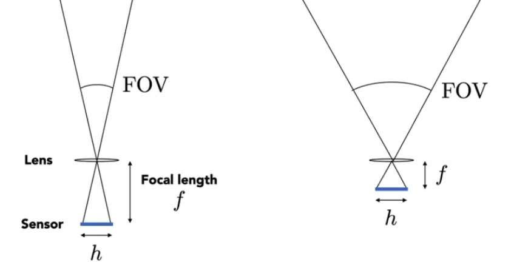

Imaging = Synthesis + Capture

### Field of View (FOV)

{style="width:400px"}

For a fixed sensor size, decreaseing the focal length increses the FOV.

$$\text{FOV}=2\,\arctan\left(\frac{h}{2f}\right)$$

Due to historical reasons, the angle of view is usually expressed using the focal length of lenses designed for 35mm format film (36 x 24mm).

- 17mm is a wide-angle lens, with a field of view of 104°
- 50mm is a "standard" lens, with a field of view of 47°
- 200mm is a telephoto lens, with a field of view of 12°

### Exposure

$H=T\times E$ (Exposure = Time $\times$ Irradiance)

Exposure time T: controlled by shutter  
Irradiance E: power of light falling on a unit area of sensor. Controlled by lens aperture and focal length.

**Aperture size**

- Change the f-stop by opening / closing the aperture

**Shutter speed**

- Change the duration the sensor pixels integrate light

**ISO gain**

- Change the amplification (analog and/or digital) between sensor values and digital image values

{style="width:500px"}

#### ISO (Gain)

Third vaiable for exposure

Film: trade sensitivity for grain  
Digital: trade sensitive for noise

- Multiply signal before analog-to-digital conversion  
- Linear effect (ISO 200 needs half the light as ISO 100)

#### F-Number (F-Stop)

Written as FN or F/N. N is the f-number.

Informal understanding: the inverse-diameter of a round aperture.

#### Shutter

Motion blur: handshake, subject movement.  
Doubling shutter time doubles motion blur.

