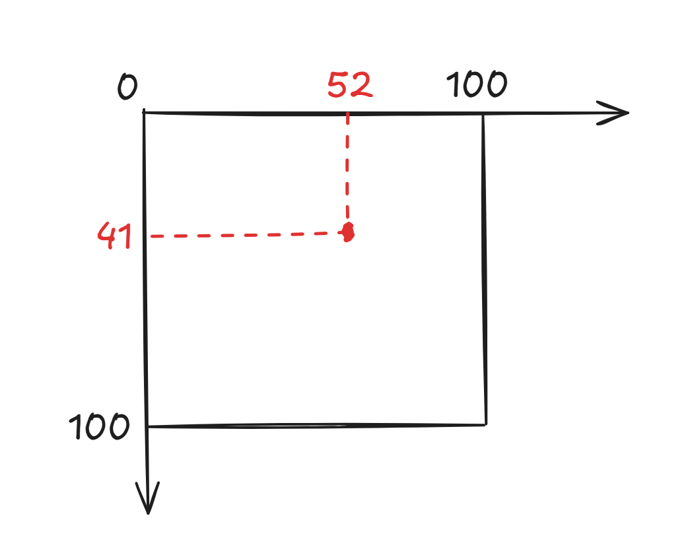
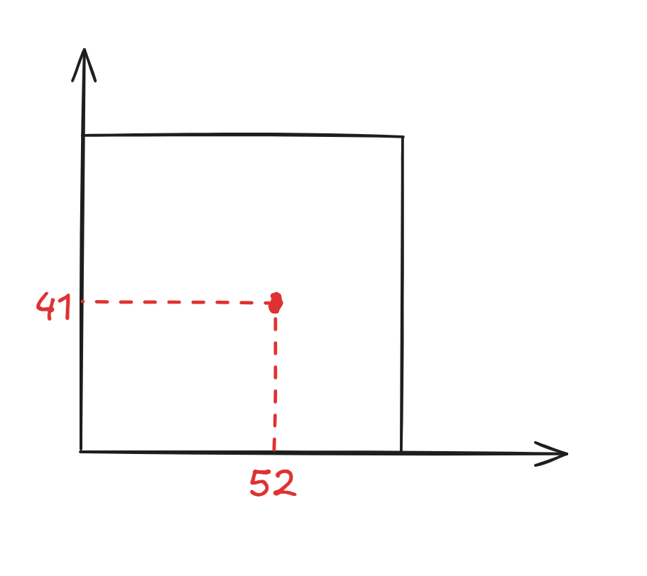
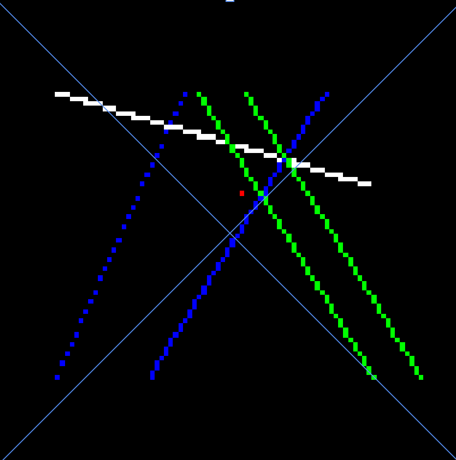
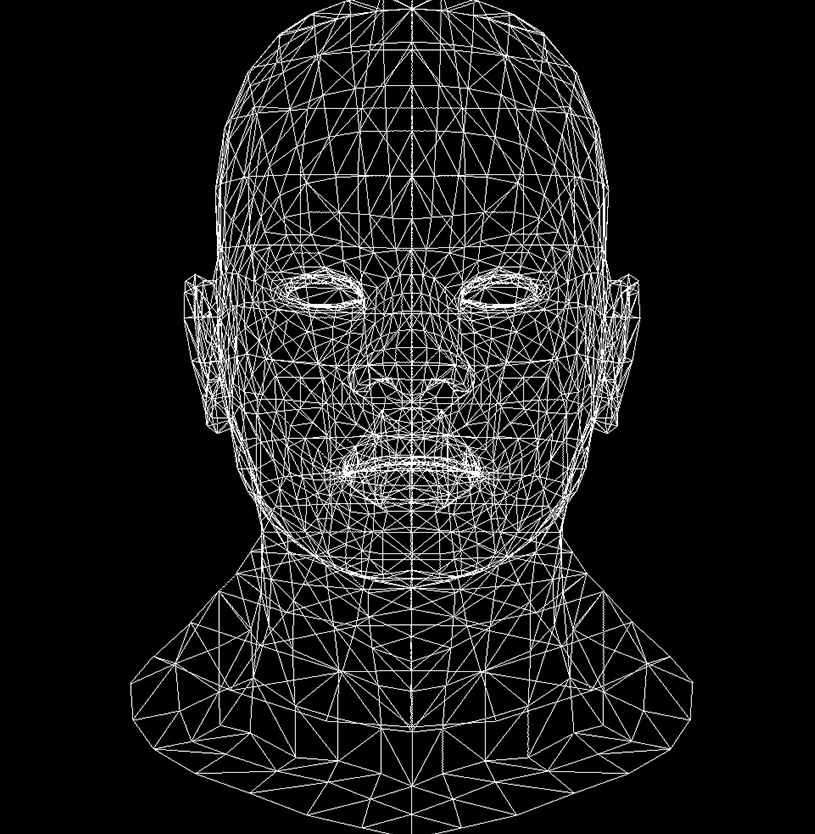

## 创建图像

```cpp
#include "tgaimage.h"

const TGAColor white = TGAColor(255, 255, 255, 255);
const TGAColor red = TGAColor(255, 0, 0, 255);

int main(int argc, char** argv) {
    TGAImage image(100, 100, TGAImage::RGB);
    image.set(52, 41, red);
    image.flip_vertically();
    // i want to have the origin at the left bottom corner of the image
    image.write_tga_file("output.tga");
    return 0;
}
```

```cpp
const TGAColor white = TGAColor(255, 255, 255, 255);
const TGAColor red = TGAColor(255, 0, 0, 255);
```

定义颜色: 不透明的红色和不透明的白色

```cpp
TGAImage image(100, 100, TGAImage::RGB);
```

创建 100\*100 像素的图像, 格式为 RGB, 默认为全黑

```cpp
image.set(52, 41, red);
```

左上角为(0,0), 横向向右为 x 轴,纵向向下为 y 轴. 将坐标为(52,41)的位置设置为红色

{style="width:400px"}

```cpp
image.flip_vertically();
```

将图像上下反转, 左下角为(0,0), 向右为 x 轴, 向上为 y 轴, 更符合日常.

{style="width:400px"}

```cpp
image.write_tga_file("output.tga");
```

将图像保存为 output.tga 文件, 保存在当前文件夹中.

## 画线

### 1. 等间隔

```cpp
void line1(int x0, int y0, int x1, int y1, TGAImage& image, TGAColor color) {
    for (float t = 0.; t < 1.; t += .01) {
        int x = x0 * (1. - t) + x1 * t;
        int y = y0 * (1. - t) + y1 * t;
        image.set(x, y, color);
    }
}
```

`1.`表示浮点数 1.0, `.01`表示 0.01  
上述代码得到有锯齿的直线, 修改步长可得到虚线或更光滑的直线

### 2. 逐像素

```cpp
void line2(int x0, int y0, int x1, int y1, TGAImage& image, TGAColor color) {
    for (int x = x0; x <= x1; x++) {
        float t = (x - x0) / (float)(x1 - x0);  // t表示x轴的比例
        int y = y0 + (1. - t) * (y1 - y0);
        image.set(x, y, color);
    }
}
```

缺点：

1. for 循环遍历要求传递参数必须先传左边的点，但希望绘制的线和传入顺序无关
2. 斜率大时变为虚线

### 3. 优化顺序

```cpp
void line3(int x0, int y0, int x1, int y1, TGAImage& image, TGAColor color) {
    bool steep = false;
    if (abs(y1 - y0) > abs(x1 - x0)) {
        swap(x0, y0);  // 沿x=y对称
        swap(x1, y1);
        steep = true;
    }
    if (x0 < x1) {
        swap(x0, x1);  // 交换两点
        swap(y0, y1);
    }
    for (int x = x0; x <= x1; x++) {
        float t = (x - x0) / (float)(y1 - y0);
        int y = y0 + t * (y1 - y0);
        if (!steep)
            image.set(x, y, color);  // 沿x=y对称回去
        else
            image.set(y, x, color);
    }
}
```

通过交换 x 和 y 的遍历顺序、交换第一个和第二个传入点优化

### 4. 误差累加

```cpp
void line4(int x0, int y0, int x1, int y1, TGAImage& image, TGAColor color) {
    bool steep = false;
    if (abs(y1 - y0) > abs(x1 - x0)) {
        swap(x0, y0);  // 沿x=y对称
        swap(x1, y1);
        steep = true;
    }
    if (x0 < x1) {
        swap(x0, x1);  // 交换两点
        swap(y0, y1);
    }

    int dx = x1 - x0;
    int dy = y1 - y0;
    float derror = abs(dy / (float)dx);
    float error = 0;
    int y = y0;
    for (int x = x0; x <= x1; x++) {
        if (!steep)
            image.set(x, y, color);  // 沿x=y对称回去
        else
            image.set(y, x, color);
        error += derror;
        if (error >= 0.5) {
            y += (y1 > y0) ? 1 : -1;
            error -= 1.;
        }
    }
}
```

`derror`为斜率，即 x 每走一格 y 变化的大小；`error`表示当前 y 离最近的正数点的距离。  
当前 y 偏离上一个整数点大于 0.5 时，y 移动到下一个整数点，移动方向由 y0y1 相对大小决定。

每次只需要计算浮点数加法，避免了浮点数的乘除，速度快

### 5. 减少浮点数

```cpp
float derror = abs(dy / (float)dx);

error += derror;

if (error>=0.5) {
    y += (y1 > y0) ? 1 : -1;
    error -= 1.;
}
```

同乘 2\*dx，减少浮点数运算：

```cpp
int derror = abs(dy * 2);

error += derror;

if (error>=dx) {
    y += (y1 > y0) ? 1 : -1;
    error -= dx * 2;
}
```

### 6. 减少分支

```cpp
if(steep) {
    for(int x = x0; x<=x1; ++x) {
        img.set_pixel_color(y, x, color);
        error2 += derror2;
        if(error2 > dx) {
            y += (y1>y0? 1 : -1);
            error2 -= dx*2;
        }
    }
} else {
    for(int x = x0; x<=x1; ++x) {
        img.set_pixel_color(x, y, color);
        error2 += derror2;
        if(error2 > dx) {
            y += (y1>y0? 1 : -1);
            error2 -= dx*2;
        }
    }
}
```

只需要进行一次 steep 的判断，CPU 分支预测器可以长时间运行同一个分支。

### 最终代码 Bresenham

```cpp
#include "tgaimage.h"
using namespace std;

const TGAColor white = TGAColor(255, 255, 255, 255);
const TGAColor red = TGAColor(255, 0, 0, 255);
const TGAColor green = TGAColor(0, 255, 0, 255);
const TGAColor blue = TGAColor(0, 0, 255, 255);

// Bresenham
void line5(int x0, int y0, int x1, int y1, TGAImage& image, TGAColor color) {
    bool steep;
    if (abs(y1 - y0) > abs(x1 - x0)) {
        swap(x0, y0);  // 沿x=y对称
        swap(x1, y1);
        steep = true;
    }
    if (x0 > x1) {
        swap(x0, x1);  // 交换两点
        swap(y0, y1);
    }

    int dx = x1 - x0;
    int dy = y1 - y0;
    int derror = abs(dy);
    int error = 0;
    int y = y0;
    if (!steep) {
        for (int x = x0; x <= x1; x++) {
            image.set(x, y, color);
            error += derror;
            if (error >= dx) {
                y += (y1 > y0) ? 1 : -1;
                error -= dx * 2;
            }
        }
    } else {
        for (int x = x0; x <= x1; x++) {
            image.set(y, x, color);
            error += derror;
            if (error >= dx) {
                y += (y1 > y0) ? 1 : -1;
                error -= dx * 2;
            }
        }
    }
}

int main(int argc, char** argv) {
    TGAImage image(100, 100, TGAImage::RGB);
    image.set(52, 41, red);
    line1(13, 20, 80, 40, image, white);
    line2(13, 20, 40, 80, image, blue);
    line3(33, 20, 70, 80, image, blue);
    line4(43, 20, 80, 80, image, green);
    line5(53, 20, 90, 80, image, green);
    image.flip_vertically();
    image.write_tga_file("output.tga");
    return 0;
}
```

{style="width:400px"}

## 线框

新加`model.h`和`model.cpp`，其中 Model 类为：

```cpp
class Model {
    std::vector<vec3> verts = {};    // array of vertices        ┐ generally speaking, these arrays
    std::vector<vec3> norms = {};    // array of normal vectors  │ do not have the same size
    std::vector<vec2> tex = {};      // array of tex coords      ┘ check the logs of the Model() constructor
    std::vector<int> facet_vrt = {}; //  ┐ per-triangle indices in the above arrays,
    std::vector<int> facet_nrm = {}; //  │ the size is supposed to be
    std::vector<int> facet_tex = {}; //  ┘ nfaces()*3
    TGAImage diffusemap  = {};       // diffuse color texture
    TGAImage normalmap   = {};       // normal map texture
    TGAImage specularmap = {};       // specular texture
public:
    Model(const std::string filename);
    int nverts() const; // number of vertices
    int nfaces() const; // number of triangles
    vec3 vert(const int i) const;                          // 0 <= i < nverts()
    vec3 vert(const int iface, const int nthvert) const;   // 0 <= iface <= nfaces(), 0 <= nthvert < 3
    vec3 normal(const int iface, const int nthvert) const; // normal coming from the "vn x y z" entries in the .obj file
    vec3 normal(const vec2 &uv) const;                     // normal vector from the normal map texture
    vec2 uv(const int iface, const int nthvert) const;     // uv coordinates of triangle corners
    const TGAImage& diffuse() const;
    const TGAImage& specular() const;
};
```

新加`african_head.obj`表示图像，其中 v 表示顶点坐标，f 表示每个面（三角形）的三个顶点坐标，vn 表示顶点的法线向量（用于计算光线），vt 表示纹理的 uv 坐标。

```cpp
#include "model.h"
#include "tgaimage.h"
using namespace std;

const TGAColor white = TGAColor(255, 255, 255, 255);

void line6(int x0, int y0, int x1, int y1, TGAImage& image, TGAColor color) {
    bool steep = false;  // 必须初始化
    if (abs(y1 - y0) > abs(x1 - x0)) {
        swap(x0, y0);  // 沿x=y对称
        swap(x1, y1);
        steep = true;
    }
    if (x0 > x1) {
        swap(x0, x1);  // 交换两点
        swap(y0, y1);
    }

    int dx = x1 - x0;
    int dy = y1 - y0;
    int derror = abs(dy * 2);
    int error = 0;
    int y = y0;
    if (!steep) {
        for (int x = x0; x <= x1; x++) {
            image.set(x, y, color);
            error += derror;
            if (error >= dx) {
                y += (y1 > y0) ? 1 : -1;
                error -= dx * 2;
            }
        }
    } else {
        for (int x = x0; x <= x1; x++) {
            image.set(y, x, color);
            error += derror;
            if (error >= dx) {
                y += (y1 > y0) ? 1 : -1;
                error -= dx * 2;
            }
        }
    }
}

int main(int argc, char** argv) {
    Model* model = nullptr;
    if (2 == argc) {
        model = new Model(argv[1]);  // 命令行控制方式构造model
    } else {
        model = new Model("obj/african_head.obj");  // 代码方式构造model
    }
    cerr << "finish" << '\n';

    int width = 1000;
    int height = 1000;
    TGAImage image(width, height, TGAImage::RGB);
    for (int i = 0; i < model->nfaces(); i++) {  // 遍历每个面
        for (int j = 0; j < 3; j++) {            // 遍历面的三个顶点
            vec3 v0 = model->vert(i, j);  // vert(i,j)表示第i个面第j个顶点的坐标
            vec3 v1 = model->vert(i, (j + 1) % 3);  // v1表示v0下一个点的坐标
            // 将坐标从[-1,-1]-[1,1]映射到[0,0]-[width,height]
            int x0 = (v0.x + 1.) * width / 2.;
            int y0 = (v0.y + 1.) * height / 2.;
            int x1 = (v1.x + 1.) * width / 2.;
            int y1 = (v1.y + 1.) * height / 2.;
            line6(x0, y0, x1, y1, image, white);
        }
    }
    image.write_tga_file("output.tga");
    return 0;
}
```

结果：

{style="width:500px"}
