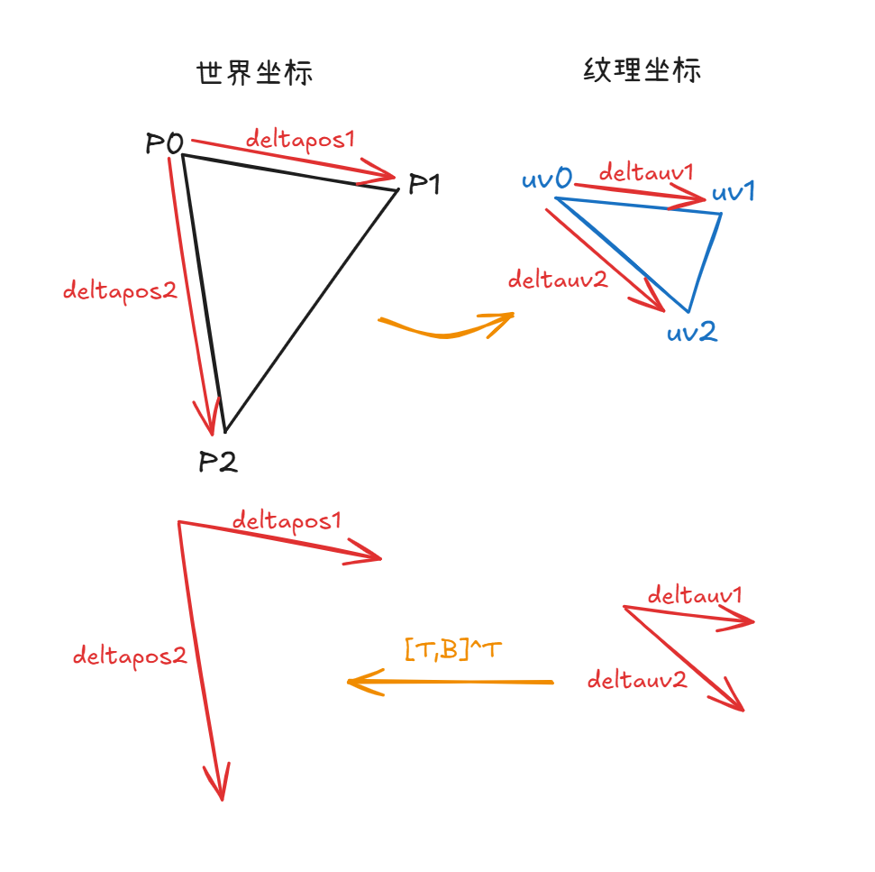

## 法线贴图

法线贴图由每个像素定义。每个像素对应一个二维纹理坐标，且存储一个三维向量，向量的每个参数为 rgb 映射到[-1,1]的值。

法线贴图用 rgb 值存储法线信息，而 uv 坐标可以再法线贴图中查找像素位置，从而读取对应的法线信息，从而实现用低面数的模型体现高面数模型的光照信息。

模型旋转时，法线在世界坐标中的 xyz 会相应变化。因此需要建立相对于模型表面的局部坐标系，即切线空间（TBN 空间）。

### 切线空间

切线空间三个轴分别是 tangent 轴、bitangent 轴、法线轴，简称 TBN 坐标系。其中 tangent 轴表示贴图的 u 方向（左右），bitangent 轴表示贴图的 v 方向（上下）。

假设三角形三个顶点的坐标为 p0,p1,p2，纹理坐标为 uv0,uv1,uv2。令 deltapos1,deltapos2 表示世界坐标下两条边，deltauv1,deltauv2 表示纹理坐标下纹理的两条边，即：

```cpp
vec3 deltapos1 = p1 - p0;
vec3 deltapos2 = p2 - p0;

vec2 deltauv1 = uv1 - uv0;
vec2 deltauv2 = uv2 - uv0;
```

{style="width:500px"}

希望能用 uv 坐标的差，反推出三维空间中坐标的变换，即：

$$
\begin{cases}
deltapos1=T\cdot\Delta u_1+B\cdot\Delta v_1 \\
deltapos2=T\cdot\Delta u_2+B\cdot\Delta v_2
\end{cases}
$$

表示成矩阵：

$$
\begin{pmatrix}
deltapos1 \\ deltapos2
\end{pmatrix}
=\begin{pmatrix}
\Delta u_1 & \Delta v_1 \\
\Delta u_2 & \Delta v_2
\end{pmatrix}
\cdot\begin{pmatrix}
T \\ B
\end{pmatrix}
$$

已知三维坐标和 uv 坐标，要求出 T、B，用逆矩阵表示：

$$
\begin{pmatrix}
T \\ B
\end{pmatrix}
=\begin{pmatrix}
\Delta u_1 & \Delta v_1 \\
\Delta u_2 & \Delta v_2
\end{pmatrix}^{-1}
\cdot\begin{pmatrix}
deltapos1 \\ deltapos2
\end{pmatrix}
$$

其中求逆矩阵部分：

$$
\begin{pmatrix}
T \\
B
\end{pmatrix}
=\frac{1}{\Delta u_1 \cdot \Delta v_2 - \Delta u_2 \cdot \Delta v_1}
\begin{pmatrix}
\Delta v_2 & -\Delta v_1 \\
-\Delta u_2 & \Delta u_1
\end{pmatrix}
\cdot
\begin{pmatrix}
\text{deltapos1} \\
\text{deltapos2}
\end{pmatrix}
$$

故 T 和 B 的计算方式为：

```cpp
float r = 1.0f / (deltauv1.x * deltauv2.y - deltauv1.y * deltauv2.x);
vec3 T = (deltapos1 * deltauv2.y - deltapos2 * deltauv1.y) * r;
vec3 B = (deltapos2 * deltauv1.x - deltapos1 * deltauv2.x) * r;
```

而 N 是法线方向，由.obj 文件或自己插值得到。至此得到 T、B、N 三个向量。

用 Gram-Schmidt 正交化（需要再各自单位化）：

$$
\begin{align*}
T_{\perp}&=T-(T\cdot N)N \\
B_{\perp}&=B-(B\cdot N)N-(B\cdot T_{\perp})T_{\perp}
\end{align*}
$$

```cpp
struct GourandShader : public IShader {
    float intensities[3];
    mat<3, 2> uvs;
    mat<4, 4> ModelView = mv_mat(eye, center, up);
    mat<4, 4> Projection = projection_mat(near, far, l, r, b, t);
    mat<4, 4> Viewport = viewport_mat(0, 0, width, height, 255);

    // 顶点着色器
    virtual vec3 vertex(int iface, int nthvert) {
        vec3 n = model->normal(iface, nthvert);
        uvs[nthvert] = model->uv(iface, nthvert);
        intensities[nthvert] =
            max(0., model->normal(iface, nthvert) * light_dir);
        vec4 gl_vert = pt2homo(model->vert(iface, nthvert));
        vec4 transformed = Projection * ModelView * gl_vert;
        transformed = transformed / transformed[3];
        return (Viewport * transformed).xyz();
    }

    // 片元着色器
    // 这里还没有正确实现法线贴图！
    virtual bool fragment(vec3 bc, TGAColor& color) {
        vec2 uvp = {0., 0.};
        for (int i = 0; i < 3; i++) {
            uvp[0] += uvs[i][0] * bc[i];
            uvp[1] += uvs[i][1] * bc[i];
        }
        int tex_x = min(int(uvp.x * model->diffuse().width()),
                        model->diffuse().width() - 1);
        int tex_y = min(int(uvp.y * model->diffuse().height()),
                        model->diffuse().height() - 1);
        TGAColor uv_color = model->diffuse().get(tex_x, tex_y);

        vec4 uv4 = vec2homo(model->normal(uvp));
        vec4 light4 = vec2homo(light_dir);
        vec3 n = (ModelView.invert_transpose() * uv4).xyz();
        n = normalized(n);
        vec3 l = (ModelView * light4).xyz();
        l = normalized(l);
        float pixel_intensity = 0.;
        for (int i = 0; i < 3; i++) {
            pixel_intensity += n[i] * l[i];
        }
        if (pixel_intensity < 0) {
            pixel_intensity = 0.;
        }

        unsigned char r = uv_color[2] * pixel_intensity;
        unsigned char g = uv_color[1] * pixel_intensity;
        unsigned char b = uv_color[0] * pixel_intensity;
        color = TGAColor{r, g, b};
        return false;
    }
};
```
