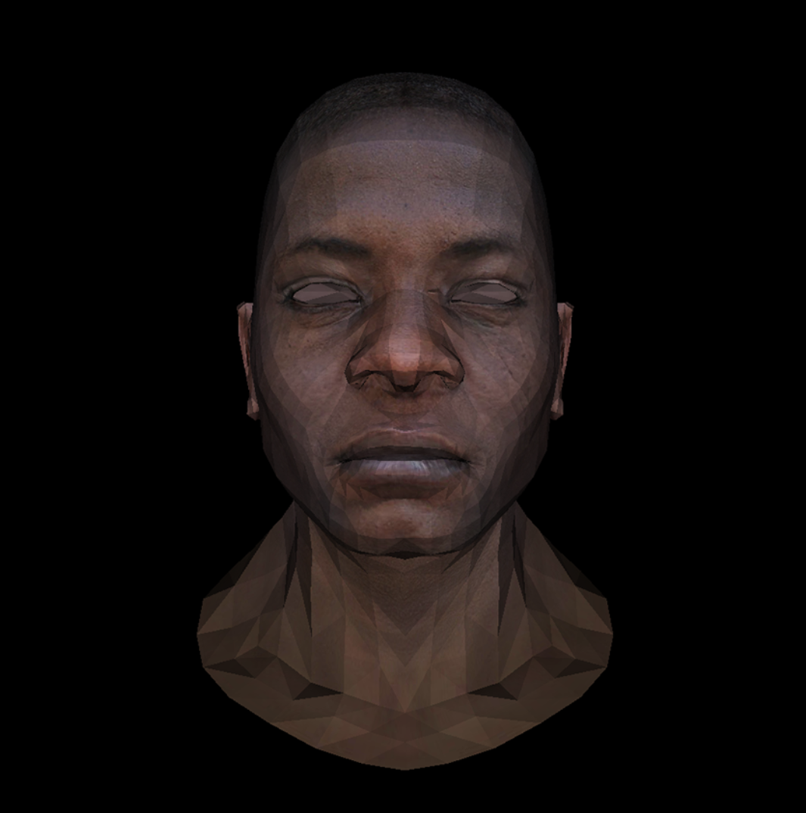

## 原理

MVP 变化可参考[Lecture 04 Transformations Cont.](../GAMES101/Lecture%2004%20Transformations%20Cont.md)

### 1. 模型变换

用于模型的放缩、平移、旋转。下面代码中先保持不变

### 2. 观察变换

用于调整模型，使相机看起来位于原点。即每个坐标都减去相机的坐标。

### 3. 透视变换

先把视锥变为长方体，再将长方体变为标准立方体。

第一步的矩阵为：

$$
M_{persp\to ortho}=\begin{pmatrix}
n & 0 & 0 & 0\\
0 & n & 0 & 0\\
0 & 0 & n+f & -nf\\
0 & 0 & 1 & 0
\end{pmatrix}
$$

变换后得到[l,r]\*[b,t]\*[near,far]的长方体，其中`near`和`far`自己定义，上下由`near`和垂直视野角计算得到，左右由上下和屏幕长宽比计算得到。为了进行视口变换，需要将该长方体变为[-1,1]^3 的标准立方体。

第二步的矩阵为：

$$
\begin{aligned}
M_{ortho} &=
\begin{pmatrix}
\frac{2}{r - l} & 0 & 0 & 0 \\
0 & \frac{2}{t - b} & 0 & 0 \\
0 & 0 & \frac{2}{n - f} & 0 \\
0 & 0 & 0 & 1
\end{pmatrix}
\begin{pmatrix}
1 & 0 & 0 & -\frac{r + l}{2} \\
0 & 1 & 0 & -\frac{t + b}{2} \\
0 & 0 & 1 & -\frac{n + f}{2} \\
0 & 0 & 0 & 1
\end{pmatrix} \\
&=\begin{pmatrix}
\frac{2}{r - l} & 0 & 0 & -\frac{r + l}{r - l} \\
0 & \frac{2}{t - b} & 0 & -\frac{t + b}{t - b} \\
0 & 0 & \frac{2}{n - f} & -\frac{n + f}{n - f} \\
0 & 0 & 0 & 1
\end{pmatrix}
\end{aligned}
$$

### 4. 视口变换

将标准立方体变为屏幕大小的长方体。先将中心移到屏幕中心的位置，再大小放缩。

### 5. 透视除法

向量的前三位都除以第四位，使第四位为 1，将四维的齐次坐标变为三维。此时透视的信息被保留在三维的坐标中，得到每个顶点透视后的屏幕坐标。

## 实现

代码：

```cpp
#include <bits/stdc++.h>
#include "model.h"
#include "tgaimage.h"
using namespace std;

const int width = 1000;
const int height = 1000;
const int depth = 255;
vec3 light_dir = {0, 0, -1};
vec3 camera_pos = {0, 0, 3};

float fov = 45.0f;
float aspect = width / float(height);
float near = 0.1f;
float far = 1000.0f;
float t = tan(fov * 0.5 * M_PI / 180.0f) * near;
float b = -t;
float r = t * aspect;
float l = -r;

// 模型变换：模型的缩放、平移、旋转
mat<4, 4> model_mat() {
    return identity<4>();
}

// 观察变换：摄像机位置和角度
mat<4, 4> view_mat() {
    mat<4, 4> m = identity<4>();
    m[2][3] = -camera_pos.z;
    return m;
}

// 透视变换：将视锥变为标准立方体
mat<4, 4> projection_mat(float near,
                         float far,
                         float l,
                         float r,
                         float b,
                         float t) {
    mat<4, 4> m;
    m[0][0] = 2 * near / (r - l);
    m[0][2] = (r + l) / (r - l);
    m[1][1] = 2 * near / (t - b);
    m[1][2] = (t + b) / (t - b);
    m[2][2] = -(far + near) / (far - near);
    m[2][3] = -2 * far * near / (far - near);
    m[3][2] = -1;
    m[3][3] = 0;
    return m;
}

// 视口变换：从[-1,1]映射到屏幕
mat<4, 4> viewport_mat(int x, int y, int width, int height, int depth) {
    mat<4, 4> m = identity<4>();
    // 平移中心
    m[0][3] = x + width / 2.;
    m[1][3] = y + height / 2.;
    m[2][3] = depth / 2.;
    // 缩放
    m[0][0] = width / 2.;
    m[1][1] = height / 2.;
    m[2][2] = depth / 2.;
    return m;
}

// 求重心坐标
vec3 barycentric(vec3* pts, vec3 p) {
    vec3 u = cross(
        vec3{(pts[0].x - pts[2].x), (pts[1].x - pts[2].x), (pts[2].x - p.x)},
        vec3{(pts[0].y - pts[2].y), (pts[1].y - pts[2].y), (pts[2].y - p.y)});
    if (abs(u.z) < 1)
        return vec3{-1, 1, 1};
    return vec3{u.x / u.z, u.y / u.z, 1 - u.x / u.z - u.y / u.z};
}

// 画三角形
void triangle5(vec3* pts,
               vec2* uvs,
               TGAImage& image,
               float* zbuffer,
               Model* model,
               float intensity) {
    // 确定包围盒大小
    vec2 bboxmin = {image.width() - 1., image.height() - 1.};
    vec2 bboxmax = {0., 0.};
    vec2 clamp = {image.width() - 1., image.height() - 1.};
    for (int i = 0; i < 3; i++) {
        bboxmin.x = max(0., min(bboxmin.x, pts[i].x));
        bboxmin.y = max(0., min(bboxmin.y, pts[i].y));
        bboxmax.x = min(clamp.x, max(bboxmax.x, pts[i].x));
        bboxmax.y = min(clamp.y, max(bboxmax.y, pts[i].y));
    }

    // 遍历包围盒中的点
    for (int x = bboxmin.x; x <= bboxmax.x; x++) {
        for (int y = bboxmin.y; y <= bboxmax.y; y++) {
            vec3 p = {static_cast<float>(x), static_cast<float>(y), 0.};
            vec2 uvp = {0., 0.};
            vec3 bc = barycentric(pts, p);
            if (bc.x < 0 || bc.y < 0 || bc.z < 0)
                continue;
            // 计算zbuffer和纹理坐标
            float z = 0.;
            for (int i = 0; i < 3; i++) {
                z += pts[i].z * bc[i];
                uvp[0] += uvs[i][0] * bc[i];
                uvp[1] += uvs[i][1] * bc[i];
            }
            if (z < zbuffer[static_cast<int>(x + y * width)]) {
                zbuffer[static_cast<int>(x + y * width)] = z;
                int tex_x = min(int(uvp.x * model->diffuse().width()),
                                model->diffuse().width() - 1);
                int tex_y = min(int(uvp.y * model->diffuse().height()),
                                model->diffuse().height() - 1);
                TGAColor color = model->diffuse().get(tex_x, tex_y);
                unsigned char r = color[2] * intensity;
                unsigned char g = color[1] * intensity;
                unsigned char b = color[0] * intensity;
                image.set(x, y, TGAColor{r, g, b});
            }
        }
    }
}

int main(int argc, char** argv) {
    Model* model = nullptr;
    if (2 == argc) {
        model = new Model(argv[1]);
    } else {
        model = new Model("obj/african_head.obj");
    }

    // zbuffer记录深度值
    float* zbuffer = new float[width * height];
    for (int i = 0; i < width * height; ++i) {
        zbuffer[i] = numeric_limits<float>::infinity();
    }

    // 矩阵用于变换
    mat<4, 4> Model = model_mat();
    mat<4, 4> View = view_mat();
    mat<4, 4> Projection = projection_mat(near, far, l, r, b, t);
    mat<4, 4> MVP = Projection * View * Model;
    mat<4, 4> Viewport = viewport_mat(0, 0, width, height, 255);

    // 遍历三角形处理
    TGAImage image(width, height, TGAImage::RGB);
    for (int i = 0; i < model->nfaces(); i++) {
        vec3 screen_coords[3];
        vec3 world_coords[3];

        for (int j = 0; j < 3; j++) {
            vec3 v0 = model->vert(i, j);
            world_coords[j] = v0;

            vec4 v4 = pt2homo(v0);
            vec4 proj = Viewport * MVP * v4;
            proj = proj / proj[3];
            screen_coords[j] = homo2pt(proj);
        }

        // 用叉乘计算法向量并单位化
        vec3 n = cross(world_coords[2] - world_coords[0],
                       world_coords[1] - world_coords[0]);
        vec3 unit_n = normalized(n);

        // 计算光照强度
        float intensity = unit_n * light_dir;
        if (intensity > 0) {
            vec2 uvs[3];
            for (int j = 0; j < 3; j++) {
                uvs[j] = model->uv(i, j);
            }
            triangle5(screen_coords, uvs, image, zbuffer, model, intensity);
        }
    }
    image.write_tga_file("tri_head_proj.tga");
    cerr << "Image written to tga" << endl;
    delete[] zbuffer;
    return 0;
}
```

结果：

{style="width:500px"}
