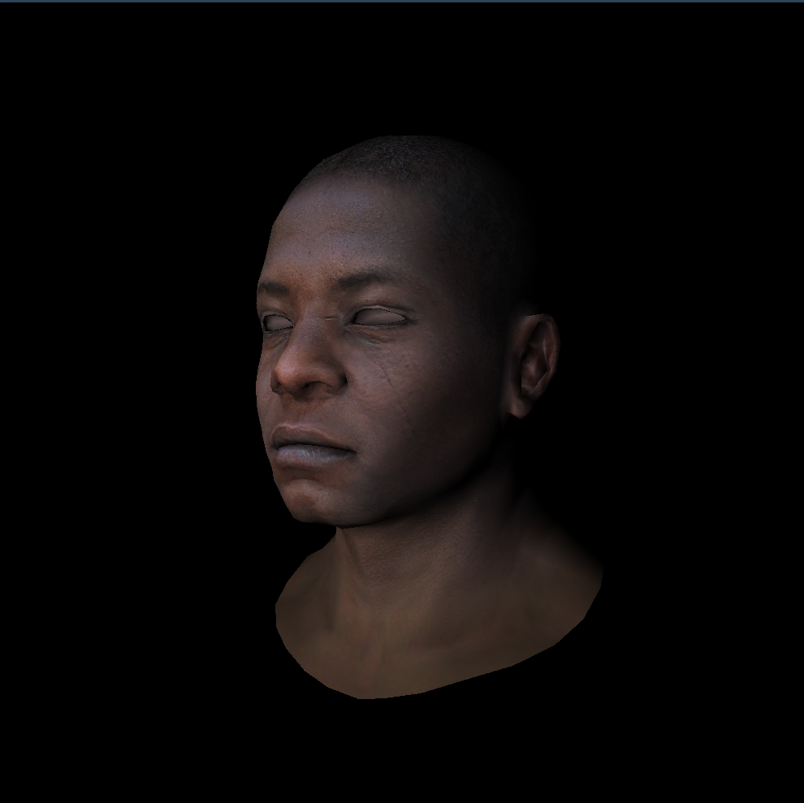

## 着色器

这里整理了一下代码。

着色器分为顶点着色器和片元着色器。

顶点着色器计算顶点的屏幕坐标，顺便计算顶点的光照强度和纹理坐标；片元着色器根据重心坐标判断是否绘制该像素（下面代码中默认全部绘制），并得到该像素的颜色。

下面代码中用`model->normal(i,j)`得到顶点法向量，但是和之前`calc_vertex_normal`得到的法向量方向相反，要将光照方向改成正的或单位化。~~此处bug耗费几小时。。~~

## 代码

`my_gl.h`:

```cpp
#pragma once
#include "geometry.h"
#include "model.h"
#include "tgaimage.h"

struct IShader {
    virtual vec3 vertex(int iface, int nthvert) = 0;
    virtual bool fragment(vec3 bar, TGAColor& color) = 0;
    virtual ~IShader() = default;
};

mat<4, 4> mv_mat(vec3 eye, vec3 center, vec3 up);
mat<4, 4> projection_mat(float near, float far, float l, float r, float b, float t);
mat<4, 4> viewport_mat(int x, int y, int width, int height, int depth);
vec3 barycentric(vec3* pts, vec3 p);
void triangle(vec3* pts, IShader& shader, TGAImage& image, float* zbuffer, int width);
std::vector<vec3> calc_vertex_normal(Model* model);
```

`my_gl.cpp`:

```cpp
#include "my_gl.h"
using namespace std;

// MV变换
mat<4, 4> mv_mat(vec3 eye, vec3 center, vec3 up) {
    vec3 gaze = normalized(center - eye);
    vec3 z = -1 * gaze;
    vec3 x = normalized(cross(gaze, up));
    vec3 y = cross(z, x);

    mat<4, 4> T = identity<4>();
    T[0][3] = -eye.x;
    T[1][3] = -eye.y;
    T[2][3] = -eye.z;

    mat<4, 4> R = identity<4>();
    for (int i = 0; i < 3; i++) {
        R[0][i] = x[i];
        R[1][i] = y[i];
        R[2][i] = z[i];
    }
    return R * T;
}

// 透视变换：将视锥变为标准立方体
mat<4, 4> projection_mat(float near,
                         float far,
                         float l,
                         float r,
                         float b,
                         float t) {
    mat<4, 4> m;
    m[0][0] = 2 * near / (r - l);
    m[0][2] = (r + l) / (r - l);
    m[1][1] = 2 * near / (t - b);
    m[1][2] = (t + b) / (t - b);
    m[2][2] = -(far + near) / (far - near);
    m[2][3] = -2 * far * near / (far - near);
    m[3][2] = -1;
    m[3][3] = 0;
    return m;
}

// 视口变换：从[-1,1]映射到屏幕
mat<4, 4> viewport_mat(int x, int y, int width, int height, int depth) {
    mat<4, 4> m = identity<4>();
    m[0][3] = x + width / 2.;
    m[1][3] = y + height / 2.;
    m[2][3] = depth / 2.;
    m[0][0] = width / 2.;
    m[1][1] = height / 2.;
    m[2][2] = depth / 2.;
    return m;
}

// 求重心坐标
vec3 barycentric(vec3* pts, vec3 p) {
    vec3 u = cross(
        vec3{(pts[0].x - pts[2].x), (pts[1].x - pts[2].x), (pts[2].x - p.x)},
        vec3{(pts[0].y - pts[2].y), (pts[1].y - pts[2].y), (pts[2].y - p.y)});
    if (abs(u.z) < 1)
        return vec3{-1, 1, 1};
    return vec3{u.x / u.z, u.y / u.z, 1 - u.x / u.z - u.y / u.z};
}

// 计算每个顶点的法向量
vector<vec3> calc_vertex_normal(Model* model) {
    vector<vec3> vertex_normals(model->nverts(), vec3{0, 0, 0});
    // 遍历三角形累加分量
    for (int i = 0; i < model->nfaces(); i++) {
        // 提取三角形顶点坐标
        vec3 v[3];
        for (int j = 0; j < 3; j++) {
            v[j] = model->vert(i, j);
        }
        // 计算三角形法向量和权重
        vec3 n = cross(v[2] - v[0], v[1] - v[0]);
        float area = norm(n) / 2.;
        n = normalized(n);
        // 给三个顶点法向量加分量
        for (int j = 0; j < 3; j++) {
            int vertex_idx = model->index(i, j);
            vertex_normals[vertex_idx] = vertex_normals[vertex_idx] + n * area;
        }
    }

    // 顶点法向量标准化
    for (auto& n : vertex_normals) {
        n = normalized(n);
    }
    return vertex_normals;
}

// 画三角形
void triangle(vec3* pts,
              IShader& shader,
              TGAImage& image,
              float* zbuffer,
              int width) {
    // 确定包围盒大小
    vec2 bboxmin = {image.width() - 1., image.height() - 1.};
    vec2 bboxmax = {0., 0.};
    vec2 clamp = {image.width() - 1., image.height() - 1.};
    for (int i = 0; i < 3; i++) {
        bboxmin.x = max(0., min(bboxmin.x, pts[i].x));
        bboxmin.y = max(0., min(bboxmin.y, pts[i].y));
        bboxmax.x = min(clamp.x, max(bboxmax.x, pts[i].x));
        bboxmax.y = min(clamp.y, max(bboxmax.y, pts[i].y));
    }

    // 遍历包围盒中的点
#pragma omp parallel for
    for (int x = bboxmin.x; x <= bboxmax.x; x++) {
        for (int y = bboxmin.y; y <= bboxmax.y; y++) {
            vec3 p = {static_cast<float>(x), static_cast<float>(y), 0.};
            vec3 bc = barycentric(pts, p);
            if (bc.x < 0 || bc.y < 0 || bc.z < 0)
                continue;

            // 计算zbuffer,纹理坐标和每个像素的光照强度
            float z = 0.;
            for (int i = 0; i < 3; i++) {
                z += pts[i].z * bc[i];
            }
            if (z < zbuffer[static_cast<int>(x + y * width)]) {
                zbuffer[static_cast<int>(x + y * width)] = z;
                TGAColor color = {255, 255, 255};
                if (shader.fragment(bc, color)) {
                    continue;
                }
                image.set(x, y, color);
            }
        }
    }
}
```

`main.cpp`:

```cpp
#include <bits/stdc++.h>
#include "model.h"
#include "my_gl.h"
#include "tgaimage.h"
using namespace std;

Model* model = nullptr;
const int width = 1000;
const int height = 1000;
const int depth = 255;
vec3 light_dir = {0, 0, 1};
vec3 eye = {2, 0, 3};
vec3 center = {0, 0, 0};
vec3 up = {0, 1, 0};
float fov = 45.0f;
float aspect = width / float(height);
float near = 0.1f;
float far = 1000.0f;
float t = tan(fov * 0.5 * M_PI / 180.0f) * near;
float b = -t;
float r = t * aspect;
float l = -r;

mat<4, 4> ModelView = mv_mat(eye, center, up);
mat<4, 4> Projection = projection_mat(near, far, l, r, b, t);
mat<4, 4> Viewport = viewport_mat(0, 0, width, height, 255);

struct GourandShader : public IShader {
    float intensities[3];
    mat<3, 2> uvs;

    // 顶点着色器
    virtual vec3 vertex(int iface, int nthvert) {
        vec3 n = model->normal(iface, nthvert);
        uvs[nthvert] = model->uv(iface, nthvert);
        intensities[nthvert] =
            max(0., model->normal(iface, nthvert) * light_dir);
        vec4 gl_vert = pt2homo(model->vert(iface, nthvert));
        vec4 transformed = Projection * ModelView * gl_vert;
        transformed = transformed / transformed[3];
        return (Viewport * transformed).xyz();
    }

    // 片元着色器
    virtual bool fragment(vec3 bc, TGAColor& color) {
        float pixel_intensity = 0.;
        vec2 uvp = {0., 0.};
        for (int i = 0; i < 3; i++) {
            pixel_intensity += intensities[i] * bc[i];
            uvp[0] += uvs[i][0] * bc[i];
            uvp[1] += uvs[i][1] * bc[i];
        }
        int tex_x = min(int(uvp.x * model->diffuse().width()),
                        model->diffuse().width() - 1);
        int tex_y = min(int(uvp.y * model->diffuse().height()),
                        model->diffuse().height() - 1);
        TGAColor uv_color = model->diffuse().get(tex_x, tex_y);
        unsigned char r = uv_color[2] * pixel_intensity;
        unsigned char g = uv_color[1] * pixel_intensity;
        unsigned char b = uv_color[0] * pixel_intensity;
        color = TGAColor{r, g, b};
        return false;
    }
};

int main(int argc, char** argv) {
    if (2 == argc) {
        model = new Model(argv[1]);
    } else {
        model = new Model("obj/african_head.obj");
    }

    float* zbuffer = new float[width * height];
    for (int i = 0; i < width * height; ++i) {
        zbuffer[i] = numeric_limits<float>::infinity();
    }

    TGAImage image(width, height, TGAImage::RGB);

    GourandShader shader;
    for (int i = 0; i < model->nfaces(); i++) {
        vec3 screen_coords[3];
        for (int j = 0; j < 3; j++) {
            screen_coords[j] = shader.vertex(i, j);
        }
        triangle(screen_coords, shader, image, zbuffer, width);
    }
    image.write_tga_file("tri_head_shader.tga");
    cerr << "Image written to tga" << endl;
    delete[] zbuffer;
    return 0;
}
```

结果：

{style="width:500px"}