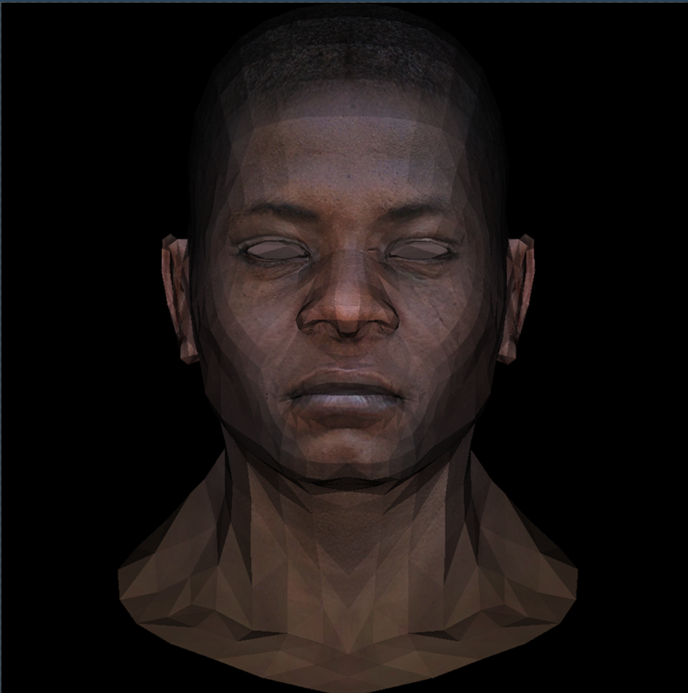

## 原理

.obj 文件中，三角形面用`f a1/b1/c1 a2/b2/c2 a3/b3/c3`表示，一共有`model->nfaces()`个面。  

a1,a2,a3 表示顶点对应的索引，顶点信息存储在 v 开头的行中。由`model->vert(i,j)`得到第 i 个面第 j 个顶点的世界坐标。

b1,b2,b3 表示相应顶点的纹理的索引，纹理信息存储在 vt 开头的行中。由`model->uv(i,j)`得到`vec2`类型的值，是第 i 个面第 j 个顶点纹理信息，即这个顶点在纹理图案中的坐标。

TGAImage 类型的`diffusemap`是纹理贴图图案，通过`diffusemap.get(x,y)`获取贴图上坐标(x,y)处的像素颜色，返回值为 TGAColor 类型。

`Model`类中的`diffuse`用于获取`diffusemap`，即`model->diffuse().get(x,y)`获得贴图上坐标(x,y)处的像素颜色。

**应用纹理：**

1. 遍历三角形中点时用顶点的纹理坐标插值，得到当前点的纹理坐标`vec2 uvp`
2. 将图像上的坐标(uvp.x,uvp.y)（float 类型）转换为贴图图案的坐标(tex_x,tex_y)（int 类型）。其中 uvp.x 和 uvp.y 表示相应方向的占比，故转换方式为`int tex_x = min(int(uvp.x * model->diffuse().width()),model->diffuse().width() - 1);`
3. 由(tex_x,tex_y)得到对应的纹理颜色，具体方式为`TGAColor color = model->diffuse().get(tex_x, tex_y);`
4. 将颜色和光影结合，即 rgb 中每个值乘上光照强度`intensity`，具体为`unsigned char r = color[2] * intensity;`

## 实现

代码：

```cpp
#include <bits/stdc++.h>
#include "model.h"
#include "tgaimage.h"
using namespace std;

const int width = 1000;
const int height = 1000;

vec3 barycentric(vec3* pts, vec3 p) {
    vec3 u = cross(
        vec3{(pts[0].x - pts[2].x), (pts[1].x - pts[2].x), (pts[2].x - p.x)},
        vec3{(pts[0].y - pts[2].y), (pts[1].y - pts[2].y), (pts[2].y - p.y)});
    if (abs(u.z) < 1)
        return vec3{-1, 1, 1};
    return vec3{u.x / u.z, u.y / u.z, 1 - u.x / u.z - u.y / u.z};
}

void triangle5(vec3* pts,
               vec2* uvs,
               TGAImage& image,
               float* zbuffer,
               Model* model,
               float intensity) {
    // 确定包围盒大小
    vec2 bboxmin = {
        image.width() - 1.,
        image.height() - 1.}; 
    vec2 bboxmax = {0., 0.}; 
    vec2 clamp = {image.width() - 1., image.height() - 1.};
    for (int i = 0; i < 3; i++) {
        bboxmin.x = max(0., min(bboxmin.x, pts[i].x));
        bboxmin.y = max(0., min(bboxmin.y, pts[i].y));
        bboxmax.x = min(clamp.x, max(bboxmax.x, pts[i].x));
        bboxmax.y = min(clamp.y, max(bboxmax.y, pts[i].y));
    }

    // 遍历包围盒中的点
    for (int x = bboxmin.x; x <= bboxmax.x; x++) {
        for (int y = bboxmin.y; y <= bboxmax.y; y++) {
            vec3 p = {static_cast<float>(x), static_cast<float>(y), 0.};
            vec2 uvp = {0., 0.};
            vec3 bc = barycentric(pts, p);
            if (bc.x < 0 || bc.y < 0 || bc.z < 0)
                continue;

            // 计算zbuffer
            float z = 0.;
            for (int i = 0; i < 3; i++) {
                z += pts[i].z * bc[i];
                uvp[0] += uvs[i][0] * bc[i];
                uvp[1] += uvs[i][1] * bc[i];
            }

            if (z > zbuffer[static_cast<int>(x + y * width)]) {
                zbuffer[static_cast<int>(x + y * width)] = z;
                // 得到纹理参数
                int tex_x = min(int(uvp.x * model->diffuse().width()),
                                model->diffuse().width() - 1);
                int tex_y = min(int(uvp.y * model->diffuse().height()),
                                model->diffuse().height() - 1);
                TGAColor color = model->diffuse().get(tex_x, tex_y);
                unsigned char r = color[2] * intensity;
                unsigned char g = color[1] * intensity;
                unsigned char b = color[0] * intensity;
                image.set(x, y, TGAColor{r, g, b});
            }
        }
    }
}

int main(int argc, char** argv) {
    Model* model = nullptr;
    if (2 == argc) {
        model = new Model(argv[1]);
    } else {
        model = new Model("obj/african_head.obj");
    }
    vec3 light_dir = {0, 0, -1};

    // zbuffer记录深度值
    float* zbuffer = new float[width * height];
    for (int i = 0; i < width * height; ++i) {
        zbuffer[i] = -numeric_limits<float>::infinity();
    }

    TGAImage image(width, height, TGAImage::RGB);
    for (int i = 0; i < model->nfaces(); i++) {
        vec3 screen_coords[3];
        vec3 world_coords[3];
        for (int j = 0; j < 3; j++) {
            vec3 v0 = model->vert(i, j);
            int x0 = (v0.x + 1.) * width / 2.;
            int y0 = (v0.y + 1.) * height / 2.;
            screen_coords[j] =
                vec3{static_cast<float>(x0), static_cast<float>(y0),v0.z};
            world_coords[j] = v0;
        }

        // 用叉乘计算法向量并单位化
        vec3 n = cross(world_coords[2] - world_coords[0],
                       world_coords[1] - world_coords[0]);
        float len = norm(n);
        vec3 unit_n = normalized(n);

        // 计算光照强度
        float intensity = unit_n * light_dir;
        if (intensity > 0) {
            vec2 uvs[3];
            for (int j = 0; j < 3; j++) {
                uvs[j] = model->uv(i, j);
            }
            triangle5(screen_coords, uvs, image, zbuffer, model, intensity);
        }
    }
    image.write_tga_file("tri_head_uv.tga");
    cerr << "Image written to tga" << endl;
    return 0;
}
```

结果：

{style="width:500px"}
