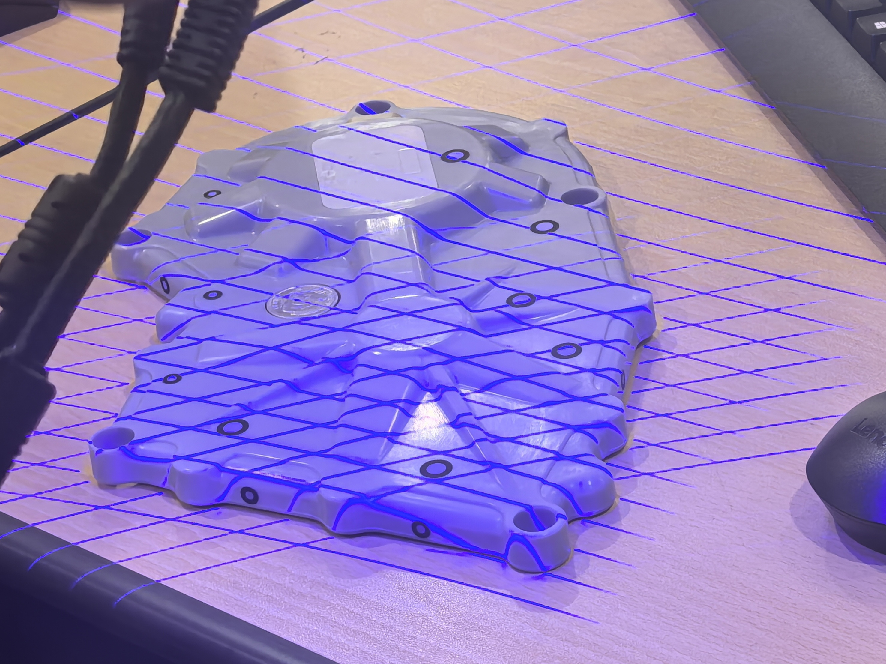
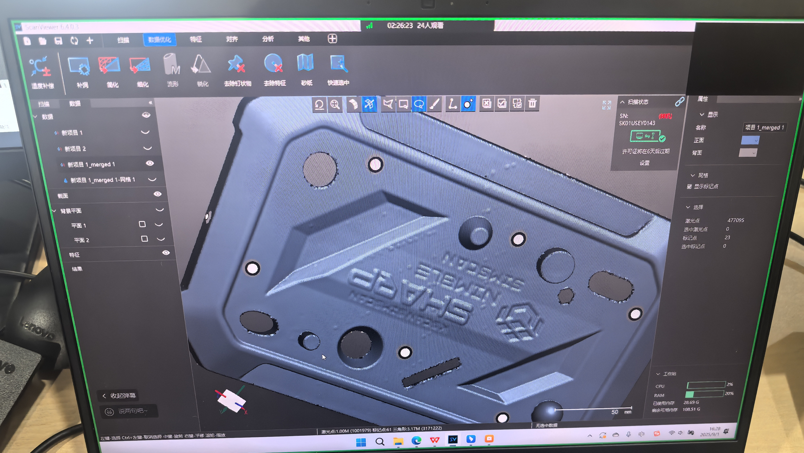

**工件前期准备：**

1. 表面处理：深色浅色可以，镜面和玻璃不能直接扫（显像剂…）  
2. 标记点粘贴：平面且曲率小的位置，避免边角等特征点；无规则粘贴，避免共线、等腰三角形（平面拼接）；公共区域的标记点大于 4 个；均匀粘贴  
3. 制定扫描策略（拼接）：激光点拼接，靠特征进行拼接；标记点拼接

**参数：**

1. 点密度：激光点两点之间的距离。数值越大，点越稀疏。精度高 0.2-0.3，标准件 0.5  
2. 曝光值：激光线的亮暗程度。浅色暗（反光多），默认 1；正常 5；深黑色 7  
3. 扫描模式：标记点/激光面片。先扫标记点，再扫面片  
4. 标记点：按大小勾选  
5. 黑亮模式：深色或反光物体勾选  

**扫描过程：**

新建文件，设置参数。按 M 开始扫描。+-使软件上图像放大缩小。一面扫描完后结束，点击添加，翻面继续扫描。

**数据处理：**

1. 背景平面：平面以下删除  
2. 连接项：选主体，反选，删除  
3. 非连接项：选取连接的一片点  
4. 孤立点：孤立的一个点  
    
**合并：**

1. 标记点合并：选中公共面上的标记点  
2. 激光点合并：在公共面上点  
    
**网格化：**

三角面片处理

**保存：**

保存后为网格文件，.stl。封装前为.asc 格式文件。

**标记点颜色状态：**

1. 绿色：当前视野中看到的标记点  
2. 白色：已经扫描完整的点  
3. 蓝色：当前没有扫描到的点  
    
**精细扫描：**

选倍率；点精细扫描，选中扫描区域；点精细扫描，退出；开始扫描。双击 M 切换扫描模式。

{style="width:400px"}

{style="width:400px"}