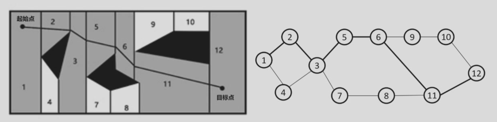

机器人导航规划

导航方式：

1. 有人工标识导引的固定路线导航：磁条，磁感应线，磁钉，二维码……
2. 有人工标识导引的无轨导航
3. 无人工标识导引的无轨导航

基本概念：

- 工作空间：移动机器人上的参考点能达到的空间集合，机器人采用位置和姿态描述，并需考虑体积
- 位形空间：机器人成为一个可移动点，不考虑姿态、体积和运动学约束

## 完备性

路径规划方法需要具备完备性。

完备性：当解存在时，能够在有限的时间内找到解

路径规划算法挑战：在连续空间内搜索，难以保证时间

确保完备性的方法：

- 基本思路：对空间作离散化
- 分辨率完备：解析性离散化，确保获得可行解
- 概率完备：基于概率进行随机采样离散化，使获得解的概率趋近于 1

## 路径规划

连通图中搜索最优路径的方法：

- 精确最优搜索法：深度优先法、宽度优先法
- 近似最优搜索法
  - 启发式搜索法： A*, D*
  - 准启发式搜索算法：退火、进化和蚁群优化等

分辨率完备的路径规划方法：

### 行车图法

基于障碍物几何形状分解位形空间，将自由空间的连通性用一维曲线的网格表示，在加入起始点和目标点后，在该一维无向连通图中寻找一条无碰路径。

**1. 可视图法**：连接所有可见顶点对（可见顶点指中间无障碍物，初始位置和目标位置也作为顶点）

- 优点：
  - 非常简单，特别是当环境地图用多边形描述物体时
  - 可得到在路径长度上最优的解
- 缺点：
  - 所得路径过于靠近障碍物，不够安全。

**2. Voronoi diagram**：取障碍物之间的中间点，以最大化机器人和障碍物之间的距离

- 优点：安全性高
- 缺点：计算复杂、路径长度较可视图法长、不适用于短距离定位传感器

### 单元分解法

1. 首先，将位形空间中的自由空间分为若干小区域，每个区域作为一个单元，以单元为顶点、以单元之间的相邻关系为边构成一张连通图；
2. 其次，在连通图中寻找包含初始姿态和目标姿态的单元，搜索连接初始单元和目标单元的路径；
3. 最后，根据所得路径的单元序列生成单元内部的路径

**1. 精确单元分解**：单元边界严格基于环境几何形状分解，所得单元完全空闲或完全被占。

- 优点：
  - 机器人不需要考虑它在每个空闲单元中的具体位置，只需要考虑如何从一个单元移动到相邻的空闲单元
  - 单元数与环境大小无关
- 缺点：
  - 计算效率极大地依赖于环境中物体的复杂度

**2. 近似单元分解**：栅格表示法，将环境分解成若干个大小相同的栅格

- 优点
  - 非常简单，与环境的疏密和物体形状的复杂度无关
- 缺点：
  - 对存储空间有要求

**3. 人工势场法**：目标点对机器人产生吸引力，障碍物对机器人产生排斥力，所有力的合成构成机器人的控制律

目标点吸引势定义为：

$$
U_{att}(x) = \frac{1}{2} K_a \cdot \rho_d^2(x)
$$

其中：

$$
\rho_d(x) = \|x - x_d\|
$$

- $K_a$ 为系数
- $x$ 为被评估点
- $x_d$ 为目标点

障碍物：排斥势场

当机器人靠近障碍物时，排斥力须足够大，以避免碰撞；  
当机器人远离障碍物时，排斥力必须不影响其运动。

### A\*算法

（待补充）

## 地图表示与构建

地图的表示：点云，栅格，特征，拓扑（点和线的关系）

### 点云地图

线扫激光得到二维的点，交叉线扫描得到三维的点

激光+视觉，得到包含距离和颜色纹理的点云

Cons：重建精度<<扫描精度

### 栅格地图

把环境划分成不同栅格，每个栅格有一个值，表示当前栅格被占用的情况。栅格划分越细，分辨率越大。

地图表示为 M={m0,m1...}，mi 表示第 i 个栅格被占用的情况，取 0 或 1

栅格划分更细后存储空间爆炸  
降低存储空间的方法：不想要地方的栅格合并；如果想要提高分辨率，将大的栅格划分。通过分辨率可变来减少存储空间的要求。
四叉树（二维）/八叉树（三维）

### 特征地图

标记导航路径有关的特征点（陆标）

发展趋势：二维特征+高度信息

Cons：无法精确表示

### 拓扑地图

把环境表示为带节点和相关连接线的拓扑结构

Pros：易于扩展，可以实现快速路径规划  
Cons：由于信息的抽象性，使得机器人难以实现精确可靠的自定位

**地图表示的研究趋势：**

混合地图，语义地图，多重地图

## 里程估计

里程估计：输入传感器感知数据，输出移动机器人位姿变化

- 轮式编码器：记录轮子转动的圈数
- 惯性测量单元：测速度、加速度
- 多信息融合里程估计
- ……

### 基于电机码盘的轮式机器人里程估计

根据电机码盘获得轮子转速

累计误差随着时间逐渐增大  
在特定位置放参照点，用传感器获取参照点并校正

### 惯性测量单元（IMU）里程估计

加速度计、陀螺仪（有时还有磁力计）  
测量加速度和角速度，用于估算机器人的运动和姿态，为导航、平衡、运动控制提供关键数据

### 激光里程估计

求解两个相邻时刻的相对位姿，将 t2 的扫描地图融合到全局地图

**迭代最近点算法（ICP）**

1. 最近点匹配

   - 为源点云的每个点找到目标点云中最近的对应点。

2. 计算变换

   - 基于对应点对，计算最佳旋转矩阵和平移向量（最小化距离误差）。

3. 应用变换

   - 将源点云按照计算出的变换进行更新。

4. 重复迭代

   - 直到误差收敛或达到最大迭代次数。

---

R，t 求解（by gpt）：

**R，t 分解算法**主要用于从**两个坐标系下的一组对应点**中，求出刚体变换的**旋转矩阵 R** 和 **平移向量 t**，使两组点尽可能重合。这是 **刚体配准 (Rigid Registration)** 的核心步骤，也用于 **相机外参估计、SLAM、3D 重建** 等。

**算法步骤（经典方法：基于 SVD 分解）**

给定两组对应点：

- 源点集 $P = \{p_i\}_{i=1}^N$
- 目标点集 $Q = \{q_i\}_{i=1}^N$

目标：找到 $R, t$ 使得：

$$
q_i \approx R p_i + t
$$

**1. 计算质心**

$$
\bar{p} = \frac{1}{N} \sum_{i=1}^N p_i, \quad
\bar{q} = \frac{1}{N} \sum_{i=1}^N q_i
$$

**2. 去中心化**

将两组点平移到以质心为原点：

$$
p'_i = p_i - \bar{p}, \quad
q'_i = q_i - \bar{q}
$$

**3. 计算协方差矩阵**

$$
H = \sum_{i=1}^N p'_i {q'_i}^\top
$$

**4. 奇异值分解（SVD）**

对 $H$ 进行 SVD 分解：

$$
H = U \Sigma V^\top
$$

**5. 计算旋转矩阵 R**

$$
R = V U^\top
$$

若 $\det(R) < 0$，则修正：

$$
V[:, -1] = -V[:, -1], \quad
R = V U^\top
$$

**6. 计算平移向量 t**

$$
t = \bar{q} - R \bar{p}
$$

特点

- **鲁棒性好**：在无噪声时能精确求解
- **计算效率高**：主要计算量在 SVD
- 该方法是 **ICP（迭代最近点）** 中每轮更新 R,t 的标准步骤

---

### 视觉里程估计

检测由运动导致的图像变化

**VO 问题求解**

基于图像：

- 利用两幅图像中所有限速的亮度信息
- 计算量大，精度低

基于特征：

- 从图像中提取醒目的、可重复的特征
- 要求两帧之间鲁棒匹配或跟踪特征

---

特征匹配 (by gpt)

**什么是光流（Optical Flow）？**

光流就是**物体在相邻两帧图像中的移动轨迹**。
简单说：**同一个点，从这一帧到下一帧，跑到哪去了？**

**光流法的特征匹配是什么？**

- 光流并不是“凭空算出来的”，它是基于**特征点**（明显的小角落、亮点）来跟踪的。
- 特征匹配就是：**找到第一帧中的特征点，然后在第二帧中找到对应的位置**。

**常见方法：稀疏光流（以 Lucas–Kanade 为例）**

1. 选取特征点

   - 先用像 Harris 或 Shi-Tomasi 算法找“角点”（这些点在图像中最明显、最稳定）。

2. 在下一帧寻找这些点

   - 假设两帧时间很近，点的运动很小。
   - 在该点附近找一小块图像窗口，计算亮度变化。

3. 计算位移（dx, dy）

   - 假设亮度不变（亮的还是亮，暗的还是暗），通过线性方程求解位移。

4. 得到光流向量

   - 每个特征点就有一个箭头：从第一帧的位置，指向第二帧找到的位置。

**特征匹配和光流的关系**

- 光流法是一种**特征跟踪**方式。
- 它不一定计算整张图（那叫稠密光流），而是**只对特征点做匹配（稀疏光流）**。
- 和 SIFT/ORB 等特征匹配的区别是：

  - SIFT/ORB：找关键点+描述子+匹配 → 适合大尺度变化
  - 光流：跟踪局部小范围运动 → 更快，适合视频逐帧跟踪

---

## 同时定位及建图（SLAM）

### 基于最大后验估计（MAP）

(by gpt)

**1. 什么是 MAP-SLAM？**

- **SLAM 的目标**：机器人在未知环境中 **一边移动，一边同时构建地图和确定自身位置**。
- **MAP（Maximum a Posteriori）**：最大后验估计，意思是**在所有可能的地图和轨迹中，选择最可能的那个**。
- 换句话说：我们希望找到一组 **机器人位置轨迹 X** 和 **地图 M**，使得它们 **最符合观测数据 Z** 和 **控制输入 U**。

数学上：

$$
(X^*, M^*) = \arg\max_{X,M} P(X, M \mid Z, U)
$$

- $X$ ：机器人各时刻位姿
- $M$ ：地图（特征点、栅格等）
- $Z$ ：观测数据（如激光、相机）
- $U$ ：控制量（如轮速、舵角）

**2. MAP-SLAM 的核心思想**

1. **建立概率模型**

   - 用贝叶斯公式描述 SLAM：

   $$
   P(X, M | Z, U) \propto P(Z | X, M) \, P(X | U) \, P(M)
   $$

   - $P(Z|X,M)$：观测模型（传感器测量概率）
   - $P(X|U)$：运动模型（机器人如何移动）
   - $P(M)$：地图先验（通常假设均匀分布）

2. **最大后验估计**

   - 找出最可能的地图和轨迹，使整个系统的似然最大化：

   $$
   (X^*, M^*) = \arg\max P(Z|X,M) P(X|U)
   $$

3. **迭代优化**

   - 初始位姿和地图可能不准确。
   - 通过 **非线性优化（如高斯-牛顿、Levenberg-Marquardt）** 不断调整 X 和 M。
   - 目标是**让预测观测值和实际观测值尽可能接近**。

**3. MAP-SLAM 的流程（直观版）**

1. **初始化**：机器人起点位置已知或假设为原点，地图为空。
2. **预测**：根据控制输入 $U$，预测下一个位姿。
3. **观测更新**：获取传感器数据 $Z$，计算预测位置和实际观测的差异。
4. **构建后验概率**：把运动模型和观测模型结合，形成最大后验概率。
5. **优化**：调整机器人轨迹和地图，使后验概率最大。
6. **迭代**：重复预测 → 观测 → 优化，逐步生成精确轨迹和地图。

**4. 常用实现方法**

- **图优化方法（Graph-based SLAM）**

  - 把每个位姿当作节点，观测约束当作边。
  - 用非线性优化求解整个图的最优布局 → 等价于 MAP。

- **扩展卡尔曼滤波（EKF-SLAM）**

  - 在线递推估计地图和位姿。
  - 也可以看作对 MAP 的高斯近似。

**5. 总结**

MAP-SLAM 的核心是：**在所有可能的机器人轨迹和地图中，选择最可能解释观测数据的一组**。
它将 SLAM 问题转化为 **概率建模 + 优化问题**，通过迭代不断修正位姿和地图，使预测与观测尽量一致。

---
