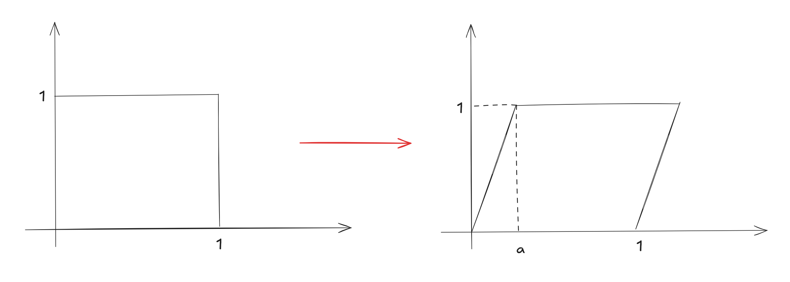

!!! remarks "Menu of this lecture"

    - [2D transformations: rotation, scale, shear](#viewing-transformation)
    - [Homogeneous coordinates](#homogeneous-coordinates)
    - [Composing transformation](#composing-transforms)

### Viewing transformation

Viewing transformation: 3D -> 2D projection

**Scale**

$$
\begin{pmatrix}
x' \\
y'
\end{pmatrix}
=\begin{pmatrix}
s_x & 0 \\
0 & s_y
\end{pmatrix}
\begin{pmatrix}
x \\
y
\end{pmatrix}
$$

Multiplying a matrix on the left corresponds to performing a row operation.

**Reflection**

E.g. reflection about the y-axis:

$$
\begin{pmatrix}
x' \\
y'
\end{pmatrix}
=\begin{pmatrix}
-1 & 0 \\
0 & 1
\end{pmatrix}
\begin{pmatrix}
x \\
y
\end{pmatrix}
$$

**Sheer**

Illustration of sheer tranformation:  
{style="width:500px"}

$$
\begin{pmatrix}
x' \\
y'
\end{pmatrix}
=\begin{pmatrix}
x+ay \\
y
\end{pmatrix}
=\begin{pmatrix}
1 & a \\
0 & 1
\end{pmatrix}
\begin{pmatrix}
x \\
y
\end{pmatrix}
$$

**Rotation**

By default, the rotation is around the origin.  
$R_{45}$ refers to rotatiing 45 degrees counterclockwose about the origin. 

$$
R_{\theta}=\begin{pmatrix}
\cos\theta & -\sin\theta \\
\sin\theta & \cos\theta
\end{pmatrix}
$$

### Homogeneous Coordinates

Translation is not linear transform, so it cannot be represented in matrix form. 
But we don't want it to be a special case, so homogeneous coordinates are used to represent all transformations. 

Add a third coordinate (w-coordinate), to represent the translation characters of points or vectors.  

**Affine transformations:**  
affine map = linear map + translation map  

$$
\begin{pmatrix}
x' \\ y'
\end{pmatrix}
=\begin{pmatrix}
a & b \\
c & d
\end{pmatrix}
\begin{pmatrix}
x \\ y
\end{pmatrix}
+\begin{pmatrix}
t_x \\ t_y
\end{pmatrix}
$$

#### 2D version

- 2D point: $\begin{pmatrix}x , y , 1 \end{pmatrix}^T$
- 2D vector:$\begin{pmatrix}x , y , 0 \end{pmatrix}^T$

When $w\neq 0$, 2D point $\begin{pmatrix}x , y , w \end{pmatrix}^T$ means $\begin{pmatrix}x/w , y/w , 1 \end{pmatrix}^T$

(The w-coordinate of vectors are 0, which means vectors are translation invariant. By comparison, w-coordinate of points are 1)

**Use homogeneous Coordinates to represent affine translations:**

$$
\begin{pmatrix}
x' \\ y' \\ w'
\end{pmatrix}
=\begin{pmatrix}
1 & 0 & t_x \\
0 & 1 & t_y \\
0 & 0 & 1
\end{pmatrix}
\begin{pmatrix}
x \\ y \\ 1
\end{pmatrix}
=\begin{pmatrix}
x+t_x \\ y+t_y \\ 1
\end{pmatrix}
$$

**Properties:**   
1. The last row must be 0 0 1.  
2. The top-left 2×2 matrix represents a linear transformation.  
3. The rightmost column represents translation.
4. Relations between points and vectors:
   - vector + vector = vector
   - point  - point  = vector
   - point  + vector = point
   - point  + point  = point

**Scale:**

$$
S(s_x, s_y)=\begin{pmatrix}
s_x & 0 & 0 \\
0 & s_y & 0 \\
0 & 0 & 1
\end{pmatrix}
$$

**Rotation:**

$$
R(\alpha)=\begin{pmatrix}
\cos\alpha & -\sin\alpha & 0 \\
\sin\alpha & \cos\alpha & 0 \\
0 & 0 & 1
\end{pmatrix}
$$

**Translation:**

$$
T(t_x, t_y)=\begin{pmatrix}
1 & 0 & t_x \\
0 & 1 & t_y \\ 
0 & 0 & 1
\end{pmatrix}
$$

**Inverse transformations:** $M^{-1}$

Esp. matrix $R_{\theta}$ for rotation is orthogonal, so $R_{-\theta}=R^{-1}=R^T$.

#### 3D version

- 3D point: $\begin{pmatrix}x , y , z, 1 \end{pmatrix}^T$
- 3D vector:$\begin{pmatrix}x , y , z, 0 \end{pmatrix}^T$

Use 4×4 matrix for affine transformations. 

### Composing Transforms

All matrices are left-multiplied to the original coordinates, and are composed in the order of transformations from right to left.

!!! examples 

    Transformations: A1 -> A2 -> ... -> An  
    Matrix: $A_n\cdots A_2A_1\begin{pmatrix}x \\ y \\ 1\end{pmatrix}$
    