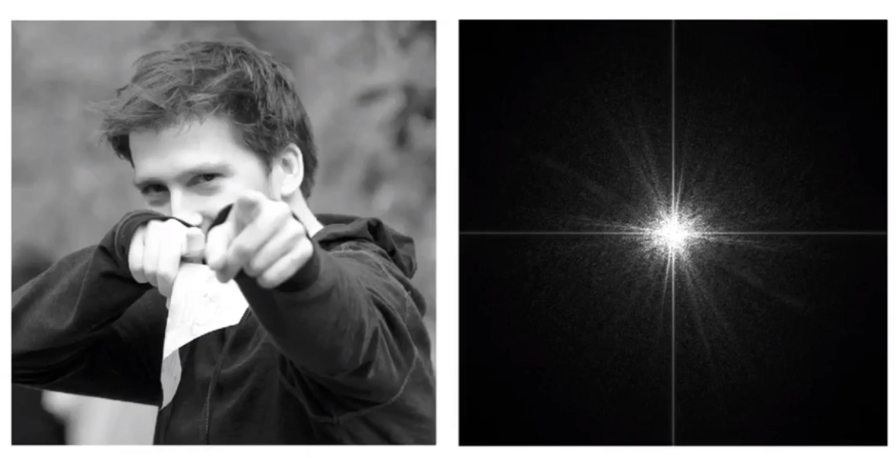
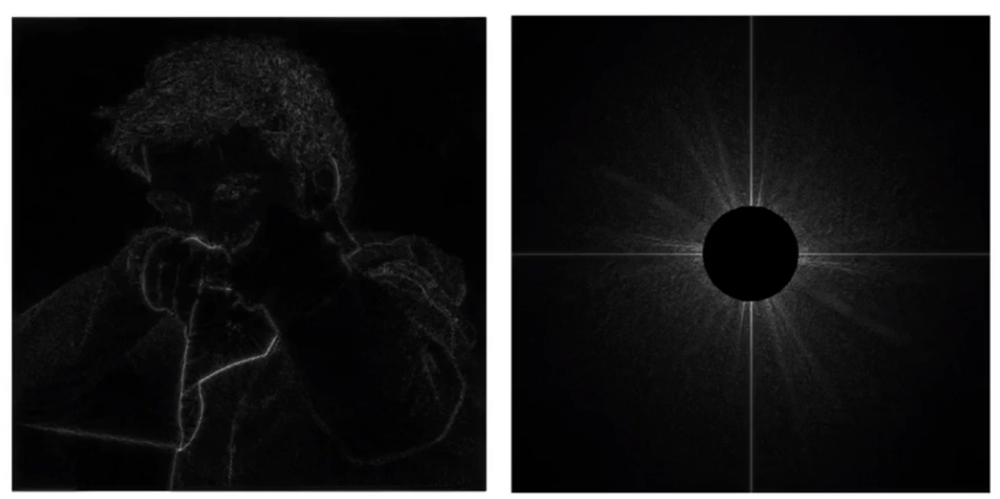
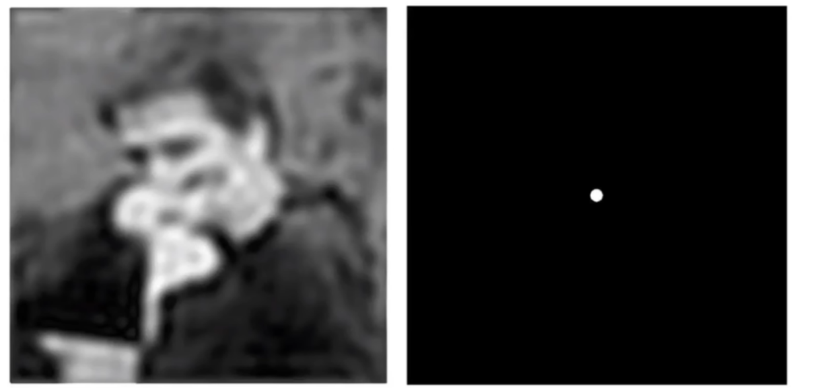

!!! remarks "Menu of this lecture"

    - [Concepts](#concepts)
    - [Frequency Domain](#frequency-domain)
    - [Filtering](#filtering)
    - [Convolution](#convolution)
    - [Sampling](#sampling)

## Concepts

Photograph: sample space  
Video: sample time

Artifact: errors/mistakes/inaccuracies in CG  
e.g. jaggies, Moire patterns, Wagon wheel effect...  
Reason: signals are changing too fast, but sampled too slowly.

Antialiasing idea: blurring (pre-filtering) before sampleing  
反走样的思想：在采样之前做模糊（滤波）  
??? normal-comment "Antialiasing and Blurred Aliasing"

    - Anitialiasing: filter then sample
    - Blurred Aliasing: sample then filter

## Frequency Domain

**Frequencies**: $\cos 2\pi fx$, $f=\frac{1}{T}$  
Fourier transform decomposes a signal into frequencies.

{style="width:600px"}

Why frequency leads to aliasing?  
Higher frequencies need faster sampling.  
Otherwise, the reconstruction will be inaccurate. It will appear to be a lower-frequency signal.  
Two frequencies that are indistinguishable at a given sampling are called "aliases".

## Filtering

**Filtering(滤波)**: Getting rid of certain frequency contents.

{style="width:600px"}

**傅里叶变换**将图像从时域变为频域，即将每个点的信息转化为不同频率的信息。  
右边图像（频谱）的中心定义为低频频率，周围定义为高频频率，从中心到周围频率递增。用图片的亮度表示不同频率上信息的量。  
自然下图片信息基本几种在低频区域。  
水平和竖直有高亮度的十字线：傅里叶变换时认为图片周期性重复，到达一个边界后重复相对边界的内容。交界处图片剧烈变化，产生极高的高频信号。

{style="width:600px"}

**高通滤波（High-pass filter）**：去除低频频率，保留高频频率，对应保留图像的边界。
为什么保留边界？边界处图像变化剧烈，高频信号信息大。

{style="width:600px"}

**低通滤波（low-pass filter）**：保留低频频率，去除高频频率，对应图像变模糊。

## Convolution

Filtering=Convolution=Averaging

**卷积**：在移动窗口时将窗口的数和覆盖的信号值点乘，在任意位置和周围的数做加权平均。  
定理：时域上两个信号的卷积，对应于频域上两个信号的乘积。频域上两个信号的卷积，对应于时域上两个信号的乘积。  

卷积的方法：

1. 直接在时域上点乘
2. 变换到频域上，在频域上乘积，再逆变换会时域

**卷积核**：所有系数和为1。  
频谱的乘积相当于留下卷积核频谱中有信息的部分。  
卷积核越大，频谱上图像越小。

## Sampling

Sampling=repeating frequency contents

**冲激函数**：模拟单位脉冲，只在一系列周期性的点上有值，其余点为零。冲激函数转化到频域后仍为冲激函数。  
原信号和冲激函数相乘（或频域上两个信号的卷积），得到采样后信号。  

**采样**是重复原始信号的频谱。  
采样间隔影响原始信号复制的间隔。  
采样率不足，采样间隔大，原始信号频谱复制的间隔小，复制搬移时频谱部分混合，发生走样。

减小走样错误：  
1. 提高采样频率  
2. 反走样：先去除高频信号，再采样

去除高频信号后，每个周期两侧的频率强度为零，在稀疏采样搬移间隔小的情况下不产生重叠部分。

Antialiasing by averaging values in pixel area:  
1. Convolve f(x,y) by a 1-pixel box-blur  
2. Then sample at every pixel's center

f(x,y)=inside(triangle,x,y) is equal to the area of the pixel covered by the triangles. 

计算像素被覆盖的面积？  
**Multisample Antialiasing(MSAA)**：用更多采样点进行反走样模糊的近似    
将像素划分为更小的像素    
MAAA解决“模糊”的操作，没有改变屏幕的像素值，没有提高分辨率。  

其他抗锯齿的方法：FXAA，TAA  
超分辨率：防止图片放大后出现锯齿，DLSS