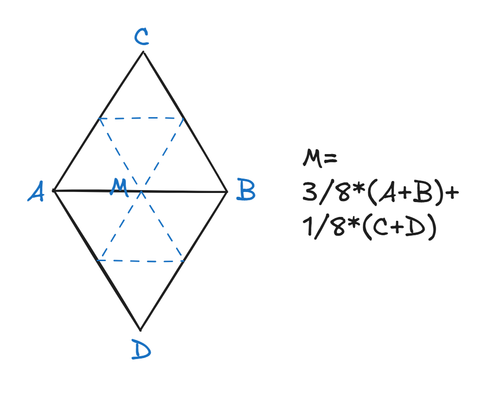
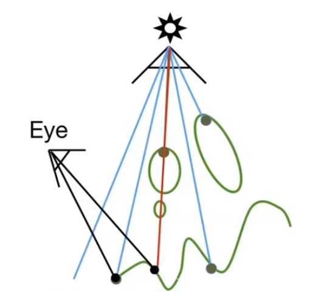

## Mesh Operation

- Mesh Subdivision：类似增大分辨率，展示更多细节。
- Mesh Simplification：删去某些边或三角形，但维持连接关系。
- Mesh Regularization：将三角形正则化，使每个面更接近正三角形，但不能丢失细节。

### Mesh Subdivision

三角形细分：先增加三角形数量，再稍微改变各个三角形位置，使其整体形成不同的形状。

#### Loop Subdivision

- Split each triangle into four: 连接三条边的中点，将原三角形分成四个
- Assign new vertex positions according to weights: new and old vertices updated differently

**怎么 update？**

1. 新点：  
   当前点所在的边被两个三角形共用。这条边的两个顶点记为 A、B，两三角形的剩余两个顶点记为 C、D，则当前点变换后的坐标为 3/8\*(A+B)+1/8\*(C+D)  
   （A 和 B 离新点更近，影响大，权重大）

{style="width:400px"}

2. 原有的点：  
   和当前点相邻的原有的点的个数是当前点的度 n。  
   u 是常数，n=3 时 u=3/16，否则 u=3/(8n)。  
   当前点变换后的坐标为：(1-n\*u)\*当前点原先的坐标+u\*所有相邻点坐标之和。

#### Catmull-Clark Subdivision

Loop Subdivision 只能用于三角形面的细分，而 Catmull-Clark Subdivision 可用于任意形状面的细分。

**定义：**

- 四边形面（quad face）和非四边形面（non-quad face）
- 度（degree）：一个顶点连接的边数
- 奇异点（extraordinaty vertex）：度不等于四的顶点

**步骤：**

1. 取每条边的中点和每个面的中点
2. 连接所有中点
3. 调整顶点的位置

细分后原有的奇异点仍然是奇异点，原来非四边形面的中点成为新的奇异点。  
非四边形面细分为多个四边形面。  
————有非四边形面，则细分后增加相应数量的奇异点；一次细分后不存在非四边形面，奇异点数不增加。

**怎么更新？（略）**

1. 新的面中心的点：用面的顶点直接平均
2. 新的边中心的点：用边的顶点和相邻的面的中心点，直接平均
3. 原先的点：用相邻的边中心点和面中心点加权平均

### Mesh Simplification

e.g. **Edge Collapse：**  
将某些边的两个顶点重合成一个。

**怎么确定哪些边坍缩？**

**Quadric Error Metrics:**  
二次误差（Quadric Error）：一个点到相关的几个面的距离平方和  
边坍缩时，将新的顶点放在某个最佳位置，使其二次误差最小

先计算所有点的最小二次误差，从小到大依次按二次误差的大小坍缩。  
每次坍缩后，周围点的二次误差会被影响，要更新周围点。

数据结构：优先队列/堆

## Shadow Mapping (dot light)

硬阴影：阴影边缘锐利，所有像素要么在阴影要么不在阴影  
软阴影：阴影平滑过渡

越靠近物体底部，阴影越硬（本影）；越远离物体底部，阴影越软（半影）

Key idea: the point NOT in shadow must be seen both by the light and by the camera.

步骤：

1. 从光源看向场景，记录能看到的点的深度  
2. 从相机看向场景，查看看到的点在上一步中记录的深度，比较记录的深度和实际到光源的深度。如果两次深度一样，则该点能被看到

{style="width:400px"}

问题：  
浮点数精度问题，相等有偏差  
shadow map的分辨率和整个图像的分辨率应对应，开销大
