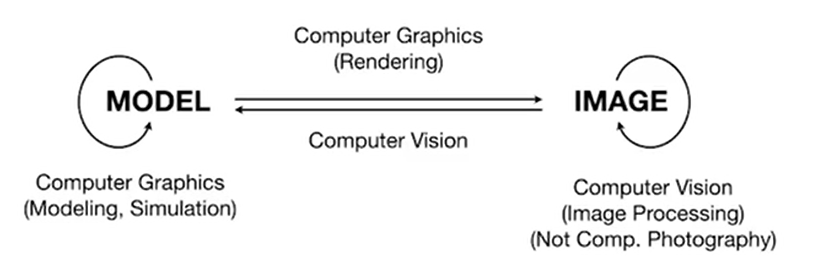
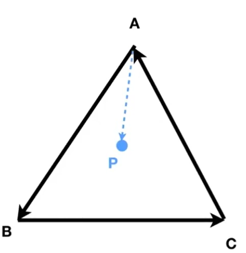

# Lecture 01 Overview of Computer Graphics

## Basic Concepts

**Rasterization**

1. Project geometry primitives (3DD triangles / polygons) onto the screen.
2. Break projected primitives into fragments (pixels)
3. Real-time applications is the gold standard in Video Games

??? note "translation"

    1. 将几何形状（3D 三角形/多边形）投影到屏幕上
    2. 将投影后的图元划分为片段（像素）
    3. 在视频游戏中，实时应用是黄金标准

**Curves and Meshes**

**Ray Tracing**

Shoot rays from camera through each pixel
Offline application is the gold standard in Animation / Movies

**Animation / Simulation**

**Difference between Computer Graphics and Computer Vision?**

[Click here to jump to the course website](http://www.cs.ucsb.edu/~lingqi/teaching/games101.html)

# Lecture 02 Review of Linear Algebra

Unit vector: $\hat{a}=\vec{a}/|\vec{a}|$  
Usually use unit vectors to present directions.

Vectors are represented as column vectors by default.

Dot product:

1. Find the angle between two vectors.  
   e.g cosine of angle bwtween light source and surface.
2. Find projection of one vector on another.

More specifically:

1. Measure how close two directions are.
2. Decompose a vector.
3. Determine forward / backward.

Cross product:  
1. Construction coordinate systems.  

Functions:  
1. Determine left / right. Given a plane and two vectors on this plane, determine the relative position of the two vectors.  
2. Determine in / out. Several vectors are connected head-to-tail to form a closed shape. Given another point, determine whether this point lies inside the closed shape.  

e.g.  
   
Check: $\vec{AB}\times\vec{AP}, \vec{BC}\times\vec{BP}, \vec{CA}\times\vec{CP}$. If the signs of all three are the same, then point P is inside the shape. 

2D reflection about y-axis: 

$$
\begin{pmatrix}
-1 & 0 \\
0 & 1
\end{pmatrix}
\begin{pmatrix}
x \\
y
\end{pmatrix}=
\begin{pmatrix}
-x \\
y
\end{pmatrix}
$$
