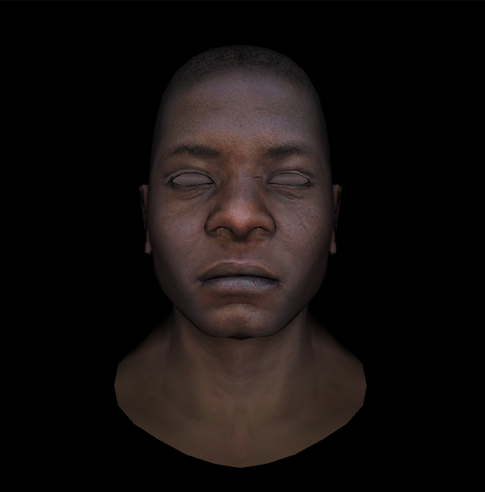

## 原理

原来的渲染方法中，利用三角形面的法向量计算光照强度，所以每个面上所有点的光照强度相同。

Gourand shading 先计算顶点的法向量，再计算顶点的光照强度，插值得到每个像素的强度。

其中，顶点的法向量定义为：考虑所有包含该顶点的三角形，以三角形面积为权值，顶点的法向量为三角形法向量的加权平均。

**具体步骤：**

1. 大小为`model->nverts()`的`vector<vec3>`用于存储顶点法向量

2. 遍历每个三角形，计算单位化的法向量和面积。再遍历每个顶点，获取顶点编号，加在 vector 相应位置。

3. 对 vector 中每个顶点法向量单位化

!!! normal-comment "如何获得顶点的索引？"

    .obj文件中，所有顶点依次存储在`facet_vrt`中，但`facet_vrt`是私有属性，故在`Model`中定义方法：

    ```cpp
    int Model::index(const int iface, const int nthvert) const {
        return facet_vrt[iface * 3 + nthvert];
    }
    ```

    可用`int idx=model->index(i,j);`得到第i个面第j个顶点的索引

!!! normal-comment "如何从.obj 文件直接获得顶点法向量？"

    如果.obj文件中有vn的行，则这些行存储每个顶点的法向量。

    根据 model.h，可以用`model->normal(i,j)`直接获取第i个面第j个顶点的法向量。

    但这里自己求法向量是~~因为我没看到~~为了展示计算过程。

## 实现

新增`calc_vertex_normal`函数，返回所有顶点的法向量：

```cpp
// 计算每个顶点的法向量
vector<vec3> calc_vertex_normal(Model* model) {
    vector<vec3> vertex_normals(model->nverts(), vec3{0, 0, 0});
    // 遍历三角形累加分量
    for (int i = 0; i < model->nfaces(); i++) {
        // 提取三角形顶点坐标
        vec3 v[3];
        for (int j = 0; j < 3; j++) {
            v[j] = model->vert(i, j);
        }
        // 计算三角形法向量和权重
        vec3 n = cross(v[2] - v[0], v[1] - v[0]);
        float area = norm(n) / 2.;
        n = normalized(n);
        // 给三个顶点法向量加分量
        for (int j = 0; j < 3; j++) {
            int vertex_idx = model->index(i, j);
            vertex_normals[vertex_idx] = vertex_normals[vertex_idx] + n * area;
        }
    }

    // 顶点法向量标准化
    for (auto& n : vertex_normals) {
        n = normalized(n);
    }
    return vertex_normals;
}
```

`main`中，在遍历顶点时计算顶点的光照强度，修改渲染的条件：

```cpp
// 遍历三角形处理
TGAImage image(width, height, TGAImage::RGB);
for (int i = 0; i < model->nfaces(); i++) {
    vec3 screen_coords[3];
    vec3 world_coords[3];
    float intensities[3];

    for (int j = 0; j < 3; j++) {
        vec3 v0 = model->vert(i, j);
        world_coords[j] = v0;

        vec4 v4 = pt2homo(v0);
        vec4 proj = Viewport * MVP * v4;
        proj = proj / proj[3];
        screen_coords[j] = homo2pt(proj);

        // 计算光照强度
        int vertex_idx = model->index(i, j);
        vec3 n = vertex_normals[vertex_idx];
        intensities[j] = max(0., n * light_dir);
    }

    // // 用叉乘计算法向量并单位化
    // vec3 n = cross(world_coords[2] - world_coords[0],
    //                world_coords[1] - world_coords[0]);
    // vec3 unit_n = normalized(n);

    // 至少一个顶点朝向光源，则渲染
    if (intensities[0] > 0 || intensities[1] > 0 || intensities[2] > 0) {
        vec2 uvs[3];
        for (int j = 0; j < 3; j++) {
            uvs[j] = model->uv(i, j);
        }
        triangle5(screen_coords, uvs, image, zbuffer, model, intensities);
    }
}
```

画三角形时传入三个顶点的强度`float* intensities`，遍历像素时插值得到每个像素的强度：

```cpp
// 遍历包围盒中的点
for (int x = bboxmin.x; x <= bboxmax.x; x++) {
    for (int y = bboxmin.y; y <= bboxmax.y; y++) {
        vec3 p = {static_cast<float>(x), static_cast<float>(y), 0.};
        vec2 uvp = {0., 0.};
        vec3 bc = barycentric(pts, p);
        if (bc.x < 0 || bc.y < 0 || bc.z < 0)
            continue;

        // 计算zbuffer,纹理坐标和每个像素的光照强度
        float z = 0.;
        float pixel_intensity = 0.;
        for (int i = 0; i < 3; i++) {
            z += pts[i].z * bc[i];
            uvp[0] += uvs[i][0] * bc[i];
            uvp[1] += uvs[i][1] * bc[i];
            pixel_intensity += intensities[i] * bc[i];
        }

        if (z < zbuffer[static_cast<int>(x + y * width)]) {
            zbuffer[static_cast<int>(x + y * width)] = z;
            int tex_x = min(int(uvp.x * model->diffuse().width()),
                            model->diffuse().width() - 1);
            int tex_y = min(int(uvp.y * model->diffuse().height()),
                            model->diffuse().height() - 1);
            TGAColor color = model->diffuse().get(tex_x, tex_y);
            unsigned char r = color[2] * pixel_intensity;
            unsigned char g = color[1] * pixel_intensity;
            unsigned char b = color[0] * pixel_intensity;
            image.set(x, y, TGAColor{r, g, b});
        }
    }
}
```

结果:

（逻辑上只有顶点法向量计算不同，渲染结果和上一次差不多）

{style="width:500px"}
