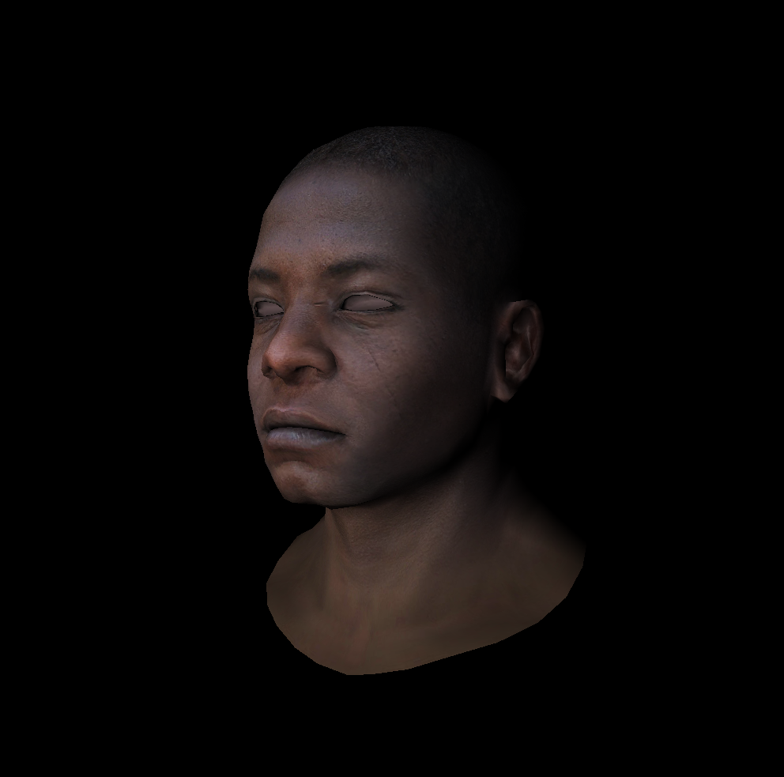

## 原理

当相机在不同位置、不同角度观察时，渲染的图像不同。定义相机的位置为`vec3 eye`，相机观察的角度为`vec3 gaze`（gaze 从相机指向模型），相机向上的方向为`vec3 up`。

对相机和模型同时变换，使变换后相机位于原点，向上为 Y，正方向为-Z。

变换分为两步，先将相机平移到原点，再旋转到上述位置。

**第一步平移**

矩阵$T_{view}$，即对应 MVP 中的 Model：

$$
T_{view}=
\begin{pmatrix}
1 & 0 & 0 & -x_{eye} \\
0 & 1 & 0 & -y_{eye} \\
0 & 0 & 1 & -z_{eye} \\
0 & 0 & 0 & 1
\end{pmatrix}
$$

**第二步旋转**

Y 对应 up，Z 对应-gaze，故 X 对应$up\times -gaze=gaze\times up$。将$(X,Y,Z)$旋转到$(gaze\times up,up,-gaze)$的矩阵$R_{view}^{-1}$为：

$$
R_{view}^{-1}=\begin{pmatrix}
x_{gaze\times up} & x_{up} & x_{-gaze} & 0 \\
y_{gaze\times up} & y_{up} & y_{-gaze} & 0 \\
z_{gaze\times up } & z_{up} & z_{-gaze} & 0 \\
0 & 0 & 0 & 1
\end{pmatrix}
$$

由于旋转矩阵正交，第二步矩阵$R_{view}$，即对应 MVP 中的 View：

$$
R_{view} = \begin{pmatrix}
x_{gaze\times up} & y_{gaze\times up} & z_{gaze\times up} & 0 \\
x_{up}            & y_{up}            & z_{up}            & 0 \\
x_{-gaze}         & y_{-gaze}         & z_{-gaze}         & 0 \\
0                 & 0                 & 0                 & 1
\end{pmatrix}
$$

## 实现

自定义相机参数

```cpp
vec3 eye = {2, 0, 3};
vec3 center = {0, 0, 0};
vec3 up = {0, 1, 0};
```

函数`mv_mat`生成MV变换的矩阵

```cpp
// MV变换
mat<4, 4> mv_mat(vec3 eye, vec3 center, vec3 up) {
    vec3 gaze = normalized(center - eye);
    vec3 z = -1 * gaze;
    vec3 x = normalized(cross(gaze, up));
    // vec3 y = up; // 要求gaze和up正交
    vec3 y = cross(z, x);

    // 平移
    mat<4, 4> T = identity<4>();
    T[0][3] = -eye.x;
    T[1][3] = -eye.y;
    T[2][3] = -eye.z;

    // 旋转
    mat<4, 4> R = identity<4>();
    for (int i = 0; i < 3; i++) {
        R[0][i] = x[i];
        R[1][i] = y[i];
        R[2][i] = z[i];
    }

    // 合成MV变换
    return R * T;
}
```

修改main中矩阵部分

```cpp
// 矩阵用于变换
// mat<4, 4> Model = model_mat();
// mat<4, 4> View = view_mat();
mat<4, 4> MV = mv_mat(eye, center, up);
mat<4, 4> Projection = projection_mat(near, far, l, r, b, t);
mat<4, 4> MVP = Projection * MV;
mat<4, 4> Viewport = viewport_mat(0, 0, width, height, 255);
```

结果：

（逻辑上只有顶点法向量计算不同，渲染结果和上一次差不多）

{style="width:500px"}

