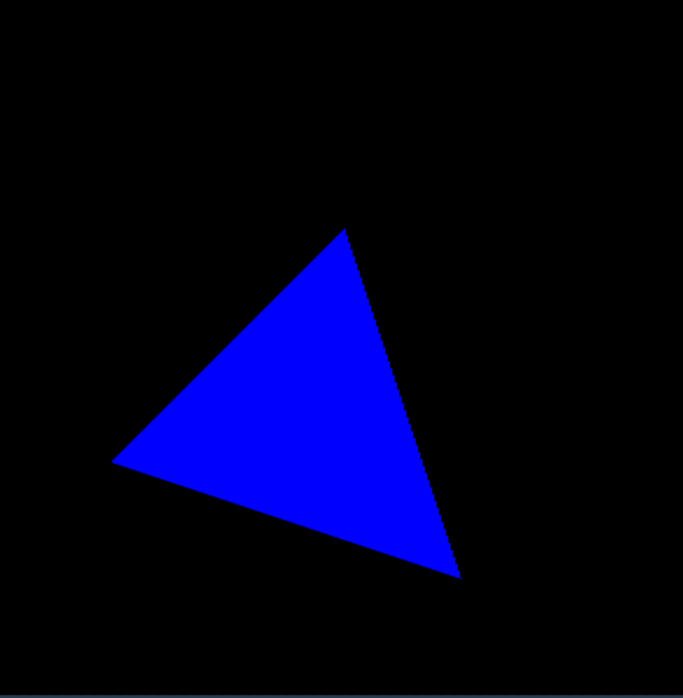
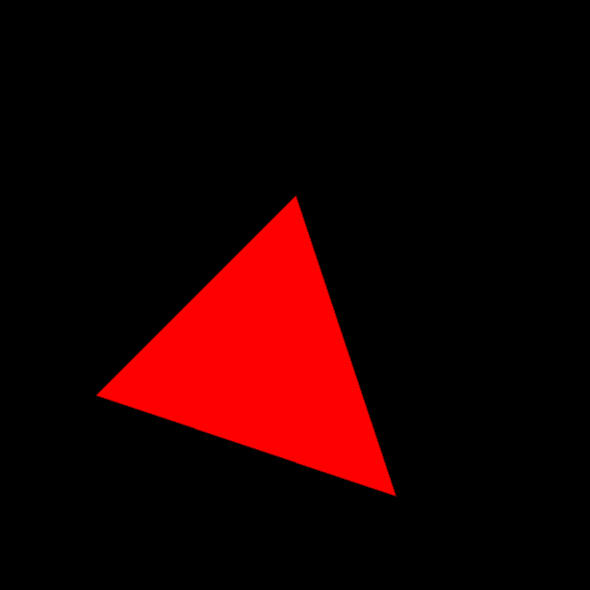
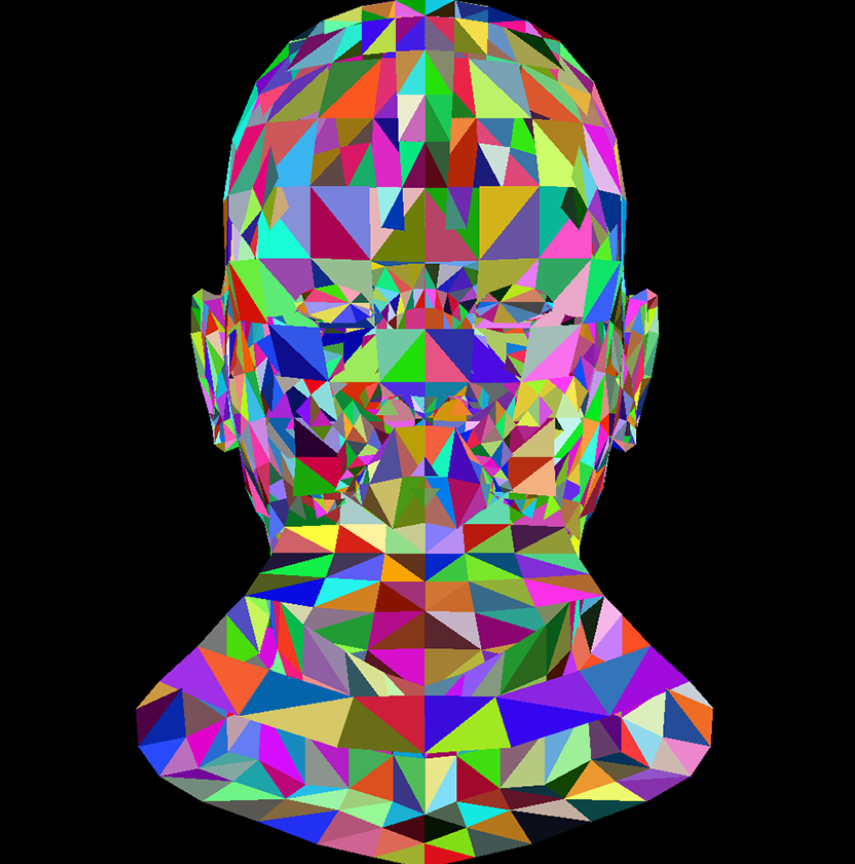
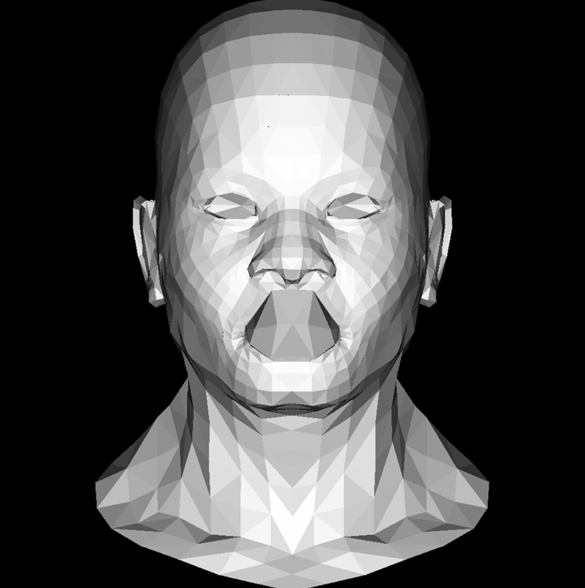
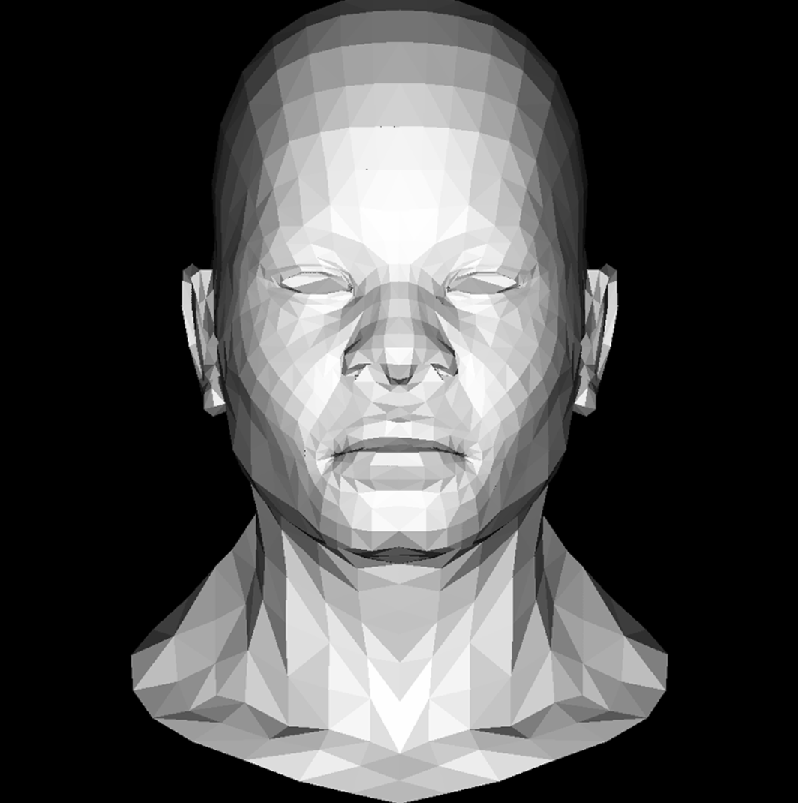

## 画三角形

### 尝试

~~因为ssloy说Usually, after this introduction I leave my students for about an hour（~~

用`unordered_map<int,vector<int>>`记录每个x对应的边界上的y，最后用竖直线填充三角形。

由于统一用x作为key，不能根据斜率翻转。但是普通Bresenhan方法每次y只能上升或下降一格，斜率大的线会变成45度直线+竖直直线。这里用了`int step = error / dx;`来进行大斜率的移动。

```cpp
#include <bits/stdc++.h>
#include "model.h"
#include "tgaimage.h"
using namespace std;

const TGAColor white = TGAColor(255, 255, 255, 255);
const TGAColor blue = TGAColor(0, 0, 255, 255);

void addEdge(vec3 v0, vec3 v1, unordered_map<int, vector<int>>& line) {
    int x0 = v0.x;
    int y0 = v0.y;
    int x1 = v1.x;
    int y1 = v1.y;
    if (x0 > x1) {
        swap(x0, x1);
        swap(y0, y1);
    }

    int dx = x1 - x0;
    int dy = y1 - y0;
    int derror = abs(dy * 2);
    int error = 0;
    int y = y0;
    for (int x = x0; x <= x1; x++) {
        line[x].push_back(y);
        error += derror;
        if (error >= dx) {
            int step = error / dx;
            y += (y1 > y0) ? step : -step;
            error -= step * dx * 2;
        }
    }
}

void triangle1(vec3 v0, vec3 v1, vec3 v2, TGAImage& image, TGAColor color) {
    unordered_map<int, vector<int>> line;
    addEdge(v0, v1, line);
    addEdge(v1, v2, line);
    addEdge(v2, v0, line);
    int xmin = min({v0.x, v1.x, v2.x});
    int xmax = max({v0.x, v1.x, v2.x});
    for (int x = xmin; x <= xmax; x++) {
        vector<int> vy = line[x];
        if (vy.empty()) {
            cout << "vy is empty!" << '\n';
        }
        int ymin = *min_element(vy.begin(), vy.end());
        int ymax = *max_element(vy.begin(), vy.end());
        for (int y = ymin; y <= ymax; y++) {
            image.set(x, y, color);
        }
    }
}

int main() {
    TGAImage image(600, 600, TGAImage::RGB);
    vec3 v0 = {100., 200., 100.};
    vec3 v1 = {300., 400., 100.};
    vec3 v2 = {400., 100., 100.};
    triangle1(v1, v2, v0, image, blue);
    image.write_tga_file("triangle.tga");
    return 0;
}
```

结果：

{style="width:500px"}

（下面是官方的改进流程）

### 1. 画边框

```cpp
void triangle2(vec3 v0, vec3 v1, vec3 v2, TGAImage& image, TGAColor color) {
    line(v0.x, v0.y, v1.x, v1.y, image, color);
    line(v1.x, v1.y, v2.x, v2.y, image, color);
    line(v2.x, v2.y, v0.x, v0.y, image, color);
}
```

### 2. 区分边界

将v0, v1, v2按y的升序排列，由v0, v1和v1, v2画的边为一组，中间有转折；由v0, v2画的边为一组，无转折。

```cpp
void triangle2(vec3 v0, vec3 v1, vec3 v2, TGAImage& image, TGAColor color) {
    if (v0.y > v1.y)
        swap(v0, v1);
    if (v0.y > v2.y)
        swap(v0, v2);
    if (v1.y > v2.y)
        swap(v1, v2);
        
    line(v0.x, v0.y, v1.x, v1.y, image, color);
    line(v1.x, v1.y, v2.x, v2.y, image, color);
    line(v2.x, v2.y, v0.x, v0.y, image, color);
}
```

### 3. 区分上下部分

交换后v1为转折点，根据v1分割成上下两部分，分别计算左右边界的x值。

```cpp
void triangle2(vec3 v0, vec3 v1, vec3 v2, TGAImage& image, TGAColor color) {
    if (v0.y > v1.y)
        swap(v0, v1);
    if (v0.y > v2.y)
        swap(v0, v2);
    if (v1.y > v2.y)
        swap(v1, v2);

    int total_height = v2.y - v0.y;
    int down_height = v1.y - v0.y + 1;  // +1避免除以零
    int up_height = v2.y - v1.y + 1;
    // 下半个三角形
    for (int y = v0.y; y <= v1.y; y++) {
        float alpha = (float)(y - v0.y) / total_height;  // alpha表示长边的比例
        float beta = (float)(y - v0.y) / down_height;    // beta表示转折边的比例
        int x_a = v0.x + alpha * (v2.x - v0.x);
        int x_b = v0.x + beta * (v1.x - v0.x);
        image.set(x_a, y, red);
        image.set(x_b, y, green);
    }
    // 上半个三角形
    for (int y = v1.y; y <= v2.y; y++) {
        float alpha = (float)(y - v0.y) / total_height;  // alpha表示长边的比例
        float beta = (float)(y - v1.y) / up_height;    // beta表示转折边的比例
        int x_a = v0.x + alpha * (v2.x - v0.x);
        int x_b = v1.x + beta * (v2.x - v1.x);
        image.set(x_a, y, red);
        image.set(x_b, y, green);
    }
}
```

### 4. 水平线填充

```cpp
// 下半个三角形
for (int y = v0.y; y <= v1.y; y++) {
    float alpha = (float)(y - v0.y) / total_height;  // alpha表示长边的比例
    float beta = (float)(y - v0.y) / down_height;    // beta表示转折边的比例
    int x_a = v0.x + alpha * (v2.x - v0.x);
    int x_b = v0.x + beta * (v1.x - v0.x);
    // image.set(x_a, y, red);
    // image.set(x_b, y, green);
    if (x_a>x_b)
        swap(x_a, x_b); // 确定左右关系
    for (int x=x_a;x<=x_b;x++) {
        image.set(x, y, color);
    }
}
// 上半个三角形
for (int y = v1.y; y <= v2.y; y++) {
    float alpha = (float)(y - v0.y) / total_height;  // alpha表示长边的比例
    float beta = (float)(y - v1.y) / up_height;    // beta表示转折边的比例
    int x_a = v0.x + alpha * (v2.x - v0.x);
    int x_b = v1.x + beta * (v2.x - v1.x);
    // image.set(x_a, y, red);
    // image.set(x_b, y, green);
    if (x_a > x_b)
        swap(x_a, x_b);  // 确定左右关系
    for (int x = x_a; x <= x_b; x++) {
        image.set(x, y, color);
    }
}
```

### 5. 合并代码

```cpp
void triangle3(vec3 v0, vec3 v1, vec3 v2, TGAImage& image, TGAColor color) {
    if (v0.y == v1.y && v0.y == v2.y)
        return;

    // 按y的升序排列
    if (v0.y > v1.y)
        swap(v0, v1);
    if (v0.y > v2.y)
        swap(v0, v2);
    if (v1.y > v2.y)
        swap(v1, v2);

    int total_height = v2.y - v0.y + 1;
    for (int y = v0.y; y <= v2.y; y++) {
        bool is_up = y > v1.y || v0.y == v1.y;
        int segment_height = is_up ? v2.y - v1.y + 1 : v1.y - v0.y + 1;
        float alpha = (float)(y - v0.y) / total_height;  // 长边的比例
        float beta = (float)(y - (is_up ? v1.y : v0.y)) /
                     segment_height;  // 转折边的比例
        int x_a = v0.x + alpha * (v2.x - v0.x);
        int x_b =
            is_up ? v1.x + beta * (v2.x - v1.x) : v0.x + beta * (v1.x - v0.x);
        if (x_a > x_b)
            swap(x_a, x_b);
        for (int x = x_a; x <= x_b; x++) {
            image.set(x, y, color);
        }
    }
}
```

结果：

{style="width:500px"}

## 重心坐标

已知三角形ABC和点P，P的重心坐标为三个顶点的加权值： 

$$ P=u\cdot A+v\cdot B+w\cdot C$$

其中$u+v+w=1$.

若$u,v,w$都在[0, 1]范围内，则P在三角形内；若至少一个权值在范围外，则至少一个值小于零，P在三角形外。

令三个顶点的坐标分别为$x_i, y_i, z_i$，P点坐标为$x_p, y_p, z_p$，则：

$$
\begin{cases}
x_p-x_2=u\cdot (x_0-x_2)+v\cdot (x_1-x_2) \\
y_p-y_2=u\cdot (y_0-y_2)+v\cdot (y_1-y_2) \\
\end{cases}
$$

增广矩阵：

$$
\begin{pmatrix}
x_0-x_2 & x_1-x_2 \\
y_0-y_2 & y_1-y_2 \\
\end{pmatrix}
\begin{pmatrix}
u \\
v \\
\end{pmatrix}=
\begin{pmatrix}
x_p-x_2 \\
y_p-y_2 \\
\end{pmatrix}
$$

Cramer's Rule:

$$
u=\frac{D_u}{D}
=\frac{
\begin{vmatrix}
x_p - x_2 & x_1 - x_2 \\
y_p - y_2 & y_1 - y_2 \\
\end{vmatrix}
} {
\begin{vmatrix}
x_0 - x_2 & x_1 - x_2 \\
y_0 - y_2 & y_1 - y_2 \\
\end{vmatrix}
},
v=\frac{D_v}{D}=\frac{
\begin{vmatrix}
x_0 - x_2 & x_p - x_2 \\
y_0 - y_2 & y_p - y_2 \\
\end{vmatrix}
} {
\begin{vmatrix}
x_0 - x_2 & x_1 - x_2 \\
y_0 - y_2 & y_1 - y_2 \\
\end{vmatrix}
}
$$

定义U：

$$
\begin{aligned}
U &= 
\begin{pmatrix}
x_0 - x_2 & x_1 - x_2 & x_2 - x_p
\end{pmatrix}
\times
\begin{pmatrix}
y_0 - y_2 & y_1 - y_2 & y_2 - y_p
\end{pmatrix} \\
&=
\begin{vmatrix}
i & j & k\\
x_0 - x_2 & x_1 - x_2 & x_2 - x_p \\
y_0 - y_2 & y_1 - y_2 & y_2 - y_p
\end{vmatrix} \\
&=
\begin{pmatrix}
D_u & D_v & D
\end{pmatrix}
\end{aligned}
$$

则：

$$
u=\frac{U.x}{U.z}, v=\frac{U.y}{U.z}
$$

代码：

```cpp
vec3 barycentric(vec3* pts, vec3 p) {
    vec3 u =
        cross(vec3{pts[0].x - pts[2].x, pts[1].x - pts[2].x, pts[2].x - p.x},
              vec3{pts[0].y - pts[2].y, pts[1].y - pts[2].y, pts[2].y - p.y});
    if (abs(u.z) < 1)
        return vec3{-1, 1, 1};
    return vec3{u.x / u.z, u.y / u.z, 1 - u.x / u.z - u.y / u.z};
}

void triangle4(vec3* pts, TGAImage& image, TGAColor color) {
    // 确定包围盒大小
    vec2 bboxmin = {
        image.width() - 1.,
        image.height() - 1.};  // 记录左上角，初始化为最大值（右下角）
    vec2 bboxmax = {0., 0.};    // 记录右下角，初始化为最小值（左上角）
    vec2 clamp = {image.width() - 1., image.height() - 1.};  // 限制大小
    for (int i = 0; i < 3; i++) {
        bboxmin.x = max(0., min(bboxmin.x, pts[i].x));
        bboxmin.y = max(0., min(bboxmin.y, pts[i].y));
        bboxmax.x = min(clamp.x, max(bboxmax.x, pts[i].x));
        bboxmax.y = min(clamp.y, max(bboxmax.y, pts[i].y));
    }

    // 判断是否在三角形内
    for (int x = bboxmin.x; x <= bboxmax.x; x++) {
        for (int y = bboxmin.y; y <= bboxmax.y; y++) {
            vec3 bf = barycentric(pts, {(double)x, (double)y, 0.});
            if (bf.x<0 || bf.y<0 || bf.z<0)
                continue;
            image.set(x, y, color);
        }
    }
}
```

结果：

{style="width:500px"}

## 平面着色

### 随机着色

这里自己加了`vec2i`结构体，用来表示`vector<2,int>`。

代码：

```cpp
#include "model.h"
#include "tgaimage.h"
using namespace std;

vec3 barycentric(vec2i* pts, vec2i p) {
    vec3 u = cross(vec3{static_cast<double>(pts[0].x - pts[2].x),
                        static_cast<double>(pts[1].x - pts[2].x),
                        static_cast<double>(pts[2].x - p.x)},
                   vec3{static_cast<double>(pts[0].y - pts[2].y),
                        static_cast<double>(pts[1].y - pts[2].y),
                        static_cast<double>(pts[2].y - p.y)});
    if (abs(u.z) < 1)
        return vec3{-1, 1, 1};
    return vec3{u.x / u.z, u.y / u.z, 1 - u.x / u.z - u.y / u.z};
}

void triangle4(vec2i* pts, TGAImage& image, TGAColor color) {
    // 确定包围盒大小
    vec2i bboxmin = {
        image.width() - 1,
        image.height() - 1};  // 记录左上角，初始化为最大值（右下角）
    vec2i bboxmax = {0, 0};   // 记录右下角，初始化为最小值（左上角）
    vec2i clamp = {image.width() - 1, image.height() - 1};  // 限制大小
    for (int i = 0; i < 3; i++) {
        bboxmin.x = max(0, min(bboxmin.x, pts[i].x));
        bboxmin.y = max(0, min(bboxmin.y, pts[i].y));
        bboxmax.x = min(clamp.x, max(bboxmax.x, pts[i].x));
        bboxmax.y = min(clamp.y, max(bboxmax.y, pts[i].y));
    }

    for (int x = bboxmin.x; x <= bboxmax.x; x++) {
        for (int y = bboxmin.y; y <= bboxmax.y; y++) {
            vec3 bf = barycentric(pts, {x, y});
            if (bf.x < 0 || bf.y < 0 || bf.z < 0)
                continue;
            image.set(x, y, color);
        }
    }
}

int main(int argc, char** argv) {
    Model* model = nullptr;
    if (2 == argc) {
        model = new Model(argv[1]);
    } else {
        model = new Model("obj/african_head.obj");
    }

    int width = 1000;
    int height = 1000;
    TGAImage image(width, height, TGAImage::RGB);
    for (int i = 0; i < model->nfaces(); i++) {
        vec2i screen_coords[3];
        for (int j = 0; j < 3; j++) {
            vec3 v0 = model->vert(i, j);
            int x0 = (v0.x + 1.) * width / 2.;
            int y0 = (v0.y + 1.) * height / 2.;
            screen_coords[j] = vec2i{x0, y0};
        }
        // 随机生成颜色
        unsigned char r = rand() % 255;
        unsigned char g = rand() % 255;
        unsigned char b = rand() % 255;
        TGAColor{r, g, b, 255};
        triangle4(screen_coords, image, TGAColor{r, g, b, 255});
    }
    image.write_tga_file("tri_head_rand.tga");
    return 0;
}
```

结果：

{style="width:500px"}

## 光照

认为光照强度等于光向量与三角形法线向量的点积。

代码：

```cpp
int main(int argc, char** argv) {
    Model* model = nullptr;
    if (2 == argc) {
        model = new Model(argv[1]);
    } else {
        model = new Model("obj/african_head.obj");
    }

    int width = 1000;
    int height = 1000;
    vec3 light_dir = {0, 0, -1};
    TGAImage image(width, height, TGAImage::RGB);
    for (int i = 0; i < model->nfaces(); i++) {
        vec2i screen_coords[3];
        vec3 world_coords[3];
        for (int j = 0; j < 3; j++) {
            vec3 v0 = model->vert(i, j);
            int x0 = (v0.x + 1.) * width / 2.;
            int y0 = (v0.y + 1.) * height / 2.;
            screen_coords[j] = vec2i{x0, y0};
            world_coords[j] = v0;
        }

        // 用叉乘计算法向量并单位化
        vec3 n = cross(world_coords[2] - world_coords[0],
                       world_coords[1] - world_coords[0]);
        double len = norm(n);
        vec3 unit_n = normalized(n);

        // 计算光照强度
        double intensity = unit_n * light_dir;
        cout << intensity << '\n';
        if (intensity > 0) {
            triangle4(screen_coords, image,
                      TGAColor(intensity * 255, intensity * 255,
                               intensity * 255, 255));
        }
    }
    image.write_tga_file("tri_head_rand.tga");
    return 0;
}
```

结果：

{style="width:500px"}


因为没有用z-buffer，嘴巴内表面渲染后覆盖了外表面的结果（？）

## 深度缓冲

按图像的大小构造z-buffer数组，初始化为负无穷，遍历三角形时对其中每个像素的值取最大（规定z值越大表示离摄像机越近）。

z-buffer用于记录每个像素的深度，保证绘制前面的图形、遮挡后面的图形。

代码：

```cpp
// 计算zbuffer
double z = 0.;
for (int k = 0; k < 3; k++) {
    z += pts[k].z * bc[k]; // 用重心坐标得到深度的插值
}
if (z > zbuffer[static_cast<int>(x + y * width)]) {
    zbuffer[static_cast<int>(x + y * width)] = z;
    image.set(x, y, color); // 当距离更近时绘制
}
```

结果：

head_zbuffer
{style="width:500px"}