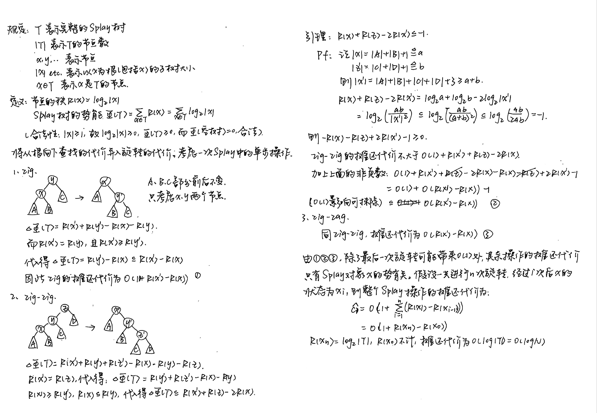

# ADS Lec 01 AVL 树和伸展树

## AVL 树

树的高度：根节点到最远的叶节点的距离（边数）

平衡二叉树：二叉搜索树+所有节点|左子树高度-右子树高度|<=1（平衡因子<=1）  
查找、插入、删除和不同二叉搜索树相同，只是每次再检查是否平衡

### 查找/插入

左旋：向左旋转，冲突的左孩变右孩  
右旋：向右旋转，冲突的右孩变左孩

**什么时候、什么节点左旋/右旋？**

LL 型（失衡节点 2，失衡节点左孩子 1）：失衡节点右旋  
RR 型（失衡节点-2，失衡节点右孩子-1）：失衡节点左旋  
LR 型（失衡节点 2，失衡节点左孩子-1）：左孩子左旋，失衡节点右旋  
RL 型（失衡节点-2，失衡节点右孩子-1）：右孩子右旋，失衡节点左旋

**怎么判断是哪种情况？**

检查插入的节点在失衡节点的哪个孩子的哪个子树上。  
或分别看失衡节点、左右孩子的平衡节点。

若同时有多个祖先失衡，只要调整距离最近的失衡节点。

### 删除

删除操作和普通二叉搜索树相同，用左子树或右子树最接近的节点替换，检查平衡。  
需要依次对每个祖先、从下到上检查，如果失衡可能需要调整多次。

!!! normal-comment "给定树高 h，AVL 树至少有几个节点？"

    “树高”定义为根节点到当前节点的路径长度。空的数高度为-1，只有根节点的树高度为 0。
    记$N(h)$为高度 h 的 AVL 树的最小节点数。

    由于希望总节点数最少，平衡因子尽量为$\pm 1$，即左右子树的高度一个为$h$、一个为$h-1$。因此$N(h)=N(h-1)+N(h-2)+1$。

    初始条件：$N(-1)=0$，$N(0)=1$

    斐波那契数列：$F_1=1, F_2=2, F_3=3, F_4=5\cdots F_n=F_{n-1}+F_{n-2}$

    递推结果：$N(h)=F_{h+2}-1$

    由于$F_n\approx\phi^n / \sqrt{5}$，其中$\phi\approx 1.618$，$N(h)\approx\phi^{h+2}-1$，为指数级别。

    故如果 AVL 树有 n 个节点，则树高为$O(\log n)$级别。

!!! normal-comment "给定树高 h，AVL 树至多有几个节点？"

    记$M(h)$为高度 h 的 AVL 树的最小节点数。

    为了使节点数最多，树应该尽量饱满，左右子树的树高都为$h-1$。

    递推关系：$M(h)=2M(h-1)+1$；初始条件：$M(-1)=0$，$M(0)=1$

    递推结果：$M(h)=2^{h}-1$

## 伸展树（Splay Tree）

伸展树是一种自平衡的 BST，它的核心原理是在每次访问节点时，将该节点通过旋转操作“伸展”到根节点。

通过这种方式，伸展树能在一定程度上优化频繁访问节点的查询效率（不仅推到根部，还将树高变成约一半）。

### 访问节点

每次对节点进行查找、插入或删除时，通过旋转将该节点提升到根部

**旋转的操作：**

当前节点、父亲、爷爷为 LR 或 RL 型：旋转操作和 AVL 树相同，称为 zig-zag（两次旋转方向相反）  
当前节点、父亲、爷爷为 LL 或 RR 型：先旋转爷爷、再旋转父亲，和 AVL 树相比多一次父亲的旋转，称为 zig-zig（两次旋转方向相同）  
esp. 当前节点为根节点的儿子时，只进行一次旋转，称为 zig

AVL 树和 Splay 树在 LL 型、RR 型旋转的区别：

{style="width:500px"}

### 查找、插入、删除

- 查询：根据 BST 找到要查询的点，旋转到根部
- 插入：根据 BST 找到要插入的点，插入，并旋转到根部
- 删除：先找到要删除的节点、旋转到根部，删除根节点，合并左右子树（将右子树中最小的或左子树中最大的 splay 到根部，连接剩余子树）

## 摊还分析

分析最大时间复杂度时，如果用所有操作中的最坏情况\*操作次数，会带来大量冗余的时间代价，导致估计的 TC 远大于实际值。

摊还分析相当于将代价大的步骤分摊到代价小的步骤，得到更接近实际的结果。

摊还分析分为**聚合法、核法、势能法**三种。

聚合法：平均代价 = 总代价 / 操作次数

核法：定义基准代价，每次多的记为负、少的记为正，要维持账户总数值大于零

势能法：定义关于状态的势能函数，对于代价大的操作，用势能的下降抵消操作的代价

详见这两篇文章：

- [聚合法、核法](https://zh.wikipedia.org/wiki/%E5%B9%B3%E6%91%8A%E5%88%86%E6%9E%90)

- [势能法](https://www.yuque.com/xianyuxuan/saltfish_shop/weekly002_amortized_analysis#KmnY6)

**push, pop, multipop**

操作代价$\Phi_1$，势函数$\Phi_2=\text{height of stack}$

$$\Phi_1 +\Phi_2=2n\,,\, \Phi_2(n)<n$$

$$|\Phi_1|=|(\Phi_1 + \Phi_2)-\Phi_2|\le|\Phi_1 +\Phi_2|+|\Phi_2|=3n$$

### Splay 树的摊还分析

（详见后面图片）

n 节点的伸展树，连续 M 次搜索需要 $O(M\log n+n\log n)$ 时间。

$$\lim _{M\to\infty}\frac{M\log n+n\log n}{M}=\log n$$

- $\Phi_1$：每次旋转次数
- $\Phi_2$：$Rank(z)=\log_2(\text{decendents of z})\, ,\, \Phi_2=\displaystyle\sum_{z\in \text{Tree}}Rank(z)$

Splay(x)时，每一步操作有：

$$\text{steps}+\Delta\Phi_2\le 3(Rank'(x)-Rank(x))+1$$

$$Rank'(x)=\log_2 n$$

<!-- ??? normal-comment "引理证明" -->

**证明：**

对每一步求和：

$$\sum\text{steps}+\Phi_2(T_M)-\Phi_2(T_0)\le 3\log_2 n+1$$

??? normal-comment "Splay 树详细证明"

    
