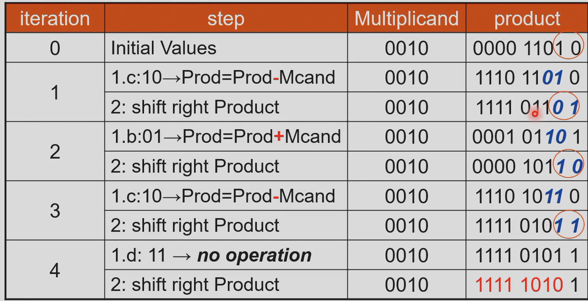
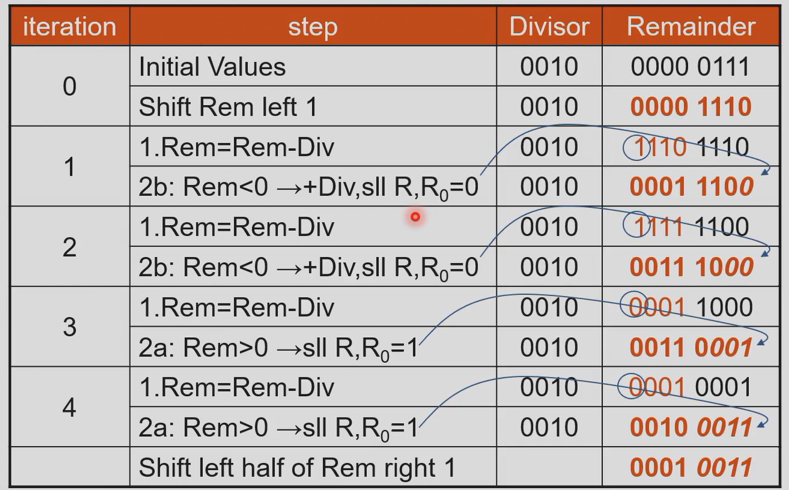

## 数的表示

word 由计算机的位宽决定  
word 是 32 位，doubleword 是 64 位  
指令也是用 word 形式表示，即指令是 32bit

### 有符号数

有符号数的表示：

1. sign magnitude：第一位符号位（0 正，1 负），后面绝对值（0 有两个）
2. two's complement：2 的补码，第一位$-2^n$

为什么一般用补码？符号位表示，则符号位和后面要分开处理，硬件开销大  
补码可以直接计算，且只有一个零

- 原码：符号位表示
- 反码：符号位不变，其他位取反
- 补码：反码+1
- 移码：补码的符号位取反（只作用于负数）

### 溢出

判断 overflow（有符号数）：

1. 次高位向高位进位，记为 c2；高位向再上一位进位，记为 c1。如果 c1 和 c2 异或为 1，则有进位。
2. 考虑加减法结果加一位（双符号位）。以 8 位为例，看第 9 位和第 8 位，如果两者不同（异或为 1），则溢出。

溢出处理：忽略 / 报给 OS / 程序自己处理  
ALU 检测溢出（异常，中断）：把当前指令的地址存在特殊的寄存器 EPC，跳到 OS 中处理异常的部分（或其他处理）  
OS 中纠正再返回，或带着报错返回程序，或终止程序

## ALU

构建 ALU：从一位扩展到多位  
单位：与，或，加，减，比较，检测零  
指令最后几位的 operation code 决定执行哪种运算

### 一位 ALU

**加法：**

全加器：

- $\text{sum}=A\oplus B\oplus C_{in}$
- $C_{out}=BC_{in}+AC_{in}+AB$

n 位加法需要 n 个全加器

**减法：**

B 按位取反，cin 一定是 1（减 B 等价于加 B 的补码）  
多位减法，只有最低位的 carry in 是 1，其余位是 0。（总的 carry in 是 1）

parallel redundant select：提前并行计算处出 cin 是 0 和 1 的两种可能结果，再选择。加快速度

**比较：**

slt rd rs rt: set on less than, rd 存储结果，对 rs 和 rt 比较。当 rs < rt 时 rd 为 1，否则为 0。即`rd=(rs<rt)?1:0`  
slt 通过减法实现。如果 rs-rt<0，则 rd 为 1。  
先判断是不是同号，因为异号相减会溢出。  
slt 作为符号位的检测

**溢出检测：**

各个运算前先通过 overflow detection 检测。

？？？？？？？？？？

least significant bit：less 信号，表示是最低位的输入
most significant bit：最高位（符号位），叫做 set 信号，表示 A < B 的最终判断结果
只有在不溢出的情况下，set 才有意义。

**零的检测：**

make the common case fast  
得到计算结果后，再判断结果是不是零（按位或的取反）

### 多位 ALU

扩展：依次计算每一位，进位串联  
ALU 输出：是不是 0，计算结果，有没有溢出

Bnegate：把 B_invert 和 carry in 结合  
减法时取反和 carry in 都是 1，而在加法时都是 0。把这两条线合成一条线。

Verilog 代码：

```v
module alu(A, B, ALU_operation, res, zero, overflow);
    input [31:0] A, B;
    input [2:0] ALU_operation;
    output [31:0] res;
    output zero;
    wire [31:0] res_and, res_or, res_add, res_sub, res_nor, res_slt;
    reg [31:0] res;
    parameter one = 32'h0000_0001, zero_0 = 32'h0000_0000;

    assign res_and = A & B;
    assign res_or = A | B;
    assign res_add = A + B;
    assign res_sub = A - B;
    assign res_slt = (A < B) ? one : zero_0;
    always@ (A or B or ALU_operation)
        case (ALU_operation)
            3'b000: res = res_and;
            3'b001: res = res_or;
            3'b010: res = res_add;
            3'b110: res = res_sub;
            3'b100: res = ~(A | B);
            3'b111: res = res_slt;
            default: res = 32'hx;
        endcase
    assign zero = (res == 0) ? 1 : 0;

endmodule

```

always@后面是敏感列表，出现再等式右边或导致结果变化的所有值，都要放在敏感列表中。  
中间值存储：redundant select，如果直接将计算式代入 case 中，则可以执行时优化

**更快的加法器：**

**1. carry look-ahead adder (CLA)**：每个进位的式子展开成输入的表达式。  
 十六位：四个一组，相同表示（两级加法器） 。

??? normal-comment "carry lookahead"

    `G`（Generate，生成）和 `P`（Propagate，传递）是进位先算（carry lookahead）加法器的核心概念。

    * **Generate g**：表示本位一定会产生进位，不依赖输入进位。$a_i$和$b_i$都是 1 时 g 为 1。

    $$
    g_i = A_i B_i
    $$

    * **Propagate p**：表示本位会把输入进位传给高一位。$a_i$和$b_i$中有一个是 1 且 carry-in 是 1 时 p 为 1。

    $$
    p_i = A_i \oplus b_i
    $$

    逐位情况：上一位产生进位、或能和再上一位的进位一起传递到下一位，则下一位的 carry-in 为 1。

    |  a |  b |  g |  p | 含义          |
    | -: | -: | -: | -: | ----------- |
    |  0 |  0 |  0 |  0 | 不产生进位，不传播进位 |
    |  0 |  1 |  0 |  1 | 不产生，但会传递进位  |
    |  1 |  0 |  0 |  1 | 不产生，但会传递进位  |
    |  1 |  1 |  1 |  0 | 一定会产生进位     |

    因此进位公式为：

    $$
    C_{i+1} = g_i+p_i C_i
    $$

    迭代代入$C_i$，将各位的进位$C_i$用 p、g 和$C_0$表示，而 p、g 可以直接求出、没有延迟。

    ---

    当把多位分为一组时，定义组信号：

    * **组传递 P**（整个组会把输入进位传到组末尾）

    $$
    P = p_{k-1} p_{k-2}\cdots p_0
    $$

    * **组生成 G**（整个组本身一定会在内部产生进位）

    $$
    G = g_{k-1} + (p_{k-1} g_{k-2}) + (p_{k-1} p_{k-2} g_{k-3}) + \cdots +(p_{k-1} \cdots p_1 g_0)
    $$

    于是组间进位可以写成：

    $$
    C_{out} = G + P C_{in}
    $$

    ---

    举例，4 位组，a=\[1,0,1,1]，b=\[0,1,1,0]：

    * bit0: g0=0, p0=1
    * bit1: g1=0, p1=1
    * bit2: g2=1, p2=0
    * bit3: g3=0, p3=1

    组传递 P = 1·0·1·1 = 0
    组生成 G = g3 ∨ (p3 g2) ∨ … = 0 ∨ (1·1) = 1
    所以无论输入进位是多少，组的输出进位必然为 1。

    直观理解：

    * g=1 → “我自己一定能产出进位”
    * p=1 → “我会把外来的进位传下去”
    * 组 G/P 是把这逻辑串联起来的结果，可以并行计算出组间进位，从而避免逐位 ripple 传递，加快加法器速度。

    ---

    在 16 位两级进位先算加法器里，16 位被划分成 4 个小组，每组 4 位。每个小组先计算自己的组生成信号 G 和组传递信号 P（不依赖 C0）。这两个信号可以并行得到，因为它们只依赖本组的输入位，而不依赖外来的进位。

    有了各组的 G 和 P，组间进位（C4、C8、C12、C16）可以直接通过逻辑展开式并行算出来，例如：

    $$
    C_4 = G_0 +P_0 C_0
    $$

    $$
    C_8 = G_1 +P_1 G_0 +P_1 P_0 C_0
    $$

    $$
    C_{12} = G_2 +P_2 G_1 +P_2 P_1 G_0+P_2 P_1 P_0 C0
    $$

    这些公式都是组合逻辑，可以同时计算，不需要等低位的进位逐级传递。

    而组内的进位（C1、C2、C3，或者 C5、C6、C7 等）必须依赖于该组的输入进位。例如 C1 的公式里就包含 C0，C5 的公式里包含 C4。如果不知道本组的入口进位，就无法算组内的逐位进位。因此必须等组间进位先确定下来，才能往下展开计算。

    所以顺序是：先并行产生组间进位 C4、C8、C12、C16，然后再用这些结果去算每个组内部的 C1、C2、C3 等。这样既保证了速度，又减少了关键路径延迟。

**2. carry select adder (CSA)**: 将进位是 0 和 1 都计算出来，用 c4 选择结果。

### 乘法

乘法：加法器、寄存器  
64bit 相乘，结果可能 128bit  
被乘数 multiplicand，乘数 multiplier

**Version 1：**

检验乘数的最后一位，如果是 1，结果加被乘数，如果是 0 跳过。被乘数左移一位，乘数右移一位。如果迭代数小于 64 次，重复进行。  
被乘数、积都要用 128 位寄存器，ALU 也要 128 位，太大！

**Version 2：**

原先需要用 128 位的 ALU，但加法只是 64 位。  
积的最低位后面不变，被乘数左移后加到积，等价于被乘数加积右移。  
改进：检验乘数的最后一位，如果是 1，把被乘数加到积的左半部分（被乘数最低位和积的中间位对齐），如果是 0 跳过。积右移一位，乘数右移一位。  
这样每次加法只是被乘数和积的左半部分，只需要 64 位 ALU。

**Version 3：**

积用 129 位寄存器存储（最高位可处理溢出），初始时的后 64 位没有用到，全部在右移时移走。因为积的右移和乘数的右移相同，把乘数放在这个位置。  
原先每次检测乘数的最低位是不是零，改为检测积的最后一位是不是零

**有符号数乘法：**

乘法不能用补码计算。先存储符号位、绝对值相乘，再判断符号位是不是一样。

**Booth 法**：（从低位开始） 第一个出现的 1，减；连续出现的 1，移位（符号位不变）；最后出现的 1，加

??? normal-comment "Booth's Algorithm"

    Booth 算法是一种对二进制数进行有符号乘法运算的优化方法，主要目的是减少实际需要的加法或减法次数，从而提高运算效率。它适用于二进制补码表示的数。

    在普通的乘法器中，逐位扫描乘数的每一位，如果该位为 1，就加上被乘数对应的移位版本，如果该位为 0，就跳过。这种方法在乘数里有很多连续的 1 时，就会产生很多次重复的加法操作。Booth 算法通过对乘数的位模式进行编码，能把一串连续的 1 替换为一次加法和一次减法，从而减少计算次数。

    $$\underbrace{11\cdots 1}_{\text{n个1}}=1\underbrace{00\cdots 0}_{\text{n个0}}-1$$

    Booth 算法的基本思想是：观察乘数的相邻两位（包括最低位和额外添加的一位 0，记作 Q\[-1]）。根据这两位的组合，决定当前步骤是否需要对部分积加上或减去被乘数。规则如下：

    * 如果当前位 Q\[i] = 0，上一位 Q\[i-1] = 0 → 不操作（部分积不变）。
    * 如果当前位 Q\[i] = 1，上一位 Q\[i-1] = 0 → 部分积减去被乘数。
    * 如果当前位 Q\[i] = 0，上一位 Q\[i-1] = 1 → 部分积加上被乘数。
    * 如果当前位 Q\[i] = 1，上一位 Q\[i-1] = 1 → 不操作。

    在每一步之后，对整个寄存器（部分积 + 乘数 + Q\[-1]）做一次算术右移，这样逐步生成最终结果。

    ---

    举个例子，用 4 位 Booth 算法计算 `(-3) × (5)`：

    * 被乘数 M = -3，用 4 位补码表示是 1101。
    * 乘数 Q = 5，用 4 位补码表示是 0101。
    * 初始部分积 A = 0000，扩展为 8 位来计算，Q\[-1] = 0。

    步骤如下：

    1. 检查 Q\[0]=1, Q\[-1]=0 → 部分积 = 部分积 - M。
    然后算术右移。
    2. 检查新 Q\[0], Q\[-1] → 决定是否加减。
    每次操作后再算术右移。
    3. 重复 4 次（因为是 4 位数）。

    最终结果得到 11111111 1011（二进制补码），即十进制的 -15。这个与 -3 × 5 的正确结果一致。

    ---

    Booth 算法的优势在于，它能快速处理乘数中包含连续 1 的情况。比如普通乘法器在遇到 1111 时会执行 4 次加法，而 Booth 算法只需要 1 次加法和 1 次减法。这样在硬件实现上可以减少部分积累加次数，提高乘法效率。

{style="width:500px"}

**Faster Multiplication：**

unroll the loop：计算乘数所有位和被乘数的乘法结果（包含移位），以加法树的形式两两相加。  
Cons：需要很多加法器，硬件成本大

**RISC-V 的乘法：**

RISC-V 中：mul, mulh, mulhu, mulhsu

- `mul`：执行两个有符号整数的乘法，结果是有符号整数。
- `mulh`：执行两个有符号整数的乘法，结果是高 64 位部分。
- `mulhu`：执行两个无符号整数的乘法，结果是高 64 位部分。
- `mulhsu`：执行一个有符号整数和一个无符号整数的乘法，结果是高 64 位部分（无符号）。

### 除法

除法：从高位开始减  
除数 divisor，被除数 divisor，商 quotient，余数 remainder

**Version 1：**

最开始，除数放在 128 位寄存器左边，余数为被除数、放在 128 位寄存器右边。  
每次余数中减除数，如果结果小于零表示多减了，再把除数加回来。将除数往右移。
减除数后，如果结果大于等于零，商左移一位、末尾置 1；如果小于零，把除数加回来，商左移一位、末尾置 0。

64 位的数，需要 65 次循环。因为最后还需要一次比较。

为什么除数（64 位）从 remainder（128 位）的最左边开始匹配，而不是直接对齐？  
这是通用除法器，不确定除数有几位，不能直接对齐。

**Version 2：**

右移除数等价于左移余数。  
将余数（被除数）和商放在同一个 128 位寄存器。一开始被除数放在最右边，除法时这个寄存器的左半部分减除数，判断正负。  
128 位寄存器左移，右边空出的位置放商（末尾放 0 或 1）。余数（被除数）和商同步左移。

第一步为 128 为寄存器左移一位，然后开始减；  
最后一步为 128 位寄存器的左半部分右移一位（因为同步左移时多移了一位）。因此 128 位寄存器既需要左移也需要右移。

除法不能展开，因为不知道什么时候结束

{style="width:500px"}

**有符号数除法：**

同号相除为正，异号相除为负。

一正一负相除：余数的符号和被除数相同（因为余数本来就是被除数的一部分）

指令：div,rem; divu,remu（无符号）

当除数是 0 时，产生 overflow，要自己处理。

## 浮点数

### 浮点的存储

**浮点**是数据结构，包含 sign（符号），significand（fraction，尾数，归一化），exponent（指数位，乘 2 的几次）  
**存储顺序**：符号、指数、尾数

符号位 0 表示正数，1 表示负数  
默认尾数的小数点前为 1，节省一个 bit

浮点数表示分为单精度（32 位）和双精度（64 位），RISC-V 两种都支持。

- **单精度**：8 位指数，23 位尾数；
- **双精度**：11 位指数，52 位尾数（尾数越多，精度越高）

指数默认加 **bias**，实际的指数为 exponent - bias，这样 exponent 的存储值始终是正的。  
单精度的 bias 是 127，双精度的 bias 是 1023。

$$(-1)^{sign}\cdot(1+significand)\cdot 2^{exponent-bias}$$

**特殊情况：**

- exponent=111..., fraction=000... 表示无穷
- exponent=111..., fraction!=000... 表示 NaN（e.g. 除数为零）
- 普通数的指数不能全 1

exponent=0 表示非规范化数或 0，所以单精度的范围最小是 $1\times 2^{-126}$，最小精度是 $2^{-23}$，指数最大为 $2^{127}$。

数太大时 overflow，数太小时 underflow。

### 浮点的计算

浮点计算：对齐（化成指数相同），对应数相加，归一化（化为小数点前为 1），进位（rounding），归一化。  
对齐时小的向大的右移靠近，因为计算后超过位数需要丢掉几位（truncation），这样丢掉的是权值低的位。  
不同计算机有不同的进位方法

{style="width:500px"}

**浮点乘法**：尾数相乘，指数相加，标准化，加符号  
指数相加时 bias 加了两次，一定要减一个 bias

**浮点除法**：小数相除，指数相减，标准化，加符号  
指数减完要把 bias 加回去

实际计算中，为了计算准确（对齐右移时有些被丢掉），额外加一些位。

- guard 位（后面放一位用于保护）
- round 位（guard 位的下一位）
- sticky 位（round 位的下一位，指数差很多，丢掉余下的数中，只要非零则 sticky 位为 1，否则为 0）

sticky 位有些地方没有

ulp（units in the last place）：四舍五入，最大的损失是最小精度的一半。ulp 作为单位，用于衡量误差的大小。

**进位模式**：

- 总是向上取整
- 总是向下取整
- 截断（直接舍去小数部分）
- 四舍五入到最近的偶数
