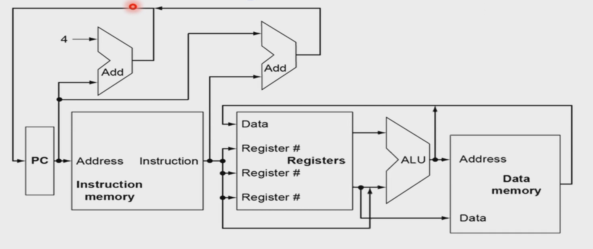
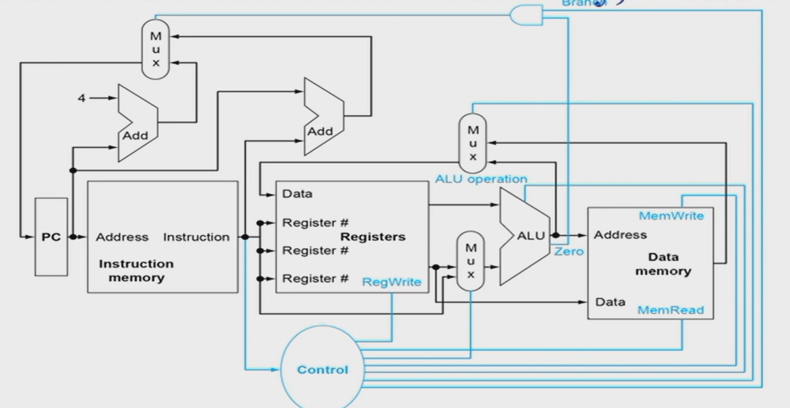
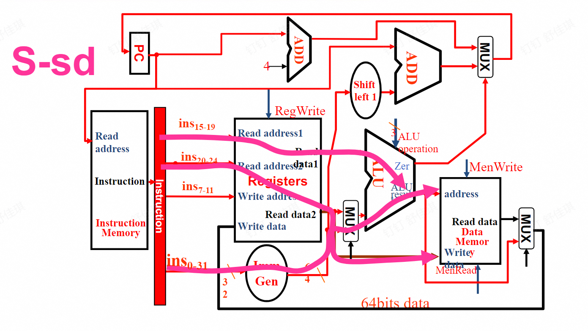
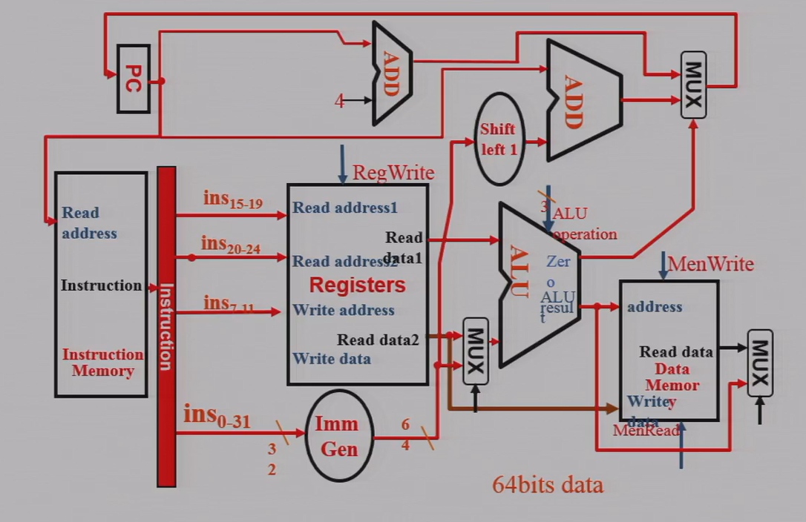

## CPU 简介

CPU 由 control unit 和 datapath 组成，其中 datapath 包含多路选择器、ALU、寄存器等。

CPU 的性能由什么决定？指令数目（由指令集 ISA 和编译器决定）、CPI（和硬件相关）、时钟周期 Cycle time。  
两种实现：单周期，不包含指令并行；流水线，前后流程可重叠。

对任何指令，执行时的前两步相同：将指令从指令存储器中取出来 -> 指令解码，读寄存器（解码 opcode 的同时读寄存器）  
第三步中，根据指令不同，读内存或计算或跳转。  
ALU 要做的：算术逻辑运算、内存读写、分支比较跳转  
ALU 在访存中做加法，在分支跳转中做减法。

一般 ALU 中第一个输入来自寄存器，第二个输入可能来自寄存器、也可能来自立即数。  
当输入或输出有多种可能时，用多路选择器实现。MUX 是选择位由指令类型（可能还有比较结果）决定。

读写时需要控制信号。如 R 型写回寄存器需要 RegWrite，load 需要 MemRead，store 需要 MemWrite，控制 ALU 操作，控制 PC 跳转到 PC+4 还是 target address。  
下图中黑色为数据通路，蓝色为控制信号。

寄存器（D 触发器）：时钟上升沿时将输入 D 的值放到输出 Q。  
增加写使能 Write，只有 Write 为 1、时钟上升沿才将 Q 变为 D。  
不同 state element 经过组合逻辑变为另一个状态单元。组合逻辑的最大长度决定时钟的周期。

## 指令的执行

指令的实现分为几步：读指令 IF -> 解码、读操作数 ID -> 控制执行 EX -> 访问内存 MEM -> 把结果写回寄存器 WB -> （Branch 中 PC 跳转，和 IF 结合）  
只有前两步是所有指令都需要，后面几步只有部分指令经历。  
Load 指令会完整经历上面的五步。

不同指令要做的事？  
R 型：寄存器、ALU。从寄存器中读数据，输出两个值到 ALU，ALU 计算后写回到寄存器。  
Load/Store 指令：内存、立即数单元（32 位指令输入，将其中 12 位的立即数扩展为 64 位）。  
B 型：读寄存器中的操作数，用 ALU 比较，相减看结果是不是零，比较结果控制是否 branch。跳转时读到的立即数要左移一位，补上末尾省略的 0。

每个 datapath 上的元素（如 ALU，MUX，寄存器）一次只能执行一个功能。  
因此需要将指令和数据的存储分开。流水线中会出现同时在内存中取数据和取指令，如果两者一起存储，每次只能取一种，效率低。

示例：R 型指令中，指令 rs2, rs1, rd 解码后，将寄存器中的值输给 ALU。func7, func3 用于控制 ALU 执行哪种操作。opcode 作为控制单元，作为寄存器的写使能，同时和 func 一起控制 ALU。  
I 型指令中，rs1, rd 作为寄存器的读，imm 经过扩展后，和寄存器读出的值一起输入到 ALU，func3, imm, opcode 一起控制 ALU 操作。ALU 输出结果作为 data memory 的地址，从内存中读数据后写回到寄存器。  
（略）

共 7+4 个控制信号。

ALU 的控制信号怎么产生？  
Load/Store 一定是加法  
Branch 指令一定是减法  
R 型指令：两级解码。第一级解码，只用 opcode，将除了 ALU control 外的所有控制信号；第二级解码，用 func7、func3 和第一季解码得到的类型，决定 ALU 操作。  
在 opcode 中将指令分为四类：ld 00，sd 00，Beq 01，R 10，第一级解码后得到类别。
