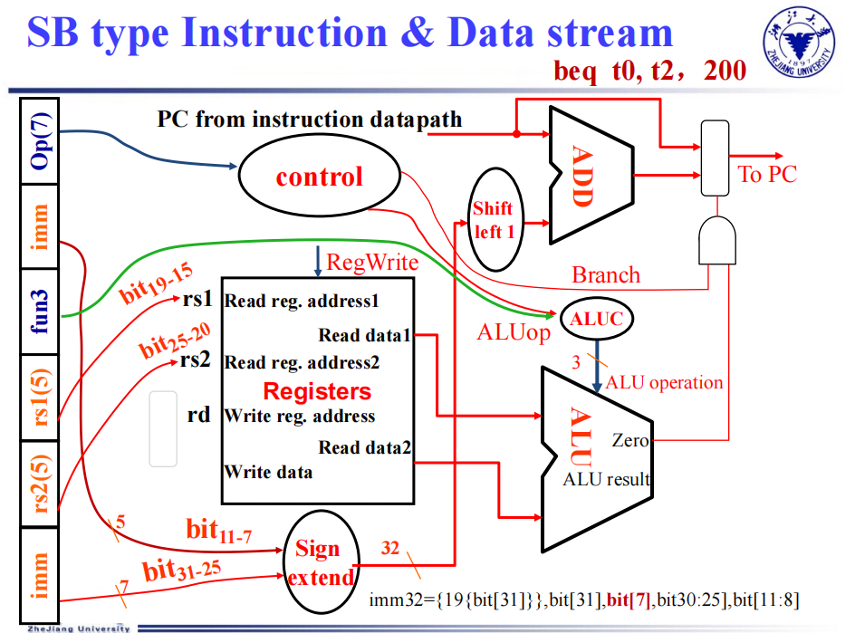
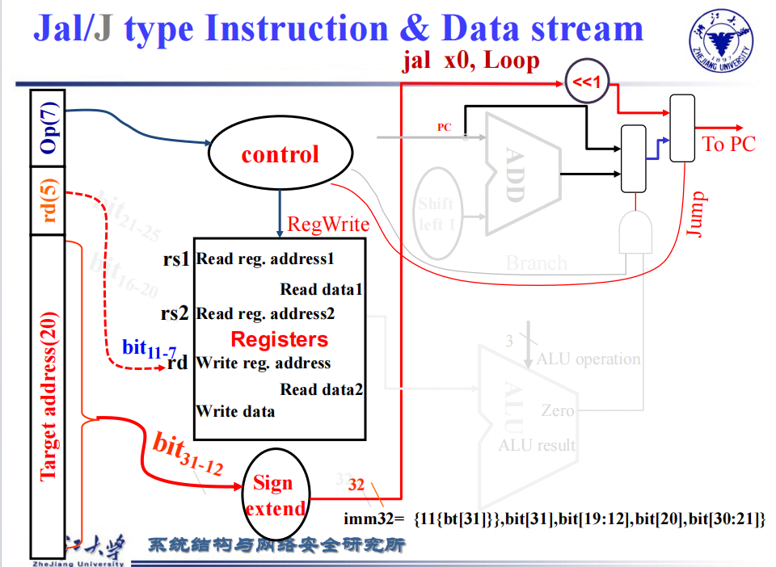
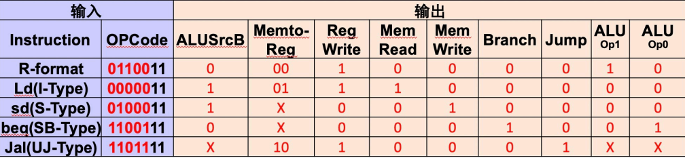

## 单周期处理器

### CPU 简介

CPU 由 control unit 和 datapath 组成，其中 datapath 包含多路选择器、ALU、寄存器等。

CPU 的性能由什么决定？指令数目（由指令集 ISA 和编译器决定）、CPI（和硬件相关）、时钟周期 Cycle time。  
两种实现：单周期，不包含指令并行；流水线，前后流程可重叠。

对任何指令，执行时的前两步相同：将指令从指令存储器中取出来 -> 指令解码，读寄存器（解码 opcode 的同时读寄存器）  
第三步中，根据指令不同，读内存或计算或跳转。  
ALU 要做的：算术逻辑运算、内存读写、分支比较跳转  
ALU 在访存中做加法，在分支跳转中做减法。


一般 ALU 中第一个输入来自寄存器，第二个输入可能来自寄存器、也可能来自立即数。  
当输入或输出有多种可能时，用多路选择器实现。MUX 是选择位由指令类型（可能还有比较结果）决定。

读写时需要控制信号。如 R 型写回寄存器需要 RegWrite，load 需要 MemRead，store 需要 MemWrite，控制 ALU 操作，控制 PC 跳转到 PC+4 还是 target address。  
下图中黑色为数据通路，蓝色为控制信号。


寄存器（D 触发器）：时钟上升沿时将输入 D 的值放到输出 Q。  
增加写使能 Write，只有 Write 为 1、时钟上升沿才将 Q 变为 D。  
不同 state element 经过组合逻辑变为另一个状态单元。组合逻辑的最大长度决定时钟的周期。

### 指令的执行

#### 指令的阶段

指令的实现分为几步：读指令 IF --> 解码、读操作数 ID --> 控制执行 EX --> 访问内存 MEM --> 把结果写回寄存器 WB --> （Branch 中 PC 跳转，和 IF 结合）  
只有前两步是所有指令都需要，后面几步只有部分指令经历。  
Load 指令会完整经历上面的五步。

在单周期实现中，每条指令都在一个时钟周期内完成，CPI=1  
时钟周期取决于最长指令的执行时长。ld 使用全部 5 个阶段，其他指令只用 4 个阶段，但仍然要花费 5 个阶段的时间。

#### 不同类型指令的执行

不同指令要做的事？  
R 型：寄存器、ALU。从寄存器中读数据，输出两个值到 ALU，ALU 计算后写回到寄存器。  
Load/Store 指令：内存、立即数单元（32 位指令输入，将其中 12 位的立即数扩展为 64 位）。  
B 型：读寄存器中的操作数，用 ALU 比较，相减看结果是不是零，比较结果控制是否 branch。跳转时读到的立即数要左移一位，补上末尾省略的 0。

每个 datapath 上的元素（如 ALU，MUX，寄存器）一次只能执行一个功能。  
因此需要将指令和数据的存储分开。流水线中会出现同时在内存中取数据和取指令，如果两者一起存储，每次只能取一种，效率低。

示例：R 型指令中，指令 rs2, rs1, rd 解码后，将寄存器中的值输给 ALU。func7, func3 用于控制 ALU 执行哪种操作。opcode 作为控制单元，作为寄存器的写使能，同时和 func 一起控制 ALU。  
I 型指令中，rs1, rd 作为寄存器的读，imm 经过扩展后，和寄存器读出的值一起输入到 ALU，func3, imm, opcode 一起控制 ALU 操作。ALU 输出结果作为 data memory 的地址，从内存中读数据后写回到寄存器。  
（略）

{style="width:550px"}

{style="width:550px"}

{style="width:550px"}

{style="width:550px"}

{style="width:550px"}

完整数据通路：


#### 控制信号

共 7+4 个控制信号。

- ALUsrc（一位）：控制 ALU 的第二个输入来自寄存器还是立即数
- MemRead 和 MemWrite（一位）：控制能否读或写入内存
- MemtoReg（两位）：要写入寄存器的可能有内存中读取的（load）、ALU 计算出的（R 型）、PC 地址（jal, jalr），MemtoReg 控制哪个信号写入
- branch（一位）：控制有条件跳转（B 型）中是否跳转，下一个 PC 是 PC+4 还是目标地址
- jump（一位）：控制无条件跳转中是否跳转，下一个 PC 是 PC+4 还是目标地址
- ALU operation（四位）：控制 ALU 执行什么操作

branch 和 jump 有什么区别？  
来源不同：branch 还由减法结果决定，jump 不依赖 ALU 的 Zero 信号。

!!! warning-box "存疑？"

    顺序不同：下一条 PC 仅由 jump 控制，jump 在每条指令中都要考虑。即使是 B 型指令中，也是 branch 控制的输出结果再输入给 jump，再由 jump 控制输出到 PC。

    看课件好像是这样？？？

ALU 的控制信号怎么产生？
ALU 操作有指令类型和 function code 决定。Load/Store 一定是加法；Branch 指令一定是减法；  
R 型指令：两级解码。第一级解码，只用 opcode，得到除了 ALU control 外的所有控制信号、和 ALU operation 中的两位；第二级解码，用 func7、func3 和第一级解码得到的类型，得到完整 4 位的 ALU operation。  
在 opcode 中将指令分为四类：load 00，store 00（因为这两者一定加法），branch 01（因为一定减法），R 型 10。第一级解码后得到类别。  
二级译码中，用一级得到的两位类别和 func7、func3 得到完整 ALU 控制信号。

一级译码示例（其中 X 表示 01 均可，便于优化）：

{style="width:550px"}

完整控制信号的数据通路：

{style="width:550px"}

## 流水线处理器

### 流水线的原理

指令执行的 5 个阶段（stage）：取指 IF --> 译码 ID --> 执行 EX --> 访存 MEM --> 写回 WB

单周期处理器的 CPI=1，即每个指令都需要一个时钟周期。  
所有指令中最长的执行时间决定 CPU 的频率（时钟周期），执行快的指令时间浪费，和 _make the common case fast_ 原则违背。

流水线处理器：分成 5 个阶段，每个时钟周期完成一个 stage，CPU 频率可提高。理想情况下（5 个阶段时间平均、指令数目多），速度提升为 5 倍。  
实际上不同阶段的时间不同，有些时间有空余，使得实际提高速度小于 1/stage。  
流水线通过增加吞吐量（throughput，单位时间内完成任务的数目）来提高速度。每条指令的 latency 没有减少（除了时间最长的指令，其余指令的 latency 增加）

RISCV 指令适合流水线：统一 32 位（每次确定读取指令的长度，可以直接 decode 出寄存器等），指令类型少，只有 load 和 store 能访问内存。

### 冒险

流水线的问题：冒险（hazards）  
结构冒险（structure hazard）：硬件上资源重叠  
数据冒险（data hazard）：前面的计算结果是后面的源操作数  
控制冒险（control hazard）：后面指令的执行取决于前面指令结果的控制

**结构冒险：**

结构冒险：将 data memory 和 instruction memory 分开存储，否则 IF 需要等（stall）内存访问 load/store 完成后才能取指。

**数据冒险：**

!!! examples "示例 数据冒险"

    ```asm
    add  x19, x0, x1
    sub  x2, x19, x3
    ```

    第一个时钟 add 取指，第二个时钟 add 译码、sub 取指，add 在第五个时钟才写回 x19，但 sub 在第三个时钟（ID）就要读取 x19。

数据冒险的一种解决：中间插入两级 bubble，使得 sub 的读取在 add 写回之后。  
一个时钟周期先是下降沿再是上升沿。用下降沿写（前半个时钟写）、用上升沿读（后半个时钟读），可使同一个寄存器的写和读在同一个时钟周期内完成。

改进：forwarding/bypassing  
上一条指令的计算结果在 EX 或 MEM 后就产生，但是 WB 才写回。可将结果计算后直接传给后面要用的指令。如果上一条为运算指令，EX 后产生结果，直接传给下一条的 EX 前，不用插入 bubble；如果上一条为 load 指令，仍需要插入一级 bubble。  
优点：不需要 stall；缺点：数据通路上需要增加连接。

编译优化：  
ld 后直接用需要等一个时钟，编译器编译后会调整顺序，尽量避免这种情况（比如 load 多个数时，统一 ld 再用，而不是 ld 一个用一个）。

**控制冒险：**

branch 在 EX 后才知道跳转结果，但下一级指令已经完成 IF，指令可能取错。

一种方法：提早知道寄存器比较和目标地址的计算。在 ID 这一级增加硬件，将着两个操作移到 ID，在 ID 阶段后就可以下一条指令的 IF。这样中间要插入一级 bubble。  
问题：循环中跳转多，bubble 带来的延迟长；现代流水线更长，不一定能将操作提前。

改进：预测跳转的结果，在结果出来前直接取预测的指令。  
具体预测方法略。（RISC-V 规范不规定具体分支预测算法，但实际 CPU 在 IF 阶段会根据静态或动态预测结果直接选择下一条 PC。预测实现包括静态预测、不跳预测、BTFNT，以及动态 BHT/BTB/GHR 预测器。在 EX 阶段若发现预测错误，需要清空流水线并修正 PC。）

#### 流水线控制信号

取出第 i+1 条指令时，需要有寄存器存第 i 条指令；第 i+1 条指令执行到 EX 时，也需要寄存器存储第 i 条指令的操作数……

流水线结构（图中 PC 更新和写回到寄存器是从右往左，会引发冒险）：

{style="width:580px"}

图中蓝色的寄存器堆成为流水线寄存器，以相邻的阶段命名。每一阶段执行完后就更新后面的寄存器。

流水线的表示图：
"single-clock-cycle" pipeline diagram：展示在某一个时钟周期中，整个流水线里每个阶段上正在执行哪一条指令。  
"multi-clock-cycle" pipeline diagram：展示指令在多个 clock cycle 中如何逐周期流经五个阶段。

load 指令写回：load 指令 ID 时将 write address 存在寄存器中，随着 load 指令的执行传到每一步的寄存器中，最终 WB 写回时将 write address 一起传回到 Register file 并写入。

流水线中的控制信号（ID 得到控制信号后，将所有信号按在哪里用到分为 WB、M、EX 几类，用寄存器传到要用的阶段）：

{style="width:580px"}

!!! examples "示例 数据竞争的解决"

    ```asm
    sub  x2, x1, x3
    and  x12, x2, x5
    or   x13, x6, x2
    add  x14, x2, x2
    sd   x15, 100(x2)
    ```

    流水线执行：5+4=9 个时钟周期
    不使用 forwarding：9+2=11 个时钟周期（只有前 3 条指令会冒险，后面的 x2 都作为 rs 而不是 rd）

    and 和 or 这两条都需要 bypass。对于第二条指令，从 EX/MEM 的寄存器传结果；而对于第三条指令，从 MEM/WB 的寄存器传结果。

#### 数据冒险

用 forward 解决数据冒险。问题在于怎么确定是不是需要 forward、起点在哪个阶段的寄存器。

用 `ID/EX.RegisterRs1` 表示 ID/EX 寄存器中 Rs1 的编号。ALU 中要用到的寄存器为 ID/EX.RegisterRs1 和 ID/EX.RegisterRs2。

从 EX/MEM 发生 foward 的条件：EX/MEM.RegisterRd = ID/EX.RegisterRs1（或 2）  
从 MEM/WB 发生 foward 的条件：MEM/WB.RegisterRd = ID/EX.RegisterRs1（或 2）

若要认为 data hazard 产生，还需要 EX/MEM.RegWrite 和 MEM/WB.RegWrite 都是 1，目标寄存器（EX/MEM.RegisterRd 或 MEM/WB.RegisterRd）不是 x0。

增加控制单元 Forwarding Unit，输入为 ID/EX 中的 Rs1、Rs2、Rd 和两个后面的 Rd，输出为两个信号 ForwardA 和 ForwardB，分别对应 Rs1 和 Rs2。当为 00 时，数据从 ID/EX 寄存器中传来；当为 01 时，数据从 MEM/WB 中传来（可能为前几条指令 ALU 计算结果，可能为 load 结果）；当为 10 时，数据从 EX/MEM 传来。

还有什么问题？可能既需要从上一条指令 forward（从 EX/MEM），还需要从上上条指令 forward（从 MEM/WB），如下面示例。这时需要用最近的 forward（即 EX/MEM）。

!!! examples "示例 double data hazard"

    ```asm
    add  x1, x1, x2
    add  x1, x1, x3
    add  x1, x1, x4
    ```

综上，MEM/WB 的 Forward 信号的表示如下：

```
// MEM/WB 的 Forward
if (MEM/WB.RegWrite  // MEM/WB 要写回
and (MEM/WB.RegisterRd != 0)  // 写回目标不是 x0
and not(EX/MEM.RegWrite and (EX/MEM.RegisterRd != 0) and (EX/MEM.RegisterRd = ID/EX.RegisterRs1))  // EX/MEM 优先
and (MEM/WB.RegisterRd = ID/EX.RegisterRs1))  // 上一级写回的是下一级的源寄存器
ForwardA = 01  // 01 表示从 MEM/WB forward
// ForwardB 同理
```

而 EX/MEM 的 Forward 信号的表示如下：

```
// EX/MEM 的 Forward
EX/MEM.RegWrite
and (EX/MEM.RegisterRd != 0)
and (EX/MEM.RegisterRd = ID/EX.RegisterRs1)
ForwardA = 01
// ForwardB 同理
```

Load-use 的竞争：下一条指令的源操作数是 load 指令的目标操作数，需要从 MEM/WB 进行 forward。Load-use 的条件为：

```
ID/EX.MemRead
and ((ID/EX.RegisterRd = IF/ID.RegisterRs1)
    or (ID/EX.RegisterRd = IF/ID.RegisterRs2))
```

Load 指令在 MEM 后才得到数据，不能只通过 forward 解决，需要插入气泡，即将所有信号置零。此时 EX、MEM 和 WB 都执行 nop（no-operation）。PC、IF/ID 都不更新，下一时钟周期再重新解码、取指。

增加 Hazard detection unit，输入信号为 ID/EX.MemRead（是否为 load）、Rs1、Rs2、ID/EX.RegisterRd（是否冒险），输出信号为 PCWrite（PC 不更新）、IF/IDWrite（不取指）、控制 Control 后的 MUX（控制信号置零）。

#### 控制冒险

用 prediction 解决控制冒险。

传统流水线：ALU 计算得到的 Zero 和 Branch 在 EX/MEM 之后再进行与，因此在 MEM 这一阶段才得到结果，在 WB 才能取指。

做法：将 Rs 的比较和 PC 加立即数放到 ID 这一阶段，在 ID 就知道需不需要跳转。如果需要（Branch Taken），下一时钟周期，传到 ID 的指令变为 nop（不往下传），IF 取跳转后指令。

实际为了提高时钟频率，将流水线拆分得更细，需要预测是否跳转。

Dynamic prediction 预测为上一次跳转情况，构建 prediction buffer，用 branch 指令的地址为索引，存储跳转结果（taken 或 not taken）。当执行 branch 指令时，检查表格，根据上一种情况取指。  
在代码中通常为 for 或 while 循环，这种预测方式能大大提高效率。

1-bit predictor 的缺点：如果有两层循环，内层循环跳出后影响外层循环的预测。  
因此使用 2-bit predictor，taken 后连着两次 not taken 才转为预测 not taken，反之同理。

进一步改进：ID 中计算地址后，存储地址，如果后面要跳转则直接用地址。如果内存满，只存最新用过的地址（cache）。

### 异常和中断

中断：从主程序跳到 interrupt，再跳回到主程序。

CPU 工作流改变：控制指令（如 branch），可预测；突然强行插入，不可预测，称为异常。  
狭义的异常（exception）为 CPU 内部的 unexpected event。广义的异常还包含 interrupt。这里统一称为异常。

预先设置好处理异常的方法，存在内存中，异常发生时直接跳转到处理异常的程序。  
问题在于：异常是 CPU 硬件中发生，CPU 怎么知道异常的原因、异常的指令（因为要回来）？

RISC-V 有三种模式：机器模式（M）、用户模式（U）、监督模式（S）。每种特权模式都有各自扩展的指令集。这里只讨论机器模式。  
M：所有都需要  
M+U：需要安全保护  
M+U+S：运行操作系统
