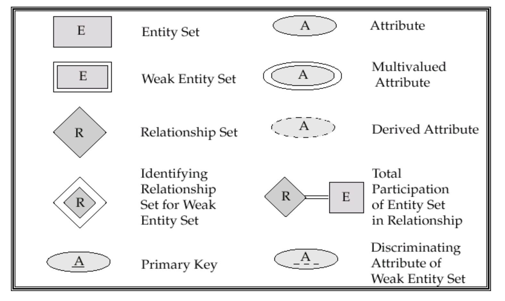
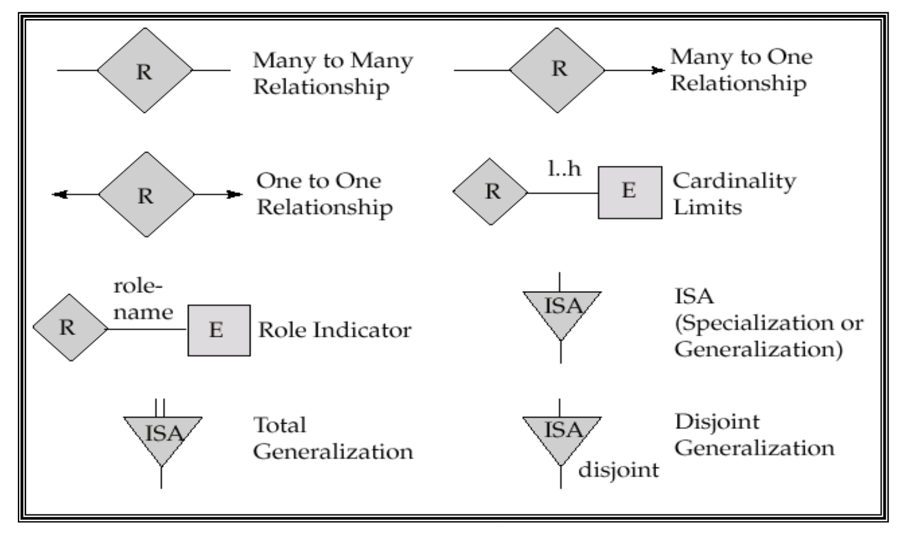
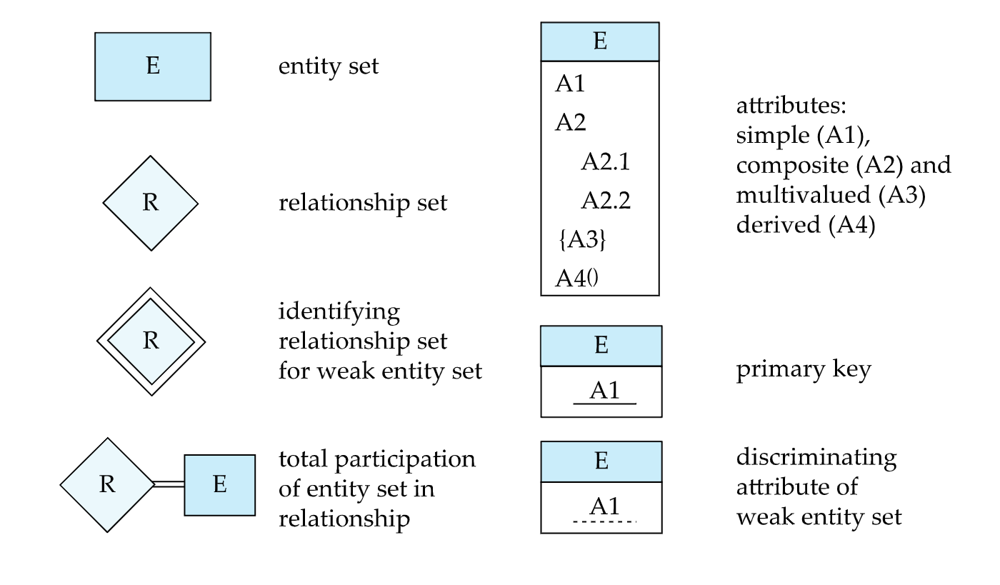
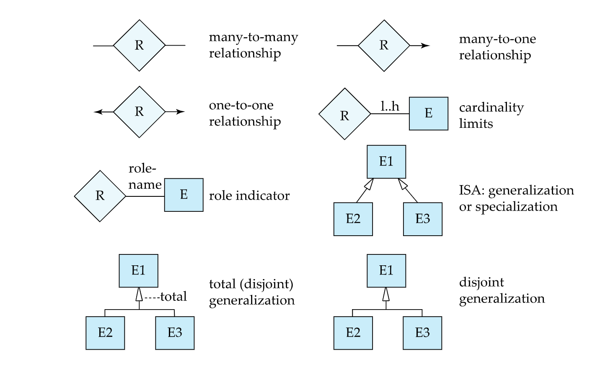

## 实体与联系

表中每一行是一个**entity**，每一列是一个attribute，整个表是一个entity set。

attribute分为：

- 分量形式和混合形式
- 单值和多值属性
- 基属性和派生属性（派生属性不用特意存储，可以由基属性计算得到）

**Relationship**一般是两个不同类属性之间的联系。具体来说，可以用两表的主键另建一张表，表示relationship。

**Mapping cardinality**指一个实体可以和另外多少个实体相联系。对于relationship，在一对多的情形下，主键为“多”的主键；在多对多的情形下，主键为两者的主键结合。

## ER图

老版（？）**ER图**中，方框表示表，圆形表示属性（实下划线表示主键），菱形连接不同表、表示关系。Recursive relationship set中，在关系的箭头上标角色的名字。关系中的“一”画成箭头，全参与画成双线（或用`x..x`形式表示，第一个x表示出现次数下届，第二个x表示上界，`*`表示若干）。

三元关系：P在不同A下有不同的B。

**弱实体集（weak entity set）**：所有属性的组合都不能作为super key，必须和另一实体结合才能唯一确定，弱实体集的属性成为部分码(partitial key)。自身有super key的成为强实体集，在ER图中用虚下划线表示。若强实体集和弱实体集联系，一定是一（强）对多（弱）关系。具体用table表示时，必须和属主实体集中的主键合并成一张表，不用另外用一张表表示relationship。

**泛化ER图**：一种实体集下细分，分为完全泛化和部分泛化，细分的子集分为disjoint和overlapping。

ER图版本1：

ER图版本2：

**UML（Unified Modeling Language，统一建模语言）**：一种标准化的建模语言，用于描述软件系统的结构和行为，也是一种ER图的表现形式。