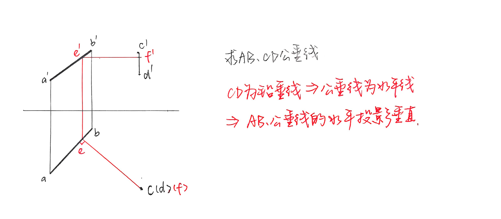
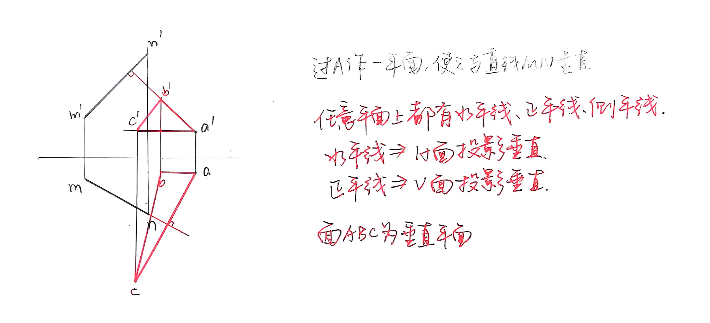
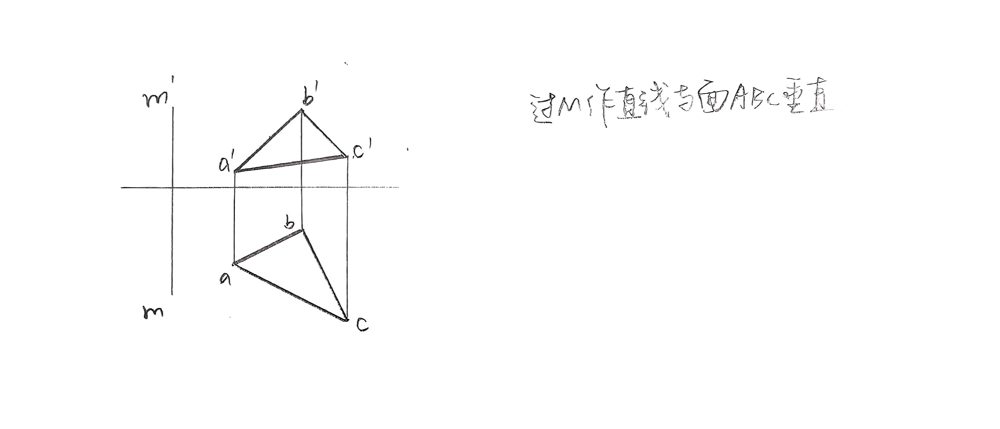
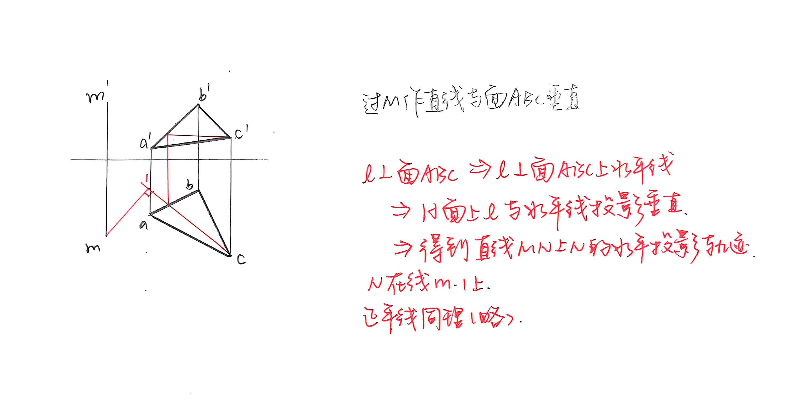
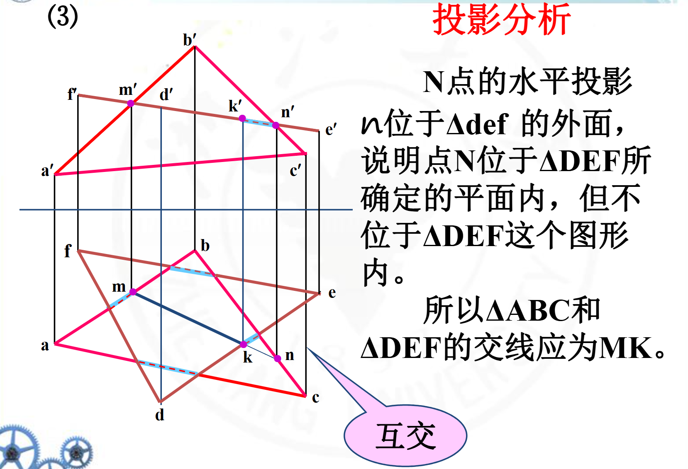
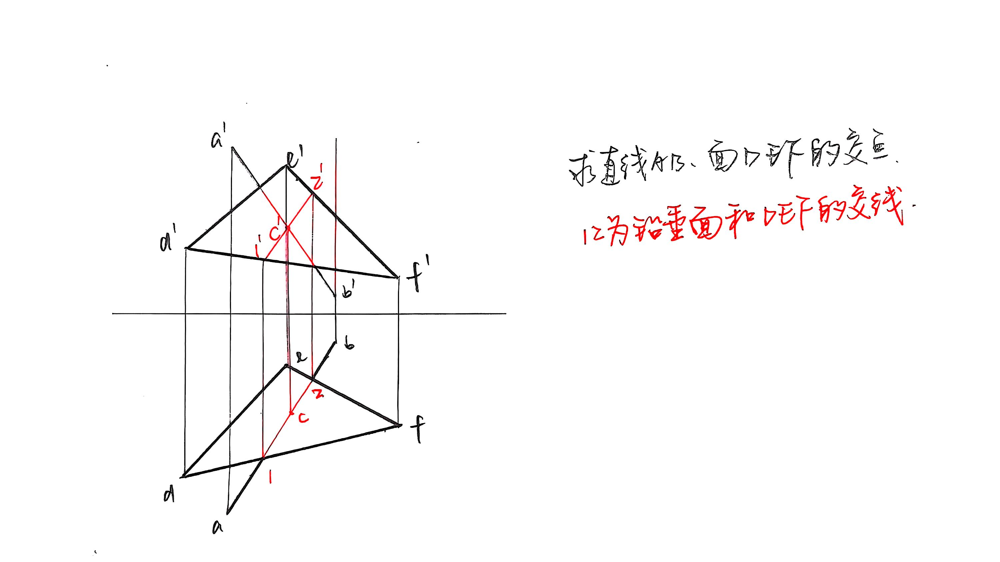

## 基本概念

水平投影，正面投影，侧面投影，同名投影，重影点，迹线（不一定有）  
水平线，正平线，侧平线；铅垂线，正垂线，侧垂线  
和 H、V、W 面的夹角：$\alpha$, $\beta$, $\gamma$

## 点、线、面

一般位置的线/面，由两个投影即可确定

**点在线上**：投影都在线上，且比例相同

**垂直的性质**：两条相互垂直的线，如果一条平行于面 S，则这两条线在面 S 上的投影也垂直。

**两平面平行**：两相交直线分别平行，或有积聚性的那组投影平行

平面与直线交点的两侧，一定是一个可见（粗实线）一个不可见（细虚线）。用端点重影点判断。

### 作垂线

!!! normal-comment "作两直线的公垂线？"

    esp. 通过其中一条直线，能判断公垂线为特殊直线。

    e.g. 一条为铅垂线，则公垂线为水平线，公垂线与另一条直线在H面的投影垂直。

    ??? examples "例题"

    

!!! normal-comment "过点作平面，与另一直线垂直？"

    过点分别作水平线、正平线，在这两条线上分别取一点，构成平面。

    ??? examples "例题"

    

!!! normal-comment "过点作直线，与另一平面垂直？"

    找平面的水平线，所作直线与其在 H 面投影垂直，得到另一端点水平投影的轨迹；

    找平面的正平线，所作直线与其在 V 面投影垂直，得到另一端点正面投影的轨迹；

    在两条轨迹上各取一点，满足长对正，即为另一端点。

    ??? examples "例题"

    

    

!!! normal-comment "过点作平面，与另一平面垂直？"

    先根据上一条，作直线与另一平面垂直；

    再任取一点，构成平面。垂线所在的平面一定与另一平面垂直。

### 求交点

!!! normal-comment "求直线和平面的交点？"

    esp. 直线为特殊位置（在某个面投影积聚为一条线）或平面为特殊位置。

    1. 平面特殊：在平面积聚的投影面确定交点，根据线在另一个面也确定交点。判断可见性。
    2. 直线特殊：在直线积聚的投影面，过面上一点作直线投影点所在的直线，再作这条直线在另一个面的投影，由此确定另一个面的交点。

!!! normal-comment "求平面和平面的交线？"

    esp. 一个平面为特殊位置。

    由平面积聚的投影面，判断交点位置；

    对齐到另一个面上两平面相交的区域，确定交点位置；

    此时两平面相交部分的可见性都不确定，判断可见性。

    ??? examples "例题"

    

!!! normal-comment "求一般位置直线和平面的交点？"

    先假象过直线的铅垂面，求铅垂面和平面的交线。即交线的水平投影为平面、直线水平投影的交线。

    由铅垂面交线的水平投影，得到铅垂面交线的正面投影。

    交点在铅垂面交线上。由正面投影确定交点位置。

    ??? examples "例题"

    

!!! normal-comment "求与 V 面、H 面等距离点的轨迹？"

    p23-25.

!!! normal-comment "求侧垂面的正面投影？"

    p26-30(3).
