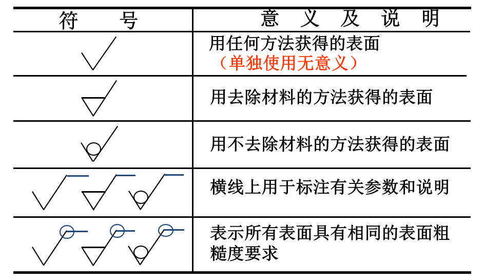

## 工艺结构

1. 铸造工艺：铸造圆角，壁厚均匀，拔模斜度
2. 机械加工：倒角，退刀槽和砂轮越程槽，钻孔垂直于端面，凸台和凹坑，沉孔

## 表面粗糙度

表面粗糙度的参数：

- Ra：轮廓算术平均偏差，优先选用
- Rz：轮廓最大高度

表面粗糙度的符号：

注意点：

- Ra 和 Rz 单位都为 $\mu m$
- 只注一个值时，表示为上限值；注两个值时，表示为上限值和下限值。
- 16% 规则：在规定的评定长度内，允许不超过 16% 的取样长度的 Ra 值超过规定值，其余至少 84% 必须满足要求
- 当不允许任何实测值超差时，应在参数值的右侧加注 max 或同时标注 max 和 min
- 当大部分表面的粗糙度相同时，可统一标注在图样的右下角，并加注 “其余”两字
- 代号中的数字方向应与尺寸数字的方向一致，朝上或者朝左
- 符号的尖端必须从材料外指向被标注的表面（即使是引出标注）

## 配合与极限

基本尺寸、实际尺寸、极限尺寸（最大极限尺寸、最小极限尺寸），极限偏差（上偏差、下偏差）、尺寸公差。

孔的代号用大写，轴的代号用小写。如上偏差，孔ES轴es；下偏差，孔EI轴ei。

公差带图：表示公差的大小及公差带相对于零线的位置。

公差带由标准公差和基本偏差两个要素组成。标准公差（IT）确定公差带的大小，而基本偏差确定公差带的位置。其中H表示基准孔（最小极限尺寸等于基本尺寸）、h表示基准轴（最大极限尺寸等于基本尺寸）。

公差带代号为基本偏差代号（如H，h）和标准公差等级代号（如8，7）。

配合：

- 间隙配合：孔大轴小
- 过盈配合：孔小轴大
- 过渡配合：孔和轴的公差带部分重合

配合制：

- 基孔制：孔为基本偏差H。对于轴，a-h为间隙配合、j-n为过渡配合、p-zc为过盈配合
- 基轴制：轴为基本偏差h。对于孔，A-H为间隙配合、J-N为过渡配合、P-ZC为过盈配合。

配合的标注：`基本尺寸 孔的公差带代号/轴的公差带代号`

