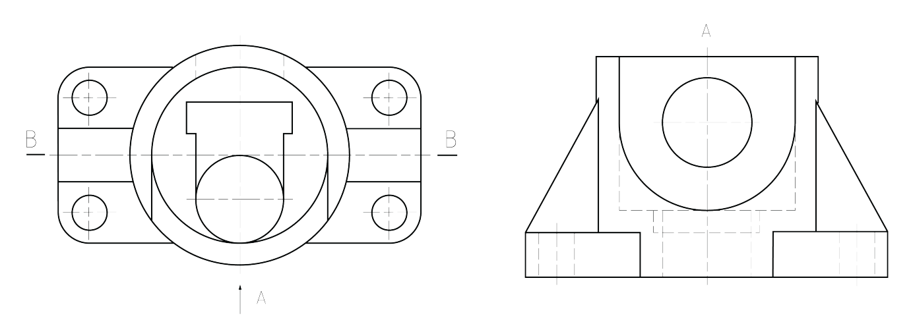

- 主体为圆筒，两侧底板和圆筒相交，底板上有四个孔和肋板。
- 孔部分，中间大圆孔挖一半；圆孔端面向下，稍大的长方形槽挖一段，长方型槽下端面向前延伸成平台，再在前面挖圆孔。主视图中，长方形槽内的虚线为长方型槽和平台交界的线；下方最前面的是圆孔。
- 为什么中间方形是平台而不是方孔？方孔不能和前面圆孔形成交界线。
- 左视图中，注意平台的线画到圆孔轴线处，表示相切。

---

- 主体为圆套筒，中间有倒角的圆孔，上方前后两个凸台、中间方孔，左侧薄板，板前侧有支撑体。
- 薄板部分，俯视图中从左到右：最左边矩形为圆环斜端面的投影；宽度不变部分，圆环宽度大于平板，平板和圆环相切后仍有部分圆环；三视图中圆环投影为 T 形，但零件图中用过渡线将相切处两边连接；剩余部分为中间平板的投影。
- 板和圆筒部分，前为斜面支撑体，和板用过渡线连接；后为圆筒和板直接连接。

---

- 主体为圆筒，上面有大的平台，圆筒内分三段打孔，两侧底板和圆筒相切。
- 上面的板，左边钻螺纹孔，前面耳板和圆筒连接，耳板中间开圆孔。
- 孔部分，如左视剖视图，上方圆孔、中间带键槽的孔、下方带凹坑的孔。上方耳板的孔和圆孔相贯，下方圆筒壁上开斜的孔，和圆孔相贯，斜面在主视、左视方向投影为矩形。
- 底板部分，中间挖方槽，两侧挖圆孔且孔周围为凸台。

---

