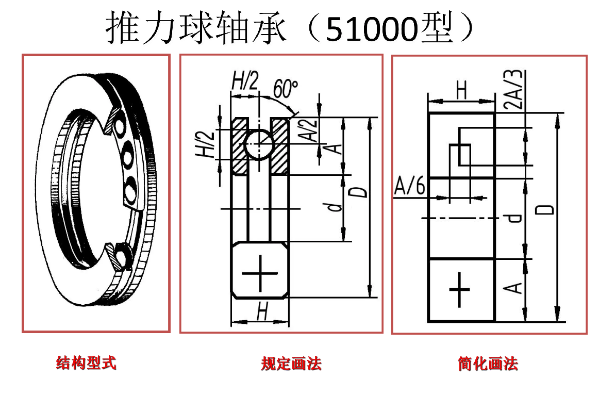
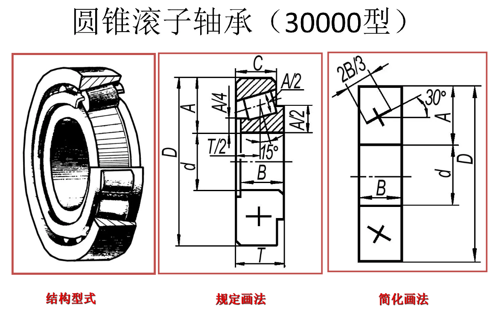

## 螺纹

## 螺纹紧固件

### 螺栓

### 螺柱

### 螺钉

## 键

键的作用：连接轴与轴上的传动件，以传递扭矩。

键的种类：普通平键，半圆键，钩头楔键。

键的标记：`键 X×Y GB/T 1096-1979` 表示圆头普通平键(A)型，宽 X mm，长 Y mm。

轴上键槽参数（凹）：

- 轴径 $d$；
- 键槽深度 $t$；
- 键槽宽度 $b$；
- 键槽长度 $l$。

轮毂上键槽参数（凸）：

- 轴径 $d$；
- 键槽高度 $t_1$；
- 键槽宽度 $b$；
- 键槽长度 $l$。

画法：

- 轴上键槽：主视图中局部剖，半圆键的截交线可省略；
- 轮毂上键槽：全剖视图中，原先轮圆孔上方增加槽的粗实线；
- 平键连接：注意轮毂上键槽深度始终大于键高度减轴上键槽深度。键在纵向剖切中按不剖画，在横向剖切中按剖面画，画在原两键槽中；
- 半圆键连接：同上，只有纵向剖切中键画成半圆；
- 钩头楔键连接：平键和半圆键全部在轮内部，而钩头楔键的钩头部分在轮外部，键在轮内且与轮上键槽间无空隙。纵向和横向剖视图中，键的上边沿和轮上键槽重合为一条线。

## 销

销的作用：主要用于零件之间的定位，也可用于零件之间的联接，但只能传递不大的扭矩。

销的种类：圆柱销，圆锥销。

销的标记：`销 GB/T 119.1-2000 Xm6×Y` 表示公称直径 X mm，长 Y mm 的 B 型圆柱销。

销连接的画法：

- 销：纵向按不剖画，两端画圆角；
- 连接件：轴局部剖、轴套全剖，或两零件局部剖。不同连接件的剖面线方向或疏密不同。

## 齿轮

齿轮的作用：传递运动和动力，改变轴的转速与转向。

齿轮的种类：圆柱齿轮（用于平行轴），圆锥齿轮（用于相交轴），蜗轮蜗杆（用于交叉轴）。

齿轮的结构：轮缘、轮齿、幅板、幅板、轴孔、键槽。

齿轮参数：

- 齿距 $p$；
- 齿数 $z$；
- 分度圆直径 $d$;
- 模数 $m$：$m=p/\pi=d/z$；
- 齿形角 $\alpha$：齿廓曲线在分度圆上的一点处的速度方向与曲线在该点处的法线方向（力的作用方向）之间所夹的锐角。

其中，分度圆为假象圆，分度圆上齿轮的弧齿厚和齿槽宽相等。两齿轮啮合时对应分度圆相切，中心距 $a$ 为两分度圆半径相加，即 $a=(d_1+d_2)/2$。传动比 $i=z_2/z_1$。

标准齿轮中，齿顶高 $h_a=m$，齿根高 $h_f=1.25m$，故齿顶圆直径和齿根圆直径的公式为：

- 齿顶圆直径 $d_a$：$d_a=d+2h_a=m(z+2)$；
- 齿根圆直径 $d_f$：$d_f=d-2h_f=m(z-2.5)$.

两齿轮啮合的条件：

1. 模数相同，$m_1=m_2$；
2. （对渐开线齿轮）齿形角相同 $\alpha_1=\alpha_2$。

单个齿轮的画法：

- 分度圆在端视图和剖视图中都画点划线；
- 齿顶圆在端视图和剖视图中都画粗实线；
- 齿根圆在端视图中画细实线或省略不画，在剖视图中画粗实线。

齿轮啮合的画法：

- 端视图：分度圆（点划线）相切，齿顶圆（粗实线）相交，齿根圆（不画或细实线）相离；
- 剖视图：节线（点划线）重合为一条线，齿顶线一个画为粗实线、另一个画为虚线（轮齿一个覆盖另一个），齿根线画为粗实线。

## 滚动轴承

滚动轴承的组成：内圈、外圈、滚动体、保持架

- 内圈：紧密套在轴上，随轴转动；
- 外圈：装在轴承座孔内，固定不动；
- 滚动体：形式有圆球、圆柱、圆锥等，排列在内外圈之间；
- 保持架：用于隔开滚动体。

滚动轴承的种类：向心轴承（径向力，常见为推力球轴承），推力轴承（轴向力，常见为深沟球轴承），向心推力轴承（径向力和轴向力，常见为圆锥滚子轴承）。前两者由保持架方向决定受力的方向，向心推力轴承轨道倾斜，能同时分解径向力和轴向力。

滚动轴承的代号：按顺序由前置代号、基本代号、后置代号构成。其中，基本代号由轴承类型代号、尺寸系列代号和内径代号构成，通常用 4 位数字表示，依次为： 

1. 第一位：轴承类型代号（3：圆锥滚子轴承；5：推力球轴承；6：深沟球轴承；etc.）
2. 第二位：尺寸系列代号
3. 第三、四位：内径代号（00：10mm；01：12mm；02：15mm；03：17mm）。当内径尺寸在 20-480mm 范围内时，内径尺寸=内径代号\*5。

滚动轴承的参数：

- 内径 $d$；
- 外径 $D$；
- 宽度 $B$。

滚动轴承画法：球按不剖画，推力球和深沟球区别在于保持架方向。简化画法中用十字线的长短表示方向。

滚动轴承的装配画法注意点：

1. 滚动轴承的保持架、倒角等可省略不画；  
2. 挡肩的上边沿不能超过保持架的下边沿，挡肩的下边沿不能超过保持架的上边沿。

