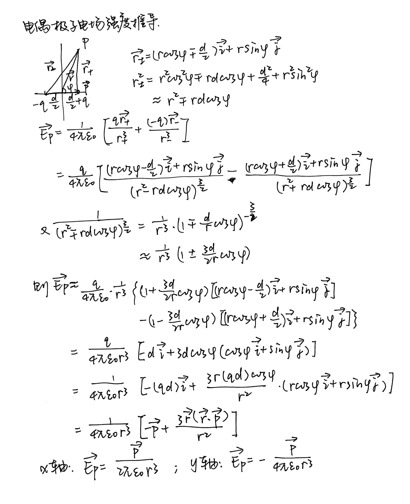
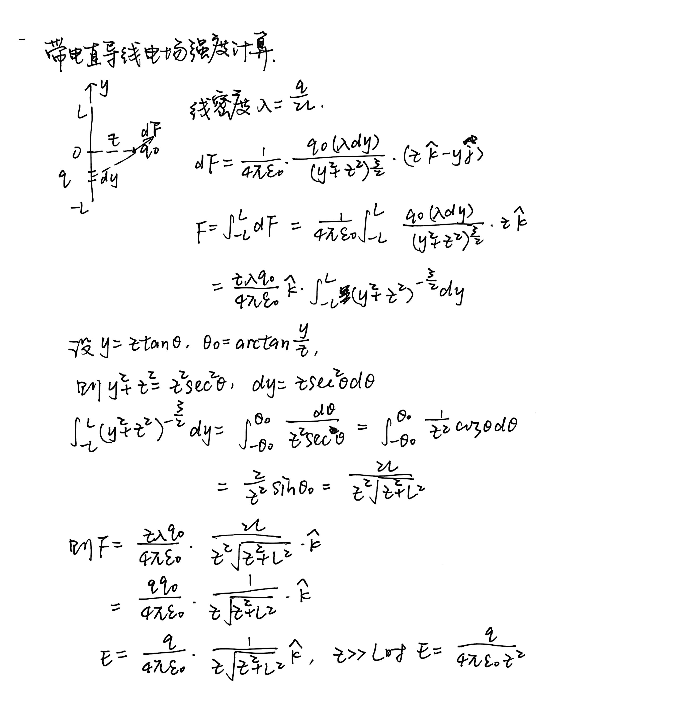
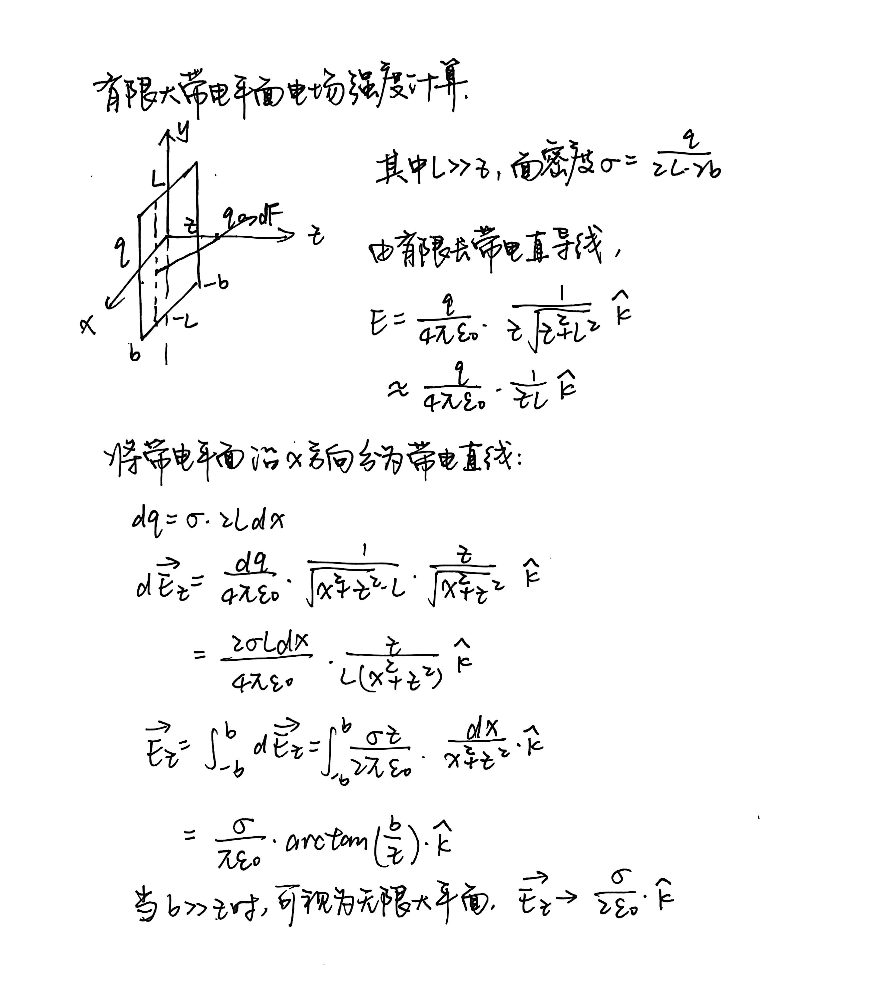

## 库仑定律

### 电偶极子

电偶极子电偶极距为 d，所求点距几何中心距离为 r，夹角为$\phi$，则电场：

$$\vec{E_p}=\frac{1}{4\pi\varepsilon_0 r^3}\left[-\vec{p}+\frac{3\vec{r}(\vec{r}\cdot\vec{p})}{r^2}\right]$$

??? normal-comment "证明"

    {style="width:520px"}

### 有限长带电直导线

导线长 2L，带电量 q，所求点距离导线中心距离为 z，在同一水平面上，则电场：

$$\vec{E}=\frac{q}{4\pi\varepsilon_0}\frac{1}{z\sqrt{z^2+L^2}}\hat{k}$$

??? normal-comment "证明"

    {style="width:520px"}

### 有限大带电平面

平面长 2L，宽 2b，所求点和几何中心在同一竖直面内，距离平面距离为 z（z << L），则电场：

$$\vec{E}=\frac{\sigma}{\pi\varepsilon_0}\cdot\arctan(\frac{b}{z})\hat{k}$$

??? normal-comment "证明"

    {style="width:520px"}

### 圆环、球壳、球体

**圆环**：按角度分成一段段圆弧

**均匀带电球壳**：纵向分成圆环，每个圆环的宽度按纵切面角度划分，最终为关于角度的积分。

$$\mathrm{d}q=2\pi R\sin\theta\text{(圆环周长)}\cdot R\mathrm{d}\theta\text{(圆环宽度)}\cdot\sigma\text{(电荷面密度)}$$

**球壳内**：对任意一点，取相对的两块球面，用立体角计算面积。相对球面在该点的电场强度抵消。

**均匀带电球体**：球外平方反比，球内正比。

## 几点注意

**几种倍率：**

| 前缀      | 符号  | 倍数       | 数值表示                                 |
| --------- | ----- | ---------- | ---------------------------------------- |
| **femto** | f     | $10^{-15}$ | $1 \, \text{fC} = 10^{-15} \, \text{C}$  |
| **micro** | $\mu$ | $10^{-6}$  | $1 \, \mu\text{C} = 10^{-6} \, \text{C}$ |
| **milli** | m     | $10^{-3}$  | $1 \, \text{mA} = 10^{-3} \, \text{A}$   |
| **centi** | c     | $10^{-2}$  | $1 \, \text{cm} = 10^{-2} \, \text{m}$   |
| **deci**  | d     | $10^{-1}$  | $1 \, \text{dm} = 10^{-1} \, \text{m}$   |
| **kilo**  | k     | $10^{3}$   | $1 \, \text{kJ} = 10^{3} \, \text{J}$    |
| **mega**  | M     | $10^{6}$   | $1 \, \text{MG} = 10^{6} \, \text{g}$    |
| **giga**  | G     | $10^{9}$   | $1 \, \text{GB} = 10^{9} \, \text{B}$    |
| **tera**  | T     | $10^{12}$  | $1 \, \text{TB} = 10^{12} \, \text{B}$   |

??? examples "相对运动下观察电场和磁场？"

    假设一无限长直导线，电荷以恒定速度 v 向右运动。

    case1：人静止。此时电荷产生电场，运动的电荷产生磁场。

    case2：人也以恒定速度 v 向右运动，此时电荷和人相对静止，在该参考系中磁场为零。

    case2 中观察者速度为$v$，根据相对论长度缩短，观察到的电荷密度为$\lambda'=\gamma\lambda$，其中$\gamma=\frac{1}{\sqrt{1+v^2 / c^2}}$为洛伦兹因子、$\lambda$为 case1 中的电荷密度。由于 case2 中电荷密度更大，电场更强，“补偿”了磁场的消失。

    这个例子说明了电场和磁场是同一物理实体在不同参考系中的表现。

??? examples "运动电荷不满足库伦定律？"

    *库伦定律的适用范围*

    库伦定律：

    $$\vec{F} = k\frac{q_1 q_2}{r^2}\hat{r}$$

    **仅适用于静止电荷**之间的相互作用。当电荷运动时，情况变得复杂得多。

    *为什么运动电荷不满足库伦定律？*

    1. **磁场的产生**

    运动电荷会产生磁场：

    $$\vec{B} = \frac{\mu_0}{4\pi}\frac{q\vec{v}\times\hat{r}}{r^2}$$

    这个磁场会对其他运动电荷产生洛伦兹力：

    $$\vec{F}_{magnetic} = q\vec{v}\times\vec{B}$$

    2. **电场的变化**

    运动电荷的电场不再是简单的库伦场，而是：

    $$\vec{E} = \frac{1}{4\pi\varepsilon_0}\frac{q}{r^2}\frac{(1-\beta^2)}{(1-\beta^2\sin^2\theta)^{3/2}}\hat{r}$$

    其中 $\beta = v/c$，$\theta$ 是速度方向与位置矢量的夹角。

    3. **相对论效应**

    高速运动时，还需要考虑：
    - 长度收缩
    - 时间膨胀
    - 质量-能量等效

    考虑一个静止电荷和一个运动电荷。前者对后者的力满足库伦定律，而后者对前者的力不满足库伦定律。此时牛顿第三定律不成立！

## 高斯定理

### 高斯定理表述

**高斯定理**：封闭曲面的电通量正比于曲面围成区域内的电荷总量。

$$\iint\vec{E}\cdot\mathrm{d}\vec{S}=\frac{Q_{in}}{\varepsilon_0}$$

**空间角**：

$$\mathrm{d}\Omega=\frac{\hat{r}\cdot \mathrm{d}\vec{S}}{r^2}$$

其中 $\hat{r}$ 为单位径矢，分子中 $\hat{r}\cdot \mathrm{d}\vec{S}$ 将面元转化为与径矢垂直。

**电通量正负**：取曲面的外法向向量。电场线穿出曲面，电通量为正；穿入曲面，电通量为负。

高斯面外的电荷对总通量没有贡献，但不是对总场强没有贡献。总场强由空间内所有电荷共同构成。

**电场方向**：

高斯定理只能得到电场大小。要判断电场方向，需要结合旋转不变性、镜像反射不变性等性质。

任意一点电场 $E$ 可以分为轴矢量 $E_r$，极矢量 $E_{\phi}$、$E_{\theta}$ 三个分量。

- 球对称：

!!! examples "点电荷高斯定理"

    任意封闭曲面一点电荷，计算电通量：

    $$\mathrm{d}\Phi=\vec{E}\cdot \mathrm{d}\vec{A}=\frac{\mathrm{d}q}{4\pi\varepsilon_0 r^2}\cdot r^2\Omega=\frac{\mathrm{d}q}{4\pi\varepsilon_0 }\Omega$$

    其中$r^2\Omega$将曲面转化为正投影。

    $$\Phi=\oint\mathrm{d}\Omega=\frac{q}{\varepsilon_0}$$

    同理可得对点电荷外的封闭曲面，同一空间角内的两块区域通量和为零，故整体的通量为零。

!!! normal-comment "高斯面能不能通过点电荷？"

    当点电荷在高斯面上，怎么计算？

    这种情况没有意义，因为点电荷的定义决定不考虑它的大小、形状，也不考虑点电荷“被穿过”的情形。

!!! normal-comment "高斯定理和斯托克斯定理"

    **高斯定理：**

    假设封闭曲面 S，围成体积 V。
    则 S 的通量，即矢量对 S 的面积分，等于散度对 V 的体积分。
    通量为正，表示源；通量为负，表示汇。

    **对于电场：**

    对于任意的小立方体（dx, dy, dz），有

    通量 = 总电荷量/介电常数 = 电荷密度/介电常数 \* 体积
    通量 = 散度 \* 体积

    因此对每个小立方体，散度 = 电荷密度/介电常数

    $$
    \begin{align}
    \vec{\nabla}\cdot\vec{E}=\frac{\rho}{\varepsilon_0}
    \end{align}
    $$

    而任意封闭曲面围成的体积，可看作无数个小立方体的集合。通量等于散度的体积分，而每个散度用“电荷密度/介电常数”替换，得到任意体积满足(1)式。

    **斯托克斯定理：**

    假设封闭曲线为 l，围成曲面 S。
    则 l 的环流，即矢量对 l 的线积分，等于旋度对 S 的面积分。
    环流为正，表示逆时针；环流为负，表示顺时针；环流为零，表示无旋。

    静电场是无旋场：

    $$\vec{\nabla}\times\vec{E}=0$$

### 常见电场强度：

| **电荷分布**                         | **高斯面选择**                   | **电场强度表达式**                                   | **说明**                                                         |
| ------------------------------------ | -------------------------------- | ---------------------------------------------------- | ---------------------------------------------------------------- |
| **无限长直导线（线电荷密度）**       | 圆柱形高斯面（以导线为轴心）     | $E = \frac{\lambda}{2 \pi \varepsilon_0 r}$          | 其中 $\lambda$ 为线电荷密度，$r$ 为到导线的径向距离              |
| **无限大平板（面电荷密度）**         | 平行于平板的高斯面（与平板平行） | $E = \frac{\sigma}{2 \varepsilon_0}$                 | 其中 $\sigma$ 为面电荷密度，电场强度在平板两侧相等，且与距离无关 |
| **球壳（外部，面电荷密度）**         | 球形高斯面（半径大于球壳半径）   | $E = \frac{Q_{\text{enc}}}{4 \pi \varepsilon_0 r^2}$ | $Q_{\text{enc}}$ 是球壳内部的总电荷，$r$ 是距离球心的径向距离    |
| **球壳（内部，面电荷密度）**         | 球形高斯面（半径小于球壳半径）   | $E = 0$                                              | 由于对称性，球壳内部的电场为零                                   |
| **均匀带电球体（外部，体电荷密度）** | 球形高斯面（半径大于球体半径）   | $E = \frac{Q_{\text{enc}}}{4 \pi \varepsilon_0 r^2}$ | 外部电场与点电荷相同，遵循平方反比定律                           |
| **均匀带电球体（内部，体电荷密度）** | 球形高斯面（半径小于球体半径）   | $E = \frac{\rho r}{3 \varepsilon_0}$                 | 其中 $\rho$ 为体电荷密度，电场强度随 $r$ 增大而增大              |

几点注意：

- 含$\mathrm{d}r/\sqrt{r^2+z^2}$的积分：令$r=z\tan\theta$，则$\mathrm{d}r=z\sec ^2\theta\mathrm{d}\theta$，$r^2+z^2=z^2\sec ^2\theta$
- 均匀球壳外：按角度$\theta$分割为圆环，$\mathrm{d}q=2\pi R\sin\theta\cdot R\mathrm{d}\theta\cdot \sigma$
- 球壳内电场：空间角相对两块，法向量夹角相等，电荷与距离平方成正比，电场和为零
- 在有限长的导体取电荷元
- 有厚度的带电平板，求空间内电场：区分平板内、外！
