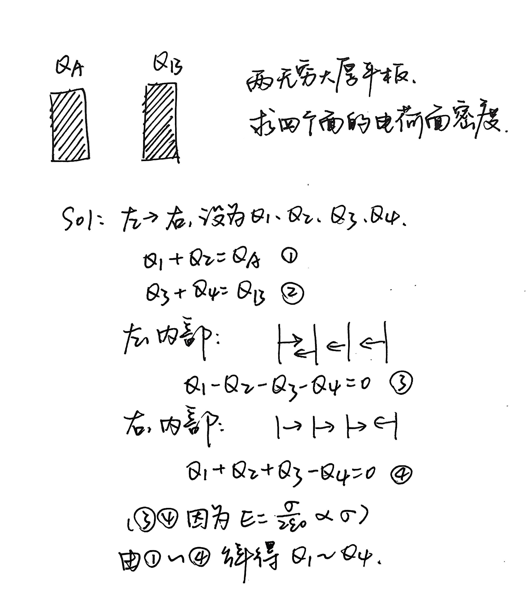

## 电势

### 电势定义

静电场是保守场，所以能定义静电势。

电势（相对无穷远参考点）：

$$
V(\vec{r}) = -\int_{\infty}^{\vec{r}} \vec{E} \cdot d\vec{l}
$$

电场强度是电势的梯度，电势是电场强度的积分，即$\vec{E}=-\nabla V$。

### 电势计算

计算电势的方法分为两种：从该点移动到电势零点做的功，电势叠加。

一般认为无穷远处为电势零点。但无限大带电平面或无限长导线的电势无绝对零点（否则任意位置电势为无穷大），需指定参考位置。

!!! examples "示例 电偶极子电势"

    电偶极子，q，d，外一点 P，距离 d，P 到中心点与正负中心连线的夹角为$\theta$，求 P 点电势。

    $$
    \begin{align*}
    V_P&=\frac{1}{4\pi\varepsilon_0}\left(\frac{q}{r_+}+\frac{-q}{r_-}\right)\\
    &=\frac{q}{4\pi\varepsilon_0}\frac{r_--r_+}{r_+r_-}
    \end{align*}
    $$

    由于$r\gg d$，近似$r_--r_+ = d\cos\theta$，$r_+r_- = r^2$，则

    $$V_P=\frac{1}{4\pi\varepsilon_0}\frac{qd\cos\theta}{r^2}=\frac{1}{4\pi\varepsilon_0}\frac{p}{r^2}$$

    其中 p 为电偶极矩。

    ---

    电偶极子在外电场中：

    - 力矩：$\vec{\tau} = \vec{p} \times \vec{E}$
    - 势能：$U = -\vec{p} \cdot \vec{E}$

    电偶极子倾向于转向与外电场平行以降低势能。

!!! normal-comment "一个结论"

    证明：在真空静电场中凡是电场线都是平行直线的地方，电场强度的大小定处处相等；或者换句话说，凡是电场强度的方向处处相同的地方，电场强度的大小必定处处相等。  
    【提示：利用高斯定理和作功与路径无关的性质，分别证明沿同一电场线和沿同一等势面上两点的场强相等。】

    结论：在真空静电场的某一区域里，若电场线都是**平行直线**（方向处处相同），则电场强度的**大小处处相等**（该区域内 \(|\mathbf E|\) 为常数）。

    证明分两步，分别对应提示中的两种思路：

    (1) 沿同一电场线两点的场强相等（用高斯定律）

    取一根极细的“**高斯柱**”（或称“通量管”）：侧面与电场线**平行**，两端盖为与电场线**垂直**的小圆片，端盖分别落在同一条电场线上两点 (P)、(Q)，端盖面积相同为 (A)。由于是静电真空且柱内**无自由电荷**，

    \[
    \oiint_S \mathbf E\cdot d\mathbf A=\frac{Q_{\text{enc}}}{\varepsilon_0}=0.
    \]

    侧面与 \(\mathbf E\) 平行，侧面通量为 0；仅两端盖有通量，且法向相反，得
    
    \[
    E(P),A - E(Q),A = 0\quad\Rightarrow\quad E(P)=E(Q).
    \]

    故**同一条电场线上任意两点场强大小相等**。

    > 直观：无源使通量沿“通量管”守恒；而在“平行直线”几何下，端面相同，故 (|\mathbf E|) 不变。

    (2) 同一等势面上两点的场强相等（用作功与路径无关）

    取一个极小**矩形回路** (P\to P'\to Q'\to Q\to P)，其中：

    - (P\to Q) 与 (P'\to Q') 两段**沿电场线方向**（相互平行）；
    - (Q\to Q') 与 (P'\to P) 两段**沿同一等势面**（与 (\mathbf E) 垂直）。

    静电场保守，闭合环路作功为零：
    
    \[
    \oint \mathbf E\cdot d\mathbf l = 0.
    \]

    而在等势段上 \(\mathbf E\cdot d\mathbf l=0\)，故仅两条“沿场线”的边有贡献。取它们长度同为 \(\delta \ell\) 并令矩形无限小，则
    
    \[
    E(P),\delta \ell - E(Q),\delta \ell = 0\quad\Rightarrow\quad E(P)=E(Q).
    \]

    于是**同一等势面上相邻两点场强相等**，进而处处相等。

    (3) 归结到“方向处处相同 ⇒ 大小处处相等”

    给定区域内任取两点 (A,B)。沿等势面从 \(A\) 平移到与 \(B\) 同一电场线上的点 \(A'\)（用步骤 2：\(E(A)=E(A')\)）；再沿该电场线从 \(A'\) 到 \(B\)（用步骤 1：\(E(A')=E(B)\)）。于是
    
    \[
    E(A)=E(A')=E(B).
    \]

    故该区域 \(|\mathbf E|\) 为常数，证毕。

常见电荷分布的电势:

| 电荷分布                             | 电势 $V(r)$                                                                                                                                                                                       |
| ------------------------------------ | ------------------------------------------------------------------------------------------------------------------------------------------------------------------------------------------------- |
| 点电荷 $q$                           | $\displaystyle V = \frac{1}{4\pi\varepsilon_0} \frac{q}{r}$                                                                                                                                       |
| 均匀带电球壳（总电荷 $Q$，半径 $R$） | $\displaystyle V = \begin{cases} \dfrac{1}{4\pi\varepsilon_0} \dfrac{Q}{R}, & r \leq R \\[6pt] \dfrac{1}{4\pi\varepsilon_0} \dfrac{Q}{r}, & r > R \end{cases}$                                    |
| 均匀带电球体（体电荷密度 $\rho$）    | $\displaystyle V = \begin{cases} \dfrac{1}{4\pi\varepsilon_0} \dfrac{Q}{2R} \left(3 - \dfrac{r^2}{R^2}\right), & r \leq R \\[6pt] \dfrac{1}{4\pi\varepsilon_0} \dfrac{Q}{r}, & r > R \end{cases}$ |
| 无限长直导线（线密度 $\lambda$）     | **不能取无穷远为零势点**；通常取某点 $r_0$ 为参考：$\displaystyle V(r) = -\frac{\lambda}{2\pi\varepsilon_0} \ln\left(\frac{r}{r_0}\right)$                                                        |

## 电势能

带电系统的总静电能由各带电体的**相互作用能**(interaction energy)和每个带电体的**自能**(self-energy)组成。
把每个带电体看作一个不可分割的整体，将各带电体从无限远移到现在位置所作的功，等于它们之间的相互作用能；把每个带电体上的各部分电荷从无限分散的状态聚集起来时所作的功，等于这个带电体的自能。

### 点电荷组的相互作用能

点电荷 $q$ 在电势 $V$ 中的相互作用能：

$$
U = qV
$$

点电荷组的相互作用能：

$$
\begin{align}
U &=\frac{1}{8\pi\varepsilon_0}\sum_{i=1}^n \sum_{j=1}^n \frac{q_i q_j}{r_{ij}} \\
&= \frac{1}{2} \sum_i q_i V_i
\end{align}
$$

(2) 中 $V_i$ 是除 $q_i$ 外其他电荷在 $q_i$ 处产生的电势。

!!! examples "示例 球壳电势能"

    均匀带电球壳，q，R，求电势能。

    (这里方法一中将球壳看成电荷元的组合，求相互作用能，实际上为球壳的自能；方法二直接求球壳自能。)

    (1) 每个点电势能都是电荷元乘球壳表面电势，总电势能为积分

    $$U=\frac{1}{2}\int_0^q \frac{q}{4\pi\varepsilon_0 R}\mathrm{d}q'=\frac{q^2}{8\pi\varepsilon_0 R}$$

    (2) 已经均匀分布了电荷 q'，再从无穷远处移来 dq'，直到电荷为 q。每次做的功为 dq'乘表面电势，球壳电势能为做的功

    $$U=\int_0^q \frac{q'}{4\pi\varepsilon_0 R}\mathrm{d}q'=\frac{q^2}{8\pi\varepsilon_0 R}$$

### 电荷连续分布时的静电能

以体电荷分布为例，我们把连续的带电体分割成许多体积元 $\Delta V_i$，设电荷的体密度为 $\rho_e$，则每块体积元内的电量为 $\Delta q_i = \rho_e \, \Delta V_i$，于是有

$$
W_e = \frac{1}{2} \sum_i \rho_e \, \Delta V_i \, U_i,
$$

取 $\Delta V_i \to 0$ 的极限，上式过渡到体积分：

$$
W_e = \frac{1}{2} \iiint \rho_e U \, \mathrm{d}V
$$

（上述积分意味着带电体内的电荷已被无限分割，因而我们得到的已不仅是相互作用能 $W_{\text{互}}$，而是包括自能在内的总静电能 $W_e$ 了。）

同理，对于线电荷和面电荷求静电能：

- 线电荷：$W_e = \frac{1}{2} \int \eta_e U \, \mathrm{d}l$
- 面电荷：$W_e = \frac{1}{2} \iint \sigma_e U \, \mathrm{d}S$
- 体电荷：$W_e = \frac{1}{2} \iiint \rho_e U \, \mathrm{d}V$

!!! examples "示例 均匀球壳和球体的静电能"

    {style="width:400px"}

!!! normal-comment "静电自能与基本粒子理论"

    由上述静电自能计算可知，如果将电子看作点电荷，则自能无穷大，造成“发散困难”。如果看作半径 $r_c$ 的球，则球壳、球体模型自能不同，即自能与电荷分布有关，但都是 $e^2/4\pi\varepsilon_0 r_c$ 数量级。

    根据相对论质能关系，$W=mc^2$，假设 $W$ 全部来自静电自能，且取表达式为 $e^2/4\pi\varepsilon_0 r_c$，则可导出电子的半径 $r_c$：

    $$r_c=\frac{e^2}{4\pi\varepsilon_0 mc^2}\approx 2.8\times 10^{-15}\mathrm{m}$$

    $r_c$ 称为电子的经典半径。

    现代的基本粒子理论大多建筑在点模型上，通常采用点模型会导致上述发散困难；但不采用点模型，从相对论和量子理论考虑，又会出现其他一系列问题。这是现代基本粒子理论中广泛存在的一个基本矛盾。

## 导体

### 静电平衡

静电平衡时，导体内部任意区域电荷的代数和为零。电荷只分布在导体表面。

表面电场与电荷面密度成正比，电荷面密度与曲率半径成反比。

!!! normal-comment "粗略说明 电荷面密度与曲率半径倒数成反比"

    两个带电球，一个为 q1, R1, $\sigma_1$，另一个为 q2, R2, $\sigma_2$。两者相距无穷远（电势互不影响）。

    某一时刻用导线将两个球连接，连接后电荷重新分布，使两者电势相等，即

    $$\frac{1}{4\pi\varepsilon_0}\frac{q_1'}{R_1}=\frac{1}{4\pi\varepsilon_0}\frac{q_2'}{R_2}\Rightarrow \frac{q_1'}{q_2'}=\frac{R_2}{R_1}$$

若导体有空腔，则空腔内表面净电荷等于空腔内净电荷。

几点注意：

- 多个导体的系统，求电势：先计算电场分布，再积分得到电势
- 多个导体、多个未知数：以“导体内部电场为零”为约束条件

!!! examples "示例 面密度计算"

    {style="width:380px"}

**静电屏蔽**：

1. 空腔导体可屏蔽外部电场对内部的影响
2. 接地导体可屏蔽内部电场对外部的影响
