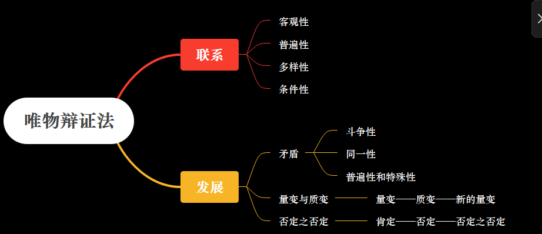

**判定性说法：**

世界的物质统一性原理是辩证唯物主义最基本、最核心的观点，是马克思主义的基石。

联系和发展的观点是唯物辩证法的总观点。

联系具有客观性、普遍性、多样性、条件性。

对立统一规律是唯物辩证法的根本规律。

对立统一是矛盾的两个属性。

实践的观点是马克思主义的基本观点.

实践具有客观实在性、自觉能动性和社会历史性三个基本特征。

实践的主体、客体和中介是实践活动的三项基本要素。

实践是认识的基础，实践在认识活动中起着决定性的作用。

真理有客观性，绝对性，相对性。

价值有客观性，主体性，社会历史性，多维性。

客观性是真理的本质属性，但是真理的形式又是主观的。真理的本性在于主观和客观相符合。

---

**著作及意义：**

| 著作                       | 首次 / 标志性意义    |
| -------------------------- | -------------------- |
| 共产党宣言                 | 科学社会主义诞生标志 |
| 德意志意识形态             | 历史唯物主义形成     |
| 资本论                     | 剩余价值理论系统阐述 |
| 反杜林论                   | 马克思主义体系化     |
| 社会主义从空想到科学的发展 | 科学社会主义成熟形态 |
| 哥达纲领批判               | 共产主义社会两阶段   |

---

**物质与意识的关系：**

物质第一性，意识第二性；物质决定意识，意识对物质具有能动反作用。

---

**唯物史观、剩余价值学说：**

恩格斯总结的马克思两大发现：唯物史观和剩余价值学说

1. 唯物史观

   - 社会存在和社会意识
   - 生产方式决定社会发展
   - 生产力和生产关系
   - 经济基础和上层建筑
   - 社会基本矛盾
   - 阶级斗争是阶级社会发展的直接动力
   - 人民群众是历史的创造者
   - 社会形态发展规律

2. 剩余价值学说

   - 劳动价值论：劳动是价值的唯一源泉，商品价值由社会必要劳动时间决定
   - 劳动力是特殊商品，其使用价值能创造价值
   - 必要劳动、剩余劳动
   - 剩余价值，绝对/相对
   - 资本的有机构成
   - 资本主义经济危机

---

**意识的作用：**

即意识的能动作用体现在哪

1. 意识活动有目的性和计划性
2. 意识活动有创造性
3. 意识能调控人行为和心理活动
4. 意识能指导实践改造世界

---

世界本原问题（本体论）——最先判断的一层

| 类别             | 世界本原 | 核心观点               | 关键词               | 典型说法               |
| ---------------- | -------- | ---------------------- | -------------------- | ---------------------- |
| **主观唯心主义** | 主观意识 | 世界依赖人的意识而存在 | 心、意识、感觉、良知 | 心外无物；存在即被感知 |
| **客观唯心主义** | 客观精神 | 独立于人的精神决定世界 | 理念、天、道、神     | 理在心外；神创造世界   |
| **朴素唯物主义** | 具体物质 | 某种具体物质是本原     | 水、火、气、原子     | 万物由水构成           |
| **机械唯物主义** | 物质     | 世界是机械拼合、静止的 | 机械、外力           | 世界像机器一样运转     |
| **辩证唯物主义** | 物质     | 物质第一性，意识反作用 | 实践、发展、矛盾     | 物质决定意识           |

认识来源问题（认识论）——第二步常考

| 类别                   | 认识从哪来 | 核心特征                 | 关键词           | 典型说法                 |
| ---------------------- | ---------- | ------------------------ | ---------------- | ------------------------ |
| **唯物主义反映论**     | 客观世界   | 认识是对客观现实的反映   | 实践、反映       | 实践出真知               |
| **主观唯心主义认识论** | 主观心灵   | 认识先天存在于内心       | 天赋、良知       | 不学而知                 |
| **不可知论**           | 不可认识   | 否认或怀疑认识世界       | 不可知、怀疑     | 本质不可认识             |
| **辩证唯物主义认识论** | 实践       | 实践是认识来源和检验标准 | 实践—认识—再实践 | 实践是检验真理的唯一标准 |

社会历史观（历史观）——必考对立点

| 类别         | 历史动力  | 核心观点           | 关键词         | 典型说法         |
| ------------ | --------- | ------------------ | -------------- | ---------------- |
| **英雄史观** | 少数人/神 | 英雄、伟人决定历史 | 英雄、伟人、神 | 帝王将相创造历史 |
| **唯物史观** | 人民群众  | 人民群众创造历史   | 群众、实践     | 战争胜利靠人民   |

发展观（变化怎么看）——常作为选择题陷阱

| 类别         | 对变化的看法 | 核心特征     | 关键词     | 典型说法       |
| ------------ | ------------ | ------------ | ---------- | -------------- |
| **形而上学** | 静止、孤立   | 否认内在矛盾 | 不变、外力 | 变化来自外因   |
| **辩证法**   | 运动、发展   | 矛盾推动发展 | 对立统一   | 发展是螺旋上升 |

---

唯物辩证法的成对范畴

| 成对范畴         | 含义要点                                           | 辩证关系（一句话）                   |
| ---------------- | -------------------------------------------------- | ------------------------------------ |
| **内容 与 形式** | 内容是事物的要素和过程，形式是内容的结构和表现方式 | 内容决定形式，形式反作用于内容       |
| **本质 与 现象** | 本质是事物内在的根本联系，现象是外在表现           | 本质通过现象表现，现象掩盖或反映本质 |
| **原因 与 结果** | 原因引起结果，结果反过来影响原因                   | 二者相互作用、相互转化               |
| **必然 与 偶然** | 必然是事物发展的确定趋势，偶然是不确定表现         | 必然通过偶然表现，偶然受必然制约     |
| **现实 与 可能** | 现实是已存在的，可能是尚未实现的                   | 可能在一定条件下转化为现实           |

---

发挥人的主观能动性需要：

1. 从实际出发，认识规律
2. 实践是基本途径
3. 依赖物质条件和物质手段

---

辩证唯物主义=唯物论（物质观）+辩证法（唯物辩证法）+认识论（辩证唯物主义认识论）

问唯物辩证法（联系与发展，矛盾，三大规律，方法论）：

- 辩证唯物主义（世界观，认识论，方法论）
- 物质观（物质客观实在，物质与意识，意识是什么，世界统一于物质）
- 认识论（实践是来源，感性到理性，能动反映，实践是标准，认识发展）

---

实践是认识的基础，对认识有决定性作用；认识是主体在实践基础上对客体的能动反映。

实践与认识的关系：

1. 产生需要
2. 提供可能
3. 使认识产生和发展
4. 检验的唯一标准

认识运动的基本规律：

1. 从实践到认识（感性，理性，感性和理性的辩证关系，过渡的两个条件）
2. 从认识到实践（怎么做）
3. 不断反复，无限发展（为什么）

从认识/理论到实践的条件：

1. 出发点：从实际出发，理论和实践相结合
2. 准备：需要中介环节（制定方案，运用手段……）
3. 执行者：理论被群众掌握
4. 执行方法：正确的实践方法

认识运动反复性和无限性的原因：

1. 反复：人们的认识不是一次性完成
2. 无限：物质世界及其发展无限，人类认识没有完成。

---

真理的特点：

1. 客观性：内容客观，检验标准客观
2. 绝对性：本身有界限、不能推翻，无限进步是绝对的
3. 相对性：对象有条件，正确程度是相对的

真理和价值在实践中辩证统一：

1. 成功的实践以两者的辩证统一为前提
2. 坚持真理是价值的前提
3. 真理一定有价值
4. 真理和价值在实践中相互制约

---

怎么认识和改造世界：

1. 一切从实际出发
2. 实事求是
3. 解放思想
4. 守正创新

---

