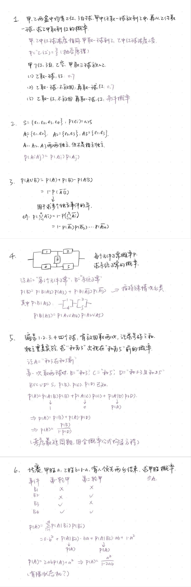

## 事件概念

- 随机试验：对随机现象的试验
- 样本空间：所有可能结果的集合
- 样本点：一个结果
- 随机事件：样本空间的子集
- 基本事件：只有一个样本点的随机事件
- 事件发生：结果包含于事件
- 必然事件：全集
- 不可能事件：空集

## 事件运算

- 和事件：$A\cup B$
- 积事件：$A\cap B=AB$
- 互不相容（互斥）：$A\cap B=\varnothing$
- 逆事件（对立事件）：$A\cup B=S\,\text{and}\, A\cap B=\varnothing$
- 差事件：$A-B$

## 频率与概率基本概念

- 频数：n 次试验中发生次数
- 频率：n 次中频数/n 的比值
- 概率：频率的极限
- 古典概型：有限个样本点，等概率
- 条件概率：$P(A|B)$表示 B 发生的条件下 A 发生的概率
- 完备事件组：划分整个样本空间的一组事件
- 先验概率：贝叶斯公式中$P(B_j)$
- 后验概率：贝叶斯公式中$P(B_j|A)$
- 相互独立：$P(AB)=P(A)P(B)$，积事件的概率等于概率的积
- 独立试验：试验结果互不影响
- 重复试验：相同条件下的试验

概率有可列可加性，如果有一列两两互不相容的事件 \(A_1, A_2, A_3, \dots\)，那么

\[
P\Bigl(\bigcup*{i=1}^{+\infty} A_i\Bigr) = \sum*{i=1}^{+\infty} P(A_i).
\]

并非所有概率都能直接相加，比如线段上单点的概率都为 0，但整个区间的概率为 1。

## 基本公式

**德摩根律：**

$$\overline{\bigcup_{j=1}^n A_j}=\bigcap_{j=1}^n\overline{A_j}$$

$$\overline{\bigcap_{j=1}^n A_j}=\bigcup_{j=1}^n\overline{A_j}$$

**差集的概率运算：**

$$P(A-B)=P(A)-P(AB)$$

**容斥原理：**

至少一个事件发生 = 所有奇数个事件发生概率求和 - 所有偶数事件发生概率求和

$$P\left(\bigcup_{j=1}^n A_j\right)=\sum_{j=1}^n P(A_j)-\sum_{i<j}P(A_i A_j)+\sum_{i<j<k}P(A_i A_j A_k)-\cdots +(-1)^{n-1}P(A_1 A_2\cdots A_n)$$

**条件概率乘法：**

$$P(AB)=P(A)P(A|B)=P(B)P(B|A)$$

**全概率公式：**

$B_1,B_2\cdots B_n$是整个样本空间的划分，则

$$P(A)=\sum_{j=1}^n P(B_j)P(A|B_j)$$

**贝叶斯公式：**

$B_1,B_2\cdots B_n$是整个样本空间的划分，则

$$P(B_k|A)=\frac{P(B_k A)}{P(A)}=\frac{P(B_k)P(A|B_k)}{\displaystyle \sum_{j=1}^n P(B_j)P(A|B_j)}$$

**其他：**

$$P(AB\cup BC\cup AC)=P(AB)+P(BC)+P(AC)-2P(ABC)$$

## 几道例题

!!! examples "例题 1 错排问题概率"

    n 卡片随机排列，A=“至少一张卡片的序号和位置不一样”。当 n 趋向于无穷时，求 P（A）？

    设 Ai=“第 i 张卡片的序号和位置不一样”

    $$
    \begin{align}
    P(A)&=P(A_1\cup\cdots A_n) \\
    &=\sum P(A_i)-\sum P(A_i A_j)+\cdots +(-1)^{n-1}P(A_1\cdots A_n) \\
    &=C_n^1 P(A_1)-C_n^2 P(A_1 A_2)+\cdots +(-1)^{n-1}P(A_1\cdots A_n)
    \end{align}
    $$

    （2）是因为容斥原理，（3）是因为每个 Ai 等价。

    又因为

    $$C_n^k=\frac{n!}{k!(n-k)!}\, , \, P(A_1\cdots A_k)=\frac{(n-k)!}{n!}$$

    有

    $$P(A)=1-\frac{1}{2!}+\frac{1}{3!}-\cdots\,\to 1-\frac{1}{e}$$

!!! examples "例题 2 取牌问题"

    52 张牌取 13 张

    **（1）A=“恰好 2 张红桃，3 张方块”**

    每种取牌结果等可能。

    $$P(A)=\frac{C_{13}^2 C_{13}^3 C_{26}^8}{C_{52}^{13}}$$

    **（2）B=“取的 13 张中至少 2 张红桃”**

    从反面求解，反面为 0 张、1 张红桃。

    $$P(B)=1-\frac{C_{13}^0 C_{39}^{13}}{C_{52}^{13}}-\frac{C_{13}^1 C_{39}^{12}}{C_{52}^{13}}$$

    !!! normal-comment "另一种想法？"

        先保证 2 张红桃，其余 11 张从取完两张剩下的 51 张中任意取？

        $$P(B)=\frac{C_{13}^2 C_{51}^{11}}{C_{52}^{13}}$$

        为什么不对：相同的红桃方案，每次选取的“固定的”红桃不同，导致重复计数。

!!! examples "例题 3 用概率判断条件"

    某接待站 12 次接待都在周二或周四，能不能认为接待时间有规定？

    假设每天等概率，即接待时间没有规定，上述发生的概率为$(\frac{2}{7)^{12}}$，为小概率事件。

    小概率事件发生，说明假设错误。接待时间有规定。

!!! examples "例题 4 抽签问题"

    a 白球 b 红球，a+b 个人，不放回取球，求第 k 个人取到红球的概率？

    将取球看作所有球分配到 a+b 个空位上，每种分配方式等可能，总的可能分配方式为$(a+b)!$

    对于第 k 个人，第 k 位一定为红，有$a$种可能；剩余 k-1 位随机，有$(a+b-1)!$种可能。

    $$P(A_k)=\frac{a\cdot(a+b-1)\cdots 1}{(a+b-1)\cdots 1}=\frac{a\cdot(a+b-1)!}{(a+b)!}=\frac{a}{a+b}$$

    抽签问题中，抽到的概率与抽签次序无关。

!!! examples "几道例题"

    {style="width:550px"}
