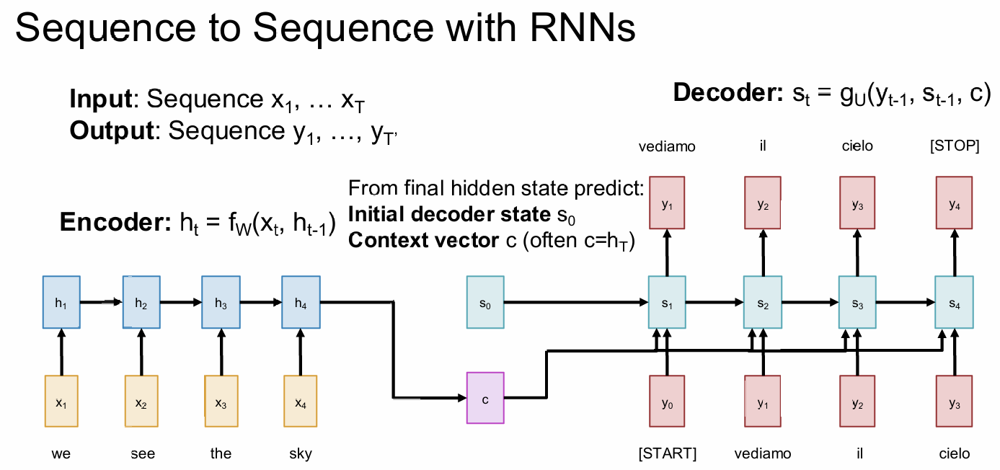

## Seq2Seq RNNs

As the figure shows.

Problem: Input sequence bottlenecks through fixed sized c, which will lead to gradient vanishment.

## Attention

Look back at the whole input sequence on each step of the output.