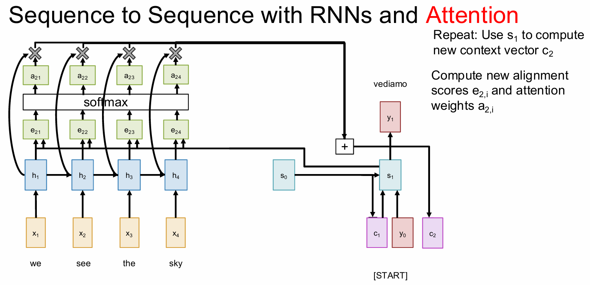
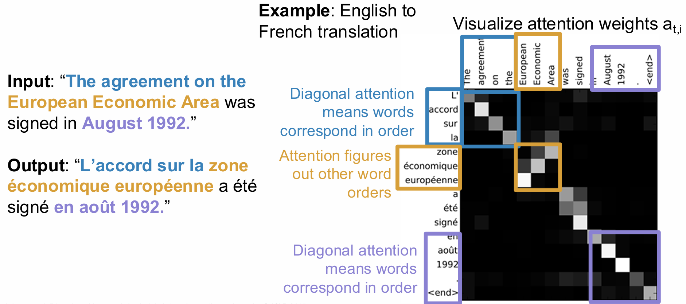

## Seq2Seq RNNs

As the figure shows.

Problem: Input sequence bottlenecks through fixed sized c, which will lead to gradient vanishment.

## Attention

Look back at the whole input sequence on each step of the output.

At time $t$, our compute sequence is:

1. $\displaystyle e_{t,i} = \mathrm{score}(h_i, s_{t - 1}), i = 1, 2, \cdots$

    where 

    $$
    \mathrm{score}(h, s) = \begin{cases}
    h^Ts &\quad \text{Dot} \\
    h^T W s &\quad \text{General} \\
    v^T \tanh (W [h; s]) &\quad \text{Concat}
    \end{cases}
    $$
    
    >To prevent large score causing the vanishment of softmax, we can change "Dot" to $\displaystyle \frac{h^Ts}{\sqrt{D}}$ where $D$ is the dimension of the input data.

2. $\displaystyle \mathbf{a_{t}} = \mathrm{Softmax}(\mathrm{e_t})$
3. $\displaystyle c_t = \sum_{i = 1}^{N}a_{t, i}h_i$
4. $\displaystyle s_t = g_U(y_{t - 1}, s_{t - 1}, c_t) \quad \text{(Decoder)}$

the visualization of weights:

## Self Attention

### Inputs
- Input vectors: $\mathbf{X} \in \mathbb{R}^{N \times D_{\text{in}}}$  
  Each input produces one output, which is a mix of information from **all** inputs.

- Key matrix: $\mathbf{W}^{K} \in \mathbb{R}^{D_{\text{in}} \times D_{\text{out}}}$  
- Value matrix: $\mathbf{W}^{V} \in \mathbb{R}^{D_{\text{in}} \times D_{\text{out}}}$  
- Query matrix: $\mathbf{W}^{Q} \in \mathbb{R}^{D_{\text{in}} \times D_{\text{out}}}$

> Shapes get a little simpler: almost always $D_{Q} = D_{K} = D_{V} = D_{\text{out}}$.

### Computation
Given $N$ input vectors, each of dimension $D_{\text{in}}$:

1. **Queries**  
   
$$
\mathbf{Q} = \mathbf{X}\,\mathbf{W}^{Q} \in \mathbb{R}^{N \times D_{\text{out}}} 
$$

2. **Keys**  

$$ 
\mathbf{K} = \mathbf{X}\,\mathbf{W}^{K} \in \mathbb{R}^{N \times D_{\text{out}}} 
$$

3. **Values**  

$$ 
\mathbf{V} = \mathbf{X}\,\mathbf{W}^{V} \in \mathbb{R}^{N \times D_{\text{out}}} 
$$

4. **Similarities**

$$ 
\mathbf{E} = \frac{\mathbf{Q}\,\mathbf{K}^{\!\top}}{\sqrt{D_{\text{out}}}} \in \mathbb{R}^{N \times N},\qquad  
E_{ij} = \frac{\mathbf{Q}_{i}\!\cdot\!\mathbf{K}_{j}}{\sqrt{D_{\text{out}}}} 
$$

5. **Attention weights**  

$$ 
\mathbf{A} = \text{Softmax}(\mathbf{E},\; \text{dim}=1) \in \mathbb{R}^{N \times N} 
$$

6. **Output vectors**  

$$ 
\mathbf{Y} = \mathbf{A}\,\mathbf{V} \in \mathbb{R}^{N \times D_{\text{out}}},\qquad  
\mathbf{Y}_{i} = \sum_{j} A_{ij}\,\mathbf{V}_{j} 
$$