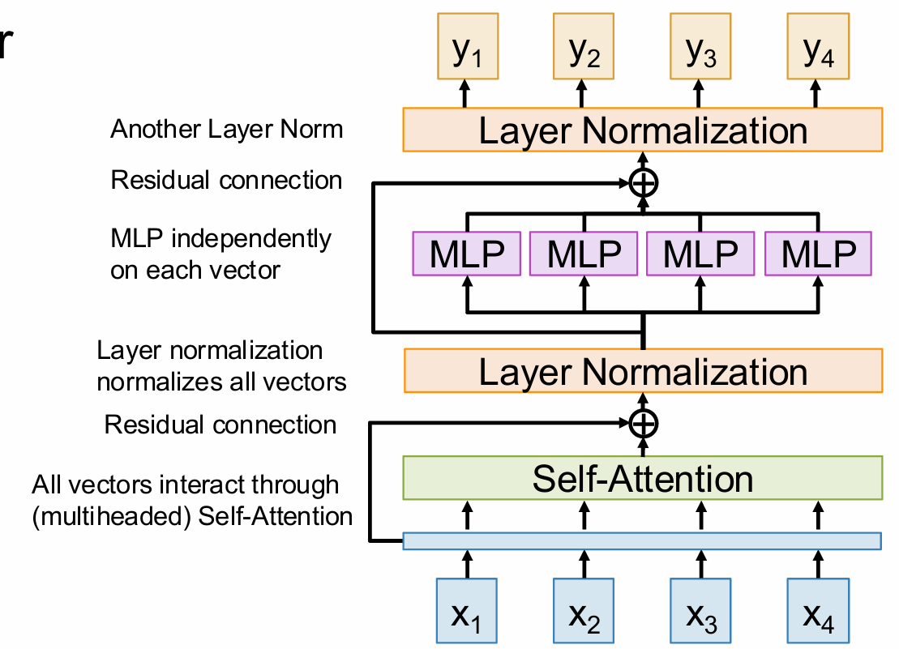
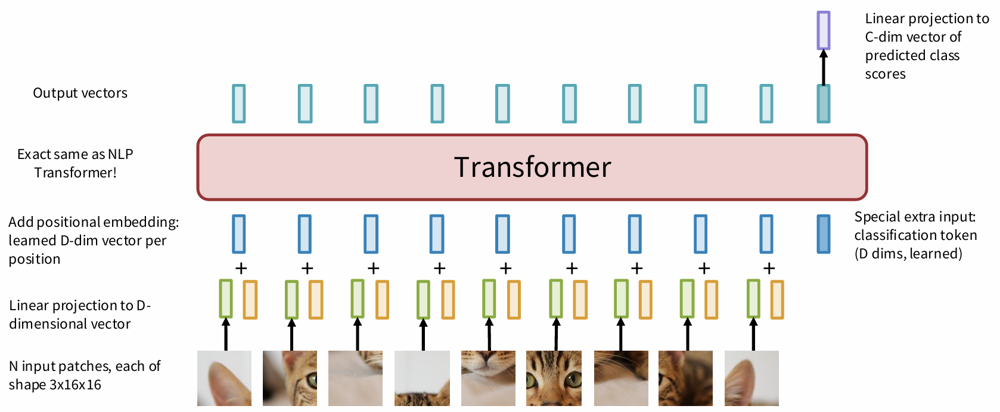

## Seq2Seq RNNs

As the figure shows.


Problem: Input sequence bottlenecks through fixed sized c, which will lead to gradient vanishment.

## Attention

Look back at the whole input sequence on each step of the output.


At time $t$, our compute sequence is:

1. $\displaystyle e_{t,i} = \mathrm{score}(h_i, s_{t - 1}), i = 1, 2, \cdots$

    where 

    $$
    \mathrm{score}(h, s) = \begin{cases}
    h^Ts &\quad \text{Dot} \\
    h^T W s &\quad \text{General} \\
    v^T \tanh (W [h; s]) &\quad \text{Concat}
    \end{cases}
    $$
    
    >To prevent large score causing the vanishment of softmax, we can change "Dot" to $\displaystyle \frac{h^Ts}{\sqrt{D}}$ where $D$ is the dimension of the input data.

2. $\displaystyle \mathbf{a_{t}} = \mathrm{Softmax}(\mathrm{e_t})$
3. $\displaystyle c_t = \sum_{i = 1}^{N}a_{t, i}h_i$
4. $\displaystyle s_t = g_U(y_{t - 1}, s_{t - 1}, c_t) \quad \text{(Decoder)}$

the visualization of weights:


## Self Attention

### Inputs
- Input vectors: $\mathbf{X} \in \mathbb{R}^{N \times D_{\text{in}}}$  
  Each input produces one output, which is a mix of information from **all** inputs.

- Key matrix: $\mathbf{W}^{K} \in \mathbb{R}^{D_{\text{in}} \times D_{\text{out}}}$  
- Value matrix: $\mathbf{W}^{V} \in \mathbb{R}^{D_{\text{in}} \times D_{\text{out}}}$  
- Query matrix: $\mathbf{W}^{Q} \in \mathbb{R}^{D_{\text{in}} \times D_{\text{out}}}$

> Shapes get a little simpler: almost always $D_{Q} = D_{K} = D_{V} = D_{\text{out}}$.

### Computation
Given $N$ input vectors, each of dimension $D_{\text{in}}$:

1. **Queries** (提问者)
   
    $$
    \mathbf{Q} = \mathbf{X}\,\mathbf{W}^{Q} \in \mathbb{R}^{N \times D_{\text{out}}} 
    $$

2. **Keys** (被提问者)

    $$ 
    \mathbf{K} = \mathbf{X}\,\mathbf{W}^{K} \in \mathbb{R}^{N \times D_{\text{out}}} 
    $$

3. **Values** (信息提供者)

    $$ 
    \mathbf{V} = \mathbf{X}\,\mathbf{W}^{V} \in \mathbb{R}^{N \times D_{\text{out}}} 
    $$

4. **Similarities**

    $$ 
    \mathbf{E} = \frac{\mathbf{Q}\,\mathbf{K}^{\!\top}}{\sqrt{D_{\text{out}}}} \in \mathbb{R}^{N \times N},\qquad  
    E_{ij} = \frac{\mathbf{Q}_{i}\!\cdot\!\mathbf{K}_{j}}{\sqrt{D_{\text{out}}}} 
    $$

5. **Attention weights**  

    $$ 
    \mathbf{A} = \text{Softmax}(\mathbf{E},\; \text{dim}=1) \in \mathbb{R}^{N \times N} 
    $$

6. **Output vectors**  

    $$ 
    \mathbf{Y} = \mathbf{A}\,\mathbf{V} \in \mathbb{R}^{N \times D_{\text{out}}},\qquad  
    \mathbf{Y}_{i} = \sum_{j} A_{ij}\,\mathbf{V}_{j} 
    $$

A Single-head Attention:

{ style="width:50%; float:center;" }

!!! examples "举个例子 （翻译场景）"
    - 输入句子：
      > **The cat sat on the mat**
    - 在 Self-Attention 中，**“cat”这个词**会：
         - 用 **Query** 问自己：“我需要关注哪些词？”
         - 用 **Key** 让其他词（包括自己）回答：“我和 cat 有多相关？”
         - 用 **Value** 提取信息：“从每个词中拿多少信息？”
    - 最终，“cat”这个词的输出向量会融合“cat”、“sat”、“mat”等信息，变得更“全局”。

However, if we permute the input sequence, similarities, attention weights and outputs will be the same but permuted, which means that Self-Attention is **permutation equivalent**. So problem is that, Self-Attention does not know the order of sequence.

**Solution**: Add positional encoding to each input.

## Masked Self-Attention

When used at language models where you want to predict the next word, the self attention shouldn't look ahead,  
To prevent vectors from peeking ahead, zero out the upper-triangle of the similarity matrix (set it to  -inf ) before softmax.

## Multiheaded Self-Attention

(Used everywhere in practice)

Compute $H$ independent self-attention layers, each with their own weights. Stack up the $H$ independent layers and fuse them into the final output with $W_O$

$$
\begin{cases}
\displaystyle \mathbf{Q} = \mathbf{X} \mathbf{W}_Q &\quad (\text{Queries: } [H \times N \times D_H]) \\
\displaystyle \mathbf{K} = \mathbf{X} \mathbf{W}_K &\quad (\text{Keys: } [H \times N \times D_H]) \\
\displaystyle \mathbf{V} = \mathbf{X} \mathbf{W}_V &\quad (\text{Values: } [H \times N \times D_H]) \\
\displaystyle \mathbf{E} = \frac{\mathbf{Q} \mathbf{K}^\top}{\sqrt{D_Q}} &\quad (\text{Similarities: } [H \times N \times N]) \\
\displaystyle \mathbf{A} = \mathrm{softmax}(\mathbf{E}, \mathrm{dim}=2) &\quad (\text{Attention weights: } [H \times N \times N]) \\
\displaystyle \mathbf{Y} = \mathbf{A} \mathbf{V} &\quad (\text{Head outputs: } [H \times N \times D_H] \Rightarrow [N \times H D_H]) \\
\displaystyle \boxed{\mathbf{O} = \mathbf{Y} \mathbf{W}_O} &\quad (\text{Outputs: } [N \times D])
\end{cases}
$$

!!! remarks "Compute Optimizations for Self-Attention"

    1. **QKV Projection**: $\displaystyle [\mathbf{Q, K, V}] = \mathbf{X}\mathbf{W}_{qkv}$
        ```python
        qkv = X @ W_qkv        # [N × 3H·D_H]
        qkv = qkv.reshape(N, H, 3, D_H).permute(2, 1, 0, 3)  # [3, H, N, D_H]
        Q, K, V = qkv[0], qkv[1], qkv[2]                     # Each [H × N × D_H]
        ```
    2. **QK Similarity**: Use
        ```python
        # Q, K: [H, N, D_H]
        # K.transpose(-1, -2): [H, D_H, N]
        E = torch.matmul(Q, K.transpose(-1, -2)) / sqrt(D_H)  # => [H, N, N]
        ```
       to compute $\displaystyle \mathbf{E} = \frac{\mathbf{Q} \mathbf{K}^\top}{\sqrt{D_Q}}$
    3. **V-Weighting**: After compute $\displaystyle \mathbf{Y} = \mathbf{A}\mathbf{V}$, we reshape $\mathrm{Y}$ into $[N \times H \cdot D_H]$ for output projection, preventing the storage of head outputs.
        ```python
        Y = torch.matmul(A, V)            # [H × N × D_H]
        Y = Y.permute(1, 0, 2).reshape(N, H * D_H)  # => [N × H·D_H]
        ```
       And at output, we let $\mathrm{W}_O$ be $[H\cdot D_H \times D]$
    This has the $O(N^2)$ space complexity.

    **Flash Attention**: 
    
    $$
    \mathrm{FlashAttn}(\mathbf{Q}, \mathbf{K}, \mathbf{V}) = \mathrm{StreamSoftmax}(\mathbf{Q}\mathbf{K}^T)\mathbf{V}
    $$

    where stream softmax will compute the value without store the whold matrix. With this, the space complexity will be $O(N)$.

## Cross-Attention

Almost the same as Self-Attention, but the Query is from outer.

## Transformer

### Transformer Block

{ style="width:50%; float:center;" }

!!! remarks "Residual connection (残差连接)"
    $\mathrm{Output} = \mathrm{Layer}(X) + X$, which allows information to be preserved without having to pass through every layer.

**Self-Attention** is the only interaction between vectors  
**LayerNorm and MLP** work on each vector independently

It is  Highly scalable and parallelizable, most of the compute is just 6 matmuls:
- 4 from Self-Attention
- 2 from MLP

### The Transformer

A Transformer is just a stack of **identical** Transformer blocks!

- Original: [Vaswani et al, 2017]  
12 blocks, D=1024, H=16, N=512, 213M params  
- GPT-2: [Radford et al, 2019]  
48 blocks, D=1600, H=25, N=1024, 1.5B params  
- GPT-3: [Brown et al, 2020]  
96 blocks, D=12288, H=96, N=2048, 175B params

### Applications

#### Transformers for Language Modeling (LLM)

1. Learn an embedding matrix $[V \times D]$ at the start of the model to convert words into vectors.
2.  Use masked attention inside each transformer block so each token can only see the ones before it
3.  At the end, learn a projection matrix shape $[D \times V]$ to project each D-dim vector to a V-dim vector of scores for each element of the vocabulary.
4.  Train to predict next token using softmax + cross-entropy loss

#### Vision Transformers

Just break the image into patches, flatten and apply a linear transform, and put into the transformer.



### Tweaking Transformers

#### Pre-Norm Transformer

Move layer normalization before the Self-Attention and MLP, inside the residual connections. Training is more stable.

#### RMSNorm

Replace Layer Normalization with Root-Mean-Square Normalization.

$$
\begin{cases}
\displaystyle y_i = \frac{x_i}{\mathrm{RMS}(x)}\gamma_i &\quad \gamma \text{ is the weight (Shape D)} \\
\displaystyle \mathrm{RMS}(x) = \sqrt{\varepsilon + \frac{1}{N}\sum_{i = 1}^N x_i^2}
\end{cases}
$$

#### SwiGLU MLP

$$
\begin{cases}
\displaystyle Y = \left(\mathrm{Swish}(XW_1)\odot XW_2\right)W_3 \\
\displaystyle \mathrm{Swish}(x) = \frac{x}{1 + \mathrm{e}^{-x}}
\end{cases}
$$

#### Mixture of Experts (MoE)

Learn E separate sets of MLP weights in each block; each MLP is an **expert**.
It turns one giant model into many small “experts” but activates only a handful of them for each input token.