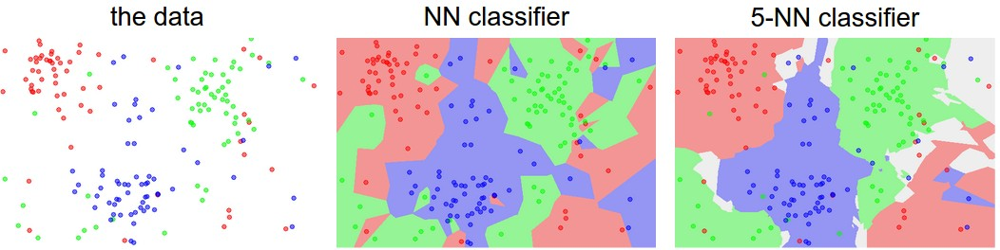

# CS231n: Deep Learning for Computer Vision
## Stanford - Spring 2025

### Image Classification

#### Ways to compare images

- L1 distances: $d_1(I_1, I_2) = \sum_p \vert I_1^p - I_2^p \vert$
- L2 distances: $d_2(I_1, I_2) = \sqrt{\sum_p \vert I_1^p - I_2^p \vert^2}$

A classifier below with $O(1)$ for training and $O(N)$ for predecting with L1 distance.


```python
import numpy as np

class NearestNeighbor(object):
  def __init__(self):
    pass

  def train(self, X, y):
    """ X is N x D where each row is an example. Y is 1-dimension of size N """
    # the nearest neighbor classifier simply remembers all the training data
    self.Xtr = X
    self.ytr = y

  def predict(self, X):
    """ X is N x D where each row is an example we wish to predict label for """
    num_test = X.shape[0]
    # let's make sure that the output type matches the input type
    Ypred = np.zeros(num_test, dtype = self.ytr.dtype)

    # loop over all test rows
    for i in range(num_test):
      # find the nearest training image to the i'th test image
      # using the L1 distance (sum of absolute value differences)
      distances = np.sum(np.abs(self.Xtr - X[i,:]), axis = 1)
      min_index = np.argmin(distances) # get the index with the smallest distance
      Ypred[i] = self.ytr[min_index] # predict the label of the nearest example

    return Ypred
```

It's bad: we want classifiers that are fast at prediction and slow for training

#### K-Neatest Neighbours
The idea is very simple: instead of finding the single closest image in the training set, we will find the top k closest images, and have them vote on the label of the test image.
Higher values of k have a smoothing effect that makes the classifier more resistant to outliers



