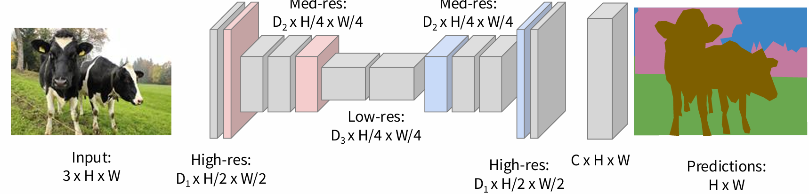
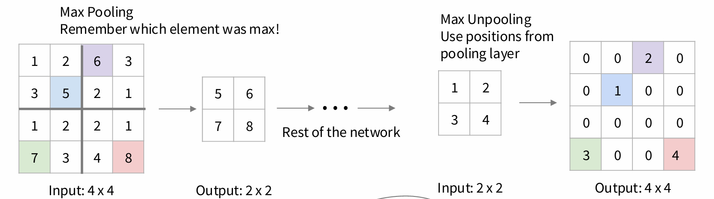
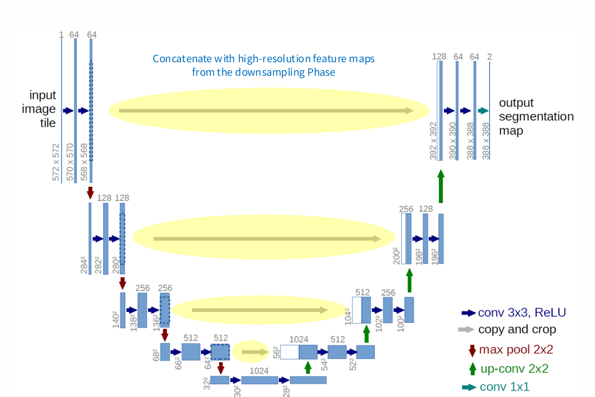
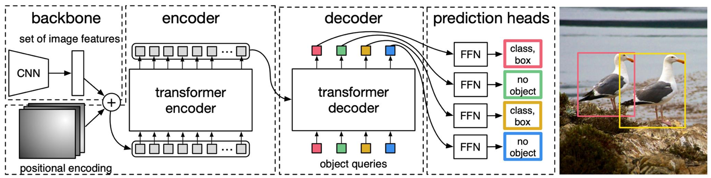

## Semantic Segmentation

Detect which region a pixel belongs to.

At training time, each pixel is labeled with a semantic category. And at test time,classify each pixel of a new image.

### Fully Convolutional

Design network as a bunch of convolutional layers, with downsampling and upsampling inside the network.

### Upsampling

#### Unpooling

Sampling --> Pooling

e.g. Max Unpooling: Set others to zero, and put it back to the original position.

#### Transposed Convolution

The inverse of convolution.

$$
Y[m, n] = \sum_{i=0}^{H-1} \sum_{j=0}^{W-1} X[i, j] \cdot K[m - i \cdot s, n - j \cdot s]
$$

> $X$: input figure  
> $K$: conv kernel  
> $Y$: larger output  

### U-Net

## Object Detection

(Classification + Localization)

### One Object

After conv layers, we will:

1. Apply a fully-connected layer for classification --> Softmax loss
2. Apply a fully-connected layer for localization --> L2 loss

Add the two loss together (**Multitask Loss**)

### Multiple Objects

 Each image needs a different number of outputs!

#### R-CNN

- R: Region proposal

1. Regions of Interest (RoI) from a proposal method(~2k), usually Selective Search。
2. Warping, reshape RoI to a fixed size (224 / 227)
3.  Forward each region through ConvNet (ImageNet-pretrained)
4. Classify regions with SVMs
5. Bounding Box Regression

Problem: Very slow! Need to do ~2k independent forward passes for each image!  
Idea: Pass the image through convnet before cropping! Crop the conv feature instead!

#### Fast R-CNN

Conv the image before region proposal, and conv together for classification and localization

### Region Proposal Network

 Imagine an anchor box of fixed size at each point in the feature map.  At each point, predict whether the corresponding anchor contains an object (binary classification)  
Output: Anchor is an object? Box corrections?

#### YOLO (You Only Look Once)

Real-time object detection

For each box output:
- P(object): probability that the box contains an object  
- B bounding boxes (x, y, h, w)  
- P(class): probability of belonging to a class

#### DETR (Object **De**tection with **Tr**ansformers)

## Instance Segmentation

Simultaneously detects objects in an image while delineating precise pixel-level masks for each distinct object instance.

### Masked R-CNN
