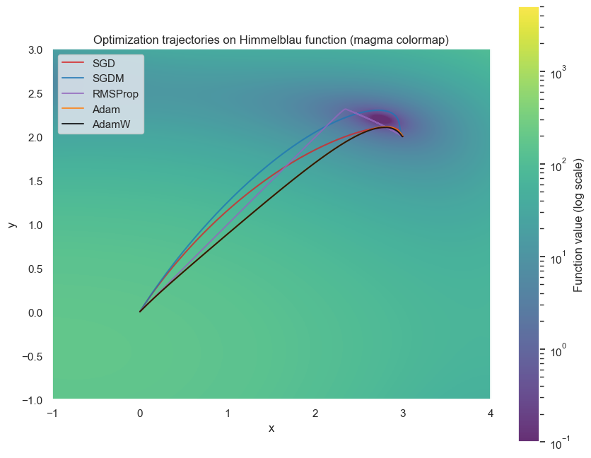
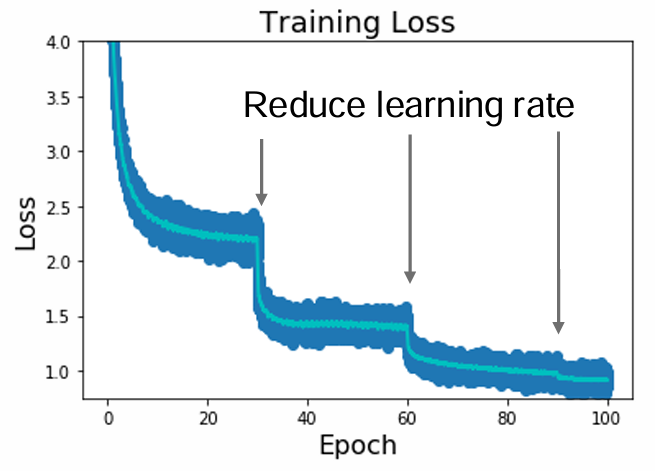
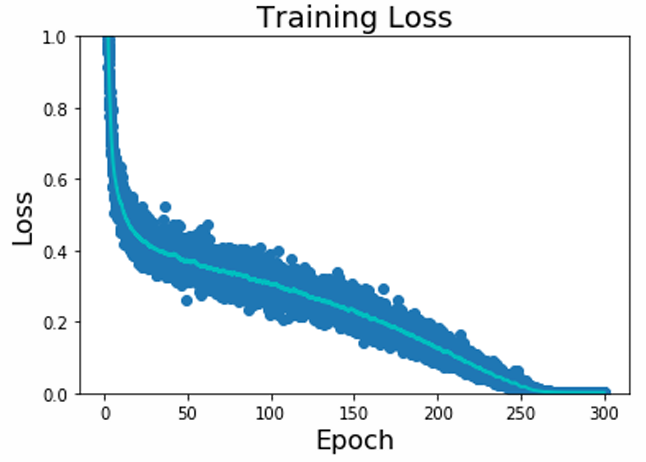

## Optimizers

```python
while True:
    weights_grad = evaluate_gradient(loss_fun, data, weights)
    weights += -step_size * weights_grad
```

> `step_size` is a hyper-parameter called learning rate.

### Stochastic Gradient Descent (SGD)

Full sum will be expensive when N is large, so we approximate the sum using a minibatch of examples.

$$
L(W) = \frac{1}{N}\sum_{i = 1}^{N}L_i(x_i, y_i, W) + \lambda R(W)
$$

$$
\nabla_W L(W) = \frac{1}{N} \sum_{i=1}^{N} \nabla_W L_i(x_i, y_i, W) + \lambda \nabla_W R(W)
$$

```python
while True:
    data_batch = sample_training_data(data, 256)
    weights_grad = evaluate_gradient(loss_fun, data_batch, weights)
    weights += -step_size * weights_grad
```

!!! remarks "Problems"
    1. If the loss **changes quickly in one direction and slowly in another**, there will be very slow progress along shallow dimension and jitter along steep direction
    2.  If the loss function has a **local minima** or **saddle point**, the gradient descent will get stuck.
    3. Our gradients come from minibatches so they can be noisy.

### SGD with Momentum (SGDM)

While SGD is $x_{t + 1} = s_t - \alpha \nabla f(x_t)$, SGD + momentum will be

$$
\begin{cases}
v_{t + 1} = \rho v_t + \nabla f(x_t) \\
x_{t + 1} = x_t - \alpha v_{t + 1}
\end{cases}
$$

We build up "velocity" and "friction" $\rho$ (typicaly $\rho = 0.9$ or $0.99$)

```python
vx = 0
while True:
    dx = compute_gradient(x)
    vx = rho * vx + dx
    x -= learning_rate * vx
```

### RMSProp

Adds element-wise scaling of the gradient based on the historical sum of squares in each dimension (with decay). 前面每一次的梯度都在不断累积，但是影响又会衰减

$$
\begin{cases}
x_{t+1} = x_t - \frac{\eta}{\sqrt{v_{t+1}}} \nabla f(x_t) \\
v_1 = (\nabla f(x_0))^2 \\
v_{t+1} = \alpha v_t + (1 - \alpha)(\nabla f(x_t))^2
\end{cases}
$$

$(\nabla f(x_t))^2$ denotes the element-wise square of the gradient.

```python
grad_squared = 0
while True:
    dx = compute_gradient(x)
    grad_squared = decay_rate * grad_squared + (1 - decay_rate) * dx * dx
    x -= learning_rate * dx / (np.sqrt(grad_squared) + 1e-7)
```

!!! remarks "Why adding `1e-7`?"
    It's a numerical stability trick called **epsilon smoothing**， which can prevent division by 0 or near-zero values.

### Adam

**Adam** builds upon **RMSProp** by incorporating the first-moment term $m_t$ and bias correction, which improves convergence speed and stability.

$$
\begin{cases}
g_t = \nabla f(x_t) & \text{(当前梯度)} \\
m_1 = 0,\quad v_1 = 0 & \text{(一阶与二阶动量初值)} \\
m_{t+1} = \beta_1 m_t + (1 - \beta_1) g_t & \text{(一阶动量估计)} \\
v_{t+1} = \beta_2 v_t + (1 - \beta_2) g_t^2 & \text{(二阶动量估计)} \\
\hat{m}_{t+1} = \dfrac{m_{t+1}}{1 - \beta_1^{t+1}} & \text{(一阶动量偏差修正)} \\
\hat{v}_{t+1} = \dfrac{v_{t+1}}{1 - \beta_2^{t+1}} & \text{(二阶动量偏差修正)} \\
x_{t+1} = x_t - \eta \cdot \dfrac{\hat{m}_{t+1}}{\sqrt{\hat{v}_{t+1}} + \epsilon} & \text{(更新参数)}
\end{cases}
$$

```python
first_moment = 0
second_moment = 0
for t in range(1, num_iterations):
    dx = compute_gradient(x)

    # Momentum
    first_moment = beta1 * first_moment + (1 - beta1) * dx

    # RMSProp / AdaGrad components
    second_moment = beta2 * second_moment + (1 - beta2) * dx * dx

    # Bias correction
    first_unbias = first_moment / (1 - beta1 ** t)
    second_unbias = second_moment / (1 - beta2 ** t)

    # Update
    x -= learning_rate * first_unbias / (np.sqrt(second_unbias) + 1e-7)
```

### AdamW (Adam Variant with Weight Decay)

AdamW is an improvement over Adam that decouples **weight decay** from the gradient update, commonly used in training deep neural networks such as Transformers and BERT.

$$
\begin{cases}
g_t = \nabla f(x_t) & \text{(当前梯度)} \\
m_1 = 0,\quad v_1 = 0 \\
m_{t+1} = \beta_1 m_t + (1 - \beta_1) g_t & \text{(一阶动量)} \\
v_{t+1} = \beta_2 v_t + (1 - \beta_2) g_t^2 & \text{(二阶动量)} \\
\hat{m}_{t+1} = \dfrac{m_{t+1}}{1 - \beta_1^{t+1}} & \text{(一阶偏差修正)} \\
\hat{v}_{t+1} = \dfrac{v_{t+1}}{1 - \beta_2^{t+1}} & \text{(二阶偏差修正)} \\
x_{t+1} = x_t - \eta \cdot \left( \dfrac{\hat{m}_{t+1}}{\sqrt{\hat{v}_{t+1}} + \epsilon} \boxed{ + \lambda x_t} \right) & \text{(参数更新)}
\end{cases}
$$

```python
first_moment = 0
second_moment = 0

for t in range(1, num_iterations):
    dx = compute_gradient(x)

    # Momentum
    first_moment = beta1 * first_moment + (1 - beta1) * dx

    # RMSProp / AdaGrad components
    second_moment = beta2 * second_moment + (1 - beta2) * dx * dx

    # Bias correction
    first_unbias = first_moment / (1 - beta1 ** t)
    second_unbias = second_moment / (1 - beta2 ** t)

    # AdamW update: 参数先按权重衰减衰减，再进行Adam更新
    x -= learning_rate * weight_decay * x  # 权重衰减部分

    # Adam更新部分
    x -= learning_rate * first_unbias / (np.sqrt(second_unbias) + 1e-7)
```

Comparison plots of the optimizers are shown below



### How to controll the learning rate?

One approach is to let learning rate decay over time.

Way 1: Reduce learning rate at a few fixed points. E.g. for ResNets, multiply LR by 0.1 after epochs 30, 60, and 90

{ style="width:49%; float:left;" }
{ style="width:51%; float:right;" }

<br><br>

Way 2: Set learning rate as a decreasing function.   

- **Cosine**: $\displaystyle{\alpha_t = \frac{1}{2}\alpha_0(1 + \cos (t \pi / T))}$  
- **Linear**: $\alpha_t = \alpha_0 (1 - t/T)$  
- **Inverse Sqrt**: $\displaystyle{\alpha_t = \alpha_0 / \sqrt{t}}$  
- **Linear Warmup**: $\text{lr}(t) = 
\begin{cases}
\displaystyle \frac{t}{T_{\text{warmup}}} \cdot \text{lr}_{\text{max}}, & \text{if } t \leq T_{\text{warmup}} \\
\text{lr}_{\text{schedule}}(t), & \text{otherwise}
\end{cases}$

## Image Features

### Histogram of Oriented Gradients (HoG)

Divide each image into $8 \times 8$ pixel regions. Within each region quantize edge direction into 9 bins.

### Bag of Words

1. Build codebook: Extract random patches from the image and cluster (K-Means) patches to form "codebook" of "visual words".
2. Encode images.