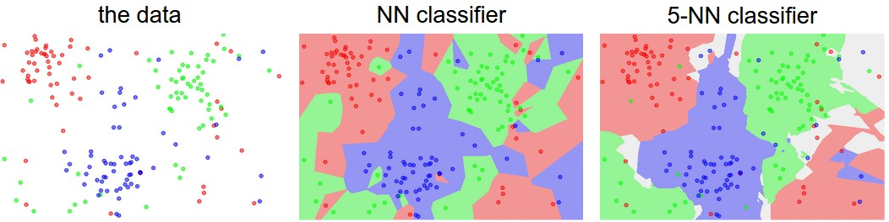

## Ways to compare images

- L1 distances: $d_1(I_1, I_2) = \sum_p \vert I_1^p - I_2^p \vert$
- L2 distances: $d_2(I_1, I_2) = \sqrt{\sum_p ( I_1^p - I_2^p )^2}$

A classifier below with $O(1)$ for training and $O(N)$ for predecting with L1 distance.


```python
import numpy as np

class NearestNeighbor(object):
  def __init__(self):
    pass

  def train(self, X, y):
    """ X is N x D where each row is an example. Y is 1-dimension of size N """
    # the nearest neighbor classifier simply remembers all the training data
    self.Xtr = X
    self.ytr = y

  def predict(self, X):
    """ X is N x D where each row is an example we wish to predict label for """
    num_test = X.shape[0]
    # let's make sure that the output type matches the input type
    Ypred = np.zeros(num_test, dtype = self.ytr.dtype)

    # loop over all test rows
    for i in range(num_test):
      # find the nearest training image to the i'th test image
      # using the L1 distance (sum of absolute value differences)
      distances = np.sum(np.abs(self.Xtr - X[i,:]), axis = 1)
      min_index = np.argmin(distances) # get the index with the smallest distance
      Ypred[i] = self.ytr[min_index] # predict the label of the nearest example

    return Ypred
```

It's bad: we want classifiers that are fast at prediction and slow for training

## K-Neatest Neighbours
The idea is very simple: instead of finding the single closest image in the training set, we will find the top k closest images, and have them vote on the label of the test image.
Higher values of k have a smoothing effect that makes the classifier more resistant to outliers



Ideas on the hyperparameters
- ❌ Choose hyperparameters working best on the data. K = 1 always works best on the training data.
- ❌ Choose hyperparameters working best on the test data. No idea how it will perform on new data.

!!! normal-comment "Note"
    Whenever you’re designing Machine Learning algorithms, you should think of the test set as a very precious resource that should ideally never be touched until one time at the very end.

- Split data into **train**, **validation**, **test** sets, train and test on train and validation sets and showcase the performance on the test set. (Test at the last time.)


```python
# assume we have Xtr_rows, Ytr, Xte_rows, Yte as before
# recall Xtr_rows is 50,000 x 3072 matrix
Xval_rows = Xtr_rows[:1000, :] # take first 1000 for validation
Yval = Ytr[:1000]
Xtr_rows = Xtr_rows[1000:, :] # keep last 49,000 for train
Ytr = Ytr[1000:]

# find hyperparameters that work best on the validation set
validation_accuracies = []
for k in [1, 3, 5, 10, 20, 50, 100]:

  # use a particular value of k and evaluation on validation data
  nn = NearestNeighbor()
  nn.train(Xtr_rows, Ytr)
  # here we assume a modified NearestNeighbor class that can take a k as input
  Yval_predict = nn.predict(Xval_rows, k = k)
  acc = np.mean(Yval_predict == Yval)
  print 'accuracy: %f' % (acc,)

  # keep track of what works on the validation set
  validation_accuracies.append((k, acc))
```

- **Cross-Validation** (use less on CV). Split data into folds, try each fold as validation and average the results.

!!! normal-comment "Example"
    For example, in 5-fold cross-validation, we would split the training data into 5 equal folds, use 4 of them for training, and 1 for validation. We would then iterate over which fold is the validation fold, evaluate the performance, and finally average the performance across the different folds.

!!! remarks "Tip"
    In practice, people prefer to avoid cross-validation in favor of having a single validation split, since cross-validation can be computationally expensive.

K-Nearest Neighbor on images never used: very slow at test time, and distance matrix on pixels are not informative. And our classifier should densely cover the space, which is harder when the dimension goes high. (Curse of dimensionality)
