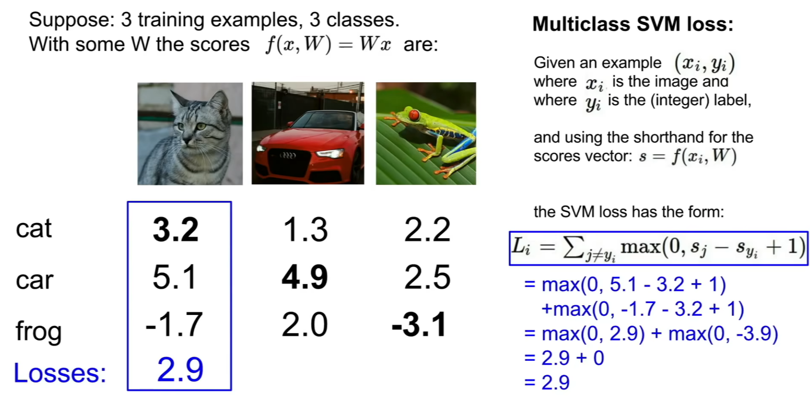

## Parametric Approach

$$
input: x \rightarrow f(x, W[, b]) \rightarrow \text{10 numbers giving class scores}
$$

e.g.

$$
f(x, W, b) = W \text{vec}(x) + b
$$

- Hard cases: Cases with no linear boundaries.

## Loss function

Given a dataset of examples $\{(x_i, y_i)\}_{i = 1}^n$, loss over the dataset is a sum of loss over examples:

$$
L = \frac{1}{N}\sum_{i}L_i(f(x_i, W), y_i)
$$

### Multiclass SVM Loss (Hinge loss)

$y_i$ are integers, $s_i$ is the $j$-th class prediction of data $x_i$, $L_i = \sum_{j \neq y_i}\max \{0, s_j - s_{y_i} + 1\}$  (s -> score).
$1$ here is a threshold, but it can be chosen randomly.




```python
def L_i_vectorized(x, y, W):
    scores = W.dot(x)
    margins = np.maximum(0, scores - scores[y] + 1)
    margins[y] = 0
    loss_i = np.sum(margins)
    return loss_i
```

### The regularization

Model should be simple, so it works on test data. (防止过拟合)

$$
L(W) = \frac{1}{N}\sum_{i = 1}^{N}L_i(f(x_i, W), y_i) + \lambda R(W)
$$

$\lambda$: regularization strength.
$R(W)$ allows the model to choose a simple model (It can be understood as reducing the degree of the fitted curve)

- L2 regularization: $R(W) = \Vert W \Vert_F$
- L1 regularization: $R(W) = \Vert W \Vert_1$
- Elastic net: $R(W) = \beta \Vert W \Vert_F + \Vert W \Vert_1$
- Max norm regularization
- Dropout
- Fancier

### Softmax Loss (Cross-entropy loss)

$$
P(Y = k | X = x_i) = \frac{\mathrm{e}^{s_k}}{\sum_j \mathrm{e}^{s_j}}
$$

where $s = f(x_i, W)$, which will normalize the score vector $s$.
We want to minimize the negative log likelihood of the correct class, so the loss function would be

$$
L_i = -\log P(Y = y_i | X = x_i)
$$

