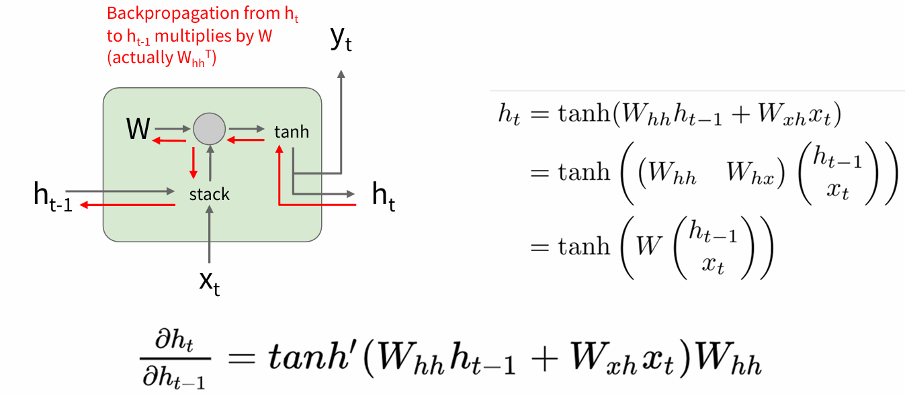
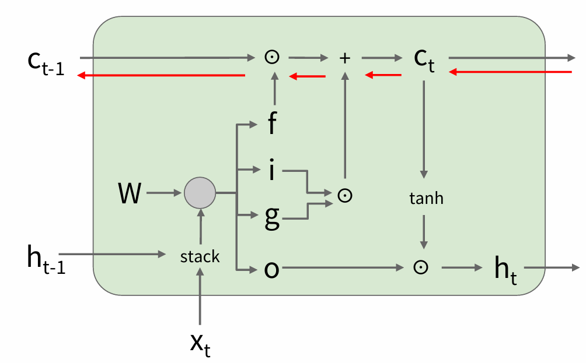

## Vanilla RNN

### Forward

$$
\begin{cases}
    \displaystyle h_t = f_W(h_{t - 1}, x_t) \\
    \displaystyle y_t = f_{W_hy}(h_t)
\end{cases}
$$

or 

$$
h = \tanh (W_{hh}h_{t - 1} + W_{xh}x_t) = \tanh \left(W \binom{h_{t - 1}}{x_t}\right)
$$

### Backpropagation

$$
\frac{\partial L}{\partial W} = \sum_{t=1}^{T} \frac{\partial L_t}{\partial W}
$$

$$
\frac{\partial L_T}{\partial W}
= \frac{\partial L_T}{\partial h_T}
\left(
\prod_{t=2}^{T} \frac{\partial h_t}{\partial h_{t-1}}
\right)
\frac{\partial h_1}{\partial W}
$$

due to

$$
\frac{\partial h_t}{\partial h_{t-1}} = \tanh'\left(W_{hh} h_{t-1} + W_{xh} x_t\right) W_{hh}
$$

we have

$$
\frac{\partial L_T}{\partial W}
= \frac{\partial L_T}{\partial h_T}
\left(
\prod_{t=2}^{T}
\tanh'\left(W_{hh} h_{t-1} + W_{xh} x_t\right)
\right)
W_{hh}^{T-1}
\frac{\partial h_1}{\partial W}
$$

noting that $tanh'(x)$ is almost always less than 1, the gradient will vanish as $T$ increases. And for $W_{hh}$, if its lagest singular value (最大奇异值) > 1, the gradient will explode, if < 1, the gradient will vanish

Only backpropagate for some smaller number of steps.

## LSTM (Long Short Term Memory)

$$
\begin{cases}
\displaystyle
\begin{pmatrix}
i \\
f \\
o \\
g
\end{pmatrix}
=
\begin{pmatrix}
\sigma \\
\sigma \\
\sigma \\
\tanh
\end{pmatrix}
W
\begin{pmatrix}
h_{t-1} \\
x_t
\end{pmatrix} &\quad \text{(Four gates)}\\
\displaystyle c_t = f \odot c_{t-1} + i \odot g &\quad \text{(Cell state)} \\
\displaystyle h_t = o \odot \tanh(c_t) &\quad \text{(Hidden state)}
\end{cases}
$$

- $i$: Input gate, whether to write to cell  
- $f$: Forget gate, Whether to erase cell  
- $o$: Output gate, How much to reveal cell  
- $g$: Gate gate(?), How much to write to cell

> if the $f = 1$ and the $i = 0$, then the information of that cell is preserved indefinitely.

Backpropagation from $c_t$ to $c_{t-1}$ only elementwise multiplication by $f$, no matrix multiply by $W$