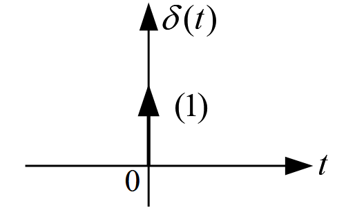
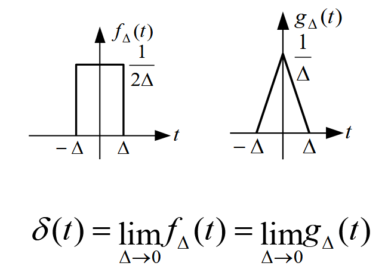

## 信号基本概念

信息的表现形式与传送载体

## 信号分类

$$
\begin{array}{c}
\left\{
\begin{array}{l}
\text{确定信号：能够用函数表示的} \\
\text{随机信号：不能用函数表示但是可以有确定的概率分布}
\end{array}
\right.
\end{array}
$$

$$
\begin{array}{c}
\left\{
\begin{array}{l}
\text{连续信号：时间连续采样，常见为模拟信号（取值也需要连续）} \\
\text{离散信号：时间离散采样}
\end{array}
\right.
\end{array}
$$

**能量与功率**

对连续信号 $f(t)$, 

$$
W = \lim_{T \to \infty} \int_{-T/2}^{T/2}f^2(t) \mathrm{d}t \qquad P = \lim_{T \to \infty} \frac{1}{T}\int_{-T/2}^{T/2}f^2(t)
$$

对离散信号 $f[k]$,

$$
W = \lim_{N \to \infty} \sum_{-N}^{N}f^2[k] \qquad P = \lim_{N \to \infty}\frac{1}{2N + 1} \sum_{-N}^{N}f^2[k]
$$

有定义

$$
\begin{array}{c}
\left\{
\begin{array}{l}
\text{能量信号：功率为 0 而能量有限} \\
\text{功率信号：能量发散而功率有限}
\end{array}
\right.
\end{array}
$$

> 直流信号与周期信号都是功率信号。

## 常用的连续时间信号

### 典型普通信号

**直流信号** $f(t) = A$

**实指数信号** $\displaystyle f(t) = A\mathrm{e}^{\alpha t}, \alpha \in \mathbb{R}$

**虚指数信号** $\displaystyle f(t) = A\mathrm{e}^{\mathrm{j}\omega_0 t}$ 为周期为 $\displaystyle T_0 = \frac{2\pi}{\vert \omega_0 \vert}$ 的周期信号

**复指数信号** $\displaystyle f(t) = A\mathrm{e}^{(\sigma + \mathrm{j}\omega_0) t}$

**抽样信号(Sa 信号)** $\displaystyle \mathrm{Sa}(t) = \frac{\sin x}{x}$ 有性质 $\displaystyle \int_{-\infty}^{\infty}\mathrm{Sa}(t)\mathrm{d}t = 1$, 相似的有 $\displaystyle \mathrm{sinc}(t) = \frac{\sin \pi x}{\pi x}$.

### 奇异信号

**单位跃阶信号** 

$\displaystyle u(x) = \begin{cases}1 & t > 0 \\ 0 & t < 0\end{cases}$, $t = 0$ 时不做定义与考虑.

??? remarks "单位跃阶信号的作用"
    1. 表示方波脉冲信号: $f(t) = u(t - T) - u(t - 2T)$
    2. 表示其它信号的范围: $f(t) = \sin \omega_0 t \cdot u(t)$

**冲激信号**

用于表示极短但是很强的信号，常用 Dirac 定义:

$$
\begin{cases}
    \displaystyle \delta(t) = 0, & t \neq 0 \\
    \displaystyle \int_{-\infty}^{\infty}\delta(t) \mathrm{d}t = 1 &
\end{cases}
$$

图示：{ style="width:300px" }

有两种极限模型：{ style="width:300px" }

性质：

1. 筛选特性: $f(t)\delta(t - t_0) = f(t_0)\delta(t - t_0)$
2. 取样特性: $\displaystyle \int_{-\infty}^{\infty}f(t)\delta(t - t_0)\mathrm{d}t = f(t_0)$ (卷积特性 $\displaystyle \int_{-\infty}^{\infty}f(\tau)\delta(t - \tau)\mathrm{d}\tau = f(t)$)
3. 展缩特性: $\displaystyle \delta(\alpha t) = \frac{1}{|\alpha|}\delta(t)\Rightarrow \delta(t)$ 是偶函数
4. $\displaystyle \frac{\mathrm{d}u(t)}{\mathrm{d} t} = \delta (t)$

**斜坡信号**

$$
r(t) = \begin{cases}t, &\quad t > 0 \\ 0, &\quad t < 0\end{cases}
$$

$$
r(t) = \int_{-\infty}^{t}u(\tau) \mathrm{d}\tau
$$

**冲激偶信号**

$$
\delta'(t) = \frac{\mathrm{d}\delta(t)}{\mathrm{d}t}
$$

是奇函数

!!! remarks "正交信号"
    两个信号乘积的积分为 0