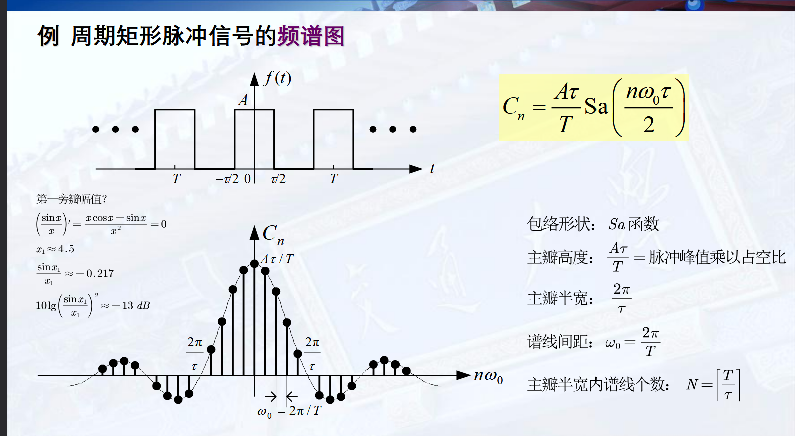
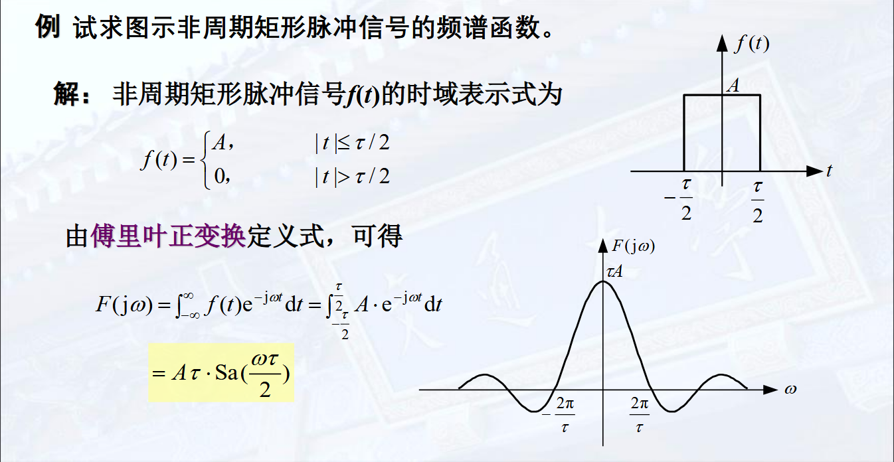

我们发现，指数信号经过 LTI 系统之后仍然为指数信号，仅系数发生变化。

例如，$\mathrm{e}^{\mathrm{j} \omega t}$ 经过系统 $h(t)$, 结果为

$$
y(t) = \int_{-\infty}^{\infty} \mathrm{e}^{\mathrm{j} \omega \tau}h(\tau) \mathrm{d}\tau = \mathrm{e}^{\mathrm{j} \omega t} \int_{-\infty}^\infty h(\tau) \mathrm{e}^{-\mathrm{j} \omega t}\mathrm{d}t = H(\mathrm{j} \omega)\cdot \mathrm{e}^{\mathrm{j} \omega t}
$$

我们把 $\displaystyle H(\mathrm{j} \omega) = \int_{-\infty}^\infty h(\tau) \mathrm{e}^{-\mathrm{j} \omega t}\mathrm{d}t$ 称为 $h(t)$ 的傅里叶变换 (一个与 $t$ 无关的常数)。  
在实际求解中，不用显式地求 $H(s)$, 而是用其它方法求得。

## 信号的频域分解

由上面的思路，将输入 $f$ 分解成指数信号的线性组合，即可更加方便地求得。

平稳的信号 (周期信号) 分解为虚指数信号 $\mathrm{e}^{\mathrm{j} \omega t}$ 的组合 --> 傅里叶变换  
截断或者发散的信号 分解为复指数信号 $\mathrm{e}^{st}$ 的组合 --> 拉普拉斯变换

### 周期信号的傅里叶级数展开

周期为 $\displaystyle T = \frac{2\pi}{\omega}$ 的连续时间周期信号 $f$, 可以展开为指数函数集 $\{\exp(\mathrm{j}n\omega t)\}, n = 0, \pm 1, \pm 2, \ldots$ 的线性组合，即**指数形式的傅里叶级数** 

$$
\sum_{n = -\infty}^{\infty}C_n \exp(\mathrm{j}n\omega t)
$$

该指数函数集具有**正交性**：$\displaystyle \int_T \mathrm{e}^{\mathrm{j}n\omega t} \mathrm{e}^{\mathrm{j}m\omega t}\mathrm{d} t = \begin{cases}T ,& n = m \\ 0, & n \neq m\end{cases}$

为求 $C_n$, 计算积分

$$
\int_T f(t) \mathrm{e}^{-\mathrm{j}n\omega t}\mathrm{d}t = \sum_kC_k \int_T \mathrm{e}^{-\mathrm{j}n\omega t} \mathrm{e}^{\mathrm{j}k\omega t}\mathrm{d} t = C_nT
$$

即可，$\displaystyle C_n = \frac{1}{T}\int_T f(t) \mathrm{e}^{-\mathrm{j}n\omega t}\mathrm{d}t$

!!! remarks "符号解释"
    $\displaystyle \int_T$ 为任意长度为 $T$ 区间上的积分

作为信号，我们称 $\omega$ 为**基波角频率**， $\displaystyle f = \frac{\omega}{2\pi}$ 为**基波频率**， $C_0$ 为**直流分量**  
$n = \pm N$ 的基波频率为 $Nf$, 两项合起来为信号的 $N$ 次谐波分量。

#### 实信号展开为三角形式傅里叶级数

若 $f$ 为实函数，有

$$
\begin{aligned}
f(t) &= C_0 + \sum_{n = 1}^{\infty}C_n \mathrm{e}^{\mathrm{j}n\omega t} + \sum_{n = -\infty}^{-1}C_n \mathrm{e}^{\mathrm{j}n\omega t} \\
&= C_0 + \sum_{n = 1}^{\infty}\left(C_n \mathrm{e}^{\mathrm{j}n\omega t} + C_{-n}\mathrm{e}^{-\mathrm{j}n\omega t}\right)
\end{aligned}
$$

令 $\displaystyle C_n = \frac{a_n - \mathrm{j}b_n}{2}$，则 $\displaystyle C_{-n} = \frac{a_n + \mathrm{j}b_n}{2}$，原式化为

$$
\begin{aligned}
f(t) &= \frac{a_0}{2} + \sum_{n = 1}^{\infty}\left( a_n \cos n \omega t + b_n \sin n \omega t\right) \\
&=\frac{a_0}{2} + \sum_{n = 1}^\infty A_n \cos (n\omega t + \varphi)
\end{aligned}
$$

后者被称为**带初始相位的纯余弦形式**

#### 周期信号可以展开为傅里叶级数的充分条件

**Dirichlet 条件**:  
- 在任何周期内绝对可积  
- 在一个周期内只有有限个有限的不连续点，且这些不连续点的值有限  
- 在一个周期内只有有限个极大值和极小值

**Gibbs 现象**

傅里叶级数在逼近方波信号的时候会出现在间断点出现非一致收敛；但是能依能量收敛。

#### 实信号的频谱及其特征

对相同周期的周期信号，傅里叶级数的各个谐波频率是相同的，只有 $C_n$ 不同，因此仅用 $C_n$ 即可研究周期函数的全部性质。我们把 $C_n$ (关于 $n$/频率 的函数 ) 称为**频谱函数**

对于指数形式傅里叶级数，$C_n = \vert C_n \vert \exp(\mathrm{j} \varphi_n)$, 分别称为**幅度频谱** 和 **相位频谱**  
对于实信号的纯余弦形式 $f = a_0 / 2 + \sum A_n\cos(n\omega t + \varphi_n)$, 分别称为**幅度频谱 ($a_0 / 2, A_n$)** 和 **相位频谱 ($\varphi$)**

!!! examples "一些例子"
    

**Parseval 功率守恒定理** 

$$
P = \frac{1}{T}\int_T \vert f(t) \vert^2\mathrm{d}t = \sum_{n = -\infty}^{\infty}\vert C_n\vert^2
$$

代入指数形式傅里叶级数并且展开即可.  
物理意义：任意周期信号的平均功率 (一般不考虑瞬时功率) 等于信号所包含的直流、基波以及各次谐波的平均功率之和。

$\vert C_n \vert^2$ 随 $n\omega$ 称为周期信号的**功率频谱** (一般仪器的结果)

!!! examples "例题"
      
    这里有效带宽包含负的频率，也即要计算 $[-40\pi, +40\pi]$ 的所有 $C_n$ 的平方和

    $$
    \mathrm{Sa}^2\left(\frac{n\pi}{5}\right) = 25 P_f = 5
    $$

    上面的例子在各种 $\tau / T$ (占空比) 中，有效带宽的谐波分量平均功率基本都在 $90\%$ 左右。

### 连续非周期信号的频谱

我们发现，当周期 $T$ 不断增加的时候，$\omega_0$ 减小。谐波之间的频率间隔为 $\displaystyle \Delta f = \frac{1}{T}$, 则在频率为 $n\omega_0$ 谐波处**单位频率的谐波振幅为** $\displaystyle\rho(n\omega_0) = C_n / \Delta f = TC_n = \int_T f_T(t)\exp(-\mathrm{j}n\omega_0 t) \mathrm{d}t$ 与 $T$ 无关！  

#### 傅里叶变换和频谱函数

因此如果我们把非周期函数表示为周期为无穷大的函数，则 $\omega$ 变成 $0$, 谐波频率连续，在 $\omega$ 处的谐波振幅密度为 $\rho(\omega) = \int_T f_T(t) \exp(-\mathrm{j}\omega t)\mathrm{d}t$

$$
F(\mathrm{j} \omega) = \int_{-\infty}^{\infty} f(t) \exp(-\mathrm{j}\omega t) \mathrm{d}t
$$

$F(\mathrm{j}\omega)$ 是单位频率上的信号频谱，称为非周期信号的**频谱密度函数**，简称**频谱函数**

!!! remarks "傅里叶变换和傅里叶级数之间的关系"
    取 $f(t) \leftrightarrow F(\mathrm{j}\omega)$, $f_T(t)$ 是 $f(t)$ 的周期性延拓。则有

    $$
    f_T(t) = f(t) \otimes \sum_{n}\delta(t - nT)
    $$

    因此

    $$
    f_T(t) \leftrightarrow F(\mathrm{j}\omega)\omega_0 \delta(\omega - n\omega_0)
    $$

    代入傅里叶反变换表达式，有

    $$
    \begin{align}
        f_T(t) &= \frac{1}{2\pi} \int_{\omega} \omega_0 \sum_n F(\mathrm{j}\omega)\delta(\omega - n\omega_0) \cdot \mathrm{e}^{\mathrm{j}\omega t} \mathrm{d}\omega \\
        &= \frac{1}{T}\sum_n F(\mathrm{j}n\omega_0)\mathrm{e}^{\mathrm{j}n\omega_0 t}
    \end{align}
    $$

    另一种计算方法：

    $$
    \begin{align}
        F(\mathrm{j}n\omega_0) = \frac{F_T(\mathrm{j}\omega)}{\displaystyle\omega_0\sum_n\delta(\omega - n\omega_0)} = \frac{\displaystyle 2\pi\sum_nF_n\delta(\omega - n\omega_0)}{\displaystyle\omega_0\sum_n\delta(\omega - n\omega_0)} = TF_n
    \end{align}
    $$

    在傅里叶变换中，我们使用 $F_n$ 代替 $C_n$ 做记号，表示 $f_T(t)$ 的傅里叶级数的系数

    满足关系：

    $$
    \begin{cases}
        F(\mathrm{j}n\omega_0) = \lim_{T \to \infty} TF_n \\
        \displaystyle F_n = \frac{F(\mathrm{j}\omega)}{T} \Bigg\vert_{\omega = n\omega_0}
    \end{cases}
    $$

    这里 $F_n$ 对应的函数是原非周期函数通过周期为 $T$ 的重复相加而来的.

    可见，信号在时域进行周期性延拓，延拓信号的频谱是原信号频谱的冲激序列采样

!!! examples "例题"
      
    求该周期信号的傅里叶级数.

    由于单个峰的函数值可以表示为 $G_2(1) \otimes G_2(1)$, 得到其傅里叶变换 $F(\mathrm{j}\omega) = 4\mathrm{Sa}^2(\omega)$. 根据上面的式子, 

    $$
    F_n = \frac{F(\mathrm{j}\omega)}{T} \Bigg\vert_{\omega = n\omega_0} = \frac{2}{3}\mathrm{Sa}^2\left(\frac{\pi}{3}\right)
    $$

#### 傅里叶反变换

由上面的性质，

$$
f(t) = \lim_{T \to \infty} \sum_{n = -\infty}^{\infty}\frac{F(\mathrm{j}n\omega_0)}{T}\exp(\mathrm{j}n\omega_0 t) = \lim_{\omega \to 0^+}\sum_{n = -\infty}^{\infty}\frac{\omega_0}{2\pi}F(\mathrm{j}n\omega_0)\exp(\mathrm{j}n\omega_0 t) = \frac{1}{2\pi}\int_{-\infty}^{\infty}F(\mathrm{j}\omega)\exp(\mathrm{j}\omega t)\mathrm{d}\omega
$$

可以用符号记为 $\displaystyle f(t) \overset{F}{\longleftrightarrow}{F(\mathrm{j}\omega)}$

!!! examples "例题"
    

    最好也要记忆一下！

!!! remarks "一些性质"
    1. 信号在时域有限，则在频域将无限延续  
    2. 矩形信号的频谱分量主要集中在零频到第一个过零点之间 (主瓣)，工程中往往将此宽度作为有效带宽。  
    3. 脉冲宽度 $\tau$ 越窄，有限带宽越宽，高频分量越多。即信号信息量大、传输速度快，传送信号占用的频带越宽。  
    4. 偶函数的傅里叶变换为偶的实函数，奇函数的傅里叶变换为奇的纯虚函数  
    5. $f \rightarrow F(\mathrm{j}\omega) \Rightarrow f' \rightarrow F(\mathrm{j}\omega)\cdot \mathrm{j}\omega$

!!! remarks "常见非周期信号的频谱"
    **单边指数信号** $f(t) = \mathrm{e}^{-at}u(t)$, 有 $\displaystyle F(\mathrm{j}\omega) = \frac{1}{a + \mathrm{j\omega}}$  
    **双边指数信号** $f(t) = \mathrm{e}^{-a \vert t \vert}$, 有 $\displaystyle F(\mathrm{j}\omega) = \frac{1}{a + \mathrm{j\omega}} + \frac{1}{a - \mathrm{j\omega}} = \frac{2a}{a^2 + \omega^2} \in \mathbb{R}$  
    
    ??? normal-comment "数学"
    
        $$
        f(t) = \frac{1}{2\pi}\int_{-\infty}^{\infty}\frac{2a}{a^2 + \omega^2}\exp(\mathrm{j}\omega t)\mathrm{d}\omega
        $$
        
        取 $t = 0$ 有
        
        $$
        f(1) = \mathrm{e}^{-a} = \frac{1}{2\pi}\int_{-\infty}^{\infty}\frac{2a}{a^2 + x^2}\mathrm{d}x
        $$
    
    **单位冲激信号** $f(t) = \delta(t)$, 有 $F(\mathrm{j}\omega) = 1$ 与 $\omega$ 无关！  
    **冲激偶信号** $f(t) = \delta'(t)$, 有 $F(\mathrm{j}\omega) = \mathrm{j}\omega$  
    **直流信号**  $f(t) = 1$, 由于 $\displaystyle \frac{1}{2\pi} \int_{-\infty}^{\infty}2\pi \delta(\omega) \exp(\mathrm{j}\omega t)\mathrm{d}t = 1$, 有 $F(1) = 2\pi \delta(\omega)$
    **符号函数信号** 由于 $\displaystyle F(\mathrm{sgn}(t)\exp(-\sigma \vert t \vert)) = - \frac{1}{\sigma - \mathrm{j}\omega} + \frac{1}{\sigma + \mathrm{j}\omega}$, 令 $\sigma = 0$ 有 $\displaystyle F(\mathrm{sgn}(t)) = \frac{2}{\mathrm{j}\omega}$ 为奇的纯虚函数  
    **单位阶跃信号** $u(t) = 1/2 + 1/2 \cdot \mathrm{sgn}(t)$, 由傅里叶变换的线性性，$\displaystyle F(u(t)) = \pi \delta(\omega) + \frac{1}{\mathrm{j}\omega}$ (不要忘记 $1/2$ 的傅里叶变换！)

!!! remarks "常见周期信号的频谱"
    **虚指数信号 $\mathrm{e}^{\mathrm{j}\omega t}$**: 注意到 $\displaystyle \int_{-\infty}^{\infty}1 \cdot \exp(-\mathrm{j} \omega t\mathrm{d}t = 2\pi \delta(\omega)$, 有 $\displaystyle F(\mathrm{e}^{\mathrm{j}\omega t}) = \int_{-\infty}^{\infty}1 \cdot \exp(-\mathrm{j} (\omega - \omega_0) t)\mathrm{d}t = 2\pi \delta (\omega - \omega_0)$  
    **余弦信号** $F(\cos \omega_0 t) = \pi (\delta(\omega - \omega_0) + \delta(\omega + \omega_0)))$  
    **正弦信号** $F(\sin \omega_0 t) = \mathrm{j}\pi(\delta(\omega + \omega_0) - \delta(\omega - \omega_0))$  
    **一般周期信号** $\displaystyle f_T(t) = \sum_{n = -\infty}^{\infty}F_n \exp(\mathrm{j}n\omega_0 t), \omega_0 = \frac{2\pi}{T}$, 有 $\displaystyle F(f_T(t)) = \sum_{n = -\infty}^{\infty}F_n F(\mathrm{e}^{\mathrm{j}n\omega_0 t})$  
    **单位冲激序列** $\displaystyle\delta_T(t) = \sum_{n = -\infty}^{\infty}\delta(t - nT) = \frac{1}{T}\sum_{n = -\infty}^{\infty}\mathrm{e}^{\mathrm{j}n\omega_0 t}$, 有 $\displaystyle F(\delta_T(t)) = \omega_0 \sum_{n = -\infty}^{\infty} \delta(\omega - n\omega_0)$ 在傅里叶变换下形状不变！

## 傅里叶变换的性质

#### 线性性 

(不写了)  

#### 时域卷积特性

若 $\displaystyle f_1(t) \overset{F}{\longleftrightarrow}{F_1(\mathrm{j}\omega)}, f_2(t) \overset{F}{\longleftrightarrow}{F_2(\mathrm{j}\omega)}$, 有

$$
\begin{align}
F(f_1(t) \otimes f_2(t)) &= \int_{-\infty}^{\infty} \left[ \int_{-\infty}^{\infty} 
f_1(\tau) f_2(t - \tau)\,\mathrm{d}\tau \right] 
\mathrm{e}^{-\mathrm{j}\omega t}\,\mathrm{d}t \\[6pt]
&= \int_{-\infty}^{\infty} f_1(\tau)
\left [ \int_{-\infty}^{\infty} 
f_2(t - \tau)\,\mathrm{e}^{-\mathrm{j}\omega t}\,\mathrm{d}t \right]
\mathrm{d}\tau \\[6pt]
&= \int_{-\infty}^{\infty} 
f_1(\tau) F_2(\mathrm{j}\omega)\,
\mathrm{e}^{-\mathrm{j}\omega \tau}\,\mathrm{d}\tau \\[6pt]
&= F_1(\mathrm{j}\omega)\cdot F_2(\mathrm{j}\omega)
\end{align}
$$

!!! remarks "傅里叶变换将时域卷积转换成频域相乘！"

!!! remarks "还有一种理解方法"
    $$
    \begin{aligned}
    \mathrm{e}^{\mathrm{j}\omega\tau} \otimes h(t)
    &= H(\mathrm{j}\omega)\,\mathrm{e}^{\mathrm{j}\omega t} \\[6pt]
    \frac{1}{2\pi} F(\mathrm{j}\omega)\,\mathrm{e}^{\mathrm{j}\omega t} \otimes h(t)
    &= \frac{1}{2\pi} F(\mathrm{j}\omega) H(\mathrm{j}\omega)\,\mathrm{e}^{\mathrm{j}\omega t} \\[6pt]
    \frac{1}{2\pi} \int F(\mathrm{j}\omega)\,\mathrm{e}^{\mathrm{j}\omega t} \,\mathrm{d}\omega \otimes h(t)
    &= \frac{1}{2\pi} \int F(\mathrm{j}\omega) H(\mathrm{j}\omega)\,\mathrm{e}^{\mathrm{j}\omega t} \,\mathrm{d}\omega \\[6pt]
    f(t)\otimes h(t)
    &= \frac{1}{2\pi} \int F(\mathrm{j}\omega) H(\mathrm{j}\omega)\,
    \mathrm{e}^{\mathrm{j}\omega t}\,\mathrm{d}\omega
    \end{aligned}
    $$

!!! examples "例题"
    

    这里 $\displaystyle G_\tau(t) = \begin{cases}1, &\quad -\tau / 2 \leq t \leq \tau / 2 \\ 0, &\quad \text{others} \end{cases}$ 是门函数  
    三角波信号是方波信号的自身卷积

#### 频域卷积特性 (调制特性)

$$
\begin{aligned}
F[f_1(t)\cdot f_2(t)] 
&= \int_{-\infty}^{\infty} [f_1(t)\cdot f_2(t)]\,\mathrm{e}^{-\mathrm{j}\omega t}\,\mathrm{d}t \\[6pt]
&= \int_{-\infty}^{\infty} f_2(t)\,\mathrm{e}^{-\mathrm{j}\omega t}
\left[ \frac{1}{2\pi} \int_{-\infty}^{\infty} F_1(\mathrm{j}\Omega)\,
\mathrm{e}^{\mathrm{j}\Omega t}\,\mathrm{d}\Omega \right] \mathrm{d}t \\[6pt]
&= \frac{1}{2\pi} \int_{-\infty}^{\infty} F_1(\mathrm{j}\Omega)
\left[ \int_{-\infty}^{\infty} f_2(t)\,
\mathrm{e}^{-\mathrm{j}(\omega-\Omega)t}\,\mathrm{d}t \right] \mathrm{d}\Omega \\[6pt]
&= \frac{1}{2\pi} \int_{-\infty}^{\infty} 
F_1(\mathrm{j}\Omega)\,F_2[\mathrm{j}(\omega-\Omega)]\,\mathrm{d}\Omega
= \frac{1}{2\pi}\,[F_1(\mathrm{j}\omega)\otimes F_2(\mathrm{j}\omega)]
\end{aligned}
$$

!!! remarks "傅里叶变换将时域相乘转换成频域卷积！"

在收音机调制的过程中，载波的频率往往不发生改变，即  $f_2(t) = \exp(\mathrm{j}\omega t)$, 即有：

#### 频移特性

$$
\displaystyle f(t)\cdot \exp(\mathrm{j}\omega t)\overset{F}{\longleftrightarrow}{F(\mathrm{j}(\omega - \omega_0))}
$$

相当于乘以指数信号之后，频谱向右搬移了 $\omega_0$. 推论：

$$
F(f(t)\cos \omega_0 t) = \frac{1}{2}F(\mathrm{j}(\omega - \omega_0) + \frac{1}{2}F(\mathrm{j}(\omega + \omega_0)
$$

!!! examples "例子"

    对于 $f(t) \cos \omega_0$, 其载波频率为 $\omega_0$, 其频谱可以表示为两个 $\mathrm{Sa}$ 函数，可知其频率为 $\omega_0$; 但是在 $\omega_0$ 周围仍旧有频谱值，此现象称为**频率泄露**

#### 展缩特性

$$
\displaystyle f(at) \overset{F}{\longleftrightarrow}{\frac{1}{\vert a \vert}F(\mathrm{j}\frac{\omega}{a})}
$$

该方式不是线性时不变的变换，只能用定义式证明

#### 时移特性

$$
\displaystyle f(t - t_0) \overset{F}{\longleftrightarrow}{F(\mathrm{j}\omega)\cdot \exp(-\mathrm{j} \omega t_0)}
$$

注意到傅里叶变换的指数项 (理解为相位) 的变化随频率增大而增大

!!! remarks "证明"
    $$
    f(t - t_0) = f(t) \otimes \delta(t - t_0) \overset{F}{\longleftrightarrow}{F(\mathrm{j}\omega)\cdot \exp(-\mathrm{j} \omega t_0)}
    $$

#### 互易对称特性

若 $\displaystyle f(t) \overset{F}{\longleftrightarrow}{F(\omega)}$, 则 $\displaystyle F(t) \overset{F}{\longleftrightarrow}{2\pi f(-\omega)}$

!!! examples "例子"

    $$
    \frac{\sin W t}{\pi t} \overset{F}{\longleftrightarrow}{G_{2W}(\omega)}
    $$

    有

    $$
    G_{2W}(\omega) \overset{F}{\longleftrightarrow}{\frac{2\sin W t}{ t}}
    $$

#### 虚实奇偶特性

若 $\displaystyle f(t) \overset{F}{\longleftrightarrow}{F(\omega)}$, 则  
- $\displaystyle f(-t) \overset{F}{\longleftrightarrow}{F(-\omega)}$  
- $\displaystyle \overline{f(t)} \overset{F}{\longleftrightarrow}{\overline{F(-\omega)}}$  
- 当 $f(t) \in \mathbb{R}$ 时, $F(\omega) = \overline{F(-\omega)}$, 也即 $F(\omega)$ 的实部和模长是偶函数，虚部和辐角是奇函数.

#### 时域微分特性

$$
\begin{aligned}
\frac{\mathrm{d}f(t)}{\mathrm{d}t} &\overset{F}{\longleftrightarrow}{(\mathrm{j}\omega) \cdot f(\mathrm{j}\omega)} \\
\frac{\mathrm{d}^n f(t)}{\mathrm{d}t^n} &\overset{F}{\longleftrightarrow}{(\mathrm{j}\omega)^n \cdot f(\mathrm{j}\omega)}
\end{aligned}
$$

!!! remarks "使用冲激偶信号证明"
    由于 $f'(t) = f(t) \otimes \delta'(t)$ 且 $\delta'(t) \overset{F}{\longleftrightarrow}{\mathrm{j}\omega}$ 即证.

!!! examples "例题"
      
    只要若干次导数得到冲激信号即可用此方法求得傅里叶变换

#### 积分特性

若 $\displaystyle f(t) \overset{F}{\longleftrightarrow}{F(\mathrm{j}\omega)}$, 

$$
\begin{aligned}
&\int_{-\infty}^t f(\tau) \mathrm{d}\tau = f(t) \otimes u(t) \\
&\overset{F}
{\longleftrightarrow}{F(\mathrm{j}\omega)\cdot \left(\frac{1}{\mathrm{j}\omega} + \pi \delta(\omega)\right)} = \frac{1}{\mathrm{j}\omega}F(\mathrm{j}\omega) + \pi F(0)\delta(\omega)
\end{aligned}
$$

#### 频域微分特性

$$
\begin{aligned}
tf(t) &\overset{F}{\longleftrightarrow}{\mathrm{j}\cdot\frac{\mathrm{d}F(\mathrm{j}\omega)}{\mathrm{d}\omega}} \\
t^nf(t) &\overset{F}{\longleftrightarrow}{\mathrm{j}^n\cdot\frac{\mathrm{d}^nF(\mathrm{j}\omega)}{\mathrm{d}\omega^n}}
\end{aligned}
$$

#### 帕什瓦尔能量守恒定理 (Parseval theorem)

$$
\int_{-\infty}^{\infty}\vert f(t)\vert^2\mathrm{d}t = \frac{1}{2\pi}\int_{-\infty}^\infty \vert F(\mathrm{j}\omega)\vert^2 \mathrm{d}\omega
$$

把函数 $\displaystyle G(\omega) = \frac{1}{2\pi} \vert F(\mathrm{j}\omega) \vert^2$ (单位角频率的信号能量) 为**能量频谱密度函数**

!!! remarks "一般地"

    对两个函数 $x(t), y(t)$, 其时域上的内积 $\displaystyle \langle x, y\rangle_t = \int_{-\infty}^{\infty}x(t)\overline{y(t)}\mathrm{d}t$. 则有
    
    $$
    \int_{-\infty}^{\infty}x(t)\overline{y(t)}\mathrm{d}t = \frac{1}{2\pi}\int_{-\infty}^{\infty}X(\omega)\overline{Y(\omega)}\mathrm{d}\omega
    $$
    
    推导
    
    $$
    \begin{align}
    \int_{-\infty}^{\infty} x(t)\,\overline{y(t)}\mathrm{d}t &= \int_{-\infty}^{\infty} x(t)
       \left[\frac{1}{2\pi}\int_{-\infty}^{\infty} \overline{Y(\omega')}e^{-\mathrm{j}\omega' t}\,d\omega'\right] \mathrm{d}t \\
    &= \frac{1}{2\pi}\int_{-\infty}^{\infty} \overline{Y(\omega')}
       \left[\int_{-\infty}^{\infty} x(t)e^{-\mathrm{j}\omega' t}\mathrm{d}t\right] \mathrm{d}\omega' \notag\\
    &= \frac{1}{2\pi}\int_{-\infty}^{\infty} \overline{Y(\omega')}X(\omega')\mathrm{d}\omega'
    \end{align}
    $$

!!! examples "例题"
    计算 $\displaystyle \int_{-\infty}^{\infty}\mathrm{Sa}^2(t)\mathrm{d}t$.
    
    由于 $\mathrm{Sa}(t) \overset{F}{\longleftrightarrow}{\pi G_2(\omega)}$, 
    
    $$
    \int_{-\infty}^{\infty}\mathrm{Sa}^2(t)\mathrm{d}t = \frac{1}{2\pi} \int_{-\infty}^{\infty}\vert \pi G_2(\omega)\vert^2\mathrm{d}\omega = \frac{1}{2\pi} \int_{-1}^1 \pi^2 \mathrm{d}\omega = \pi
    $$
    
    计算 $\displaystyle \int_{-\infty}^{\infty}\mathrm{Sa}(t)\mathrm{d}t$
    
    相当于 $\omega = 0$ 的直流分量，
    
    $$
    \int_{-\infty}^{\infty}\mathrm{Sa}(t)\mathrm{d}t = \pi G_2(0) = \pi
    $$

## 离散信号的频域分析

### 离散周期信号的傅里叶级数 (DFS)

对于周期为 $N$ 的周期信号 $x[n]$, 有

$$
\begin{cases}
\displaystyle x[n] &= \sum_{k = \langle N \rangle}a_k \exp(\mathrm{j}\frac{2\pi}{N}kn) \\
\displaystyle a_k &= \frac{1}{N}\sum_{n = \langle N \rangle}x[n]\exp(-\mathrm{j}\frac{2\pi}{N}kn)
\end{cases}
$$

由此可见离散时间周期信号的频谱是周期的 ($N$)

!!! examples "例题"
    考虑一个方波信号，其周期为 $N$ ，持续时间为 $2N_1+1$, 有 

    $$
    \begin{align}
    a_k &= \frac{1}{N}\sum_{n = -N_1}^{N_1}\exp (-\mathrm{j} \frac{2 \pi}{N}kn) \\
    &= \begin{cases}
    \displaystyle \frac{2N_1 + 1}{N} & \quad k = 0, \pm N, \pm 2N, \ldots \\
    \displaystyle \frac{1}{N}\frac{\displaystyle\sin \frac{\pi}{N}k(2N_1 + 1)}{\displaystyle\sin \frac{\pi}{N}k} & \quad k \neq 0, \pm N, \pm 2N, \ldots 
    \end{cases}
    \end{align}
    $$
    
    包络具有 $\displaystyle \frac{\sin \beta x}{\sin x}$ 的形状

### 离散时间非周期信号的傅里叶变换

类似连续时间信号我们给出傅里叶变换 (DTFT) 和反变换：

$$
\begin{align}
X(\mathrm{e}^{\mathrm{j}\omega }) &= \sum_{n = -\infty}^\infty x[n]\mathrm{e}^{-\mathrm{j}\omega n} \\
x[n] &= \frac{1}{2\pi} \int_{-\pi}^{\pi}X(\mathrm{e}^{\mathrm{j}\omega})\mathrm{e}^{\mathrm{j}\omega n} \mathrm{d}\omega
\end{align}
$$

离散时间序列 $x[n]$ 可以分解为频率在 $2\pi$ 区间上分布的、幅度为 $\displaystyle \frac{1}{2\pi}X(\mathrm{e}^{\mathrm{j}\omega }) \mathrm{d}\omega$ 的负指数分量的线性组合.

#### 离散时间非周期信号傅里叶变换的收敛问题

当 $x[n]$ 是无限长序列时，$X(\mathrm{e}^{\mathrm{j}\omega })$ 作为无限长级数有收敛问题

两个充分条件：

若 $x[n]$ 绝对可和，则 $x[n]$ 的傅里叶变换存在且一致收敛于 $X(\mathrm{e}^{\mathrm{j}\omega })$ --> 幅度差 $\to 0$  
若 $x[n]$ 不绝对可和，而是平方可和，则其傅里叶变换以均方差为零的方式收敛于 $X(\mathrm{e}^{\mathrm{j}\omega })$ --> 能量差 $\to 0$

!!! remarks "常用信号的离散时间傅立叶变换"

    **单位冲激信号** $x[n] = \delta[n]$, 有 $X(\mathrm{e}^{\mathrm{j}\omega }) = 1$, $\delta[n - n_0] \overset{F}{\longleftrightarrow}{\mathrm{e}^{- \mathrm{j}\omega n_0}}$  
    **矩形脉冲** 宽度为 $2N_1$ 时，有 $\displaystyle X(\mathrm{e}^{\mathrm{j}\omega }) = \frac{\sin(2N_1 + 1)\omega / 2}{\sin \omega / 2}$  
    **实指数序列** $x[n] = a^n u[n], \vert a \vert < 1$，有 $\displaystyle X(\mathrm{e}^{\mathrm{j}\omega }) = \frac{\mathrm{e}^{\mathrm{j}\omega}}{\mathrm{e}^{\mathrm{j}\omega} - a}$. 其模长和相位 $\displaystyle \vert X(\mathrm{e}^{\mathrm{j}\omega })\vert = 1 / \sqrt{1 + a^2 - 2a \cos \omega},\ \arg X(\mathrm{e}^{\mathrm{j}\omega }) = -\arctan \frac{a \sin \omega}{1 - a\cos \omega}$  
    **非因果实指数序列** $x[n] = a^n u[-n], \vert a \vert > 1$，有 $\displaystyle X(\mathrm{e}^{\mathrm{j}\omega }) = \frac{1}{1 - a^{-1}\mathrm{e}^{\mathrm{j}\omega}}$  
    **双边指数序列** $x[n] = a^{\vert n\vert}, \vert a \vert > 1$，有 $\displaystyle X(\mathrm{e}^{\mathrm{j}\omega }) = \frac{a\mathrm{e}^{\mathrm{j}\omega}}{1 - a\mathrm{e}^{-\mathrm{j}\omega}} + \frac{1}{1 - a\mathrm{e}^{\mathrm{j}\omega}} = \frac{1 - a^2}{1 + a^2 - 2a \cos \omega}$  
    **常数序列** $x[n] = 1$, 有 $\displaystyle X(\mathrm{e}^{\mathrm{j}\omega }) = 2\pi \sum_{n = -\infty}^\infty \delta (\omega - 2\pi k)$ 是以 $2\pi$ 为周期的冲激串  
    **周期为 $N$ 的单位样值序列** $\displaystyle \delta_N[n] = \sum_{k = -\infty}^\infty \delta[n - kN]$, 有 $\displaystyle X(\mathrm{e}^{\mathrm{j}\omega }) = \frac{2\pi }{N}\sum_{k = -\infty}^{\infty}2\pi \delta \left(\omega - \frac{2\pi}{N}k\right)$. (1)  
    **离散时间周期指数信号** $x[n] = \mathrm{e}^{\mathrm{j}\omega n}$，有 $\displaystyle X(\mathrm{e}^{\mathrm{j}\omega }) = \sum_{k = -\infty}^{\infty} 2\pi \delta(\omega - \omega_0 - 2\pi k)$  
    **离散时间余弦信号** $x[n] = \cos \omega_0 n$, 有 $\displaystyle X(\mathrm{e}^{\mathrm{j}\omega }) = \pi \sum_{k = -\infty}^{\infty} \delta(\omega + \omega_0 - 2\pi k) + \delta(\omega - \omega_0 - 2\pi k)$
    { .annotate}
    
    1.  计算时先算傅里叶级数 $\displaystyle \delta_N[n] = \frac{1}{N}\sum_{k = 0}^{N - 1}\exp\left(-\mathrm{j} \frac{2 \pi k}{N}n\right)$, 然后两边傅里叶变换即可

#### 离散时间非周期信号傅里叶变换的性质

_这里只写不同点_

**时移和频移**

若 $x[n] \longleftrightarrow X(\mathrm{e}^{\mathrm{j}\omega})$

$$
\begin{cases}
x[n - n_0] &\longleftrightarrow X(\mathrm{e}^{\mathrm{j}\omega})\mathrm{e}^{-\mathrm{j}\omega n_0} \\
x[n]\mathrm{e}^{\mathrm{j}\omega n_0} &\longleftrightarrow X(\mathrm{e}^{\mathrm{j}(\omega - \omega_0)})
\end{cases}
$$

**时间反转**

$$
X[-n] \longleftrightarrow X(\mathrm{e}^{-\mathrm{j}\omega})
$$

!!! example "滑动平均"
    把信号和高度为 1 的窗口卷积，能够使信号变得平滑。  
    表现在频谱上，表现为高频信号频谱减小，低频信号频谱增加。

**频域微分**

$$
\frac{\mathrm{d}X(\mathrm{e}^{\mathrm{j}\omega})}{\mathrm{d}\omega} = \sum_{n = -\infty}^{\infty}x[n](-\mathrm{j}n)\mathrm{e}^{-\mathrm{j}\omega n}
$$
