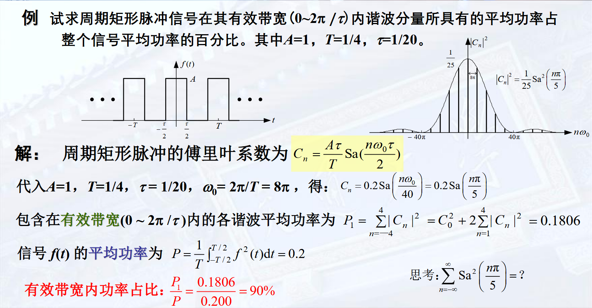

我们发现，指数信号经过 LTI 系统之后仍然为指数信号，仅系数发生变化。

例如，$\mathrm{e}^{j \omega t}$ 经过系统 $h(t)$, 结果为

$$
y(t) = \int_{-\infty}^{\infty} \mathrm{e}^{j \omega \tau}h(\tau) \mathrm{d}\tau = \mathrm{e}^{j \omega t} \int_{-\infty}^\infty h(\tau) \mathrm{e}^{-j \omega t}\mathrm{d}t = H(j \omega)\cdot \mathrm{e}^{j \omega t}
$$

我们把 $\displaystyle H(j \omega) = \int_{-\infty}^\infty h(\tau) \mathrm{e}^{-j \omega t}\mathrm{d}t$ 称为 $h(t)$ 的傅里叶变换 (一个与 $t$ 无关的常数)。  
在实际求解中，不用显式地求 $H(s)$, 而是用其它方法求得。

## 信号的频域分解

由上面的思路，将输入 $f$ 分解成指数信号的线性组合，即可更加方便地求得。

平稳的信号 (周期信号) 分解为虚指数信号 $\mathrm{e}^{j \omega t}$ 的组合 --> 傅里叶变换  
截断或者发散的信号 分解为复指数信号 $\mathrm{e}^{st}$ 的组合 --> 拉普拉斯变换

### 周期信号的傅里叶级数展开

周期为 $\displaystyle T = \frac{2\pi}{\omega}$ 的连续时间周期信号 $f$, 可以展开为指数函数集 $\{\exp(jn\omega t)\}, n = 0, \pm 1, \pm 2, \ldots$ 的线性组合，即**指数形式的傅里叶级数** 

$$
\sum_{n = -\infty}^{\infty}C_n \exp(jn\omega t)
$$

该指数函数集具有**正交性**：$\displaystyle \int_T \mathrm{e}^{jn\omega t} \mathrm{e}^{jm\omega t}\mathrm{d} t = \begin{cases}T ,& n = m \\ 0, & n \neq m\end{cases}$

为求 $C_n$, 计算积分

$$
\int_T f(t) \mathrm{e}^{-jn\omega t}\mathrm{d}t = \sum_kC_k \int_T \mathrm{e}^{-jn\omega t} \mathrm{e}^{jk\omega t}\mathrm{d} t = C_nT
$$

即可

!!! remarks "符号解释"
    $\displaystyle \int_T$ 为任意长度为 $T$ 区间上的积分

作为信号，我们称 $\omega$ 为**基波角频率**， $\displaystyle f = \frac{\omega}{2\pi}$ 为**基波频率**， $C_0$ 为**直流分量**  
$n = \pm N$ 的基波频率为 $Nf$, 两项合起来为信号的 $N$ 次谐波分量。

#### 实信号展开为三角形式傅里叶级数

若 $f$ 为实函数，有

$$
\begin{aligned}
f(t) &= C_0 + \sum_{n = 1}^{\infty}C_n \mathrm{e}^{jn\omega t} + \sum_{n = -\infty}^{-1}C_n \mathrm{e}^{jn\omega t} \\
&= C_0 + \sum_{n = 1}^{\infty}\left(C_n \mathrm{e}^{jn\omega t} + C_{-n}\mathrm{e}^{-jn\omega t}\right)
\end{aligned}
$$

令 $\displaystyle C_n = \frac{a_n - jb_n}{2}$，则 $\displaystyle C_{-n} = \frac{a_n + jb_n}{2}$，原式化为

$$
\begin{aligned}
f(t) &= \frac{a_0}{2} + \sum_{n = 1}^{\infty}\left( a_n \cos n \omega t + b_n \sin n \omega t\right) \\
&=\frac{a_0}{2} + \sum_{n = 1}^\infty A_n \cos (n\omega t + \varphi)
\end{aligned}
$$

后者被称为**带初始相位的纯余弦形式**

#### 周期信号可以展开为傅里叶级数的充分条件

**Dirichlet 条件**:  
- 在任何周期内绝对可积  
- 在一个周期内只有有限个有限的不连续点，且这些不连续点的值有限  
- 在一个周期内只有有限个极大值和极小值

**Gibbs 现象**

傅里叶级数在逼近方波信号的时候会出现在间断点出现非一致收敛；但是能依能量收敛。

#### 实信号的频谱及其特征

对相同周期的周期信号，傅里叶级数的各个谐波频率是相同的，只有 $C_n$ 不同，因此仅用 $C_n$ 即可研究周期函数的全部性质。我们把 $C_n$ (关于 $n$/频率 的函数 ) 称为**频谱函数**

对于指数形式傅里叶级数，$C_n = \vert C_n \vert \exp{j \varphi_n}$, 分别称为**幅度频谱** 和 **相位频谱**  
对于实信号的纯余弦形式 $f = a_0 / 2 + \sum A_n\cos(n\omega t + \varphi_n)$, 分别称为**幅度频谱 ($a_0 / 2, A_n$)** 和 **相位频谱 ($\varphi$)**

!!! examples "一些例子"
    

**Parseval 功率守恒定理** 

$$
P = \frac{1}{T}\int_T \vert f(t) \vert^2\mathrm{d}t = \sum_{n = -\infty}^{\infty}\vert C_n\vert^2
$$

代入指数形式傅里叶级数并且展开即可.  
物理意义：任意周期信号的平均功率 (一般不考虑瞬时功率) 等于信号所包含的直流、基波以及各次谐波的平均功率之和。

$\vert C_n \vert^2$ 随 $n\omega$ 称为周期信号的**功率频谱** (一般仪器的结果)

!!! examples "例题"
      
    这里有效带宽包含负的频率，也即要计算 $[-40\pi, +40\pi]$ 的所有 $C_n$ 的平方和

    $$
    \mathrm{Sa}^2\left(\frac{n\pi}{5}\right) = 25 P_f = 5
    $$

    上面的例子在各种 $\tau / T$ (占空比) 中，有效带宽的谐波分量平均功率基本都在 $90\%$ 左右。

### 连续非周期信号的频谱

我们发现，当周期 $T$ 不断增加的时候，$\omega_0$ 减小。谐波之间的频率间隔为 $\displaystyle \Delta f = \frac{1}{T}$, 则在频率为 $n\omega_0$ 谐波处**单位频率的谐波振幅为** $\displaystyle\rho(n\omega_0) = C_n / \Delta f = TC_n = \int_T f_T(t)\exp{-jn\omega_0 t} \mathrm{d}t$ 与 $T$ 无关！  

#### 傅里叶变换和频谱函数

因此如果我们把非周期函数表示为周期为无穷大的函数，则 $\omega$ 变成 $0$, 谐波频率连续，在 $\omega$ 处的谐波振幅密度为 $\rho(\omega) = \int_T f_T(t) \exp{-j\omega t}\mathrm{d}t$

$$
F(j \omega) = \int_{-\infty}^{\infty} f(t) \exp{-j\omega t} \mathrm{d}t
$$

$F(j\omega)$ 是单位频率上的信号频谱，称为非周期信号的**频谱密度函数**，简称**频谱函数**

!!! remarks "注意"
    在傅里叶变换中，我们使用 $F_n$ 代替 $C_n$ 做记号

    满足关系：

    $$
    \begin{cases}
        F(jn\omega_0) = \lim_{T \to \infty} TF_n \\
        \displaystyle F_n = \frac{F(j\omega)}{T} \Bigg\vert_{\omega = n\omega_0}
    \end{cases}
    $$

#### 傅里叶反变换

由上面的性质，

$$
f(t) = \lim_{T \to \infty} \sum_{n = -\infty}^{\infty}\frac{F(jn\omega_0)}{T}\exp{jn\omega_0 t} = \lim_{\omega \to 0^+}\sum_{n = -\infty}^{\infty}\frac{\omega_0}{2\pi}F(jn\omega_0)\exp{jn\omega_0 t} = \frac{1}{2\pi}\int_{-\infty}^{\infty}F(j\omega)\exp{j\omega t}\mathrm{d}\omega
$$
