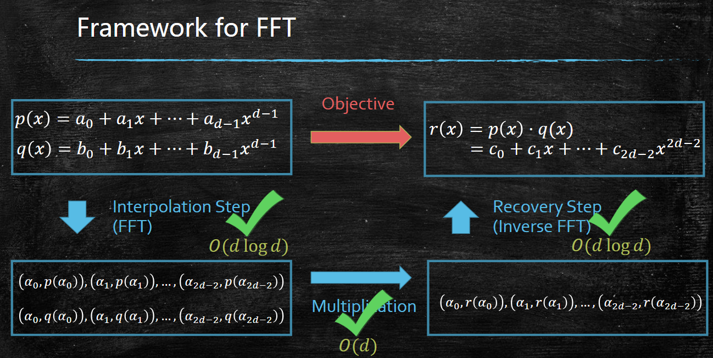

## 数字乘法（Number Multiplication）

- 直接把两个 $n$ 位数各拆分成两部分，递归计算乘积，时间复杂度为 $O(n^2)$；  
- 可以做改进：

$$
xy = ac \cdot 10^n + (ad + bc) \cdot 10^{n / 2} + bd
$$

其中

$$
ad + bc = (a + c)(b + d) - ac - bd
$$

这样可以用 3 次乘法替代原来的 4 次乘法。  
于是其乘法次数的时间复杂度为 $\displaystyle O(3^{\log n}) \approx O(n^{1.6})$。

!!! remarks "如果 $n$ 不是 2 的幂怎么办？"
    在高位补 $0$ 即可。

**Karatsuba 算法**

$$
T(n) = 3T\left(\frac{n}{2}\right) + O(n)
$$

> 更精确地说，由于 $a + b, c + d$ 可能是 $(2n + 1)$ 位长（存在进位），$3T(n / 2)$ 应该写成 $3T(n / 2 + 1)$。

展开递推：

$$
\begin{aligned}
T(n) &= 3\Bigg( 3T\!\left(\frac{n}{4}\right) + c \cdot \frac{n}{2} \Bigg) + cn 
     = 3^2 T\!\left(\frac{n}{4}\right) + cn\left(1 + \frac{3}{2}\right) \\[6pt]
     &= 3^3 T\!\left(\frac{n}{2^3}\right) + cn\left(1 + \frac{3}{2} + \left(\frac{3}{2}\right)^2\right) \\[6pt]
     &= 3^4 T\!\left(\frac{n}{2^4}\right) + cn\left(1 + \frac{1}{2} + \left(\frac{3}{2}\right)^2 + \left(\frac{3}{2}\right)^3\right) \\[6pt]
     &\ \ \vdots \\[6pt]
     &= 3^{\log_2 n}T(1) 
        + cn\left(1 + \frac{1}{2} + \left(\frac{3}{2}\right)^2 + \left(\frac{3}{2}\right)^3 + \cdots 
        + \left(\frac{3}{2}\right)^{\log_2 n - 1}\right) \\[6pt]
     &= O\!\left(n^{\log_2 3}\right) + O\!\left(n^{1+\log_2 1.5}\right) 
      = O\!\left(n^{\log_2 3}\right)
\end{aligned}
$$

**更快的乘法算法**

- Toom-Cook：把数拆成 3 段，把 9 次乘法降到 5 次，对应时间复杂度 $O(n^{1.465})$；  
- Schonhage-Strassen：时间复杂度 $O(n \log n \log \log n)$，基于 FFT。

## 矩阵乘法（Matrix Multiplication）

直接按定义计算矩阵乘法，时间复杂度为 $O(n^3)$。

Strassen 的巧妙思路如下。设

$$
\begin{cases}
P_{1} = A(F - H) \\
P_{2} = (A + B)H \\
P_{3} = (C + D)E \\
P_{4} = D(G - E) \\
P_{5} = (A + D)(E + H) \\
P_{6} = (B - D)(G + H) \\
P_{7} = (A - C)(E + F)
\end{cases}
$$

则有

$$
\begin{aligned}
XY &= 
\begin{pmatrix}
A & B \\
C & D
\end{pmatrix}
\begin{pmatrix}
E & F \\
G & H
\end{pmatrix} \\[6pt]
&=
\begin{pmatrix}
AE + BG & AF + BH \\
CE + DG & BF + DH
\end{pmatrix} \\[6pt]
&=
\begin{pmatrix}
P_{5} + P_{4} - P_{2} + P_{6} & P_{1} + P_{2} \\
P_{3} + P_{4} & P_{1} + P_{5} - P_{3} - P_{7}
\end{pmatrix}
\end{aligned}
$$

从而把 8 次矩阵乘法降到了 7 次。

此外还有更快的矩阵乘法算法，例如：

- Strassen：复杂度 $n^\omega, \omega \leq \log_2^7$；  
- Conjecture：对任意 $\varepsilon > 0$，都有 $\omega = 2 + \varepsilon$。

## 排序（Sorting）

（略）

以归并排序为例分析递推式：

$$
T(n) = 2T\left(\frac{n}{2}\right) + O(n)
$$

于是

$$
T(n) \leq 2T(n / 2) + cn \leq 2 B \cdot \frac{n}{2} \log \frac{n}{2} + cn \leq Bn\log n
$$

!!! remarks "基于比较模型的排序下界为 $\Omega(n \log n)$"
    若算法进行了 $K(n)$ 次比较，则可能的比较结果序列共有 $3^{K(n)}$ 种。  
    而待排序的 $n$ 个元素的排列方式共有 $n!$ 种，算法必须能把这些排列全部区分开来，因此

    $$
    3^{K(n)} \geq n! \Rightarrow K(n) \geq \log n!
    $$


## 主定理（Master Theorem）

若递推式形如 $T(n) = aT(n / b) + O(n^d)$，则

$$
T(n) = 
\begin{cases}
\displaystyle O(n^d), &\quad a < b^d \\
\displaystyle O(n^{\log_ba}), &\quad a > b^d \\
\displaystyle O(n^d\log n), &\quad a = b^d
\end{cases}
$$

## 选择问题（Selection Problem）

在 $x_1, \cdots, x_n$ 中寻找第 $k$ 小的数。

一种思路与快速排序类似：任选一个枢轴 $x_0$，把数组分成三部分：  
$L: x < x_0,\ M: x = x_0,\ R: x > x_0$，然后递归地在对应区间继续查找。  
> 但这种方法在最坏情况下时间复杂度为 $O(n^2)$。

**Median of the medians 算法**（1973）

> step1. 将集合 $S$ 按大小为 5 的子集划分（$O(n)$）；  
> step2. 在每个子集中找到中位数，再把这些中位数放在一起，再求它们的中位数（$O(n)$）；  
> step3. 把这个“中位数的中位数”作为 $x_0$（通过递归在所有中位数中找第 $n / 2$ 小的元素，复杂度为 $T(n / 5)$）。

分析：在最坏情况下，大约有 $3n / 10$ 个数大于 $x_0$，即

$$
\text{the-} 3 / 10 \text{-th} \leq x_0 \leq \text{the-} 7 / 10 \text{-th}
$$

（为什么？）

因此有

$$
T(n) = T(n / 5) + T(7n / 10) + O(n)
$$

> 每次迭代之后 $T(n)$ 大致变成 $0.9T(n)$，因此猜测 $T(n) \leq Bn$。

验证这一猜测：

$$
T(n) \leq \frac{1}{5}Bn + \frac{7}{10}Bn + Cn \leq 0.9Bn + Cn \leq Bn
$$

只要 $B \geq 10C$ 即可成立，因此 $T(n) = O(n)$。

!!! remarks "为什么要分成 5 个一组？"

    假设我们把集合按大小为 $t$ 的子集划分，则当 $t$ 为奇数时，有
    
    $$
    x_0 \in \left[\frac{3t - 1}{4t}, \frac{t + 1}{4t}\right]
    $$
    
    因而递推式变为
    
    $$
    T(n) = T(n / t) + T\left(\frac{(3t - 1)n}{4t}\right) + O(n)
    $$
    
    当且仅当
    
    $$
    \frac{1}{t} + \frac{3t - 1}{4t} \leq 1
    $$
    
    即 $t \geq 5$ 时，才能得到 $T(n) = O(n)$。  

    * 若 $t = 3$，则有 $T(n) = O(n \log n)$。*

## 快速排序（Quick Sort）

借助 *Median of the medians* 算法，我们可以用 $O(n)$ 的时间找到中位数，于是

$$
T(n) = 2T(n / 2) + O(n) \Rightarrow T(n) = O(n \log n)
$$

> 不过在实际中，这个算法常数很大，速度并不理想（主要是 *Median of the medians* 本身比较“重”）。

**随机选择枢轴（randomized quick sort）**：

记 $a_i$ 为数组中第 $i$ 小的元素，令

$$
X_{ij} =
\begin{cases}
1, & a_i, a_j \text{ 在排序过程中被比较过} \\
0, & \text{否则}
\end{cases}
$$

并记 $X$ 为总的比较次数，则

$$
\mathbb{E}(X) = \mathbb{E}\left[\sum X_{ij}\right] = \sum \Pr(X_{ij} = 1)
$$

当且仅当 $a_i, a_j$ 被首次选作枢轴的那个数把它们分到了不同分组时，有 $X_{ij} = 0$。  
注意到在算法执行过程中，每个数只会被选作枢轴一次，我们只需关注在 $a_i, a_j$ 之间最先被选出来的那个数。  
因此

$$
\Pr(X_{ij} = 1) = \frac{2}{j - i + 1}
$$

（第一次选出的枢轴刚好是 $a_i$ 或 $a_j$ 的概率）。

于是

$$
\mathbb{E}(X) = \sum \frac{2}{j - i + 1} = \Theta (n \log n)
$$

!!! remarks "推导过程"
    
    令 $d = j - i$，则

    $$
    \begin{align}
    \mathbb{E}(X) =& \sum_{d = 1}^{n - 1}\frac{2(n - d)}{d + 1} \\
    =& (2n + 2)\sum_{d = 1}^{n - 1}\frac{1}{d + 1} - 2(n - 1) \\
     \approx& (2n + 2)\log n - 2(n - 1) = \Theta (n \log n)
    \end{align}
    $$

## 最近点对（Closest Pairs）

在平面上找到欧几里得距离最近的一对点。

## 多项式乘法与 FFT（Polynomial Multiplication -- FFT）

设

$$
p(x) = a_0 + \ldots + a_{d - 1}x^{d - 1},\quad
q(x) = b_0 + \ldots + b_{d - 1}x^{d - 1}.
$$

做法 1：直接套用 Karatsuba 算法，复杂度为 $O(d^{\log_2 3})$。  

一个更快的方案是利用 FFT，把复杂度降到 $O(d \log d)$。



**step1**：选择 $2d - 1$ 个互不相同的点 $a_0, \cdots, a_{2d - 2}$，并计算所有 $p(a_i), q(a_i)$。

可以把多项式求值视作一次矩阵–向量乘法：

$$
\begin{pmatrix}p(x_0) \\ \vdots \\ p(x_{d - 1})\end{pmatrix}
= \begin{pmatrix}1 & \cdots & x^{d - 1} \\ \vdots & \ddots & \vdots \\ x^{d - 1} & \cdots & x^{(d - 1)(d - 1)}\end{pmatrix}\begin{pmatrix}a_0 \\ \vdots \\ a_{d - 1}\end{pmatrix}
$$

直接逐点计算所有 $p(a_i), q(a_i)$ 的复杂度是 $O(d^2)$（不理想）。  
不过计算单个 $p(a_i)$ 的开销是 $O(d)$。

设

$$
\begin{align}
p_e(x) &= a_0 + a_2 x + \cdots + a_{d - 2}x^{d/2 - 1} \\
p_o(x) &= a_1 + a_3x + \cdots + a_{d - 1}x^{d / 2 - 1}
\end{align}
$$

则

$$
p(x) = p_e(x^2) + xp_o(x^2)
$$
 
再令 $a_1 = - a_0, a_3 = -a_2, \cdots$，有

$$
\begin{align}
p(a_1) &= p_e(a_0^2) - a_0p_o(a_0^2) \\
p(a_0) &= p_e(a_0^2) + a_0p_o(a_0^2)
\end{align}
$$

这样就只需要计算一半的 $p(a_i)$。在任务规模不变的情况下，我们把多项式的次数从 $d$ 降到了 $d / 2$。

递归地对 $p_e$ 与 $p_o$ 做同样的处理，总时间复杂度为 $O(d \log d)$。

为保证递归结构可以一直延伸下去，实际中我们会选取单位根：$\displaystyle \omega = \mathrm{e}^{\frac{2\pi}{d}i}$。

```
FFT(p, w):
    If w = 1: return p(1)
    Define p_e(x) and p_o(x)
    
    (p_e(w^0), p_e(w^2), ..., p_e(w^{D - 2})) = FFT(p_e, w^2)
    (p_o(w^0), p_o(w^2), ..., p_o(w^{D - 2})) = FFT(p_o, w^2)
    
    For t = 0, 1, ..., D - 1:
        p(w^t) = p_e(w^{2t}) + w^t p_o(w^{2t})
    Return (p(w^0), ..., p(w^{D - 1}))
```

**step2**：计算 $r(a_i) = p(a_i)q(a_i)$，复杂度为 $O(d)$。  

**step3**：由所有 $r(a_i)$ 恢复多项式 $r(x)$。

$$
\begin{pmatrix}
r(1)\\
r(\omega)\\
r(\omega^{2})\\
\vdots\\
r(\omega^{d-1})
\end{pmatrix}
=
\underbrace{\begin{pmatrix}
1 & 1 & 1 & \cdots & 1\\
1 & \omega & \omega^{2} & \cdots & \omega^{d-1}\\
1 & \omega^{2} & \omega^{4} & \cdots & \omega^{2(d-1)}\\
\vdots & \vdots & \vdots & \ddots & \vdots\\
1 & \omega^{d-1} & \omega^{2(d-1)} & \cdots & \omega^{(d-1)(d-1)}
\end{pmatrix}}_{A}
\begin{pmatrix}
c_0\\
c_1\\
c_2\\
\vdots\\
c_{d-1}
\end{pmatrix}
$$

由于 $\displaystyle \frac{1}{\sqrt{d}}A$ 是酉矩阵，有

$$
\left(\frac{1}{\sqrt{d}}A\right)^{-1} = \left(\frac{1}{\sqrt{d}}A\right)^* = \overline{\left(\frac{1}{\sqrt{d}}A\right)^T}
$$

因此

$$
A(\omega)^{-1} = \frac{1}{d}A(\omega)^*
$$

并且

$$
\left(A(\omega)^{-1}\right)_{i, j} = \frac{1}{d} \overline{\left(A(\omega)\right)_{j, i}} = \frac{1}{d}\left(\omega^{-1}\right)^{(i - 1)(j - 1)}
$$

从而

$$
A(\omega)^{-1} = \frac{1}{D}\cdot A\left(\omega^{-1}\right)
$$

于是

$$
\begin{pmatrix}
c_0\\
c_1\\
c_2\\
\vdots\\
c_{d-1}
\end{pmatrix}
=
\frac{1}{D} \cdot A(\omega^{-1}) \cdot
\begin{pmatrix}
r(1)\\
r(\omega)\\
r(\omega^{2})\\
\vdots\\
r(\omega^{d-1})
\end{pmatrix}
$$

这相当于构造多项式

$$
s(x) = \frac{r(1)}{d} + \frac{r(\omega)}{d}x + \ldots + \frac{r(\omega^{d - 1})}{d}x^{d - 1}
$$

然后在 $x = \omega^{-1}, \ldots, \omega^{-(d - 1)}$ 这些点上求值。  
因此可以再次调用 `FFT`，同样在 $O(d \log d)$ 的时间内完成。

