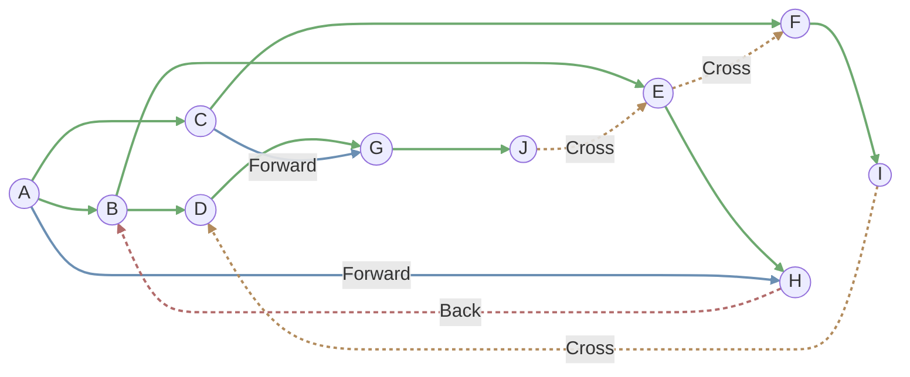
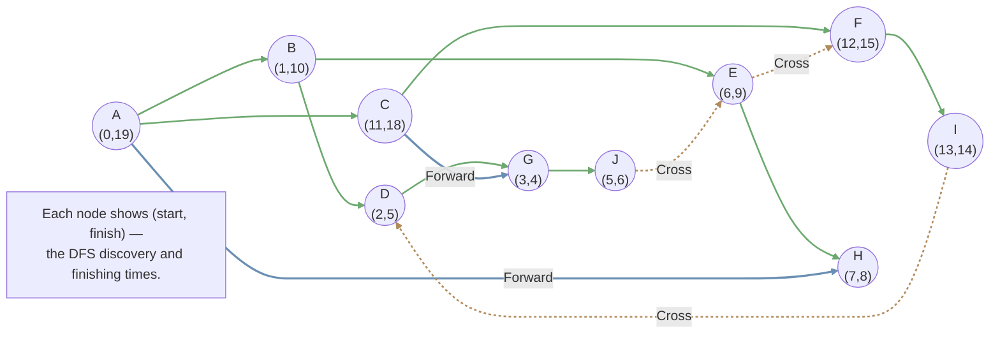

## DFS Tree and Topological Sort

### DFS Tree

By a complete DFS, we can get a subgraph $T$ of the former directed graph $G$, and $T$ is a tree called **DFS Tree**  

Then with the tree we divide the edges of $G$ into 4 groups:  
- Tree edges: the edges in $T$  
- Forward edges: edges from an ancestor to its descendant in $T$  
- Back edges: edges from an descendant to its ancestor in $T$  
- Cross edges: edges cross two subtrees in $T$



### Topological Ordering

Given a directed graph $G$, a **topological order** is an ordering of vertices such that for every directed edge $u, v \in E$, vertex $u$ comes before vertex $v$ in the ordering.

!!! remarks "Theorem"
    1. Topological order exists iff. the graph is a DAG (Directed Acyclic Graph)  
    2. There must exist at least a **sink** in a DAG. (**Sink**: vertices that do not have outgoing edges.)

#### The algorithm to find Topological Order in DAG

Solution 1: (Time complexity $O(\vert V\vert^2)$)

1. Find a sink ($O(\vert V \vert)$)  
2. Put it to be the last one in the topological order  
3. Remove the sink in the graph  
4. Repeat 1.

Solution 2: Improve by DFS

Through DFS we can record some information to find the sink.  
Record the start time and finish time through DFS:

```
time = 0
def DFS(u):
    start[u] = time
    time ++
    
    vis[u] = true
    for each u's neighbour v:
        if vis[v]: continue
        DFS[v]
        
    finish[u] = time
    time ++
```



The vertex with the earliest finish time is the sink. So just sort vertices by descending order of finish time. ($O(\vert V \vert \log \vert V \vert)$)

In fact, we haven't to sort afterward: just add the vertex into the topological order list when it finishes. ($O(\vert V \vert + \vert E \vert)$)

??? remarks "Proof"
    **Claim**: No edge $(u, v)$, if `finish[v] > finish[u]`.

    If $(u, v)$ exists,  
    - Can it be a tree/forward edge? Obviously no.  
    - Can it be a cross edge? No! If it exists, the DFS will get through the cross edge!
    - Can it be a back edge? No! There shouldn't exist back edge in DAG!

!!! remarks "DFS can distinguish four types of edges"
    Edge $(u, v)$ in DFS process:  
    - Tree edge: `vis[v] = false`  
    - Forward edge: `vis[v] = true`, `start[u] < start[v] < finish[v] < finish[u]`  
    - Cross edge: `vis[v] = true`, `start[v] < finish[v] < start[u] < finish[u]`  
    - Back edge: `vis[v] = true`, `start[v] < start[u] < finish[u] < finish[v]`


