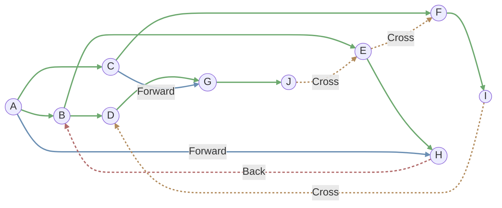
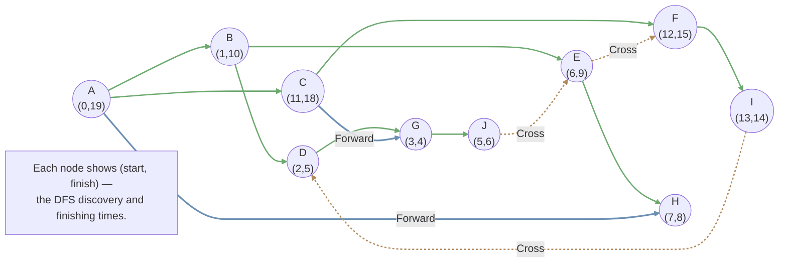

## DFS Tree and Topological Sort

### DFS Tree

By a complete DFS, we can get a subgraph $T$ of the former directed graph $G$, and $T$ is a tree called **DFS Tree**  

Then with the tree we divide the edges of $G$ into 4 groups:  
- Tree edges: the edges in $T$  
- Forward edges: edges from an ancestor to its descendant in $T$  
- Back edges: edges from an descendant to its ancestor in $T$  
- Cross edges: edges cross two subtrees in $T$



### Topological Ordering

Given a directed graph $G$, a **topological order** is an ordering of vertices such that for every directed edge $u, v \in E$, vertex $u$ comes before vertex $v$ in the ordering.

!!! remarks "Theorem"
    1. Topological order exists iff. the graph is a DAG (Directed Acyclic Graph)  
    2. There must exist at least a **sink** in a DAG. (**Sink**: vertices that do not have outgoing edges.)

#### The algorithm to find Topological Order in DAG

Solution 1: (Time complexity $O(\vert V\vert^2)$)

1. Find a sink ($O(\vert V \vert)$)  
2. Put it to be the last one in the topological order  
3. Remove the sink in the graph  
4. Repeat 1.

Solution 2: Improve by DFS

Through DFS we can record some information to find the sink.  
Record the start time and finish time through DFS:

```
time = 0
def DFS(u):
    start[u] = time
    time ++
    
    vis[u] = true
    for each u's neighbour v:
        if vis[v]: continue
        DFS[v]
        
    finish[u] = time
    time ++
```



The vertex with the earliest finish time is the sink. So just sort vertices by descending order of finish time. ($O(\vert V \vert \log \vert V \vert)$)

In fact, we haven't to sort afterward: just add the vertex into the topological order list when it finishes. ($O(\vert V \vert + \vert E \vert)$)

??? remarks "Proof"
    **Claim**: No edge $(u, v)$, if `finish[v] > finish[u]`.

    If $(u, v)$ exists,  
    - Can it be a tree/forward edge? Obviously no.  
    - Can it be a cross edge? No! If it exists, the DFS will get through the cross edge!
    - Can it be a back edge? No! There shouldn't exist back edge in DAG!

!!! remarks "DFS can distinguish four types of edges"
    Edge $(u, v)$ in DFS process:  
    - Tree edge: `vis[v] = false`  
    - Forward edge: `vis[v] = true`, `start[u] < start[v] < finish[v] < finish[u]`  
    - Cross edge: `vis[v] = true`, `start[v] < finish[v] < start[u] < finish[u]`  
    - Back edge: `vis[v] = true`, `start[v] < start[u] < finish[u] < finish[v]`  

## Strongly Connected Components (SCC)

Obviously all SCCs forms a partition of the directed graph. If we let each SCC be a super node, we can infer that the SCC super node graph is DAG, thus it has a sink SCC.

!!! remarks "Theorem"

    The SCC with the largest finish time must be the source SCC

    Proof: Assume:  
    - $u$ has the largest finish time.      
    - exists $v$ inside another SCC and has a path to $u$

    Obviously $u$ is the root of the DFS tree and $v$ cannot be in $u$'s DFS tree (or $u, v$ are strongly connected!). However, $v$ cannot be in another DFS tree because $u$ starts earlier than $v$! So $v$ doesn't exist.

So by finding the sink of reverse SCC graph, we can get the source SCC.

**Kosaraju's Algorithm**

1. DFS $G^R$ (reverse graph) and maintain a sorted list by the finish time  
2. DFS $G$, start from the descending order of the finish time each time.  
3. Each DFS forms a SCC.

Time complexity $O(\vert V \vert + \vert E \vert)$

**SCC 和 DAG**

下面是一些作业题整理

!!! examples "DAG 的特殊性质"
    注意到 DAG 具有拓扑排序，能够确定边更新的单向范围 (即若更新到点 $v$ 时，所有到 $v$ 的路径都被更新过了)
    
    在有负边权的 DAG 中作最短路树的时间复杂度可以到 $O(\vert V \vert + \vert E \vert)$. 算法如下

    ```
    # 拓扑排序
    Order = Topological(G, s)
    
    # 按拓扑排序遍历
    for u in Order:
        for each u's neighbour v:
            dist[v] = min(dist[u] + w(u, v), dist[v])
    ```

## BFS Tree and shortest path

Nothing more be derive to be written down()

| Task                 | DFS | BFS |
|----------------------|:---:|:---:|
| Detecting Cycles     | YES | NO  |
| Topological Ordering | YES | NO  |
| Finding CCs (Connected Components) | YES | YES |
| Finding SCCs (Strongly Connected Components) | YES | NO  |
| Shortest Path        | NO  | YES |

### Dijkstra Algorithm

Single source shortest path for **weighted** graphs, by constructing a SPT.

**Shortest path tree** (SPT): The path from the root to any node is the shortest.

Find the closest node (from root) out of SPT, add it into the tree and update `dist[u]` of its neighbour.

!!! remarks "Noting"
    The property "non-negative weights" ensures pulling the shortest in correct. 

```
# Initialize
T = {r}
dist[r] = 0, dist[v] = infty for v other than r
dist[e] = w(r, e) for e in r's neighbour, pre[e] = r # record pre for path finding

# Recurse
while T ≠ V:
    Find v not in T with smallest dist[v]
    T = T ∪ {v}
    dist[u] = min{dist[u], dist[v] + w(v, u)} for v's neighbour u
    if dist[u] is updated: pre[u] = v
```

To find the smallest `dist[v]`, we can maintain a heap to find it in $O(\vert V \vert \log \vert V \vert)$ overall, and update it in $O(\vert E \vert \log \vert V \vert)$ overall, so the total time complexity is $O(\left(\vert V \vert + \vert E \vert\right)\log \vert V \vert)$.  
And if using Fibonacci heap, the time complexity (optimal) $O(\vert E \vert + \vert V \vert \log \vert V \vert)$ (Not recommended to use in practice!).

!!! normal-comment "Note"
    In fact, using linear list with time complexity $O(\vert V \vert^2 + \vert E \vert)$ also acceptable!

### Short path with negative weights -- Bellman-Ford Algorithm

Instead of update the edges of the vertex $v$ with the smallest `dist[v]`, we update the edges of all vertices in SPT.

!!! warning-box "Exception"
    If the graph has a negative cycle, the algorithm will not stop!  
    To avoid this, we do the algorithm for at most $\vert V \vert$ times. If it does not stop in $\vert V \vert$ loops, the graph has negative cycles!

!!! normal-comment "Correctness of Bellman-Ford"

    **Lamma 1**: after $k$ rounds, `dist[v]` is the shortest distance of all $k$-edge paths (paths with **at most** $k$ edges).  
    Proof by induction: $k = 0$ obvious;  
    Suppose it's true for $k - 1$ rounds. Forall $k$-edge paths $(r, v_1, \ldots, u_{k - 1}, v)$. Noting that $dist[u_{k - 1}] \leq d(s, u_1, \ldots, u_{k - 1})$ (induce), $dist[v] \leq dist[u_{k - 1}] + w(u_{k - 1}, v)$ (algorithm step).

    Also, the length of $\vert V \vert$-edge-path cannot be smaller than the length of the shortest $(\vert V \vert - 1)$-edge-path, unless there is a negative cycle. ($\vert V \vert - 1$ here to maintain the tree shape, and if updates $\vert V \vert$ cycles, there must exist a cycle.)  

    So after $\vert V \vert - 1$ cycles, `dist[v]` is the shortest distance, otherwise it has a negative cycle.

#### Check if the graph has a Negative Cycle

Add a node $s$ connecting to all the nodes, and do Bellman-Ford.

In practice, just initialize all the `dist[v]` to $0$, and judge if there exist updates in round $\vert V \vert$ --> $O(\vert V \vert \cdot \vert E \vert)$ 

The full Bellman-Ford down here

```
# Initialize
T = {r}
dist[r] = 0, dist[v] = infty for v other than r
pre[v] = null for v other than r # record pre for path finding

# Recurse
do |V| times:
    for each (u, v) ∈ E:
        if dist[v] > dist[u] + w(u, v):
            dist[v] = dist[u] + w(u, v)
            pre[v] = u

if some dist[x] was updated in the last round:
    output "the graph contains cycles"
else:
    output dist
```

!!! remarks "Comments"
    1. Going through `pre` allows you to find a cycle if exists  
    2. No polynomial algorithm to find all the cycles
