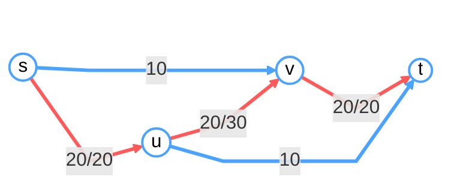
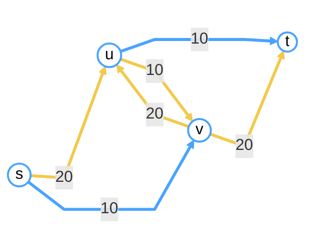

## DFS Tree and Topological Sort

### DFS Tree

By a complete DFS, we can get a subgraph $T$ of the former directed graph $G$, and $T$ is a tree called **DFS Tree**  

Then with the tree we divide the edges of $G$ into 4 groups:  
- Tree edges: the edges in $T$  
- Forward edges: edges from an ancestor to its descendant in $T$  
- Back edges: edges from an descendant to its ancestor in $T$  
- Cross edges: edges cross two subtrees in $T$


### Topological Ordering

Given a directed graph $G$, a **topological order** is an ordering of vertices such that for every directed edge $u, v \in E$, vertex $u$ comes before vertex $v$ in the ordering.

!!! remarks "Theorem"
    1. Topological order exists iff. the graph is a DAG (Directed Acyclic Graph)  
    2. There must exist at least a **sink** in a DAG. (**Sink**: vertices that do not have outgoing edges.)

#### The algorithm to find Topological Order in DAG

Solution 1: (Time complexity $O(\vert V\vert^2)$)

1. Find a sink ($O(\vert V \vert)$)  
2. Put it to be the last one in the topological order  
3. Remove the sink in the graph  
4. Repeat 1.

Solution 2: Improve by DFS

Through DFS we can record some information to find the sink.  
Record the start time and finish time through DFS:

```
time = 0
def DFS(u):
    start[u] = time
    time ++
    
    vis[u] = true
    for each u's neighbour v:
        if vis[v]: continue
        DFS[v]
        
    finish[u] = time
    time ++
```


The vertex with the earliest finish time is the sink. So just sort vertices by descending order of finish time. ($O(\vert V \vert \log \vert V \vert)$)

In fact, we haven't to sort afterward: just add the vertex into the topological order list when it finishes. ($O(\vert V \vert + \vert E \vert)$)

??? remarks "Proof"
    **Claim**: No edge $(u, v)$, if `finish[v] > finish[u]`.

    If $(u, v)$ exists,  
    - Can it be a tree/forward edge? Obviously no.  
    - Can it be a cross edge? No! If it exists, the DFS will get through the cross edge!
    - Can it be a back edge? No! There shouldn't exist back edge in DAG!

!!! remarks "DFS can distinguish four types of edges"
    Edge $(u, v)$ in DFS process:  
    - Tree edge: `vis[v] = false`  
    - Forward edge: `vis[v] = true`, `start[u] < start[v] < finish[v] < finish[u]`  
    - Cross edge: `vis[v] = true`, `start[v] < finish[v] < start[u] < finish[u]`  
    - Back edge: `vis[v] = true`, `start[v] < start[u] < finish[u] < finish[v]`  

## Strongly Connected Components (SCC)

Obviously all SCCs forms a partition of the directed graph. If we let each SCC be a super node, we can infer that the SCC super node graph is DAG, thus it has a sink SCC.

!!! remarks "Theorem"

    The SCC with the largest finish time must be the source SCC

    Proof: Assume:  
    - $u$ has the largest finish time.      
    - exists $v$ inside another SCC and has a path to $u$

    Obviously $u$ is the root of the DFS tree and $v$ cannot be in $u$'s DFS tree (or $u, v$ are strongly connected!). However, $v$ cannot be in another DFS tree because $u$ starts earlier than $v$! So $v$ doesn't exist.

So by finding the sink of reverse SCC graph, we can get the source SCC.

**Kosaraju's Algorithm**

1. DFS $G^R$ (reverse graph) and maintain a sorted list by the finish time  
2. DFS $G$, start from the descending order of the finish time each time.  
3. Each DFS forms a SCC.

Time complexity $O(\vert V \vert + \vert E \vert)$

**SCC 和 DAG**

下面是一些作业题整理

!!! examples "DAG 的特殊性质"
    注意到 DAG 具有拓扑排序，能够确定边更新的单向范围 (即若更新到点 $v$ 时，所有到 $v$ 的路径都被更新过了)
    
    在有负边权的 DAG 中作最短路树的时间复杂度可以到 $O(\vert V \vert + \vert E \vert)$. 算法如下

    ```
    # 拓扑排序
    Order = Topological(G, s)
    
    # 按拓扑排序遍历
    for u in Order:
        for each u's neighbour v:
            dist[v] = min(dist[u] + w(u, v), dist[v])
    ```

## BFS Tree and shortest path

Nothing more be derive to be written down()

| Task                 | DFS | BFS |
|----------------------|:---:|:---:|
| Detecting Cycles     | YES | NO  |
| Topological Ordering | YES | NO  |
| Finding CCs (Connected Components) | YES | YES |
| Finding SCCs (Strongly Connected Components) | YES | NO  |
| Shortest Path        | NO  | YES |

### Dijkstra Algorithm

Single source shortest path for **weighted** graphs, by constructing a SPT.

**Shortest path tree** (SPT): The path from the root to any node is the shortest.

Find the closest node (from root) out of SPT, add it into the tree and update `dist[u]` of its neighbour.

!!! remarks "Noting"
    The property "non-negative weights" ensures pulling the shortest in correct. 

```
# Initialize
T = {r}
dist[r] = 0, dist[v] = infty for v other than r
dist[e] = w(r, e) for e in r's neighbour, pre[e] = r # record pre for path finding

# Recurse
while T ≠ V:
    Find v not in T with smallest dist[v]
    T = T ∪ {v}
    dist[u] = min{dist[u], dist[v] + w(v, u)} for v's neighbour u
    if dist[u] is updated: pre[u] = v
```

To find the smallest `dist[v]`, we can maintain a heap to find it in $O(\vert V \vert \log \vert V \vert)$ overall, and update it in $O(\vert E \vert \log \vert V \vert)$ overall, so the total time complexity is $O(\left(\vert V \vert + \vert E \vert\right)\log \vert V \vert)$.  
And if using Fibonacci heap, the time complexity (optimal) $O(\vert E \vert + \vert V \vert \log \vert V \vert)$ (Not recommended to use in practice!).

!!! normal-comment "Note"
    In fact, using linear list with time complexity $O(\vert V \vert^2 + \vert E \vert)$ also acceptable!

### Short path with negative weights -- Bellman-Ford Algorithm

Instead of update the edges of the vertex $v$ with the smallest `dist[v]`, we update the edges of all vertices in SPT.

!!! warning-box "Exception"
    If the graph has a negative cycle, the algorithm will not stop!  
    To avoid this, we do the algorithm for at most $\vert V \vert$ times. If it does not stop in $\vert V \vert$ loops, the graph has negative cycles!

!!! normal-comment "Correctness of Bellman-Ford"

    **Lamma 1**: after $k$ rounds, `dist[v]` is the shortest distance of all $k$-edge paths (paths with **at most** $k$ edges).  
    Proof by induction: $k = 0$ obvious;  
    Suppose it's true for $k - 1$ rounds. Forall $k$-edge paths $(r, v_1, \ldots, u_{k - 1}, v)$. Noting that $dist[u_{k - 1}] \leq d(s, u_1, \ldots, u_{k - 1})$ (induce), $dist[v] \leq dist[u_{k - 1}] + w(u_{k - 1}, v)$ (algorithm step).

    Also, the length of $\vert V \vert$-edge-path cannot be smaller than the length of the shortest $(\vert V \vert - 1)$-edge-path, unless there is a negative cycle. ($\vert V \vert - 1$ here to maintain the tree shape, and if updates $\vert V \vert$ cycles, there must exist a cycle.)  

    So after $\vert V \vert - 1$ cycles, `dist[v]` is the shortest distance, otherwise it has a negative cycle.

#### Check if the graph has a Negative Cycle

Add a node $s$ connecting to all the nodes, and do Bellman-Ford.

In practice, just initialize all the `dist[v]` to $0$, and judge if there exist updates in round $\vert V \vert$ --> $O(\vert V \vert \cdot \vert E \vert)$ 

The full Bellman-Ford down here

```
# Initialize
T = {r}
dist[r] = 0, dist[v] = infty for v other than r
pre[v] = null for v other than r # record pre for path finding

# Recurse
do |V| times:
    for each (u, v) ∈ E:
        if dist[v] > dist[u] + w(u, v):
            dist[v] = dist[u] + w(u, v)
            pre[v] = u

if some dist[x] was updated in the last round:
    output "the graph contains cycles"
else:
    output dist
```

!!! remarks "Comments"
    1. Going through `pre` allows you to find a cycle if exists  
    2. No polynomial algorithm to find all the cycles

## Network Flow

Given a directed graph $G = (V, E)$ with a source $s$ and a sink $t$, and a positive capacity (weight) assigned to each edge. A **flow** is a map $f: E \to \mathbb{R}_{\geq 0}$ satisfying the followings:  
- **Capacity constrains**: for each $e \in E$, $f(e) \leq c(e)$  
- **Flow conservation**: for each $v \in E \setminus \{s, t\}$, $\operatorname{inFlow}v = \operatorname{outFlow}v$.

The value of the flow is defined assigned

$$
v(f) = \sum_{(s, v) \in E}f(s, v)
$$

i.e. the output flow of the source.

### Ford-Fulkerson Algorithm

Through some simple examples, just applying greedy solutions won't always get the correct answer.

**Residual network**: for a flow part $f$, revert the flow part edge, denote as $G^f$:  
$V^f = V$, $(u, v) \in E^f$ if one of the followings holds:  
- $(u, v) \in E$ and $f(u, v) < c(u, v)$, then $c^f(u, v) = f(u, v) - c(u, v)$  
- $(v, u) \in E$ and $f(v, u) > 0$, then $c^f(u, v) = f(v, u)$

**Ford-Fulkerson Algorithm**

For each path $s..t$, choose the path and update $G_f$

```
initialize flow f(e) = 0 for all edges e in E
construct the initial residual graph G_f

while there exists an s–t path p in the residual graph G_f:
    let b be the minimum residual capacity along path p

    # To find the true flow in the origin graph
    for each edge (u, v) on p:
        if (u, v) is a forward edge in E:
            # operating on the origin edge in G
            f(u, v) = f(u, v) + b
        else if (u, v) is a backward edge in E:
            # operating on the origin edge in G
            f(v, u) = f(v, u) - b   

    update the residual graph G_f

return f
```





A small bug: to be completed...

!!! warning-box "Noting"
    Actually, the algorithm won't terminate in some cases.

#### Correctness

**Max-Flow-Min-Cut Theorem**

Every cut of the graph gives a upper bound of the maximum flow. Eventually, "=" can always hold.

$$
\max_f v(f) = \min_{L, R}c(L, R)
$$

!!! remarks "Cut"
    $s, t \in V$, a $s$-$t$ cut is a partition of $V$ to $L, R$, such that $s \in L$ and $t \in R$, the value of the cut is defined By

    $$
    c(L, R) = \sum_{\substack{(u, v) \in E \\ u \in L, v \in R}}w(u, v)
    $$

!!! normal-comment "Lemma 1"
    For any flow $f$ and any cut $\{L, R\}$, $v(f) \leq c(L, R)$.  
    
    Let $f(L, R)$ be the amount of the flow going from $L$ to $R$.

    Claim $v(f) = f(L, R) - f(R, L)$.

    In $L$,

    $$
    \sum_{u \in L}\left(\operatorname{outFlow}u - \operatorname{inFlow}u\right) = \operatorname{outFlow}s = v(f)
    $$

    Also

    $$
    \begin{aligned}
        \sum_{u \in L}\left(\operatorname{outFlow}u - \operatorname{inFlow}u\right) &= \underbrace{\sum_{\substack{(u, v) \in E \\ u, v \in L}}f(u, v) + \sum_{\substack{(u, v) \in E \\ u \in L, v \in R}}f(u, v)}_{\text{outFlow}} \\ & -\underbrace{\left(\sum_{\substack{(u, v) \in E \\ u, v \in L}}f(u, v) + \sum_{\substack{(u, v) \in E \\ u \in R, v \in L}}f(u, v)\right)}_{\text{inFlow}} \\
        &= f(L, R) - f(R, L)
    \end{aligned}
    $$

    So the claim is proved, $v(f) \leq c(L, R)$

!!! normal-comment "Lemma 2"
    There exists a cut $\{L, R\}$ such that the flow $f$ output by Ford-Fulkerson algorithm satisfies $v(f) = c(L, R)$

Let $f$ be the output of Ford-Fulkerson, $L$ be the vertices reachable from $s$ in $G^f$, and $R = V \setminus L$.

Claim: $f(L, R) = c(L, R)$ and $f(R, L) = 0$. (1)
{ .annotate }

1. In the origin graph.

By the algorithm, forall $(u, v) \in E, u \in L, v \in R$, we should have $f(u, v) = c(u, v)$, otherwise there exists a edge $(u, v) \in E^f$, contradict to $v \in R$ by definition of $L$. So $f(L, R) = c(L, R)$  
Forall $(u, v) \in E, u \in L, v \in R$, there is no flow from $v$ to $u$, otherwise $(u, v) \in E^f$, contradict to $v \in R$. So $f(R, L) = 0$.

So exists a cut $\{L, R\}$, $v(f) = c(L, R)$

#### In what case can the algorithm terminate?

Consider integral capacity first.

!!! remarks "Theorem"

    If each $c(e)$ is an integer, then there is a maximum flow $f$ such that $f(e)$ is a is an integer for each $e$.  

As for rational capacities, just transform them to integers.

As for irrational capacities, then we can not ensure the algorithm can get the optimal solution in finite time.

??? normal-comment "A example"

    当容量允许为无理数时，Ford–Fulkerson 可能不会终止。构造一个网络，使唯一瓶颈为三条边 \(e_1,e_2,e_3\)，其容量分别为

    $$
    c(e_1)=1,\qquad c(e_2)=r,\qquad c(e_3)=1
    $$

    其中

    $$
    r=\frac{\sqrt{5}-1}{2},\qquad r^2=1-r
    $$

    如果算法每次都按固定的糟糕顺序选择增广路，则每轮之后三条边的剩余容量变成

    $$
    r^n,\quad r^{n+1},\quad 0
    $$

    指数 \(n\) 不断增大，因此残量始终大于 0，算法永远能找到增广路，不会终止。增广量形成几何级数，其极限流为

    $$
    1+2\sum_{i=1}^{\infty} r^i=3+2r\approx 4.236
    $$

    但网络的最大流远大于此值，因此 Ford–Fulkerson 在该例中既不会停机，得到的流量也非最大流。


So the time complexity depends on the edge capacities. The algorithm is **not polynomial**! ($O(|E| \cdot f_{\mathrm{max}})$)

!!! normal-comment "Example"

    

### Edmonds-Karp Algorithm

```
initialize f(e) = 0 for all edges e in E
initialize residual graph G^f = G

while there exists an s–t path in G^f do:
    find such a path p by BFS
    find the edge e in p with minimum residual capacity b
    update the flow f by sending b units along p
    update the residual graph G^f

return f
```

Why BFS can make it can bounded?

!!! remarks "Analysis"

    Define $dist$ by the number of edges of a path.  
    For each path flow through BFS, the added residual paths in $G^f$ must from $t + 1$ distance to $t$ distance.

    Addition of such edges does not decrease the distance between $s$ and $u$ for every $u \in V$，i.e. $dist[u]$ is **non-decreasing** throughout the algorithm for every $u \in V$.  (1)
    { .annotate}

    1. However, strictly increasing is not true!

    By observation, there must exist a **critical edge** being deleted in one iteration. (although it may appear again in the future.)

    Consider a critical edge $(u, v)$ in iteration $i$, assume $(u, v)$ can **become critical** again.  
    Obviously edge $(v, u)$ must become critical before $(u, v)$ becomes critical. Assume $(v, u)$ became critical in iteration $i + j$. Then we have

    $$
    \begin{aligned}
        dist^i(v) &= dist^i(u) + 1 \\
        dist^{i + j}(u) &= dist^{i + j}(v) + 1
    \end{aligned}
    $$

    And by distance monotonicity, $dist^{i + j}(v) \geq dist^i(v)$, thus

    $$
    dist^{i + j}(u) \geq dist^i(u) + 2
    $$

    i.e. **each "critical" increase $u$ by 1 on average**.  
    According to the two above and noting that the maximum distance in BFS is no more than $|V|$, we have:  
    **Each edge can only be critical for $O(|V|)$ times.** 

    And at least one edge become critical in one iteration, so:  
    **Total number of iterations is $O(|V| \cdot |E|)$.**  

    Each iteration takes $O(|E|)$ time.

    So the total time complexity is $O(|V|\cdot |E|^2)$

It can handle the issue with irrational numbers!

### Applications of Max Flow

Some graph problem, not valid with greedy method and need _cancel_ operation, may suitable to be converted to a flow problem. 

#### Dinner Table Assignment

Students from $m$ different universities participate in a
conference, each university $i$ has $r_i$ students. There are $n$ tables, each table $i$ can be shared by $c_i$ students.  
Decide if it is possible to make an arrangement such that each table is shared by students from different universities.


#### Tournament

Given:  
A table describes number of matches each team has won.  
A graph, number on each edge represents number of remaining
matches.  
Does one team has the chance for the champion? (Wins the most matches)


D has a chance to win iff. there exists a maximum flow in the graph!

#### Maximum Bipartite Matching

Find a maximum matching for a bipartite graph $G(A, B, E)$.


## Matching Problem

Maximum Matching in general graphs

Edmonds' Blossom Algorithm, $O(|E|\cdot |V|^2)$

Maximum Weighted Matching in bipartite graphs

Hungarian Algorithm, $O(|V|^3)$

Maximum Weighted Matching in general graphs

A clever algorithm that combines Edmonds’ Blossom Algorithm and Hungarian Algorithm, $O(|V|^3)$

!!! example "Example"

    A graph is _regular_ if all the vertices have the same degree. Let $G(A, B, E)$ be a regular bipartite graph.  
    Prove that the graph has a matching of size $|A|$.

    Obviously $|A| = |B| = n$. Construct a flow graph by adding $s$ and $t$. It has a matching of size $n$ iff the flow graph has a flow of size $n$. Just assign all the original edge with flow $\dfrac{n}{|E|}$, then obviously the total flow is $n$.  
    By the integrality of flow, there must exist a integer flow assignment, so the bipartite has a matching of size $n$.