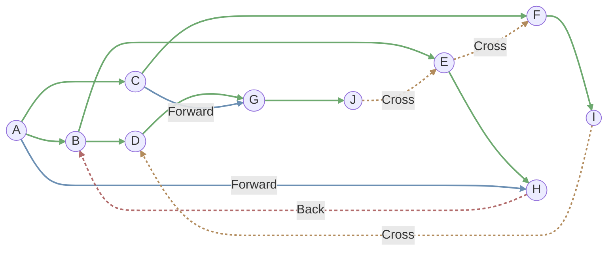
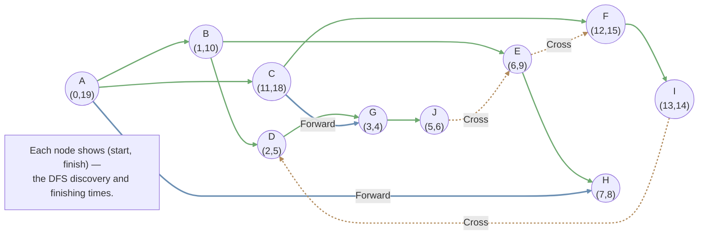
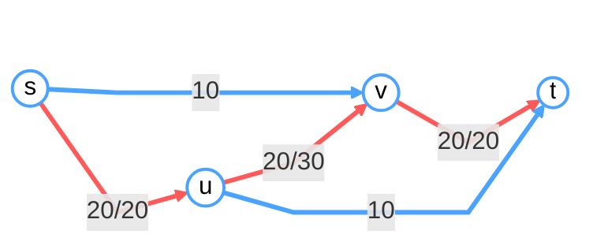
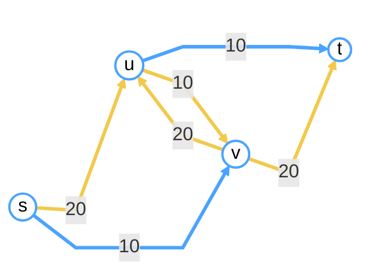

## DFS 树与拓扑排序

### DFS 树

对有向图 $G$ 做一次完整的 DFS，可以得到一个子图 $T$，并且 $T$ 是一棵树，称为 **DFS Tree**。  

利用这棵树，可以把 $G$ 中的边划分成四类：  
- Tree edges：在 $T$ 中的边  
- Forward edges：在 $T$ 中从某个祖先指向其后代的边  
- Back edges：在 $T$ 中从某个后代指回其祖先的边  
- Cross edges：连接两棵不同子树之间的边  



### 拓扑排序（Topological Ordering）

给定一个有向图 $G$，一个 **topological order** 是对所有顶点的一种线性排列，使得对于每条有向边 $(u, v) \in E$，顶点 $u$ 在该序列中一定出现在顶点 $v$ 之前。

!!! remarks "定理"
    1. 拓扑序存在当且仅当图是 DAG（Directed Acyclic Graph，有向无环图）。  
    2. 在任意一个 DAG 中一定至少存在一个 **sink**。(**Sink**：没有出边的顶点。)

#### 在 DAG 中求拓扑序的算法

解法 1：（时间复杂度 $O(\vert V\vert^2)$）

1. 找到一个 sink（$O(\vert V \vert)$）  
2. 把它放在拓扑序的最后一个位置  
3. 在图中删除这个 sink  
4. 重复步骤 1

解法 2：利用 DFS 的改进版

在 DFS 过程中，我们可以记录一些信息来帮助找到 sink。  
具体地，在 DFS 中记录每个点的发现时间和结束时间：

```
time = 0
def DFS(u):
    start[u] = time
    time ++
    
    vis[u] = true
    for each u's neighbour v:
        if vis[v]: continue
        DFS[v]
        
    finish[u] = time
    time ++
```



结束时间最早的顶点就是 sink。因此只要按结束时间从大到小对所有顶点排序即可得到拓扑序。时间复杂度为 $O(\vert V \vert \log \vert V \vert)$。  

实际上，甚至不需要在 DFS 完成之后再排序：在递归回溯、某个点刚刚 `finish` 的那一刻，就把它加入拓扑序列的头部即可。整体复杂度为 $O(\vert V \vert + \vert E \vert)$。

??? remarks "证明"
    **Claim**：如果 `finish[v] > finish[u]`，则不存在边 $(u, v)$。

    若 $(u, v)$ 存在，  
    - 它能是树边或前向边吗？显然不行。  
    - 能是 cross edge 吗？不行！若存在 cross edge，DFS 在搜索到 $u$ 的子树时就会通过这条边访问到 $v$。  
    - 能是 back edge 吗？不行！在 DAG 中不应当出现 back edge。  

!!! remarks "DFS 对四类边的判别"
    在 DFS 过程中，一条边 $(u, v)$ 的类型可以按以下规则区分：  
    - Tree edge：`vis[v] = false` 时从 $u$ 走到 $v$  
    - Forward edge：`vis[v] = true` 且 `start[u] < start[v] < finish[v] < finish[u]`  
    - Cross edge：`vis[v] = true` 且 `start[v] < finish[v] < start[u] < finish[u]`  
    - Back edge：`vis[v] = true` 且 `start[v] < start[u] < finish[u] < finish[v]`  

## 强连通分量（Strongly Connected Components, SCC）

显然，所有 SCC 在有向图上构成了一个划分。把每个 SCC 缩成一个超级节点，可以得到一个新图；这个 SCC 超级节点图是一个 DAG，因此它一定存在一个 sink SCC。

!!! remarks "定理"

    具有最大结束时间的 SCC 必然是源 SCC。

    证明：设  
    - $u$ 是结束时间最大的顶点；  
    - 存在另一个 SCC 中的顶点 $v$，并且从 $v$ 到 $u$ 存在一条路径。

    显然，$u$ 必然是 DFS 生成树的根；否则若 $v$ 在 $u$ 的 DFS 子树中，就说明 $u, v$ 强连通，矛盾。  
    另一方面，$v$ 不可能在另一棵 DFS 树中，因为 $u$ 的搜索必须早于 $v$ 开始。  
    所以这样的 $v$ 不存在。

因此，在反向图的 SCC DAG 中找到 sink，就能在原图中找到源 SCC。

**Kosaraju 算法**

1. 在反向图 $G^R$ 上做一次 DFS，并按结束时间维护一个从大到小的序列；  
2. 在原图 $G$ 上做 DFS，每次从结束时间序列中尚未访问的点里按降序选择一个作为起点；  
3. 每次 DFS 所访问到的点构成一个 SCC。

时间复杂度为 $O(\vert V \vert + \vert E \vert)$。

**SCC 与 DAG**

下面整理一些与作业相关的结论。

!!! examples "DAG 的一些性质"
    注意到 DAG 存在拓扑排序，因此对于边的“更新影响范围”是单向的（即在更新到顶点 $v$ 时，到达 $v$ 的所有路径都已被处理过）。
    
    在带负权边的 DAG 中求单源最短路，时间复杂度可以做到 $O(\vert V \vert + \vert E \vert)$。算法如下：

    ```
    # 先进行拓扑排序
    Order = Topological(G, s)
    
    # 按拓扑序遍历各顶点
    for u in Order:
        for each u's neighbour v:
            dist[v] = min(dist[u] + w(u, v), dist[v])
    ```

## BFS 树与最短路

这一部分没有更多推导，主要用于对比和总结。()

| Task                 | DFS | BFS |
|----------------------|:---:|:---:|
| Detecting Cycles     | YES | NO  |
| Topological Ordering | YES | NO  |
| Finding CCs (Connected Components) | YES | YES |
| Finding SCCs (Strongly Connected Components) | YES | NO  |
| Shortest Path        | NO  | YES |

### Dijkstra 算法

用于 **带权图** 的单源最短路问题，通过构造一棵最短路树（SPT）来实现。

**Shortest path tree**（SPT）：从根到任意节点的路径都是该节点到根的最短路径。

算法思路是：每次在树外找到一个距离根最近的顶点，把它加入树中，并用它去更新相邻顶点的 `dist[u]`。

!!! remarks "注意"
    “边权非负”这一条件保证了每次选出来的点的 `dist` 值确实已经是最短的。

```
# 初始化
T = {r}
dist[r] = 0, dist[v] = infty for v other than r
dist[e] = w(r, e) for e in r's neighbour, pre[e] = r # record pre for path finding

# Recurse
while T ≠ V:
    Find v not in T with smallest dist[v]
    T = T ∪ {v}
    dist[u] = min{dist[u], dist[v] + w(v, u)} for v's neighbour u
    if dist[u] is updated: pre[u] = v
```

为了找到 `dist[v]` 最小的点，可以维护一个堆：总的取最小操作代价为 $O(\vert V \vert \log \vert V \vert)$，更新代价为 $O(\vert E \vert \log \vert V \vert)$，因此整体时间复杂度为 $O((\vert V \vert + \vert E \vert)\log \vert V \vert)$。  
如果使用 Fibonacci heap，可以达到理论上的最优复杂度 $O(\vert E \vert + \vert V \vert \log \vert V \vert)$（但在实践中并不推荐使用）。

!!! normal-comment "说明"
    实际上，用简单的线性表实现，时间复杂度 $O(\vert V \vert^2 + \vert E \vert)$ 在很多场景下也完全可以接受。

### 含负权边的最短路 —— Bellman-Ford 算法

与其每次只更新当前 `dist[v]` 最小的顶点的出边，Bellman-Ford 选择在每一轮中更新图中所有边，对所有点的估计距离进行松弛。

!!! warning-box "特殊情况"
    如果图中存在负环，该算法将不会停止。  
    为了避免这一点，我们至多执行 $\vert V \vert$ 轮松弛：如果在第 $\vert V \vert$ 轮仍然发生更新，则图中必然存在负环。

!!! normal-comment "Bellman-Ford 的正确性"

    **引理 1**：经过第 $k$ 轮松弛后，`dist[v]` 等于所有“边数不超过 $k$ 的路径”中，从源点到 $v$ 的最短路径长度。  
    归纳证明：$k = 0$ 时显然成立；  
    假设结论对第 $k - 1$ 轮成立。对任意一条包含 $k$ 条边的路径 $(r, v_1, \ldots, u_{k - 1}, v)$，注意到由归纳假设有 $dist[u_{k - 1}] \leq d(s, v_1, \ldots, u_{k - 1})$，而在第 $k$ 轮松弛中，$dist[v] \leq dist[u_{k - 1}] + w(u_{k - 1}, v)$。

    同时，如果不存在负环，则任意一条包含 $\vert V \vert$ 条边的路径，其长度不可能小于最短的 $(\vert V \vert - 1)$ 边路径的长度。（这里用 $\vert V \vert - 1$ 来保证路径可以嵌入一棵树结构；如果需要 $\vert V \vert$ 轮更新，就一定出现了环。）

    因此，在进行了 $\vert V \vert - 1$ 轮松弛之后，`dist[v]` 就已经是从源点到 $v$ 的最短距离；否则图中一定存在负环。

#### 判断图中是否存在负环

可以添加一个新节点 $s$，向所有顶点连一条边，然后从 $s$ 出发做 Bellman-Ford。

在实际实现中，只需把所有顶点的 `dist[v]` 初始值设为 $0$，然后做 $\vert V \vert$ 轮松弛。如果在第 $\vert V \vert$ 轮仍然有某个 `dist[x]` 被更新，则说明图中存在负环。时间复杂度为 $O(\vert V \vert \cdot \vert E \vert)$。

完整的 Bellman-Ford 算法如下：

```
# Initialize
T = {r}
dist[r] = 0, dist[v] = infty for v other than r
pre[v] = null for v other than r # record pre for path finding

# Recurse
do |V| times:
    for each (u, v) ∈ E:
        if dist[v] > dist[u] + w(u, v):
            dist[v] = dist[u] + w(u, v)
            pre[v] = u

if some dist[x] was updated in the last round:
    output "the graph contains cycles"
else:
    output dist
```

!!! remarks "补充"
    1. 通过回溯 `pre` 数组，如果存在负环，可以找到其中的一条环；  
    2. 目前没有多项式时间算法可以枚举图中的所有环。

## 网络流（Network Flow）

给定一个有向图 $G = (V, E)$，其中有一个源点 $s$ 和一个汇点 $t$，每条边都带有一个正的容量（权重）。一个 **flow** 是一个映射 $f: E \to \mathbb{R}_{\geq 0}$，满足：
- **容量约束**：对每条边 $e \in E$，有 $f(e) \leq c(e)$；  
- **流量守恒**：对每个顶点 $v \in V \setminus \{s, t\}$，有 $\operatorname{inFlow}v = \operatorname{outFlow}v$。

流量的值定义为

$$
v(f) = \sum_{(s, v) \in E}f(s, v)
$$

即源点 $s$ 的总流出量。

### 最大流问题（Maximum Flow Problem）

通过若干简单例子可以看出，直接套用贪心策略并不能总是得到正确的最大流。

**Residual network**：对于一个给定的流量 $f$，可以构造对应的残量网络（residual graph）$G^f$。  
$V^f = V$，并且当满足下列任一条件时，将有向边 $(u, v)$ 加入 $E^f$：  
- 若 $(u, v) \in E$ 且 $f(u, v) < c(u, v)$，则在残量网络中令 $c^f(u, v) = f(u, v) - c(u, v)$；  
- 若 $(v, u) \in E$ 且 $f(v, u) > 0$，则在残量网络中令 $c^f(u, v) = f(v, u)$。

**Ford-Fulkerson 算法**

不断在残量网络中从 $s$ 到 $t$ 找到一条路径，对这条路径进行增广，并更新残量网络 $G^f$。

```
initialize flow f(e) = 0 for all edges e in E
construct the initial residual graph G_f

while there exists an s–t path p in the residual graph G_f:
    let b be the minimum residual capacity along path p

    # 在原图中更新真实的流量
    for each edge (u, v) on p:
        if (u, v) is a forward edge in E:
            # 在原图 G 中的正向边上增广
            f(u, v) = f(u, v) + b
        else if (u, v) is a backward edge in E:
            # 在原图 G 中的反向边上回退
            f(v, u) = f(v, u) - b   

    update the residual graph G_f

return f
```





这里例子中还有一个小 bug，有待之后补完……

!!! warning-box "注意"
    实际上，在某些情况下，该算法不会终止。

#### 正确性

**Max-Flow-Min-Cut 定理**

任意一个 cut 都给出了最大流的一个上界；并且总可以找到某个 cut，使得这个上界与最大流的值相等。

$$
\max_f v(f) = \min_{L, R}c(L, R)
$$

!!! remarks "Cut 的定义"
    在一个图中，设 $s, t \in V$。一个 $s$-$t$ cut 是对顶点集合 $V$ 的一个划分 $\{L, R\}$，满足 $s \in L, t \in R$。该 cut 的值定义为

    $$
    c(L, R) = \sum_{\substack{(u, v) \in E \\ u \in L, v \in R}}w(u, v)
    $$

!!! normal-comment "引理 1"
    对任意一个 flow $f$ 以及任意一个 cut $\{L, R\}$，都有 $v(f) \leq c(L, R)$。  
    
    记 $f(L, R)$ 为从 $L$ 流向 $R$ 的总流量。

    要证明：$v(f) = f(L, R) - f(R, L)$。

    在集合 $L$ 中，有

    $$
    \sum_{u \in L}\left(\operatorname{outFlow}u - \operatorname{inFlow}u\right) = \operatorname{outFlow}s = v(f)
    $$

    另一方面，

    $$
    \begin{aligned}
        \sum_{u \in L}\left(\operatorname{outFlow}u - \operatorname{inFlow}u\right) &= \underbrace{\sum_{\substack{(u, v) \in E \\ u, v \in L}}f(u, v) + \sum_{\substack{(u, v) \in E \\ u \in L, v \in R}}f(u, v)}_{\text{outFlow}} \\ & -\underbrace{\left(\sum_{\substack{(u, v) \in E \\ u, v \in L}}f(u, v) + \sum_{\substack{(u, v) \in E \\ u \in R, v \in L}}f(u, v)\right)}_{\text{inFlow}} \\
        &= f(L, R) - f(R, L)
    \end{aligned}
    $$

    因此命题得证，从而有 $v(f) \leq c(L, R)$。

!!! normal-comment "引理 2"
    存在一个 cut $\{L, R\}$，使得 Ford-Fulkerson 算法输出的流 $f$ 满足 $v(f) = c(L, R)$。

令 $f$ 为 Ford-Fulkerson 算法输出的流，$L$ 为在残量网络 $G^f$ 中从 $s$ 可达的所有顶点集合，$R = V \setminus L$。

命题：有 $f(L, R) = c(L, R)$，且 $f(R, L) = 0$。 (1)  
{ .annotate }

1. 在原图中：

对任意满足 $(u, v) \in E, u \in L, v \in R$ 的边，由算法的终止条件可知必有 $f(u, v) = c(u, v)$。否则在残量网络 $G^f$ 中还存在边 $(u, v) \in E^f$，这与 $v \in R$ 的定义矛盾。因此 $f(L, R) = c(L, R)$。  
对任意满足 $(u, v) \in E, u \in R, v \in L$ 的边，也不会存在从 $v$ 流回 $u$ 的流量；否则 $(u, v) \in E^f$，同样与 $v \in L$ 的性质矛盾。所以 $f(R, L) = 0$。

综上，存在某个 cut $\{L, R\}$ 使得 $v(f) = c(L, R)$。

#### 算法在什么情况下会终止？

先考虑所有边容量为整数的情形。

!!! remarks "定理"

    如果每条边的容量 $c(e)$ 都是整数，则必然存在一个最大流 $f$，使得对每条边 $e$ 都有 $f(e)$ 也是整数。  

对于有理数容量，可以统一乘一个常数，把它们缩放成整数容量。  

对于无理数容量，则不能保证该算法在有限步内一定得到最优解。

??? normal-comment "例子"

    当容量允许为无理数时，Ford–Fulkerson 可能不会终止。构造一个网络，使唯一瓶颈为三条边 \(e_1,e_2,e_3\)，其容量分别为

    $$
    c(e_1)=1,\qquad c(e_2)=r,\qquad c(e_3)=1
    $$

    其中

    $$
    r=\frac{\sqrt{5}-1}{2},\qquad r^2=1-r
    $$

    如果算法每次都按固定的糟糕顺序选择增广路，则每轮之后三条边的剩余容量变成

    $$
    r^n,\quad r^{n+1},\quad 0
    $$

    指数 \(n\) 不断增大，因此残量始终大于 0，算法永远能找到增广路，不会终止。增广量形成几何级数，其极限流为

    $$
    1+2\sum_{i=1}^{\infty} r^i=3+2r\approx 4.236
    $$

    但网络的最大流远大于此值，因此 Ford–Fulkerson 在该例中既不会停机，得到的流量也非最大流。

因此，Ford–Fulkerson 的时间复杂度依赖于边容量的大小；该算法是 **非多项式时间** 的：$O(|E| \cdot f_{\mathrm{max}})$。

!!! normal-comment "例子"

    

### Edmonds-Karp 算法

```
initialize f(e) = 0 for all edges e in E
initialize residual graph G^f = G

while there exists an s–t path in G^f do:
    find such a path p by BFS
    find the edge e in p with minimum residual capacity b
    update the flow f by sending b units along p
    update the residual graph G^f

return f
```

为什么使用 BFS 可以让算法有多项式时间上界？

!!! remarks "分析"

    用路径上边的条数来定义距离函数 $dist$。  
    在每一次通过 BFS 找到的增广路上增广之后，新加入残量网络 $G^f$ 的边，其两个端点的距离必然是从 $t+1$ 变成 $t$。  

    这种“向前”加入的边不会减小任意顶点 $u \in V$ 到源点 $s$ 的距离，也就是说，对每个 $u \in V$，$dist[u]$ 在整个算法过程中都是**单调不减**的。 (1)
    { .annotate}

    1. 但它并不一定是严格递增的。

    观察可知，在每一轮增广中，总会有一条**临界边（critical edge）** 的残量被用完并从残量网络中删除（虽然之后可能又会以反向边的形式出现）。  

    设某条边 $(u, v)$ 在第 $i$ 次迭代中是临界边，并且假设它之后还能再次变成临界边。显然，在 $(u, v)$ 再次成为临界边之前，反向边 $(v, u)$ 必须先成为临界边。假设 $(v, u)$ 在第 $i + j$ 次迭代中成为临界边，则有

    $$
    \begin{aligned}
        dist^i(v) &= dist^i(u) + 1 \\
        dist^{i + j}(u) &= dist^{i + j}(v) + 1
    \end{aligned}
    $$

    又因为距离是单调不减的，$dist^{i + j}(v) \geq dist^i(v)$，因此

    $$
    dist^{i + j}(u) \geq dist^i(u) + 2
    $$

    也就是说，每当一条边两次成为临界边时，其端点距离至少整体增加 2，**平均到每次“临界”事件上，$u$ 的距离至少增加 1**。  
    由此可知，在 BFS 中顶点到源点的距离最多为 $|V|$，因此：  
    **每条边至多成为 $O(|V|)$ 次临界边。**  

    而在每一轮迭代中至少有一条边成为临界边，所以  
    **总的迭代次数为 $O(|V| \cdot |E|)$。**  

    每一轮 BFS 的时间复杂度为 $O(|E|)$。

因此 Edmonds-Karp 算法的总时间复杂度为 $O(|V|\cdot |E|^2)$，它还避免了无理数容量导致的“不停机”问题。

### 最大流的应用（Applications of Max Flow）

有一些图论问题，无法直接用贪心解决，而且过程中需要“撤销/回退”操作，这类问题往往可以建模为网络流。

#### 晚宴座位安排（Dinner Table Assignment）

有 $m$ 所大学的学生参加某次会议，第 $i$ 所大学有 $r_i$ 名学生。共有 $n$ 张桌子，第 $i$ 张桌子的容量为 $c_i$，即最多可以同时坐 $c_i$ 人。  
判断是否存在一种安排方式，使得**每张桌子上坐的学生都来自不同的学校**。


#### 联赛排位（Tournament）

给定：  
一张表，记录了每支队伍目前赢了多少场比赛；  
一张图，其中每条边上的数字表示这两支队之间还剩余多少场比赛没有进行。  

问题：某支队伍（例如 $D$ 队）是否还有机会夺冠（最终获胜场数不小于任何其他队）？


结论：当且仅当在构造出的网络中存在一个满足约束的最大流时，队伍 $D$ 才有机会夺冠。

#### 最大二分图匹配（Maximum Bipartite Matching）

在二分图 $G(A, B, E)$ 中，求一组最大匹配。


## 匹配问题（Matching Problem）

一般图上的最大匹配：Edmonds 的 Blossom 算法，时间复杂度 $O(|E|\cdot |V|^2)$。  

二分图上的最大权匹配：匈牙利算法（Hungarian Algorithm），时间复杂度 $O(|V|^3)$。  

一般图上的最大权匹配：结合 Edmonds Blossom 算法与匈牙利算法的更巧妙算法，时间复杂度 $O(|V|^3)$。
